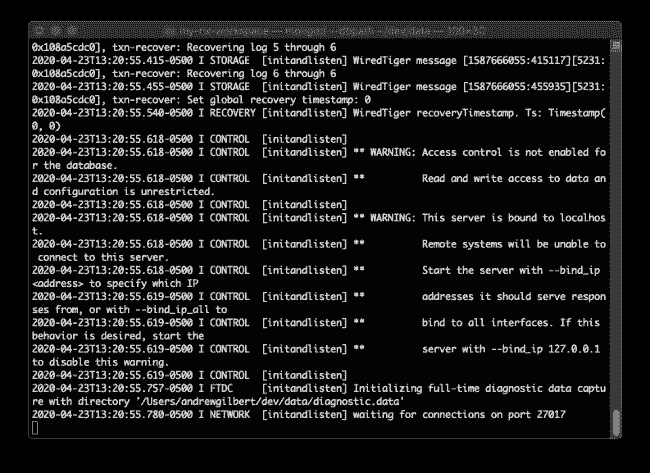

# 开始构建一个 MANNN 堆栈

> 原文：<https://levelup.gitconnected.com/are-you-ready-to-mannn-up-25bcdc9ce4d7>

## 准备您的计算机，用 MongoDB、Angular、NestJS、Nx 和 Node.js (MANNN)构建一个全栈单页应用程序

我们将让我们的计算机准备好构建一个全栈 MANNN 应用程序，我们将把它视为一个绿地项目——也就是说，我们从零开始。零。没有。没什么。一笔勾销。

最后，我们将有一个简单的启动应用程序运行在我们的计算机上，我们可以在以后扩展它。

具体来说，我们将执行以下操作:

1.  安装 Node.js 和 npm
2.  安装 Git(可选)
3.  安装 MongoDB
4.  安装角度 CLI
5.  创建包含角度和嵌套的 Nx 工作空间
6.  在本地提供我们的入门应用程序

# 为什么是曼恩堆栈？

我不想加入堆栈大战，但我喜欢这种特殊的堆栈，主要有以下几个原因:

*   Angular 和 [NestJS](https://docs.nestjs.com/) 非常相似，部分原因是它们都使用了[的打字稿](https://www.typescriptlang.org/docs/handbook/typescript-in-5-minutes.html)。但是它们的结构也是相似的，并且都能够搭建组件/模块等。对于我们来说使用命令行。因此，一起使用它们可以最大限度地提高前端和后端知识和技术的可移植性。此外，它们都有很棒的在线免费文档。
*   Nx workspaces 为我们提供了许多出色的功能，但其中最重要的一个功能是，它们允许我们轻松地在前端和后端之间，甚至在独立的应用程序之间共享代码。点击了解更多关于 Nx 的[优势。](https://nx.dev/angular/getting-started/why-nx)
*   [MongoDB](https://www.mongodb.com/what-is-mongodb) 以类似于 [JSON](https://en.wikipedia.org/wiki/JSON) 的格式存储数据，当我们使用 JavaScript 时，这是一个自然的选择。

我们开始吧！

# 安装 Node.js 和 npm

我们的应用程序的后端将在 [Node.js](https://nodejs.org/en/about/) 上运行，所以我们需要在我们的机器上安装 Node.js。你可以通过[访问 Node.js 网站](https://nodejs.org/en/download/)并下载适合你的操作系统的安装程序。我推荐使用最新的长期支持(LTS)版本，在撰写本文时是版本 12。

一旦安装了 Node.js，就可以打开命令行并运行以下命令来验证 Node.js 安装是否正确:

`node --version`

您应该会看到类似于`v12.16.2`的内容。我们还应该验证 npm 安装是否正确:

`npm --version`

同样，您应该会看到类似于`6.14.4`的内容。

# 安装 Git

安装 Git 是可选的，但是我推荐它有三个原因:

1.  它使您能够执行[版本控制](https://git-scm.com/book/en/v2/Getting-Started-About-Version-Control)。
2.  这是部署到 Heroku 所必需的，如果你想轻松地将你的应用部署到网络上的实际生产环境中，我推荐使用它。
3.  如果你注册了一个 [GitHub](https://guides.github.com/activities/hello-world/) 账户，你可以使用 Git 将你的本地源代码推送到一个 GitHub 库，这个库本质上是你代码的异地备份，并允许你与他人共享你的代码。

对于 macOS :打开你的命令行并运行`git --version`。如果您还没有安装 Git，系统会提示您安装它。

对于 **Windows** :您可以通过访问 Git 网站上的[Windows 下载页面](https://git-scm.com/download/win)下载并安装 Git。

更详细的说明可以在 Git 网站上找到。

您可以通过在命令行中输入`git --version`来验证 Git 是否安装在您的机器上。如果正确安装了 Git，您应该会看到类似于`git version 2.16.2`的响应。

# 安装 MongoDB

我们将把我们的 MANNN 应用程序的数据存储在一个 [MongoDB](https://www.mongodb.com/) 数据库中。因此，我们需要在我们的机器上安装并运行 MongoDB。安装 MongoDB 可能是准备您的计算机开发 MANNN 应用程序的最复杂的部分。但是，您通常只需要做一次。所以不要气馁！

## 在 macOS 上安装 MongoDB

有关在 macOS 上安装 MongoDB 的详细说明，请参见 MongoDB 网站上的[本指南](https://docs.mongodb.com/manual/tutorial/install-mongodb-on-os-x/)。下面我总结一下步骤。

1.  从 App Store 免费安装苹果 [**XCode**](https://developer.apple.com/xcode/) 。我们接下来要安装的家酿依赖于 XCode。
2.  打开你的命令行输入:
    `/bin/bash -c "$(curl -fsSL https://raw.githubusercontent.com/Homebrew/install/master/install.sh)"`
    安装 [**家酿**](https://brew.sh/#install) (这里看起来不太好看，不过都是一行)。
3.  通过输入以下命令建立到 MongoDB 存储库的连接:
    `brew tap mongodb/brew`
4.  通过运行
    `brew install mongodb-community@4.2`安装 MongoDB
5.  最后，我们可以通过在命令行中运行`mongod`来验证 MongoDB 安装正确。这将启动`mongod`进程——换句话说，它启动了我们的 MongoDB。如果 MongoDB 启动正常，应该会看到数据库是`waiting for connections on port 27017`。参见**图 1** 。

**图 1** 运行在 macOS 上的 MongoDB 数据库

## 在 Windows 上安装 MongoDB

有关在 Windows 上安装 MongoDB 的详细说明，请参见 MongoDB 网站上的[本页](https://docs.mongodb.com/manual/tutorial/install-mongodb-on-windows/)。下面我总结一下步骤。

1.  从[下载中心](https://www.mongodb.com/download-center/community?tck=docs_server)下载 MongoDB 安装程序。(您将选择社区服务器，然后是当前发布版本，然后是 Windows x64，然后是 MSI 包。)
2.  双击您在第一步中下载的`.msi`文件，运行 MongoDB 安装程序(默认情况下，它会转到您的下载文件夹)。
3.  按照安装向导中的提示将 MongoDB 安装为服务。(您将选择“安装 MongoDB 作为服务”和“作为网络服务用户运行服务”。我建议保留默认的服务名、数据目录和日志目录。)
4.  通过将一个`mongo.exe` shell 连接到您正在运行的 MongoDB 来验证 MongoDB 安装是否正确。双击位于`C:\Program Files\MongoDB\Server\4.2\bin\`中的`mongo.exe`文件即可。

# 安装角度 CLI

Nx 命令行界面(CLI)依赖于罩下的 Angular CLI。因此，我们需要安装 Angular CLI。这很简单。我们只需在命令行中运行以下命令:

`npm install -g @angular/cli`

如果您使用的是 macOS，并且收到错误响应，这可能是因为您缺少全局安装 CLI 的权限。通过输入以下命令，以管理员权限运行该命令:

`sudo npm install -g @angular/cli`

这将提示您输入密码。输入密码后，安装过程应该会继续。

# 创建一个 Nx 工作空间

我们将在 Nx 工作空间中构建我们的应用程序。要创建我们的工作区，我们应该使用命令行导航到我们想要存储工作区的目录，然后运行以下命令:

`npm init nx-workspace **my-nx-workspace**`

其中`my-nx-workspace`是我们想要创建的工作空间的名称。

该过程将提示我们四个问题:

1.  *在新工作区创建什么？*我们将选择`angular-nest`来构建一个包含 Angular 前端和 NestJS 后端的全栈应用程序。
2.  *应用名称？*在这里，我们应该为我们的应用输入一个名称。
3.  *默认样式表格式？*我们应该选择我们喜欢的选项，但是`CSS`是标准选项。
4.  最后，我们会被问及是否愿意与谷歌分享分析信息。我们应该选择我们喜欢的选项。

npm 现在将根据我们的选择生成一个 Nx 工作区。完成后，我们的目录应该如图**图 2** 所示。

**图 2** 新 Nx 工作区的目录结构

以下是该工作区的快速浏览:

*   NestJS 后端位于`apps/api`。
*   角度前端位于`apps/my-new-app`。
*   默认情况下，应用程序的构建将放在`dist/`中。
*   前端和后端共享的代码将位于`libs/`中。
*   当然，依赖项将被放在`node_modules/`中。

# 在本地服务应用程序

我们的 Nx workspace 带有一个功能示例 Angular-NestJS 应用程序。让我们在本地服务这个应用程序，看看它的运行情况。

打开命令行，导航到 Nx 工作区的目录。然后，运行:

`nx serve api`

这将服务于示例应用程序的 API 或后端。换句话说，这将启动您的 Node/NestJS 服务器。如果 API 服务成功，您应该会看到类似这样的内容:

`Listening at [http://localhost:3333/api](http://localhost:3333/api)`

这意味着您的开发 web 服务器正在运行，并在`[http://localhost:3333/api](http://localhost:3333/api.)`监听来自客户端的连接。接下来，让我们通过运行来服务角度前端:

`nx serve **my-new-app**`

其中`my-new-app`是您之前创建 Nx 工作区时输入的应用程序的名称。如果前端启动成功，您应该会看到类似这样的内容:

`Angular Live Development Server is listening on localhost:4200`

现在，打开网络浏览器，在地址栏输入`[http://localhost:4200](http://localhost:4200)`。您应该看到示例应用程序的欢迎页面，如图 3 中的**所示。**

如果你的浏览器显示*消息:{"message ":"欢迎使用 api！"}* 在 Nx 徽标下，这意味着 Angular 前端正在成功地与 Node/NestJS 后端对话。

恭喜你！现在，您已经有了一个在本地计算机上运行的全栈应用程序。

那么，你将何去何从？好了，你开始在这个入门应用程序的基础上构建你自己的应用程序。查看下面的“进一步阅读和资源”,获取帮助您构建自己的应用程序的信息。

图 3 在 http://localhost:4200 本地运行的示例应用程序

# 进一步阅读和资源

以下是构建您的 MANNN 应用程序的附加资源列表:

*   [**Angular 文档**](https://angular.io/docs) — Angular 网站上有大量文档。对于初学者，我强烈推荐阅读文档的“基础”部分，尤其是“角度概念”和“组件&模板”
*   [**NestJS 文档**](https://docs.nestjs.com/) — NestJS 的文档也异常丰富。通读他们文档的“概述”部分，对如何使用 NestJS 构建后端有一个基本的了解。
*   Nx — Nx 的网站上有有用的文档。了解使用 Nx 的好处，请访问"[为什么选择 Nx？](https://nx.dev/angular/getting-started/why-nx)“你也可以完成他们的[教程](https://nx.dev/angular/tutorial/01-create-application)，该教程旨在演示使用 Nx 工作空间的好处。
*   [**MongoDB**](https://www.mongodb.com/what-is-mongodb) —通过查看他们的网站了解更多关于 MongoDB 的信息。看看 NestJS 网站上的[指南](https://docs.nestjs.com/techniques/mongodb)，学习如何将你的 MongoDB 集成到你的 NestJS 后端。
*   [**Node.js**](https://nodejs.org/en/about/) —通过使用 NestJS，不需要对 Node.js 有深入的了解。但是，如果你有兴趣了解更多，我推荐你阅读 Node.js 网站的“关于 Node.js”部分。可以说，需要理解的最重要的概念是在 Node.js 中使用异步编程。
*   **部署** —如果你想把你的应用部署到一个真实的生产环境，我建议试试 Heroku。查看我关于将你的应用部署到 Heroku 的文章。你可以跳过第一步，因为你已经在这里完成了。