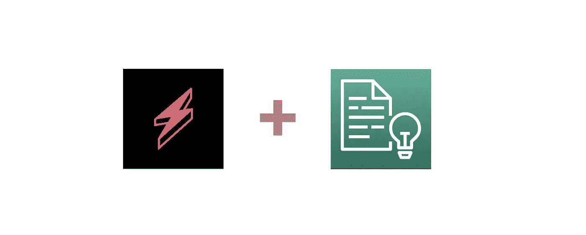

# 您的无服务器客户是高兴还是难过？🚀

> 原文：<https://levelup.gitconnected.com/are-your-serverless-customers-happy-or-sad-32f904ede5ff>


[利迪娅·纳达](https://unsplash.com/@lidyanada?utm_source=unsplash&utm_medium=referral&utm_content=creditCopyText)在 [Unsplash](https://unsplash.com/s/photos/happy?utm_source=unsplash&utm_medium=referral&utm_content=creditCopyText) 拍摄的照片

## 使用 AWS understand 来理解您的客户内容的情绪的示例，同时还编辑了 PII，用 TypeScript 和无服务器框架编写了可视化和附带的代码回购！🚀



# 介绍

您目前是否检查客户评论的情绪、转录的通话细节、聊天记录等？而如果不是，你怎么知道他们是普遍快乐，烦恼还是五味杂陈？你现在有没有登录 [PII](https://en.wikipedia.org/wiki/Personal_data) ( *个人身份信息*)因为 [GDPR](https://gdpr-info.eu/) 你可能不应该登录？你需要储存的内容，但 PII 编辑？

这个例子展示了一个完全无服务器的解决方案，它是使用[AWS comprehension](https://aws.amazon.com/comprehend/)以及 Amazon API Gateway 和 AWS Lambda 构建的，展示了一些您可以用很少的代码实现的基本功能，以减轻上述问题！

你可以在这里访问基本的[代码报告，为了清楚起见，这里有详细的注释，为了简单起见，将大部分代码保存在一个文件中。](https://github.com/leegilmorecode/serverless-comprehend)

> *💡*请注意，这是演示 AWS understand 与 Lambda 配合使用的最少代码和架构，因此这不是生产就绪，也不符合编码最佳实践。

## 我们在建造什么？

下面的架构图显示了我们将要构建的内容，并在下面进一步描述:


我们将要建造的建筑的例子

**架构描述如下:**

1.  用户点击`/comments` POST 端点并添加评论。
2.  API 网关调用 lambda。
3.  AWS 的理解是用来理解评论的情绪，以及从它编辑任何 PII。
4.  编辑后的评论和观点被记录到 [AWS CloudWatch](https://aws.amazon.com/cloudwatch/) 中。
5.  编辑后的评论和观点将与原始评论一起在响应中返回给用户。

## AWS 领悟是什么？🤔

亚马逊理解是一项自然语言处理服务，它使用 T4 机器学习和人工智能来揭示非结构化数据中的信息。

该服务可以识别数据中的关键元素，包括语言、人物和地点，文本文件可以按照相关主题进行分类。实时地，你可以自动准确地[检测你内容中的客户情绪](https://en.wikipedia.org/wiki/Sentiment_analysis)。

> “这加速了更明智的实时决策，从而改善了客户体验”

understand 不仅查找包含个人身份信息的任何内容，还编辑和屏蔽这些内容。

> *💡*以下视频提供了一个很好的概述:

AWS 理解概述

## 有哪些用例？

AWS Comprehend 的几个用例如下所示。

**使用 Amazon understand 自动检测客户情绪**准确分析客户互动，包括社交媒体帖子，以改进您的产品和服务。


[https://aws.amazon.com/comprehend/](https://aws.amazon.com/comprehend/)

**您可以使用 Amazon understand 按主题对网站上的文档进行组织和分类，以便于查找** 内容可以针对读者进行个性化，并为相关文章提供推荐。


[https://aws.amazon.com/comprehend/](https://aws.amazon.com/comprehend/)

## 什么是 PII，AWS understand 如何使用它？👤

**PII** 代表**P**personal**I**identificati on**I**information；例如姓名、位置、银行详细信息、电子邮件地址、电话号码等。出于 GDPR 的考虑，您可能希望存储或记录某些信息，但您可能需要编辑其中的任何个人信息(*以及出于安全原因*)。

AWS understand 通过使用机器学习和人工智能来自动提取标记为 PII 的关键信息，从而帮助编辑信息，允许您以编程方式编辑它。

> *💡understand 还可以使用单独的批处理方法自动编辑 PII，但是我想在这个例子中明确使用它。*

下表显示了 AWS comprehension 当前能够定位的`PII`实体:


[显示 AWS 理解的 PII 实体类型可以使用的表格](https://docs.aws.amazon.com/comprehend/latest/dg/how-pii.html)

# 给我看看代码！👨‍💻

> *🛑* **注意** *:* 运行以下命令将在您的 AWS 帐户上产生费用，因此相应地更改配置。

在文件夹的根目录下运行`npm i`，然后运行`npm run deploy:develop`，这将安装所有的依赖项，然后部署到 AWS。

无服务器部署将使用[无服务器框架](https://www.serverless.com/)为您生成资源，即 API 和计算层。如果成功，您将看到与此类似的输出:


该图显示了 Postman 文件所需的端点 URL(末尾没有注释)

> *💡*记下主 API url，因为在使用 Postman 文件测试端点时，您将在下面的部分需要它。

下面详细介绍了 main 函数的一个片段，展示了使用 AWS SDK 对 intensive API 的基本调用:

add-comment lambda 处理程序示例

# 测试 API！🎯

现在，您可以使用`./postman folder`中的 [Postman 文件](https://learning.postman.com/docs/getting-started/importing-and-exporting-data/)来测试端点，并使用如下所示的主体点击“ *POST comment* ”请求，一旦您用上一节中生成的 API 响应替换了“`url`”变量:

```
{
   "comment": "Hi I am **Peter** and I live in **Brazil**, I am not happy    with my service from **Tom** in the **UK** at all"
}
```

您将获得来自端点的响应，如下所示:


对第一个测试注释的回应

您也可以在 CloudWatch 中看到详细的日志:


将结果记录到 AWS CloudWatch，这样我们可以更详细地了解正在发生的事情。注意:我重复一遍，您不会将此 PII 存储在日志中，这只是一个示例

## 这里发生了什么？😔

从上面的响应中可以看出，我们有以下属性:

***感悟*** :这是来自评论的整体感悟，明显是`negative`。

***sentings core***:这是评论返回的情感到`1` ( *1 为最高置信度*)的分数。你可以看到它被拆分成四个属性，`Positive` | `Negative` | `Neutral` | `Mixed`

***评论*** :这是您在 POST 请求中传递到有效负载中的原始未编辑评论。

***reduced comment***:这是原注释加任何 PII 理解发现的 reduced(*加*********)。*

## *然后我们可以用不同的注释再次测试，看看我们在下一个响应中得到什么😃*

*用以下内容达到终点:*

```
*{
   "comment": "Its great that you found the product my wife **Susan** was looking for, I will send her an email to **susan@google.com** to let her know"
}*
```

*会给你以下的回应:*

**

*对我们添加的第二条评论的回应*

*正如你所看到的，这一次姓名和电子邮件都被编辑了，整体情绪被理解为`positive`。*

> *“四处玩一玩，看你怎么找！这可能符合您当前的需求"*😁**

## *这种方法有什么问题吗？*

*通过摆弄各种评论/文本，我发现 AWS Comprehend 并不总是在文本中找到 PII，如果您出于安全或 GDPR 的原因依赖于此，这是一个问题。(*或者我应该说，我个人认为是 PII* 的标签)*

*这很可能是由于模型没有足够的基于这是模拟聊天响应的上下文，但是在基于完整对话的一组日志中，我会将这视为 PII 的累积(*足以识别一个人**

*聊天中未编辑的回复/评论示例如下:*

**好的，请问，* ***纽斯*** *店*响应哪家店送货？
*我的汽车注册是* ***ER21 ITG*** “回应你的汽车注册是什么？
****纽斯*** *，是的*“回应你是哪里人？
“其，***11–08–90***”以回应你的出生日期？( ***英国的 sort-code 也是这样***)
****65624352***“回复你的银行账号是多少？
***13 号西露台*** “你的地址是什么？***

> **在一次与呼叫中心代理的聊天中，我无疑能够认出上面这个人。**

**从控制台中的测试可以清楚地看出，使用[**detect entities**](https://docs.aws.amazon.com/comprehend/latest/dg/how-entities.html)API 可以找到上述所有实体，但是**detect entities**API 却找不到任何实体……(*可能是由于模型中对 PII 的解释以及文本*中没有足够的上下文来处理)**

**以上以“***13 West Terrace***”作为聊天中的响应为例，您可以看到这是使用 **DetectEntities** API 作为`location`检测到的:**

****

**使用检测实体 API 找到**

**但是没有使用**检测指标** API 进行检测:**

****

**使用 DetectPiiEntities API 未找到地址**

**有趣的是，与`DetectPiiEntities` API 相比，`DetectEntities` API 也选择了不同的实体**

****

**[https://docs . AWS . Amazon . com/imperstand/latest/DG/how-entities . html](https://docs.aws.amazon.com/comprehend/latest/dg/how-entities.html)**

> ***🛑***

# **包扎**

**我很乐意就以下任何一个问题与您联系:**

**[https://www.linkedin.com/in/lee-james-gilmore/](https://www.linkedin.com/in/lee-james-gilmore/)https://twitter.com/LeeJamesGilmore**

**如果你觉得这些文章鼓舞人心或有用，请随时用虚拟咖啡[https://www.buymeacoffee.com/leegilmore](https://www.buymeacoffee.com/leegilmore)来支持我，不管怎样，让我们联系和聊天吧！☕️**

**如果你喜欢这些帖子，请关注我的简介[李·詹姆斯·吉尔摩](https://medium.com/u/2906c6def240?source=post_page-----39c4f4ae5aff----------------------)以获取更多的帖子/系列，不要忘记联系我并打招呼👋**

**如果你喜欢，也请使用帖子底部的“鼓掌”功能！( ***可以不止一次鼓掌！！*** )**

****本文由**[**sedai . io**](https://www.sedai.io/)赞助**

****

# **关于我**

**"*大家好，我是 Lee，英国的 AWS 认证技术架构师和首席软件工程师，目前是技术云架构师和首席无服务器开发人员，过去 5 年主要从事 AWS 上的全栈 JavaScript 工作。***

***我认为自己是一个无服务器布道者，热爱 AWS、创新、软件架构和技术。***

******提供的信息是我个人的观点，我对信息的使用不承担任何责任。*******