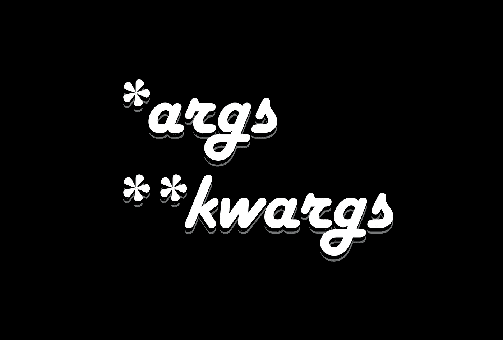
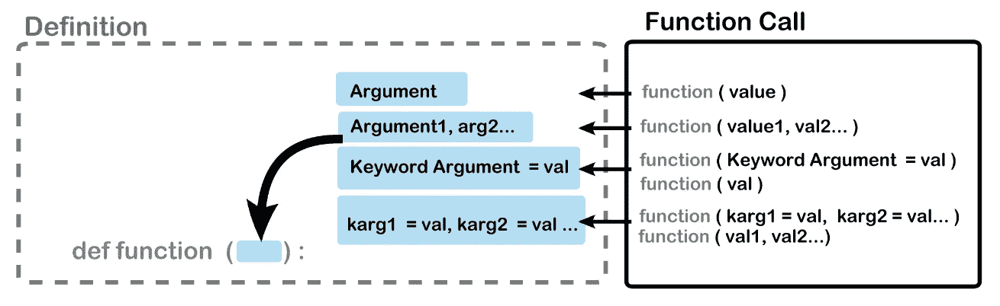
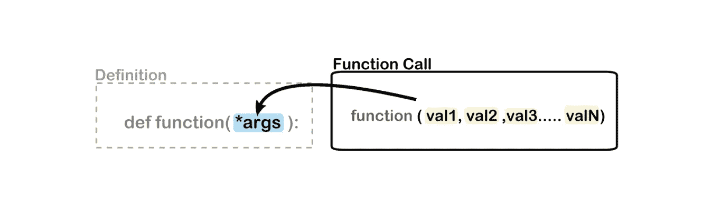
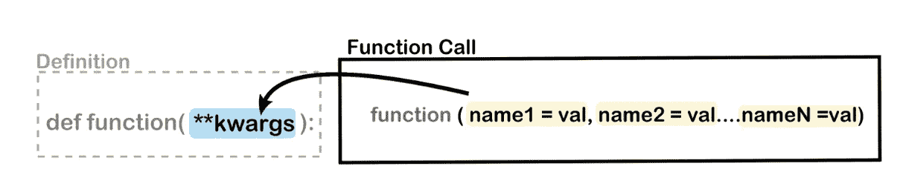
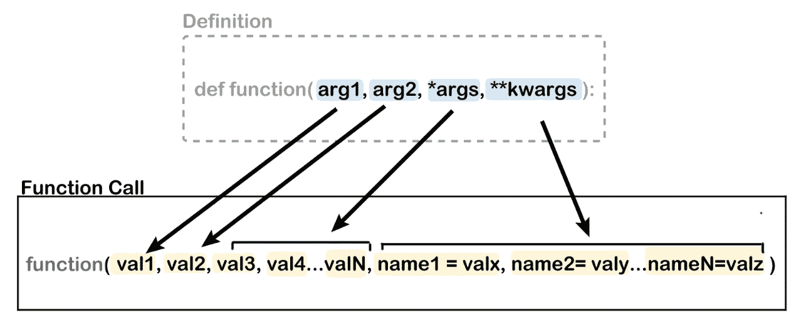

# * Python 中的 args & **kwargs

> 原文：<https://levelup.gitconnected.com/args-kwargs-in-python-8d483f9f253e>



## 他们是做什么的？

如果你在这里，可能是因为你已经发现这些代码是 python 代码片段的一部分，但你不能完全理解它们，或者你想学习如何使用它们。别害怕，我们是来帮忙的。

```
In short **args & **kwargs allow you to pass an **undetermined amount ( * & ** )** of arguments and named arguments (**args** = arguments &  **kwargs** = key-worded arguments).
```

在充分解释它们之前，我们需要后退一步，回顾一些基础知识。让我们从函数开始(*我们稍后会检查类*)，我建议你跟着编码。

```
**# A simple function with one argument or positional argument...**def simpleFunction(**arg**):
    return( 'I am a function, this is my argument: ' + **arg** )print(simpleFunction(**'Argy'**))>>>I am a function, this is my argument: **Argy**  ------------------ • ------------------ **# Now let's try key-worded arguments and 3 ways to add them when calling a function:**def simpleFunctionNamedArgs(**arg1='Argy', arg2=2**):
    return( 'I am a function, these are my named arguments: arg1=' + **arg1** + ', arg2=' + **str(arg2)**) ------------------ 1 ------------------print(simpleFunctionNamedArgs())>>> **Default Arguments:** I am a function, these are my named arguments: **arg1=Argy, arg2=2** ------------------ 2 ------------------ print(simpleFunctionNamedArgs(**'Argidio', 4**))>>> **Sequential Arguments**
I am a function, these are my named arguments: **arg1=Argidio, arg2=4** ------------------ 3  ------------------print(simpleFunctionNamedArgs(**arg2=6, arg1='Argos’**))>>> **Named Arguments, note the order doesn’t matter as long as the keywords fit the function definition:**I am a function, these are my named arguments: **arg1=Argos, arg2=6** 
```

## 总结如下:



## 未确定的参数数量*args

`*args`的神奇/有用之处在于，您可以快速创建一个接受 1 个或 1000 个参数的函数，并用它们做一些事情。以下是一些例子:

```
**#Simple function that receives multiple arguments and returns them:**def multiArguments(*args):
    return(args) **#returns a tuple**print (multiArguments('one', 'two', 'three'))# **args returns a tuple, which is ordered and unchangeable...** 
>>>
**('one', 'two', 'three')** ------------------ • ------------------**# In order to do something useful with the arguments, we need to “unpack" them, here's the classical way:**def multiArguments(***args**):
    for **arg** in **args**:
        print(**arg + 2**)multiArguments(10, 20, 30)
>>>**12
22
32** ------------------ • ------------------# And here with [**comprehension**](https://medium.com/@k3no/python-comprehension-885cd3f27f4a)def multiArgumentsComprehension(***args**):
     print([**arg+100** for **arg** in **args**])multiArguments(100, 200, 300)>>>
**[200, 300, 400]**# we get a list in this last example.
```



## 未确定数量的关键措辞参数* *

从概念上讲，这与`*args`相同，除了这里我们处理的是关键字参数。因此`**kwargs`需要一种稍微不同的方式来打开包装:

```
**#Simple function that receives multiple key-worded arguments and returns them, notice it returns a key, value dictionary:**def multiKeywordedArguments(****kwargs**):
    return(kwargs)print(multiKeywordedArguments(**kwarg1 = 'uno', kwarg2 = 'dos', kwarg3 = 'tres'**))>>>
**{'kwarg1': 'uno', 'kwarg2': 'dos', 'kwarg3': 'tres'}** ------------------ • ------------------**# Unpacking kwargs much like args can be done with a for loop:** def multiKeywordedArguments(**kwargs):
    **for name,value in kwargs.items():**
        print('name: ' + name + ' value: ' + value)multiKeywordedArguments(kwarg1 = 'uno', kwarg2 = 'dos', kwarg3 = 'tres')>>>
name: kwarg1 value: uno
name: kwarg2 value: dos
name: kwarg3 value: tres ------------------ • ------------------**# and you can also use dict comprehension (note we need to make a copy):**def multiKeywordedArgumentsComprehension(**kwargs):
 **modifiedDict = {key:value + 100 for (key,value) in kwargs.items()}**    print(modifiedDict)multiKeywordedArgumentsComprehension(kwarg1 = 100, kwarg2 = 200, kwarg3 = 300)>>>{'kwarg1': 200, 'kwarg2': 300, 'kwarg3': 400}
```



## 混合搭配

很可能你会在同一个函数定义中同时遇到`*args`和`**kwargs`。通常在函数模板中，这是一个 Python 编程约定。以下是几个常见的例子:

```
def mixAndMatch(***args, **kwargs**):
    print(f' Args: {**args**}' )
    print(f' Kwargs: {**kwargs**}' )mixAndMatch('one', 'two', arg3 = 'three', arg4 = 'four')>>>
**Args: ('one', 'two')**
**Kwargs: {'arg3': 'three', 'arg4': 'four'}**Note that you **cannot** place them in the wrong order on the function definition, for instance  (**kwargs, *args) will give you an error.              ------------------ • ------------------# And if you want to add regular arguments they go ***before* *args** or ****kwargs**def mixAndMatch(**regArg**, *args, **kwargs):
    print(f' Regular Argument: {**regArg**}' )
    print(f' Args: {args}' )
    print(f' Kwargs: {kwargs}' )mixAndMatch(**‘zero'**, 'one', 'two', arg3 = 'three', arg4 = 'four')>>>**Regular Argument: Zero**
Args: ('one', 'two')
Kwargs: {'arg3': 'three', 'arg4': 'four'}
```



## 班级

另一个可以找到`*args`和`**kwargs`的地方是在类和子类中:

```
# Here we are passing an undetermined number of arguments and key-worded arguments to a class/object upon creation, and also to a method/function inside the class.class simpleclass(object):
    def __init__(self, ***args, **kwargs**):
        print (args, kwargs) def classMethod(self, ***args, **kwargs**):
        print (args, kwargs)**classInstance** = simpleclass('one', 'two', arg3 = 'three', arg4 = 'four')
>>>
('one', 'two') {'arg3': 'three', 'arg4': 'four'}**classInstance.classMethod**('uno', 'dos', arg3 = 'tres', arg4 = 'cuatro')
>>>
('uno', 'dos') {'arg3': 'tres', 'arg4': 'cuatro'} ------------------ • ------------------# Another place where they usually appear is in subclassing, let's say we want to pass arguments to the parents init method: class parentClass(object):
    def __init__(***args, **kwargs**):
        print('parentArgs:', args, kwargs)class childClass(parentClass):
    def __init__(self, *args, **kwargs):
        print('childArgs:', args, kwargs)
        parentClass.__init__(***args, **kwargs**)subclassInstance = childClass('one', 'two', arg3 = 'three', arg4 = 'four')childArgs: ('one', 'two') {'arg3': 'three', 'arg4': 'four'}
parentArgs: ('one', 'two') {'arg3': 'three', 'arg4': 'four'}
```

## 额外积分:用* & **打开包装

与`*args`和`**kwargs`相关的一个主题是用`*`和`**`解包列表、元组和字典，这可以被认为是我们一直在做的事情的逆过程。考虑下面的例子:

```
# Trying to pass a list or tuple as an argument fails without the unpacking operators...def needsUnpacking(arg1, arg2,arg3):
    print('My arguments:', arg1, arg2, arg3)**commonTuple** = ('One','Two', ‘Three')
**commonList** = ['uno','dos', 'tres']# needsUnpacking(commonList) >>> **ERROR**
# needsUnpacking(commonTuple) >>> **ERROR**needsUnpacking(***commonList**)
>>>
My arguments: uno dos tresneedsUnpacking(***commonTuple**)
My arguments: One Two Three ------------------ • ------------------# Same use for Dictionaries...def needsUnpacking(arg1='ONE', arg2='TWO',arg3='THREE'):
    print('My arguments:', arg1, arg2, arg3)**commonDict** = {'arg1':'un', 'arg2':'deux', 'arg3':'trois'}needsUnpacking(commonDict) 
>>>
My arguments: {'arg1': 'un', 'arg2': 'deux', 'arg3': 'trois'} TWO THREE# Doesn't throw an error but is **INCORRECT**needsUnpacking(****commonDict**)>>>
My arguments: un deux trois#This is what we wanted.
```

从现在开始你应该能弄清楚如何阅读 Python 中的大多数`*`和`**`。剩下的工作就是弄清楚什么时候在你自己的代码中使用它们…

```
The quick answer is that it depends on what you are coding. There are genuine cases where you don’t know how many arguments your function or class will be receiving (*you can also abuse this syntax easily*). Your code might be more readable if you are more explicit with your arguments.A reasonable compromise is to add *args and **kwargs to your functions while prototyping and once you figure out what arguments you need, then add them explicitly to your function definitions.
```

我希望这对你有帮助。

感谢阅读。