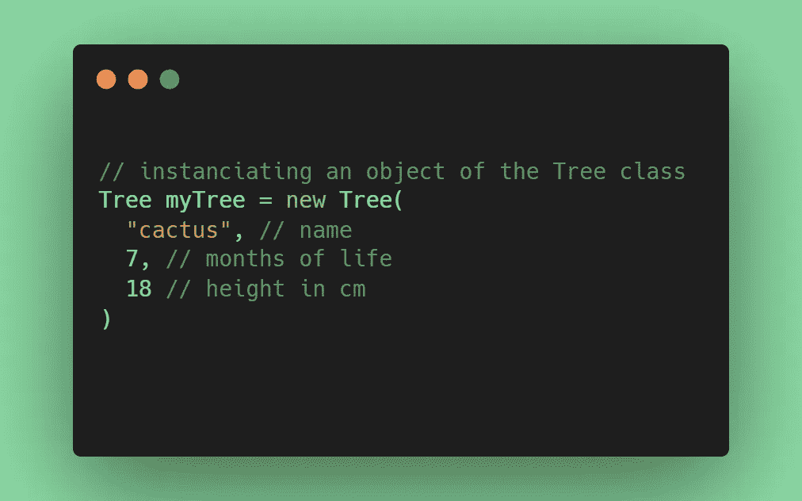

# 亚里士多德奠定了面向对象编程的基础

> 原文：<https://levelup.gitconnected.com/aristotle-laid-the-foundation-for-object-oriented-programming-c8ce840e8380>

## 当计算机科学遇到哲学

*拉斐尔 1511 年雅典学院壁画细节[* [*来源*](https://www.onverticality.com/blog/raphael-school-of-athens)

*虽然从我第一次接触面向对象编程到现在已经过去了好几年，但我仍然能感觉到它给我带来的困惑。我当时 12 岁。老实说，也许我甚至还没有准备好理解面向对象编程，或者任何其他编程范式。*

*我清楚记得的是，我在高中开始学习哲学时，正经历着类似的迷茫状态。正如你将要知道的，这可能不是巧合。*

*快进 10 年，我是一名自由软件工程师，每天使用面向对象编程来设计和构建软件。在那段时间里，我从未真正停下来思考面向对象编程的起源。直到我看了一本关于亚里士多德的哲学书！*

*令我深感惊讶的是，我发现这位希腊哲学家、漫游学派的创始人所写的东西与面向对象编程背后的概念之间有很强的相关性。*

*现在让我们试着理解为什么亚里士多德可能为面向对象编程奠定了基础，以及这可能是如何解释的。*

# *一言以蔽之的亚里士多德*

*[亚里士多德](https://en.wikipedia.org/wiki/Aristotle)出生于公元前 384 年的斯塔吉拉，是古希腊哲学“三巨头”中的最后一位。有成千上万本关于亚里士多德的书，而要深入了解亚里士多德的生活和他所有的理论将会花费太多的时间。因此，让我们只关注亚里士多德形而上学中的两个关键要素，[效力和行为](https://en.wikipedia.org/wiki/Potentiality_and_actuality)。*

## *效力*

*潜能代表了此刻不是但能成为的东西。换句话说，你可以把潜能想象成某种东西变成另一种东西、进化或经历任何变化的可能性。*

*根据亚里士多德的观点，力量与每个人的本性有关。具体来说，潜能决定了特定的限制和特征，这些限制和特征规定了一个存在的本质。*

*例如，一个孩子没有能力飞行或奔跑超过 100 公里/小时，但他们有能力成为一个成年人。*

## *行动*

*行为代表某一时刻已经存在的东西。换句话说，你可以把行为想成已经实现的东西或者已经存在的存在。*

*比如，一个孩子在行为上只是一个孩子，无法成为一个成年人，因为他们无法改变。同时，一个孩子在潜能上是一个成人。*

## *从效力到行动*

*让我们用一个例子来更好地理解效力和行动之间的关系。*

**

*照片由 [Sourabh Panari](https://unsplash.com/@_sourabh_?utm_source=medium&utm_medium=referral) 在 [Unsplash](https://unsplash.com?utm_source=medium&utm_medium=referral) 拍摄*

*一颗种子实际上有潜力变成一棵树。随着种子的成长，它逐渐从潜能转化为行动。当种子变成树时，它就变成了一棵树。此时，种子不再有效。*

*然后，这棵树在行为上可以成为一张桌子或任何其他家具在效力上，等等。*

# *简而言之，面向对象编程*

*[面向对象编程](https://en.wikipedia.org/wiki/Object-oriented_programming) (OOP)诞生于 1960 年左右，现在是最广泛采用的[编程范式](https://en.wikipedia.org/wiki/Programming_paradigm)之一。Alan Kay 在 1983 年创造了这个术语，被认为是 OOP 之父。关于 OOP 有很多要说的，但是让我们主要关注两个关键概念，类和对象。*

## *班级*

*类是 OOP 的构建模块。一个类定义了该类的对象是什么。你可以把一个类想象成一个模板、蓝图或该类对象的完整描述。*

*具体来说，类是用户定义的数据类型，包括一些数据字段和成员函数。这些分别被称为“属性”和“方法”。*

*一个类映射一个抽象的概念。例如，`Tree`类可以有名字、年龄、身高，以及通过`grow()`成员函数增长的能力。*

## *目标*

*对象是类的实例，这决定了它们的类型。在 OOP 中，类型定义了一组对象所共有的特征和特性。因此，相同类型的对象的结构和行为是在它们的类中定义的。*

*详细地说，对象是由方法和属性组成的编程实体。每个属性的当前值代表对象的状态，而它的方法标识对象的可能行为。*

*一个对象映射一个抽象概念的具体表示。例如，一棵 7 个月大、18 厘米高的仙人掌可能是`Tree`类的一个实例。*

## *从类到对象*

*要从类到对象，您需要“实例化一个类”这是因为在 OOP 术语中，“实例化一个类”意味着“创建一个对象”因此，当您创建一个对象时，您正在初始化一个类的“实例”。*

*要从一个类创建一个对象，你必须调用该类的一个特殊方法，称为“构造函数”在 OOP 中，构造函数是一个类的特殊方法，它使你能够创建该类的一个新对象。实例化时，新对象将有一个默认状态，通常在构造函数方法中定义。*

*这就是你如何在 Java 中创建一个对象:*

**

*创建树类的对象*

*注意`Tree()`是`Tree`类的构造器。多亏了它，您可以创建一个由`myTree`变量引用的`Tree`类型的对象。然后，您可以使用`myTree`引用来访问对象的公共属性和方法。*

# *亚里士多德的原则和面向对象程序设计*

*现在应该很清楚，亚里士多德的基本原则和面向对象编程之间有相似之处。但是让我们更深入地研究一下。*

*首先，一个类定义了对象将具有的某些特征，就像效能塑造了特定的方面并强加了一些限制。如果一个`HumanBeing`类没有`fly()`方法，那么`HumanBeing`对象将没有飞行的可能性。换句话说，类定义决定了那个类的对象的本质的一些特征，就像效力一样。*

*第二，实际上一个类有潜力成为一个对象。再说一遍，这个对象实际上只是一个对象。同时，对象可以通过来自它的类定义的成员函数来改变，这允许它成为其他的有效力的东西。*

*因此，`Seed`类有可能被实例化为`Seed`对象，而后者有可能通过`grow()`方法成为`Tree`对象。这种逻辑与亚里士多德描述的从行动到权力的转变完全一致。*

*现在，你可能想知道亚里士多德的哲学和 OOP 之间的这种意想不到的联系是如何可能的。*

*亚里士多德出生在第一台可编程计算机发明前 2000 年。因此，很难想象他在对效力和行为进行理论化的时候会想到面向对象编程。同时，Alan Kay 可能将编程范式建立在亚里士多德的原则之上，但是没有陈述或证据表明这一点。*

*亚里士多德和艾伦·凯的目标肯定是一致的。他们都想找到一种方法来表现现实以及物体和生物的进化。亚里士多德在设计他的形而上学时，采用了“效力和行为”这一对术语来解释自然现象。类似地，Alan Kay 在介绍他的编程范式时，发明了术语“类和对象”来表示离散数字世界中的自然。*

*现在，问题仍然是在编程和哲学之间还能找到多少其他的关联…*

# *结论*

*在本文中，您了解了计算机科学和哲学的世界是如何相距不远的。*

*亚里士多德的哲学似乎是基于某些与面向对象编程范例的构建块相关联的基本原则。特别是，亚里士多德的权力和行为的概念接近 OOP 的类和对象的概念。在这里，你看到了亚里士多德的形而上学和 OOP 是如何联系在一起的，以及为什么会发生这种情况。*

*感谢阅读！我希望这篇文章对你有所帮助。请随意留下任何问题、评论或建议。*