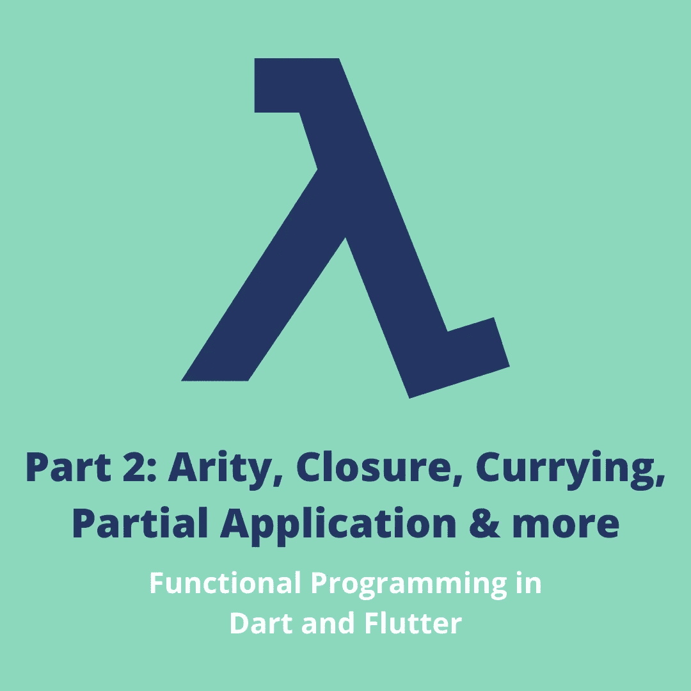
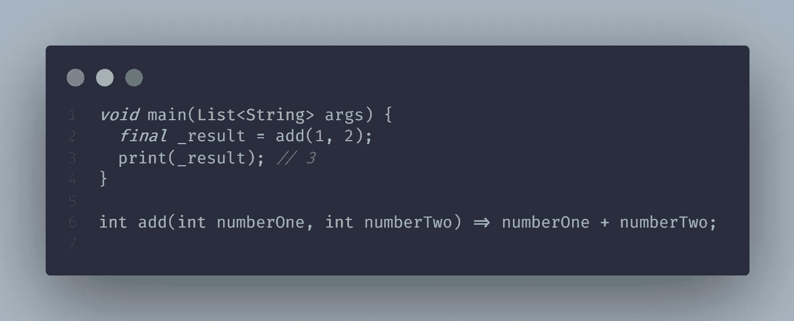
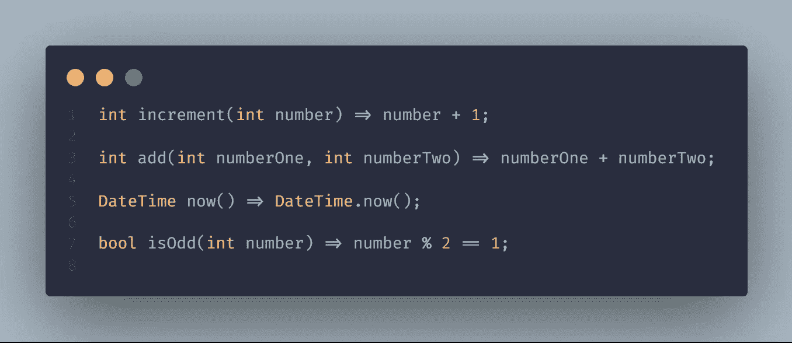
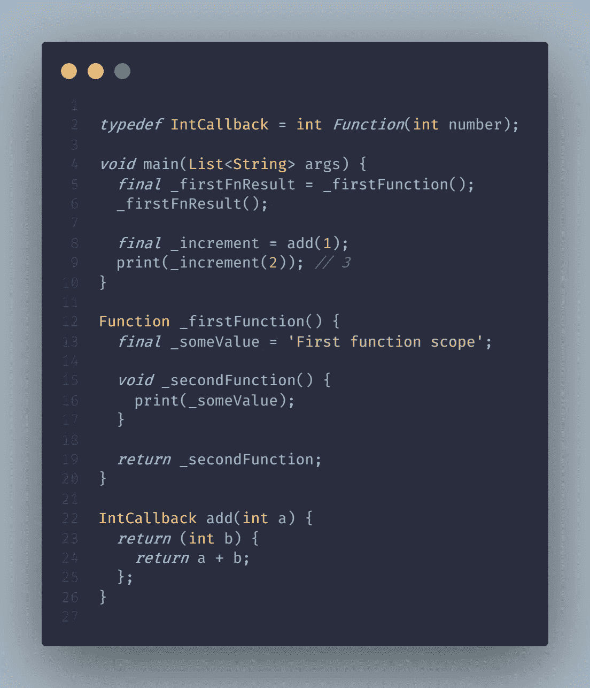
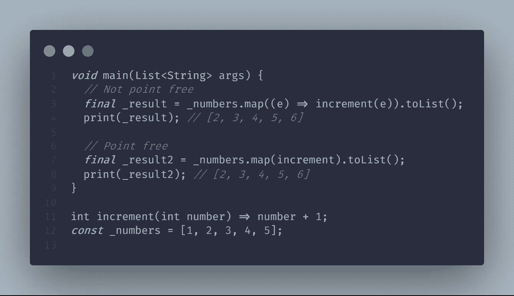
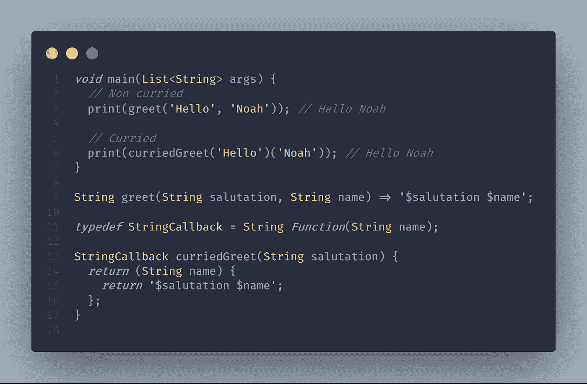
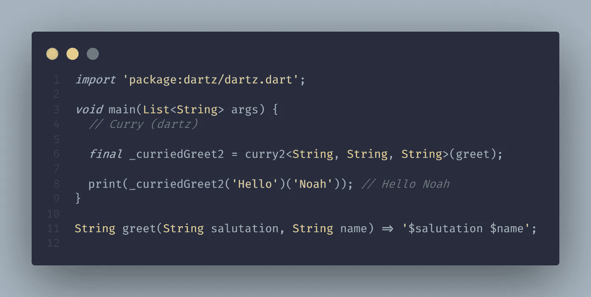
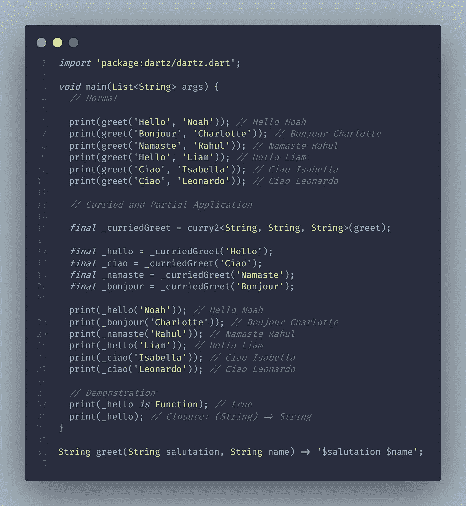

# Arity、闭包、Currying、部分应用& Dart[函数式编程—第 2 部分]中的更多内容

> 原文：<https://levelup.gitconnected.com/arity-closure-currying-partial-application-more-in-dart-functional-programming-part-2-4534a8b7f374>

## [Dart 中的功能编程](https://medium.com/@yogi-6/list/functional-programming-in-dart-flutter-2f3ac9d7fa39) / Arity、Closure、curring&

## 本文旨在解释 Dart 和 Flutter 中的函数、闭包、部分应用程序、函数与调用堆栈的关系以及更多内容



# 目录

*   [**参数 vs 变元**](#78d1)
*   [**Arity**](#03b1)
*   [**函数&调用堆栈**](#c2d6)
*   [**封**](#42d5)
*   [**局部应用**](#7425)
*   [**无点风格**](#a606)
*   [](#6fda)
*   **[**例题**](#f327)**
*   **[**结论**](#ec47)**
*   **[**本系列其他文章**](#343b)**

**我注意到这个术语的自变量和参数可以互换使用。所以在开始之前，我们先了解一下区别。**

****参数:**参数是函数声明的一部分。**

****参数:**参数是传递给函数的值。它是函数调用的一部分。**

****

**这里，在`add`函数声明中，`numberOne`和`numberTwo`是参数。在 2 号线上；1 和 2 是传递给 add 函数的参数。**

**简单地说，参数是接受值的变量，实参是传入的值。**

# **Arity**

**Arity 是函数接受的参数个数。**

****

**`increment`函数的 arity 为 1。接受单个参数的函数称为**一元**函数。**

**`add`的 arity 是 2。带两个参数的函数称为**二元**函数。**

**`now`的 arity 为 0。不带参数的函数被称为**空值**函数。**

**`isOdd`的 arity 是 1，因此它是一个**一元**函数。`isOdd`也是一个**谓词**函数，因为它返回一个布尔值。谓词函数是返回布尔值的函数。**

# **函数和调用堆栈**

**让我们理解一个函数经历哪些阶段。首先，声明。这包括函数名、它的参数和函数体。每个函数都有一个作用域，用于维护该函数所有变量的状态。一旦该函数被调用(即被调用)，它就被添加到调用堆栈中。**

**调用栈是函数调用的列表。它使用堆栈，遵循后进先出的原则。当函数返回时，它将从调用堆栈中移除。由于 Dart 是单线程语言，调用堆栈有助于维护所有函数调用的历史记录。**

# **关闭**

**正如所见，每个函数都有一个作用域。因此，当一个函数被定义到另一个函数中时，内部函数会记住外部函数的范围，即使外部函数已经执行并且不再可用。这就是所谓的终结。**

****

**`_secondFunction`是在`_firstFunction`内部声明的内部函数。在第 5 行，我们调用`_firstFunction`，它返回`_secondFunction`，存储在`_firstFnResult`变量中。调用堆栈在返回值时移除`_firstFunction`。我们来看看`_secondFunction`的车身。它正在访问位于`_firstFunction`范围内的`_someValue`变量。如果我们调用`_firstFnResult`，当它保持状态时，它将在控制台上打印值。是因为封闭。**

**我们再举一个例子。我们在第 8 行调用`add`函数。函数 add 接受单个参数，并返回一个接受单个参数的函数。现在，由于函数记住了第一个参数(在我们的例子中是 1)，我们只需要传递第二个参数，它就会返回总和。**

# **部分应用**

**应用于某些输入的函数是部分应用。闭包帮助我们实现部分应用。部分应用程序背后的思想是锁定一些参数，这样我们就不必重复传递它们。让我们来看看闭包部分所附图片中的`add`函数。`add`函数需要两个连续的参数来返回结果，但是我们传递了一个参数并将其赋给了`_increment`变量。我们没有给出所有的论点；我们已经部分应用了该功能。**

# **无点风格**

**我们可以考虑像传递给函数的参数这样的点。无点风格定义了一个函数，而不需要显式地传递参数。**

****

**在 3 号线上；e 是明确传递给增量函数的点。为了将其转换为无点样式，我们删除了显式参数。**

**无点风格，如果不过分，会使代码简洁易读。这更多的是一种选择，而不是必须。**

# **Currying**

**将一个多参数函数分解成一系列单参数函数就是 currying。一个 curried 函数一次接受一个参数，然后返回一个接受一个参数的函数，以此类推，直到所有的参数都被传递。**

****

**`greet`是一个接受两个参数并返回一个字符串的函数。**

**一个咖喱版本的问候会看起来像`curriedGreet`。它接受一个参数并返回一个函数，该函数接受一个参数并返回结果。**

**如果这是您第一次查看 curried 函数，那么`_curriedGreet`的实现可能看起来有点奇怪。此外，您可能已经注意到，随着参数数量的增加，它将有一个深度嵌套的结构。那么有没有办法克服这些问题呢？**

**欢迎光临，**达斯！**我们将使用`dartz`包在 dart 中实现 FP 概念。让我们使用`dartz`将 greet 函数转换成 curried 函数。**

****

**`curry2`是由`dartz`包提供的一个函数，它将两个参数的函数转换成一个 curried 函数。是的，你猜对了！`curry3`是将一个三参数函数转化为一个可化函数，`curry4`为四参数函数，以此类推，直到`curry6`。**

```
C Function(B) Function(A) curry2<A, B, C>(C Function(A, B) fun)
```

**上面是采用 3 个泛型的`curry2`声明。`A`和`B`分别是您想要搜索的函数的第一个和第二个参数。`C`是结果。我们的`greet`函数接收两个字符串并返回一个字符串；因此我们传递 3 个字符串作为泛型。**

# **curry vs 部分应用**

**部分应用和 currying 可能看起来一样，但它们是不同的概念。分部应用程序一次可以接受多个参数，而 curried 函数总是必须返回一个一元函数(单参数函数)。Curried 函数用于创建部分应用程序，但并非所有部分应用程序都是 curried 函数。**

# **例子**

**现在我们知道了这些概念，让我们把它们结合起来，创建一个用人们的语言问候他们的程序。**

****

**我们有相同的`greet`函数，它接受两个参数并返回一个字符串。第一个参数是称呼，可以根据用户的来源而不同，第二个参数是用户名。如果我们有 50 个来自印度的人，我们必须传递 50 次 hello 参数，这似乎是多余的。让我们用我们学过的概念，应用到这里。**

**我们使用`dartz`包中的`curry2`将我们的`greet`函数转换成第 15 行的 curried 函数。利用这一点，我们可以创建几个 salutation 部分应用程序，以后只需传递用户名就可以使用它们。**

**我们从第 17 行到第 20 行创建部分应用程序，并传入 salutation 参数。现在`_hello`是一个部分应用程序，因为它还没有完全执行。在我们的场景中，它是一个需要第二个参数，即用户名的函数。看第 30 行和第 31 行；当我们打印`_hello`时，我们得到一个函数，它期望一个字符串作为参数。**

**现在我们都准备好了，我们已经准备好使用这些部分应用的函数。如果需要新的称呼支持，我们只需要创建一个新的部分应用程序。为了使用它们，我们在第 22 到 27 行传递用户名，给出结果。即使我们没有传递 salutation 参数，`_hello`和其他函数也会因为闭包而记住它们。**

# **结论**

**唷！那很了不起。我们从基础知识开始:实参与形参，讨论了函数的 Arity 以及函数和调用栈如何协同工作。然后我们探讨了闭包、部分应用程序、Currying 以及它们是如何一起工作的。我们还看到了单点自由风格，以及它如何导致一个可读的代码库。最后，我们用一个例子来展示这些概念。所有这些可能看起来有点奇怪，但是一旦我们开始使用这些，它就会成为第二天性。试着看看你是否能在你现有的代码库中实现它。像其他事情一样，你练习得越多，感觉就越自然。**

**在接下来的文章中，我们将提升我们在功能组合方面的水平，并将这些技术与我们今天所学的结合起来解决复杂的问题。**

****牛逼！**拍拍自己的背，因为你坚持到了最后。我希望我为你投入的时间增加了一些价值。在 [**GitHub**](https://github.com/Yogi-6/functional_programming_dart) 知识库上找到更多例子，并在 [**Twitter**](https://twitter.com/_yogi_6) 或 [**LinkedIn**](https://www.linkedin.com/in/yogi6/) 上寻求建议/问题或任何你希望我涵盖的主题。你可以鼓掌支持👏，感谢您的阅读:)更多信息请关注😄**

**下次见，伙计们！**

# **本系列的其他文章**

*   **[基础](https://yogi-6.medium.com/functional-programming-in-dart-foundation-part-0-7e932517b824)**
*   **[纯功能&副作用](https://yogi-6.medium.com/pure-functions-side-effects-in-dart-functional-programming-part-1-fb931d6c0351)**
*   **Arity，Closure，Currying，Partial Application &更多。**
*   **[构图](/composition-in-flutter-dart-functional-programming-part-3-ffba917aee3d)**
*   **[永恒性&平等性](/immutability-equality-in-flutter-dart-functional-programming-part-4-339a4e9312bb)**
*   **[高阶函数&递归](https://medium.com/flutter-community/higher-order-functions-recursion-in-dart-functional-programming-part-5-4237bc114005)**