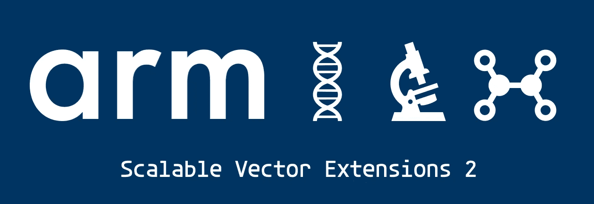
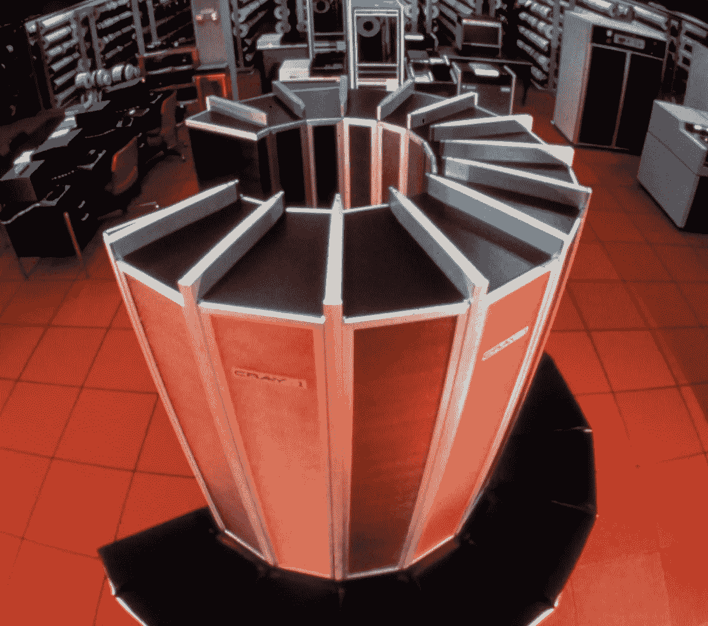
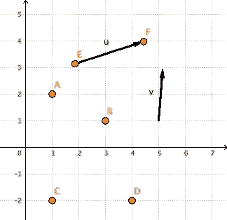
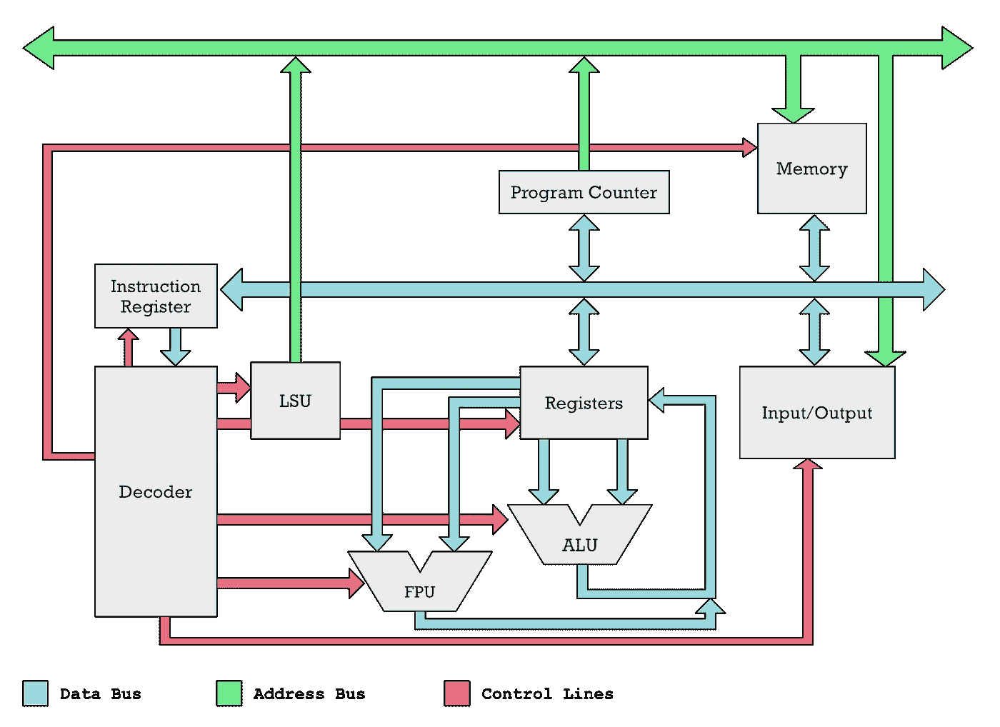
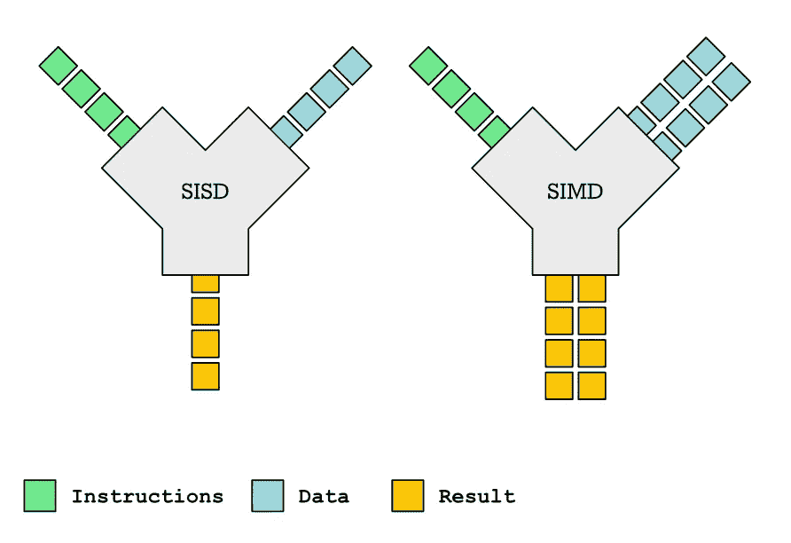
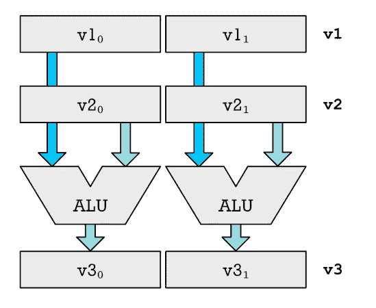
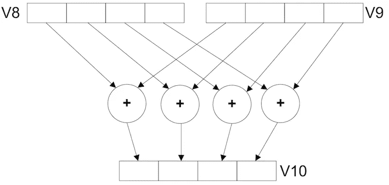

# ARMv9:有什么大不了的？

> 原文：<https://levelup.gitconnected.com/armv9-what-is-the-big-deal-4528f20f78f3>

## 什么是可伸缩向量扩展？对行业和用户意味着什么？行话背后是什么？



如果你是手机用户，那么你一定知道 ARM 芯片:它们为你的手机供电，现在它们也为下一代 MAC 电脑供电。他们也在向服务器领域大举进军。

我们正处于工业大变革的风口浪尖，这是几十年来从未有过的。是的，这听起来很戏剧化，但是 x86 已经统治计算行业几十年了，随着 ARM 的崛起，它可能会面临有史以来最大的挑战。

这场战斗不会在今年尘埃落定，但现在 ARM 发布了他们的下一代架构 ARMv9，这将设定行业十年的发展方向。因此，这是一个非常重要的事件，值得仔细研究。

这里有很多东西要谈，但对我来说最大的话题是所谓的*可伸缩向量扩展 2* (SVE2)的标准化。你可能听说过 SIMD 指令集，如英特尔的 MMX、SSE2、AVX、AVX-512 或 ARM 的 Neon。然而，除了表面上的感觉之外，你可能并不确切知道这些是做什么用的。我将试着解释是什么让 SVE/SVE2 与这些旧的 SIMD 指令集如此不同。

您知道富士通在这一切中发挥了重要作用吗？我们正在看到老派超级计算的回归，就像几十年前在 Cray-1 超级计算机中发现的那样。Cray 公司实际上还没有死，但实际上正忙于建造基于 Arm 的超级计算机: [LRZ 部署 HPE 的 Cray CS500 系统，采用 ARM 富士通 A64FX 处理器。](https://www.hpcwire.com/off-the-wire/lrz-to-deploy-hpes-cray-cs500-system-to-bring-innovative-architecture-to-the-science-of-its-users/)



克雷-1 超级计算机， *c.* 1976 年。它大约 6 英尺高，直径 7 英尺(1.8 米乘 2.1 米)。

# ARMv9 是我可以在商店买到的物理芯片吗？

这不同于 AMD 或 Intel 发布新的微处理器，你可以购买并安装在你的电脑上以获得更高的性能。它不是一件物质的东西。相反，这是一种新的微处理器架构，向后兼容以前的 ARM 架构，如 ARMv8。

让我详细说明这是如何工作的。世界各地的许多公司，如高通、苹果、富士通、安培计算、亚马逊和许多其他公司都设计自己的芯片。这分几个步骤进行。例如，苹果和 AMD 实际上都不制造自己的微芯片。相反，他们设计芯片，然后将设计运送到我们所谓的代工厂，如全球代工厂或 TSMC。他们将设计蚀刻到硅片上，然后切割成微芯片并封装。

ARM 公司不像高通或安培计算公司。他们不制作最终的蓝图，而是运送到半导体铸造厂。相反，ARM 出售智能建筑或知识产权。像苹果这样的公司可以购买这些不同的设计，并将其组合成最终的蓝图，然后运往 TSCM 进行生产。


由 TSMC 制造的基于 ARM Neoverse N1 的 SoC

但是这个有不同的味道。例如，有诸如 Neoverse N1 这样的实际微处理器核心的蓝图。一家公司可以从 ARM 购买这种设计，使用他们的设计工具，在屏幕上复制粘贴四个 N1 内核，绘制一些连接线，拖出一些缓存块，进行一些连接。嘣，他们有了新的微处理器。好吧，比那稍微复杂一点，但是你得到了大概的想法。

ARMv9 和之前的 ARMv8 一样，并不是那种特定的具体设计。这不是一个蓝图说:晶体管以这种或那种方式连接。你如何布局你的晶体管来创造一个高性能的设计，这就是我们所说的**微架构**。


ARMv9 是编译器编写者和硬件设计者之间的契约。对于特定 ARM 处理器的接口应该是什么样子，这是一个普遍的共识。支持哪些指令以及它们是如何工作的。但是它没有提到晶体管是如何做到这一点的。

相比之下，ARMv9 是 **CPU 架构**，更加抽象。它更像是硬件和软件之间的契约。它说什么硬件寄存器应该在你的微处理器上。它们包含多少位(二进制数字)。它说明了支持哪些操作。操作类似于将两个 32 位数字相加，或将两个 64 位浮点数相乘，并将结果存储在另一个寄存器中。

*CPU 指令的例子，用于分别从存储单元 14 和 24 加载数字，并存储在寄存器* `*x1*` *和* `*x2*` *中。添加寄存器并将结果存储在寄存器* `*x3*` *中。*

```
load x1, 14       ; x1 ← memory[14]
load x2, 24       ; x2 ← memory[24]
add  x3, x1, x2   ; x3 ← x1 + x2
```

欲了解更多详情，请阅读我的文章[现代微处理器如何工作？](https://medium.com/swlh/how-does-a-microprocessor-work-e06d196efd8f)

CPU 架构对工具制造商来说很重要。像编译器和连接器这样的软件以 CPU 架构为目标。这意味着当 ARM 有限公司制造 ARMv9 时，他们为软件开发人员和硬件制造商制定了一个通用标准。只要高通、苹果、Ampere 和其他公司制造的硬件能够理解 ARMv9 规范所规定的指令，那么为这一规范编写代码的软件也能运行。

自然，作为这种努力的一部分，ARM 将一直在开发实际实现这种新 ARMv9 标准的微架构。然而，这只是我们可能在未来 10 年看到的一长串微架构中的一个。在此期间，我们将看到许多不同的硬件，但它们都能够运行为 ARMv9 规范编写的代码。

# ARMv9 有什么新功能？

为了了解这种规格意味着什么，有必要提一下 ARMv8 的含义。ARMv8 发布于八年前，是 ARM 有限公司推出的第一款 64 位架构。基于 ARMv7 架构的芯片是 32 位的。这意味着 CPU 内部的寄存器只能处理最多 32 位二进制数字。

ARMv8 对苹果来说是一件大事，因为他们迅速而积极地向 64 位 ARM 架构转移，让整个行业大吃一惊。这让 iPhone 和 iPad 在竞争中领先一步。毫无疑问，苹果希望尽早进入高性能架构，因为他们的目标是 ARM 桌面芯片。

简单来说，你可以说 ARMv8 是桌面计算的 ARM 架构。ARM 迈出了手机的第一步，进入了台式电脑和服务器的世界。

相比之下，ARMv9 完全是超级计算机。这可能会让你觉得，作为一个手机用户或台式电脑用户，这并不意味着什么。然而你错了。这也和消费者有很大关系。

我还没有谈到向量有什么大不了的，或者它们到底是什么。然而，它们在科学上是一件大事。旧的超级计算机，如 Cray-1，是围绕处理大量向量而建立的。他们就是我们所说的向量处理机。

当我十几岁时读到克雷电脑，我不明白这意味着什么。我曾经和我的伙伴们幻想在克雷上玩《毁灭战士》会有什么样的帧率。但这可能不会有什么影响。克雷擅长的是科学计算，比如运行天气模拟、药物模拟以及各种数据分析和处理。任何涉及包含大量行和列的大型数据表的东西都可以从矢量处理中受益。

这就是 ARMv9 通过增加一整套称为 SVE2 或可伸缩向量扩展 2 的新微处理器指令而实现的。换句话说，ARM CPUs 正变得更像昔日的超级计算机。

更多阅读: [ARM、x86、RISC-V 微处理器对比。](https://erik-engheim.medium.com/arm-x86-and-risc-v-microprocessors-compared-92bf0d46fd52)

## 口袋里的超级电脑

但是为什么 ARM 今天会有超级计算机风格的架构呢？这是怎么回事？

你有没有注意到人脸识别、语音识别、自动驾驶和机器学习已经变得越来越普遍？你有像 Siri 这样的智能助手，给你开会的提示，回答问题。现在这可能看起来很老套，但是你有没有思考过这些解决方案在过去是如何工作的？

每当你对你的数字助理说话时，录音就会通过网络发送到云端，在那里相当于一台超级计算机会分析你的声音，确定你说了什么，然后将结果发送回你的手机。今天，我们正试图将这种智能更广泛地传播到各地更多的设备上。所有这些设备都不具备高速互联网连接，无法吸收大量带宽。

此外，用户不希望总是连接到他们的数字助理，进行语音识别、人脸识别和其他任务。我们希望这些任务总是可用的，并且在更便宜和无处不在的设备上。事实证明，这类任务反映了经典超级计算机如 Cray-1 过去所做的事情。因此，曾经旧的现在是新的。

我将在这里更详细地介绍这一点: [RISC-V 矢量指令 vs ARM 和 x86 SIMD。](https://medium.com/swlh/risc-v-vector-instructions-vs-arm-and-x86-simd-8c9b17963a31)

## ARM 进军高性能计算领域

继台式机和服务器之后，下一步自然是高性能计算(HPC)。真正的超级计算机。很久以前，这是由 ARM 等定制硬件解决方案主导的，在大型数据中心包含商用硬件(如配备强大显卡的 x86 计算机)之前。

随着机器学习和数据分析在经济中变得更加主流和重要，英特尔和 AMD 在这个市场上赚了很多钱。ARM 自然想在这个市场上大咬一口。富士的 A64FX ARM 微处理器是第一把火。

富士通有使用向量处理构建这种克雷风格超级计算机的经验。他们与 ARM 合作，使用一种新的指令集来扩展 ARM 处理器，这种指令集被称为 SVE，可扩展向量扩展。虽然 ARM 已经在这一设计上走得很远，但富士通基于他们的超级计算经验提供了很多帮助。

这种组合被用来创建 A64FX，它构成了建立世界上最强大的超级计算机的基础:[日本的 Fugaku 获得世界上最快的超级计算机](https://www.riken.jp/en/news_pubs/news/2020/20200623_1/)的称号。


A64FX 是富士通设计的基于 ARMv8 的 CPU，用于高性能计算。这是第一个具有可扩展向量扩展的芯片。

但是有一个非常重要的事实需要注意。这是一个扩展，不是 ARMv8 基本规范的一部分。例如，你基于 ARMv8 的 iPhone 或 iPad 不可能运行为 [Fugaku 超级计算机](https://www.fujitsu.com/global/products/computing/servers/supercomputer/)编写的代码，因为它们只是缺乏对 SVE 微处理器指令的支持。

相反，在 ARMv9 中，这类指令成为标准的一部分。这就是为什么我说 ARM 是把一台超级电脑放进你的口袋。

但是她还有一个更深层次的故事，需要了解更多的细节。你可以看到 ARM 正在以某种方式做到这一点，他们可以为最便宜的嵌入式设备提供处理器，一直到最昂贵的超级计算机，同时使所有这些设备都能够运行相同的代码。

他们正在以一种比以前更常规的代码能够获得更高性能的方式来做这件事。对于英特尔和 AMD 为他们的 x86 微处理器追求的 AVX 指令的解决方案来说，这种事情是不可能的。

为了更好地理解为什么，我们需要更详细地看看向量处理和 SIMD 指令之间的区别和相似之处。但是首先，什么是向量？



你可以从很多方面来看向量。要么只是一串数字。但实际上它们代表了空间的位移。比如箭头。点的(x，y)表示该点在坐标系中的位置。向量的(x，y)表示向量沿 x 轴和 y 轴延伸的距离。向量可以有更多数字的原因是因为它们不局限于 2D 和 3D 空间。它们也可以存在于数百甚至数千维的虚拟空间中。在数学中，你能想象的任何事情都是可能的。

# 向量到底是什么？

向量只是一系列数字的数学术语。我们通常会这样写:

```
[3, 5, 9]
```

通过使用名称或标识符引用数字列表来处理它们是可行的。因此，我在这里制作了两个名为`v1`和`v2`的向量:

```
v1 ← [3, 2, 1]      
v2 ← [1, 2, 2]
```

这是一种表达方式，我把向量相加，并把结果存储在`v3`中:

```
v3 ← v1 + v2  ; v3 should now contain [4, 4, 3]
```

为什么用箭头(`←`)符号？当解释计算机内部发生的事情时，这是很有用的，因为我们通常有一些存储数字的内存区域。这种记忆可以被编号或命名。在微处理器内部，我们有一小块叫做*寄存器文件*的内存，它被分成叫做寄存器的独立块。在 ARM 微处理器上，这些寄存器的名称有`x0`、`x1`...`x31`或者可以命名为`v0`、`v1`...`v31`。

为了能够执行诸如加、减或乘之类的运算，需要将它们从内存移到这些寄存器中的一个。您不能直接将存储在主存储器中的两个数字相加。CPU 只对存储在其*寄存器文件*中的数字进行运算。



在这个微处理器的简图中，**寄存器文件**是标有**寄存器**的灰色方框。内存中的数字通过被称为总线的彩色线路传输给它。寄存器文件将输入馈送到 ALU、FPU、LSU 和执行实际计算和操作的其它单元。

顺便说一下，为了避免混淆。*寄存器文件*与硬盘上的文件无关。它只是 CPU 内部的一块内存，可用于算术和逻辑运算。

矢量的反义词是*标量*。那只是一个对单个数字的花哨说法。下面是一个简单的标量操作示例，使用了前面的符号:

```
x1 ← 3        ; store 3 in x1
x2 ← 4        ; store 4 in x2
x2 ← x1 + x2  ; adding x1 and x2 gives 7
```

向量有很多用途。即使你不是程序员，你也可能使用过电子表格应用程序，比如 Microsoft Excel。一行中的一列，可以看作是一个向量。我们通常将其视为一个逻辑单元。例如，我们可以将一列中的所有元素相加，或者将一列中的每个单元格与另一列中同一行上的单元格相加。这和你在一个 CPU 中添加两个向量的情况是一样的。多个列一起形成表格。用数学术语来说，我们会说多个向量构成矩阵。基本上是按行和列组织的数字集合。


你可以把数量和单位成本看作向量。总成本是对这两个向量进行逐元素数学计算的结果。

这在机器学习或几乎任何科学工作中都是一件大事。第一台可编程计算机 Z1 实际上是用来执行矩阵计算的。

虽然今天的计算机通常不直接处理矩阵，但我们可以通过使用向量来加速矩阵计算。这就是为什么矢量指令对于加速机器学习、图像识别和语音识别如此重要。向量和矩阵的数学称为线性代数。我给好奇的你们介绍一下:[线性代数的核心思想。](https://erik-engheim.medium.com/the-core-idea-of-linear-algebra-7405863d8c1d)

但是让我们不要迷失在数学中。我们真正想知道的是这与微处理器有什么关系。现代微处理器中用来处理向量的指令叫做 SIMD 指令。

# SIMD vs 矢量指令

从技术上讲，阿姆斯·霓和 SVE 指令都是 SIMD 指令的一种形式。是缩写，是*单指令多数据*的简称。我们所说的指令是指像加、减、乘这样的东西。因此，SIMD 的思想是，你向 CPU 发出一条指令，然后它同时对多个值执行同样的操作。



单指令单数据(SISD)与单指令多数据(SIMD)

这种指令集已经存在了一段时间。你可能听说过英特尔和 AMD x86 微处理器上的 MMX、SSE 和现在的 AVX 指令集。他们开始更快地进行多媒体处理，如视频编码和解码。ARMs Neon 指令与这些最相似。这些霓虹灯说明看起来像这样:

```
LDR v0, [x4]    ; v0 ← memory[x4]
LDR v1, [x6]    ; v1 ← memory[x6]

ADD v4.16B, v0.16B, v1.16B 
STR v4, [x8]    ; v4 → memory[x8]
```

在这个例子中，标量寄存器`x4`、`x6`和`x8`保存着内存地址，也就是我们要从中加载数字和存储计算结果的内存位置。

`LDR`是一条 ARM 指令，用于将数字从内存加载到寄存器文件的寄存器中。`STR`反其道而行之，将寄存器中的数字存入主存。

`ADD`指令可能看起来很奇怪。为什么每个寄存器名称后面都有像`.16B`这样怪异的后缀？

## 向量处理中的车道

v0 和 v1 等矢量寄存器为 128 位宽。那是什么意思？它基本上是一个向量寄存器可以容纳的二进制数字的最大数量。

这就为我们可以并行处理多少个数字以及每个数字可以有多少个二进制数字(位)设置了一个上限。例如，如果您想将 64 位数字相加，那么您只能并行地将两个数字相加，因为在一个 128 位向量寄存器中只能容纳两个 64 位数字。然而，如果您使用较小的数字，您可以适合更多。例如，当处理颜色值时，我们通常将红色、绿色和蓝色分量表示为 8 位值。我们可以在一个 128 位寄存器中放入 16 个这样的寄存器。

```
128/8 = 16
```

因此，这应该给你一个提示。`16B`表示 16 个字节宽的元素。试着猜猜这条加法指令是什么意思:

```
ADD v4.2D, v0.2D, v1.2D
```

在微处理器行话中，我们通常称一个字为 32 位数字。64 位值是一个双字。因此`.2D`表示两个双字。`.4S`表示四个单词:

```
128/32 = 4
```

但是为什么只有 add 指令才有这些后缀呢？为什么不加载和存储？因为当我们加载和存储时，我们不需要把每个向量寄存器看作是由多个元素组成的。

在计算过程中，我们将寄存器分割成的元素数量决定了为计算设置了多少个通道。想象一个道路系统，其中的数字沿着多条车道平行流动。下面是一个例子。我们得到了在计算中使用的`v1`和`v2`寄存器，结果存储在`v3`中。我们分成两个元素`.2D`，因此我们有两个通道执行计算。每个通道都有一个 ALU(算术逻辑单元)。



如何使用多个 alu 来执行 SIMD。我们有两条计算路线。每个通道由一个算术逻辑单元(ALU)处理。

如果你不喜欢我的例子，那么 ARM 有另一个例子来说明这个概念，有四个单独的通道用于添加。



`v8`和`v9`寄存器之间的四通道加法

## SIMD 指令的问题

SIMD 指令，如下所示，可能看起来像是带有不同参数的相同指令:

```
ADD v4.2D, v0.2D, v1.2D 
ADD v4.4S, v0.4S, v1.4S
```

然而，这些被编码为单独的指令。这很快就失去了控制，这在 x86 方面也有所体现。英特尔从 MMX 开始，然后是 SSE、SSE2、AVX、AVX2，最后是 AVX-512。例如，MMX 拥有 64 位向量寄存器，因此您可以并行处理两个 32 位值或八个 8 位值。

随着时间的推移，随着晶体管越来越多，他们决定开发新的更大的矢量寄存器。例如，SSE2 具有 128 位向量寄存器。最终这还不够，所以你得到了 AVX 和 AVX2 给了我们 256 位向量寄存器。现在终于 AVX-512 给了我们疯狂的长 512 位向量寄存器。所以现在你原则上可以并行计算 64 个 8 位颜色值。

每当英特尔推出更大的寄存器时，他们都必须添加大量新指令。为什么？因为向量寄存器的长度被编码在 SIMD 指令中。这很快变得臃肿。您将需要一个`ADD`指令用于:

1.  每个向量寄存器宽度为 64、128、256 或 512 位。
2.  每一个都需要一个单独的变量来表示所使用的通道数。

因此，SIMD 指令的加入导致了指令数量的爆炸，尤其是对于 x86。当然，并不是每个 x86 处理器都支持所有这些指令。只有较新的版本支持 AVX-512。

## 为什么 ARM 不能遵循 AMD 和 Intel 的策略

这种策略对 ARM 来说是行不通的。英特尔和 AMD 的使命很简单。他们只是试图在任何时候都尽可能制造最大最便宜的 CPU，并将它们推向市场。

相比之下，ARM 试图覆盖非常广泛的需求。ARM 运行在微型嵌入式设备上，一直到超级计算机，如 Fugaku。ARM 可能能够为使用 512 位向量的服务器提供 CPU 设计，但在一台小型的 ARM 上支持这种设计是不可能的，该 ARM 旨在运行在具有长电池寿命的廉价手机上。当然，ARM 可以提供许多不同的指令集。

事实上，ARM 确实为不同的细分市场提供了不同的配置文件。但同样的软件可以在他们的各种芯片上编译和运行，这仍然是 arm 感兴趣的。

SVE 和 SVE2 允许 ARM 做的是为卖方设计的每种类型的芯片赋予不同物理长度的向量寄存器。对于 SVE/SVE2，向量寄存器必须具有 128 位的最小长度和 2048 位的最大长度。对于低功率智能手机，他们可以出售 128 位向量长度的设计。对于超级计算机，他们可以出售 2048 位宽向量的设计。

SVE 的美妙之处在于，超级计算机和廉价手机都可以使用相同的代码。这对于 x86 SIMD 指令来说是不可能的。虽然我不是 ARM 汇编代码专家，但根据使用 Neon 和 SVE 时汇编代码的样子，在我看来后者似乎更有效。即使向量寄存器长度相同。

原因是你得到了更短的汇编代码。这意味着缓存可以容纳更少的指令。需要解码和管理的指令更少。让我澄清一下我的意思。当一个微处理器从内存中接收到一个指令，告诉它比如说把两个数字相加或者相乘，那么它就需要计算出这个指令告诉它做什么。这被称为*解码*，需要相当大的功率。解码更少的指令可以节省电池。

# 可扩展矢量指令的应用

如果我们看看 Neon 指令，它们对前缀中使用的通道数进行编码，如前面的示例所示。

```
ADD v4.2D, v0.2D, v1.2D 
ADD v4.4S, v0.4S, v1.4S
```

然而，如果我们将此翻译成 SVE 指令，那么它们看起来几乎是这样的:

```
ADD v4.D, v0.D, v1.D 
ADD v4.S, v0.S, v1.S
```

这意味着我们不再暴露我们正在执行的计算的数量。使用 SVE 指令，你不知道在编译你的代码时会使用多少通道，因为向量长度是未知的。

## 述谓

相反，SVE 的主要思想是使用所谓的预测。它有一组特殊的寄存器`p0`、`p1`，...，`p15`它就像是我们计算通道的面具。您可以使用这些来启用和禁用不同的通道。所以前面使用的 add 指令看起来更像这样:

```
ADD v4.D, p0/M, v0.D, v1.D
```

所以我们得到了一个额外的参数`p0/M`，CPU 只存储`v4`中的`v0`和`v1`相加的结果，其中`p0`为 1(真)，我们什么都不做。在伪代码中应该是这样的:

```
while i < N
   if p0[i] == 1
      v4[i] = v0[i] + v1[i]
   end
   i += 1
end
```

谓词寄存器也在例如加载和存储数据时使用。下面是一个从内存加载数据的例子:

```
LD1D z1.D, p0/Z, [x1, x3, LSL #3]
```

这做了一大堆事情，所以它需要一些解释。`[x1, x3, LSL #3]`是指定存储器地址的典型 ARM 方式。可以这样理解:

```
base_address = x1 + x3*2^3
z1 ← memory[base_address]
```

但是因为我们有谓词，这并不完全正确。我们需要过滤加载的内容。更准确的描述是这样的:

```
base = x1 + x3*2^3
while i < N
   if p0[i] == 1
      v1[i] = memory[base + i]
   else
      v1[i] = 0
   end
   i += 1
end
```

这个掩码概念也存在于许多高级语言中，例如 Python、R 和 Julia。一个高级语言的例子可能有助于理解这个概念。这是来自 Julia 命令行的。在 R 和 Python 中应该是类似的:

```
julia> mask = [false, true, true, false];

julia> A = [2, 4, 8, 10];

julia> B = [1, 3, 7, 9];

julia> A[mask]
2-element Vector{Int64}:
 4
 8

julia> B[[true, false, false, true]]
2-element Vector{Int64}:
 1
 9

julia> A[mask] + B[mask]
2-element Vector{Int64}:
  7
 15
```

你在这个例子中看到的是，我们有四个元素的向量。我们使用`mask`，它类似于谓词寄存器，只挑选两个中间元素。或者两条中间的车道。

因此，我们可以只对两个中间值进行加法运算。

## 如何避免知道向量长度

谓词实际上是对向量处理的 if 语句的概括。自然，你不能为每个通道独立地跳过代码。为了模拟不同条件的执行，每个通道有不同的结果，我们使用谓词。

这也有助于我们极大地简化矢量化代码，避免需要知道矢量的确切长度。假设您有六个 32 位值要处理。基本上是`N = 6`，而且你只有在编译的时候才知道这个。对于 Neon，您会得到如下说明:

```
ADD v4.4S, v0.4S, v1.4S  ; v4 ← v0 + v1
```

你可以这样做一次，但是你还有两个元素。如果你做两次，你会得到八个元素，这太多了。因此，常规的向量化代码将不得不做尽可能多的事情，然后在最后有一个我们称之为*的排水循环*。这就是使用纯标量运算来计算余数的地方。

和 SVE 在一起，你不需要那样。相反，我们得到了一个叫做`WHILELT`的神奇指令来帮助我们。这里有一个例子:

```
WHILELT p3.s, x1, x4
```

但是这有什么用呢？我用一个伪代码的例子来说明。让我们称最大车道数为`M`。直到运行时你才知道那个数字，但是让我们说`M = 4`。此外，我们知道我们想要处理的元素数量是`N = x4 = 6`。`WHILET`是`While Less Than`的简称，工作原理是这样的:

```
i = 0
while i < M
   if x1 < x4
      p3[i] = 1
   else
      p3[i] = 0
  end
  i += 1
  x1 += 1
end
```

因此，如果我们想象在一个循环中进行这些向量运算，那么在第一次迭代中`p3`将会是这样的:

```
x1 = 0
p3 = [1, 1, 1, 1]
```

然而，在第二次迭代中，`x1`将在某个点不小于`x4`(我们的 N)。所以我们得到了

```
p3 = [1, 1, 0, 0]
```

因此，在代码中没有任何地方我们需要明确指定我们在多少个车道上操作。`WHILELT`指令将确保所有通道都打开，直到我们到达终点。

这就是所有 SIMD 处理的工作方式。你处理一批数字。因此，例如，如果您必须处理 20 个元素，您的向量寄存器足够大，一次可以处理 4 个通道，那么您可以进行五次完整的迭代(`5×4 = 20`)。但是如果你有 22 个元素呢？

您不能在最后进行完整的四元素批处理。因此，您需要一次手动处理一个元素。有了断言寄存器，你就不必这么做了。您只需屏蔽掉最后的 too 元素。这在将结果写回内存时有效。被`p3`屏蔽的元素不会被写回。

## 聚集-分散加载和存储操作

SVE 风格指令的另一个重要特性是支持我们所说的聚集-分散操作。这意味着只需一次操作，就可以用分布在内存中多个位置的数据填充一个向量寄存器。同样，您可以将向量的结果写入多个位置。这个原理类似于我们讨论的谓词。

这有什么用？在高级编程语言中，我们通常以这种方式存储数据:

```
**struct** Sale {
    **int** unit_price;
    **int** sold_units;
    **int** tax;
}Sale sales[1000];
```

假设我们有几千个这样的物体。通常我们要做相关领域之间的计算。例如，您可能想将`unit_price`乘以`sold_units`中售出的单位数。这意味着您希望一个向量寄存器包含许多单位价格，另一个包含所有售出的单位。然而，这些领域并没有整齐地存储在内存中的传染块。它们是交错的。

像这样的小细节有很多，这使得 SVE 风格的指令可以应用到你可能产生的更广泛的代码中。更多的 for 循环可以矢量化，这为性能提升提供了更多的机会。

# SVE2 带来了什么？

在这一点上，你很自然地想知道 SVE2 增加了哪些 SVE 没有的东西？

SVE 只是已经建立的 ARMv8 架构的可选扩展。对于 SVE2 和 ARMv8，它们都是基础设计的一部分。这意味着霓虹灯和 SVE 变得更加紧密地结合在一起。SVE 得到了额外的指令，这使得 SVE2 基本上是氖的替代品。你可以用 SVE2 做所有 Neon 擅长的事情。

请记住，SVE 最初只是为超级计算的东西，而不是 Neon 的多媒体工作负载。多媒体内容通常不需要长的向量寄存器。考虑像一个彩色像素编码为 RGBA。它是四个 8 位值，全部适合一个 32 位寄存器。


每个像素由四个部分组成:红色、绿色、蓝色和 Alpha 值。每个都是一个字节，应该单独计算。如果一个 32 位寄存器是一个有 4 个分量的向量寄存器，我们可以这样做。

然而，对于 SVE2，更短的向量寄存器非常适合的这些工作负载也可以很好地处理 SVE2 的可变长度向量。

这为 ARM 提供了一个强大的指令集，可以在最小和最节能的芯片上工作，也可以在性能要求最高的芯片上工作，用户只需编译一次。更不用说这对于编译器来说是更容易产生的代码。而 ARM 也不需要参与英特尔和 AMD 一直在搞的这场 SIMD 指令军备竞赛。

他们不需要每隔几年就添加一大堆新的 SIMD 指令。SVE2 会给他们一个基础，有很大的稳定性和成长空间。

# 对用户、开发者和行业的影响

对于开发者来说，这意味着编写和优化 ARM 代码变得更加容易。写机器学习，人脸识别，语音识别变得更容易。不用担心目标平台是否支持这些指令。

对于这个行业来说，这意味着公司将能够提供更多不同的利用机器学习的设备，无论是相机、平板电脑、智能手机、微控制器还是其他东西。

对于用户来说，这意味着你将减少对网络接入的依赖，因为你的设备将能够做很多过去云必须做的事情。

ARM 也应该越来越多地将英特尔和 AMD 挤出利润丰厚的数据中心业务。现在，我不是芯片设计专家，但看到 RISC-V 也在追求这种类型的指令集，并看到所有的优势，我认为英特尔/AMD 在这一点上有点失误。他们的 SIMD 战略看起来并不明智。我怀疑它会回来困扰他们。