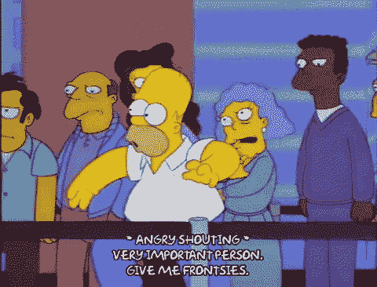

# 阵列代码挑战分解

> 原文：<https://levelup.gitconnected.com/array-code-challenge-breakdown-8799f903d9cc>



当你真的想撒尿，必须排在队伍前面的时候…

我最近完成了一个叫做 [*新年混乱*](https://www.hackerrank.com/challenges/new-year-chaos/problem) 的 HackerRank 代码挑战。我编写了一个解决方案，在我的终端上运行该程序时产生了预期的结果，但是它没有通过 HackerRank 站点上的测试。在重构失败一段时间后，我做了一点研究。我找到了一两篇介绍这个问题并提供解决方案的文章，但是我找不到一篇用 JavaScript 表达解决方案的文章，也没有像我希望的那样完整地解释代码机制。我决定写这样一篇文章。

问题陈述描述了排队等候乘车的人群。队列被表示为一个`Array`。排队的人表示为`elements`。从队列开始的`1`开始，队列中的每个人都被顺序分配一个整数。八个人的队列可以表示为:

```
queue = [1, 2, 3, 4, 5, 6, 7, 8]
```

排队的人可以贿赂直接排在他们前面的人交换位置。然而，在切换时，两个人都保留他们的顺序标识符，*，即*分配给该特定索引的整数。一个人只能贿赂眼前这个人两次。如果`person 5`贿赂`person 4`调换位置，那么队伍将会是这样的:

```
queue = [1, 2, 3, **5**, 4, 6, 7, 8]
```

挑战在于编写一个程序，接受长度大于`1`的任意整数`Array`，并确定产生`Array`的数字顺序所需的有效贿赂的最小数量。该程序应*打印*一个整数，表示产生输入的数字顺序`Array`所需的最小贿赂数，或者*打印* `Too chaotic`如果顺序无效，*即*要求一个人贿赂的人数超过`2`人。该解决方案将是一个`JavaScript`函数:

```
 1  function minimumBribes(q) {
 2    let swaps = 0
 3
 4    for (let i = 0; i < q.length; i++) {
 5      let bribes = q[i] - (i + 1)
 6      let maxAdvance = q[i] - 2 > 0 ? q[i] - 2 : 0
 7
 8      if (bribes > 2) {
 9        console.log('Too chaotic')
10        return
11      }
12
13      for (let j = maxAdvance; j < i; j++) {
14        if (q[j] > q[i]) swaps++
15      }
16    }
17    console.log(swaps)
18  }
19
20 ///////////////////////////////////////////
21 
22  const q = [1, 2, 5, 3, 7, 8, 6, 4]
23  minimumBribes(q)
24  // => 7
25
26 ///////////////////////////////////////////
27
28  const q = [5, 1, 2, 3, 7, 8, 6, 4]
29  minimumBribes(q)
30  // => Too chaotic
```

## 所以，很好，这个函数起作用了，但是让我们把它分解一下，了解一下是如何起作用的。请继续阅读。

该函数被命名为`minimumBribes`，并被赋予一个`Array`参数，在本例中由变量`q`表示。在最外层的作用域中，`2`行上有一个名为`swaps`的变量，赋值为`0`。`swaps`将作为计数器变量，每次进行有效的贿赂和职位互换时，计数器变量将增加`1`。在第`17`行，`console.log()`将打印出由`swaps`表示的整数，除非输入数组无效。

在同一范围内，第`4`行上有一个`for loop`。`for loop`的条件表明，只要`i`小于`Array`的长度，计数器变量`i`将从索引`0`(`Array`的第一个元素)开始，并递增`i++`(`1`)。

在`for loop`的范围内，声明了两个变量，一个`if`语句和一个嵌套的`for loop`。第一个变量位于第`5`行，名为`bribes`，表示当前人(当前元素)行贿的次数。这是通过减去队列中的当前位置(或`Array`加`1`的索引)计算出来的。* `Array`索引从`0`开始，从被评估的当前元素的值开始，或者从处于该位置的人员的标识号开始。

例如:在第`28`行的第二个输入示例中，第一个元素(`q[0]`)的值是`5`。人数`5`减去`i + 1` ( `0 + 1`或`1`，因为这是循环的第一次迭代)等于`4`。号码`5`必须将`4`的位置移向队伍的前方才能就位，于是人员`5`向`4`行贿。现在让我们暂时跳到第`8`行。

在`for loop`的每次迭代中，计算贿赂的次数。然后，在第`8`行，`if`语句评估此人行贿的金额是否大于`2`，从而使数组无效。如果是，消息`Too chaotic`被打印到终端，并且`return`语句跳出循环并结束函数的执行。

如果贿赂金额*是*有效，那么该功能继续执行。让我们跳回到第`6`行，这里有一个名为`maxAdvance`的变量，它代表一个人通过贿赂可能获得的最远有效位置`2`。`maxAdvance`的值由条件运算符的评估决定。如果当前元素(人)的原始位置减去`2`(空格)大于`0`，那么`maxAdvance`的值就是当前元素(`q[i]`)减去`2`。否则，`maxAdvance`的值为`0`。条件操作符基本上确保占位符不能变成负数，*，即*不能移动到队列的第一个位置之外。在某个地方必须有一条线*的前面。*

在第`13`行，嵌套的`for loop`评估任何小于`3`的有效`bribes`值。嵌套`for loop`的条件表明，只要`j`小于外部`for loop`的当前索引(`i`),计数器变量`j`将从`maxAdvance`确定的索引开始，并以`1`递增(`i++`)。在嵌套的`for loop`的主体中，`if`语句评估人员编号(`Array`元素的值)是否大于队列中下一个人员的编号。如果是这样，这意味着更大的整数肯定已经贿赂了它，并且在第`2`行建立的名为`swaps`的计数器增加了`1`。这种评估将根据循环条件进行一次或两次，并适当增加和记录交换的次数。

最后，只要没有无效贿赂被处理，行`17`上的`console.log()`就向终端打印产生输入数组的数字顺序所需的贿赂的最小数量。

这个代码挑战相当具有挑战性，没有双关语(HAR！).它要求我测试和检查我对正在处理的数据的假设，并理解场景的机制，以便最有效地编写一个提供必要结果的函数。这表明代码是围绕解决方案精心制作的，而不是相反。

[github.com/dangrammer](https://github.com/dangrammer)
[linked.com/in/danieljromans](https://www.linkedin.com/in/danieljromans/)
danromans.com