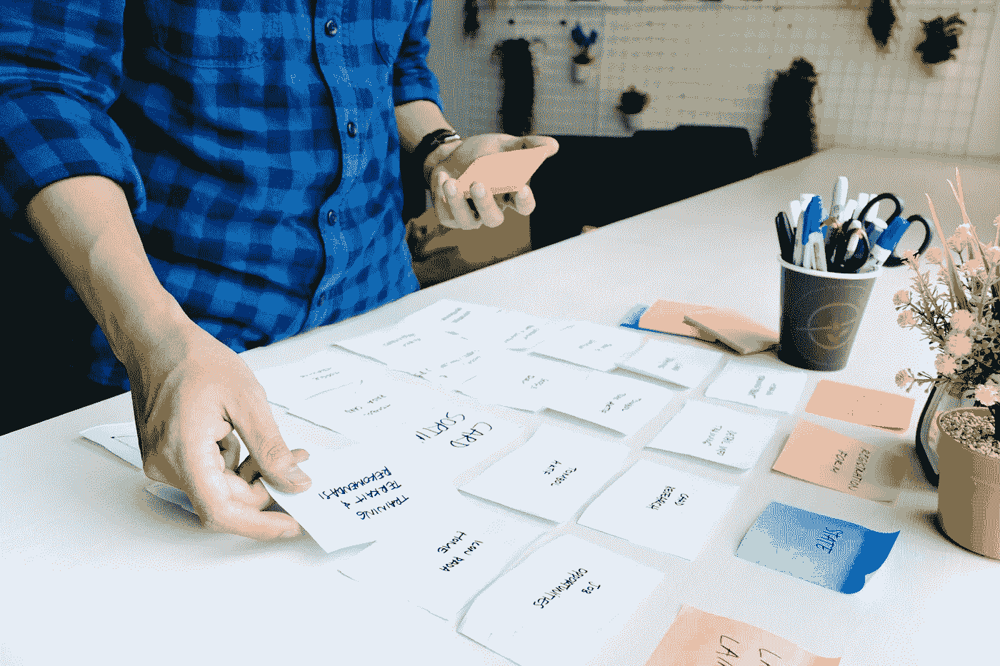
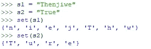
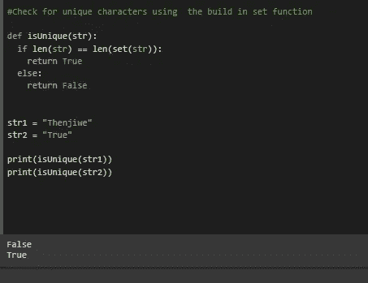
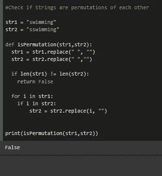

# 数组面试问题第 1 部分

> 原文：<https://levelup.gitconnected.com/array-interview-questions-part-1-b710d6690541>



来源:经由[Unsplash.com](https://unsplash.com/photos/WCID2JWoxwE)的 UX

计算机以线性或二进制的方式进行分类和搜索。如果你要指导他们使用线性方法，那么我们就不需要对数据进行排序。同时，如果我们想让他们以二进制的方式处理这个问题，数据必须被分类。

遍历数组是线性方法，我们不需要对数据进行排序。我们有 3 种不同类型的阵列，即:

*   列表[]
*   元组(，，，)
*   字符串("")

让我们来看看面试问题的前半部分:

# 检查字符串是否唯一

我们被要求写一个算法来检查一个字符串是否有重复的字符。

假设我们有“Thenjiwe”和“True ”,我们要检查哪一个字符串有重复字符？

通过观察它们，我们看到“Thenjiwe”有重复字符，而“True”没有。

但是，如果我们正在处理数以百万计的项目，那么我们需要我们的计算机朋友来帮助我们识别字符，会发生什么呢？电脑是我们的朋友，它们简化了我们的任务。

我们有多种方法可以指导解释器或编译器来帮助我们完成这些任务。我们只做其中一个方法。

## 这是最简单的方法，我们将使用 Python 提供的内置 set 函数。

我们将使用 Python 终端 IDLE 来演示 set 函数的功能。

我们首先告诉我们的 Python 解释器存储变量“Thenjiwe”和“True”。然后使用 Python 内置的 set()函数。



我们看到 set 函数以无序的形式返回字符串中的项目。所以我们可以用这个来检查集合的长度是否等于字符串的长度。

```
def isUnique(str):
    if len(str) == len(set(str)):
        return True
    else
    return Falsestr1 = "Thenjiwe"
str2 = "Mathematics"print(isUnique(str1))
print(isUnique(str2))
```



# 检查字符串是否是排列

这些希腊大词可能会让人产生误解，什么是事物的排列。在数学中，排列是重新排列项目的行为。我们都知道计算机科学是数学的婴儿，所以我们喜欢向父母学习。

好吧，回到手头的问题。所以在字符串中，一个字符串是另一个的排列，如果我们可以重新排序的话。

示例:

“游泳”

" smmingw "

我们已经重新排列了条目，没有什么变化，这两个单词的长度仍然相同，由相同的字符组成。

这个问题不仅仅限于单词，我们也可以将句子作为字符串。

“我喜欢游泳”

“我爱游泳”

在句子的情况下，我们必须消除空格，因为它们也被视为字符。

```
str1 = swimming
str2 = sswimmingdef isPermutation(str1,str2):
    str1 = str1.replace(" ","")
    str2 = str2.replace(" ","")
    if len(str1) != len(str2):
        return False
    for i in str1:
        if i in str2:
            str2 = str2.replace(i,"")
print(isPermutation(str1,str2)
```



# 两个总和

我们得到了一个数字列表以及目标数字，我们需要计算出哪两个数字加到了目标数字上。数字的组合可能存在，也可能不存在。

这个问题可以这样组织:

“假设我们有一个整数数组。我们必须返回两个整数的索引，这样，如果我们把它们加起来，我们将达到一个给定的特定目标。这里我们将做一个假设，即数组中总是有一个唯一的解，因此不会有相同目标的两组索引。

比如，假设数组像 A = [2，8，12，15]，目标和是 20。然后它将返回索引 1 和 2，作为 A[1] + A[2] = 20。"

我们只需要一个指针，因为我们将寻求一组数据结构的帮助。

同样的规则也适用于我们搜索两个数字的组合，这两个数字加起来就是目标，在我们的例子中是 20。

我们的集合将保存所有我们“见过”的组合器项目，这将跟踪我们的检查。

我们将从 2 开始，因为这是我们的第一个项目，我们知道我们需要 18 来达到 20 的总和。然后，我们将在集合中保存 18 个。移动到下一个项目 8，我们需要 12 来得到 20 的总数，因此我们将在我们的集合中保存 12。

下一项是 12，但是我们的集合中已经有 12 个了，我们的条件已经满足，我们将返回 True。

让我们编写我们的解决方案:

```
def twoSum(nums,target):
    combinators = {}
    for i in range(len(nums)):
        if target - nums[i] in combinators:
            return True
        else:
            combinators[nums[i]] = i
    test_list = [2,8,12,15]
    print(twoSum(test_list,20))
```

# 附加阅读

[](https://colab.research.google.com/drive/17wiCuHjfUa3dDDa2P0XAIYqq6vd9IUWZ?usp=sharing) [## 谷歌联合实验室

### 编辑描述

colab.research.google.com](https://colab.research.google.com/drive/17wiCuHjfUa3dDDa2P0XAIYqq6vd9IUWZ?usp=sharing) 

请随意连接:

推特:[https://twitter.com/Thenjikubheka](https://twitter.com/Thenjikubheka)

领英:【https://www.linkedin.com/in/thenjiwe-kubheka-02a00a104/ 

https://www.facebook.com/thenjiwe.kubheka.9[脸书](https://www.facebook.com/thenjiwe.kubheka.9)