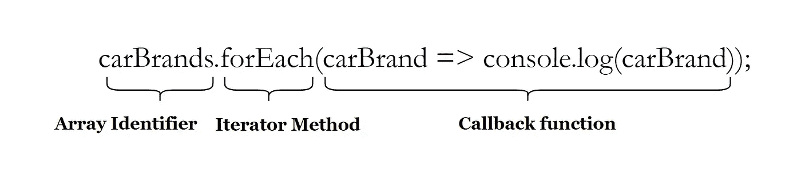

# 每个 JavaScript 开发人员都必须知道的数组方法

> 原文：<https://levelup.gitconnected.com/array-methods-that-every-javascript-developer-must-know-6e85fe2580ec>

# 使用数组方法的剖析



使用数组方法时的组件

# forEach()

*   该方法遍历一个数组，并对每个数组元素执行回调函数。
*   `.forEach()`的返回值是`undefined`。

让我们定义一系列汽车品牌:`carBrands`

```
const carBrands = ["mercedes", "audi", "tesla", "honda"];carBrands.forEach(
    carBrand => {
        console.log(carBrand);
    };
); //Logs the value of each car brand on the console.
```

# 地图()

*   该方法遍历一个数组，并对每个数组元素执行回调函数。
*   该方法返回一个**新数组。**

让我们定义一个数字数组:`numbers`

```
const numbers = [1,2,3,4,5];const new_numbers = numbers.map(
    number => {
        return number * 2;
    };
); //Returns an array 'new_numbers': [2,4,6,8,10]
```


Nubelson Fernandes 在 [Unsplash](https://unsplash.com?utm_source=medium&utm_medium=referral) 拍摄的照片

# 过滤器()

*   此方法循环访问数组，并根据指定的条件从数组中筛选元素。
*   该方法返回一个新的数组。

让我们定义一个花阵:`flowers`

```
const flowers = ["rose","lily","lotus","sunflower"];const filtered_flowers = flowers.filter(
    flower => {
        return flower.length <=4
    };
);//Returns an array 'filtered_flowers': ["rose","lily"]
```

# 减少()

*   该方法在遍历数组元素后返回一个单值。

让我们定义一个数字数组:`numbers`

```
const numbers = [1, 2, 3, 4];

const sum = numbers.reduce((**accumulator**, **currentValue**) => {
 return **accumulator** + **currentValue**;
});

// Returns a sum of all elements in the 'numbers' array: 10
```


。under hood 下的 reduce()方法


照片由[潘卡杰·帕特尔](https://unsplash.com/@pankajpatel?utm_source=medium&utm_medium=referral)在 [Unsplash](https://unsplash.com?utm_source=medium&utm_medium=referral) 上拍摄

# 切片()

*   该方法返回数组中位于`start`和`end`之间的部分(不包括`end`)
*   这个方法返回一个新的数组。
*   原数组为**未修改**。

让我们定义一组饮料:`beverages`

```
const beverages = ["tea", "coffee", "milkshake", "red bull"];const sliced_beverages = beverages.slice(1, 3);//Returns a new array 'sliced_beverages' : ["coffee", "milkshake"]
```

# 拼接()

*   此方法更改数组的内容(移除/替换现有元素和/或添加新元素)。
*   这个原阵是**修改后的**。

## 句法

```
splice(start, delete_count, item_1, item_2, item_n)
```

*   `start`:必须开始改变的数组索引
*   `delete_count`:从数组索引`start`开始删除的元素个数(可选)
*   `item_1, item_2...item_n`:从数组索引`start`开始添加到原始数组的项目(可选)

让我们定义一个字母数组:`alphabets`

```
const alphabets = ["a","b","c","d"];alphabets.splice(2,1,"x");//'alphabets' array is changed to ["a","b","x","d"]
```

# 每隔()

*   此方法测试数组中的所有元素是否都通过了指定的条件
*   该方法返回一个**布尔值。**

让我们定义一个数字数组:`numbers`

```
const numbers = [10,20,30,40];numbers.every(value => value < 100); //Returns **true**numbers.every(value => value >200); //Return **false**
```


照片由[努贝尔森·费尔南德斯](https://unsplash.com/@nublson?utm_source=medium&utm_medium=referral)在 [Unsplash](https://unsplash.com?utm_source=medium&utm_medium=referral) 拍摄

*感谢阅读这篇文章！*

*如果你是 Python 或编程的新手，可以看看我的新书《没有公牛**t 学习 Python 指南**’***》:**

[](https://bamaniaashish.gumroad.com/l/python-book) [## 学习 Python 的无牛指南

### 你是一个正在考虑学习编程却不知道从哪里开始的人吗？我有适合你的解决方案…

bamaniaashish.gumroad.com](https://bamaniaashish.gumroad.com/l/python-book) [](https://bamania-ashish.medium.com/membership) [## 通过我的推荐链接加入 Medium——Ashish Bama nia 博士

### 阅读 Ashish Bamania 博士(以及 Medium 上成千上万的其他作家)的每一个故事。您的会员费直接…

bamania-ashish.medium.com](https://bamania-ashish.medium.com/membership) 

# 分级编码

感谢您成为我们社区的一员！更多内容见[升级编码出版物](https://levelup.gitconnected.com/)。
跟随:[推特](https://twitter.com/gitconnected)，[领英](https://www.linkedin.com/company/gitconnected)，[通迅](https://newsletter.levelup.dev/)
**升一级正在转型理工大招聘➡️** [**加入我们的人才集体**](https://jobs.levelup.dev/talent/welcome?referral=true)