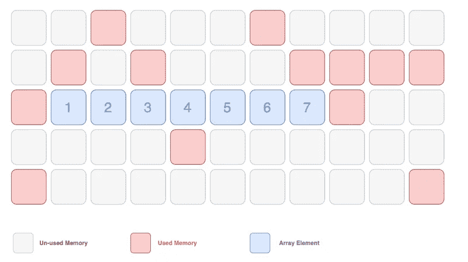
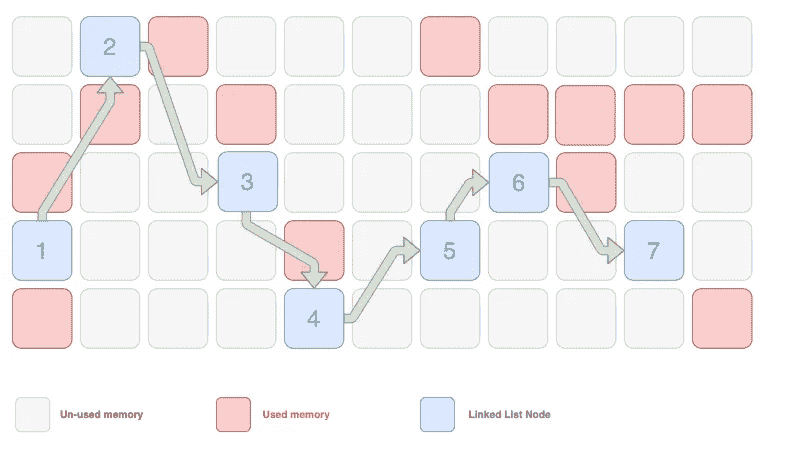
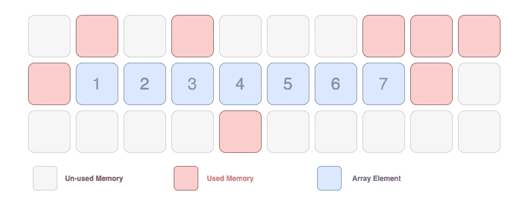
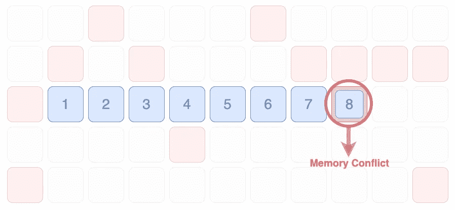
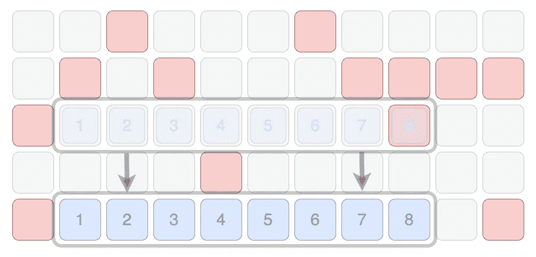
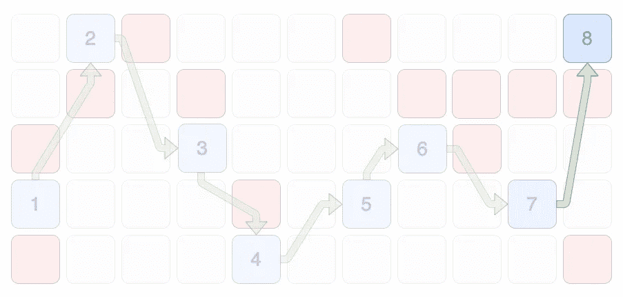

# 数组与链表数据结构

> 原文：<https://levelup.gitconnected.com/array-vs-linked-list-data-structure-c5c0ff405f16>

本文旨在区分何时在数组上使用链表数据结构。

让我们从一个数组和一个链表的基础开始。

# 排列

数组是默认的数据类型，用于存储特定类型的顺序数据。与链表数据结构相比，数组的关键属性很少。

## 数组属性:

*   **Contiguous:** 一个数组占用一块内存，数组中的每个元素都位于数组中另一个元素的旁边。
*   **随机访问:**因为数组是连续的，所以每个元素都可以通过它在数组中的索引直接访问。在上面的例子中，数组[3]可以访问值为“4”的元素。
*   **静态**:一个数组占用一个静态的内存块，包含它的起始点，大小，以及每个元素的值。因为它是静态的，所以数组不能增长或收缩。如果一个元素被添加到一个数组中，实际上必须创建一个全新的数组。
*   **更小的内存分配:**因为数组内的每个元素只需要存储它的值，所以与链表相比，数组占用的内存更少。

# 链表数据结构

链表是节点的集合，其中每个节点包含该节点的值以及指向链表中另一个节点的指针(连接)。

## 链接列表属性:

*   **非连续:**链表中的每个节点不必存储在链表中任何其他节点的旁边。一个节点可以存储在任何空闲的内存中。
*   **顺序访问**:因为链表不是连续的，所以不支持随机访问。为了访问链表中的特定节点，必须遍历整个链表，直到找到该节点。在上面的例子中，要访问值为“4”的节点:首先必须依次遍历“1”、“2”和“3”节点。
*   **动态:**一个链表可以被动态改变，而不需要创建新的链表。例如，通过插入节点并在链表中添加对它的引用，可以很容易地添加节点
*   **更大的内存分配:**与数组不同，链表中的每个节点都需要存储自己的值和对另一个节点的引用；因此，它占用更多的内存。

# 什么时候使用链表？

数组是一种默认的数据类型，支持随机访问，比链表占用的内存少，所以一个合乎逻辑的问题是“为什么要使用链表”？

在决定使用链表而不是数组时，主要考虑的是数据的易失性，换句话说，数据会发生多大的变化。如果数据非常不稳定，链表可能是一种更好的数据结构。

我们将通过在上面的数组和链表示例的末尾插入来强调这一点。

## 在数组中插入元素

在上面的例子中，我们可以看到数组周围的内存块已经被使用。

因此，当我们向数组中添加另一个元素(值为“8”)时。会有内存冲突。

为了存储我们的数组，我们必须移动数组(由于数组的静态性质，实际上，我们是在删除旧的数组，并在不同的位置创建一个新的数组)。

我们现在向数组中添加了一个元素，但是它的插入非常昂贵。现在让我们来看一个链表的插入。

## 在链表中插入节点

为了在链表中进行插入，一个节点(包含它的值和对另一个节点的引用)可以存储在任何空闲的内存中。

要将包含值“8”的节点添加到链表的末尾，我们只需将节点添加到任何有空闲空间的地方，并引用“7”节点。

那很容易！廉价的数据修改是链表数据结构的主要优点。

# TLDR

## 数组:

包含相似类型数据的默认数据类型。

*   接触的
*   支持随机访问
*   静态

## 链接列表:

一种数据结构，由包含相似类型值的节点和对链表中另一个节点的引用组成。

*   不连续的
*   支持顺序访问(无随机访问)
*   动态的

## 在下列情况下，链表非常有用:

*   数据非常不稳定
*   不需要随机访问

# 参考资料:

[**Beiatrix—“JavaScript 中的链表|数据结构”**](https://www.youtube.com/watch?v=ChWWEncl76Y)

我强烈推荐你观看这个由 [**贝特丽克斯**](https://www.youtube.com/user/beiabutt) **，**制作的简短视频。我的图表主要是她的视频动态模型的静态再现。

[**StudyTonight —数组和链表的区别**](https://www.studytonight.com/data-structures/linked-list-vs-array)

[**技术差异—连续和非连续内存分配的差异**](https://techdifferences.com/difference-between-contiguous-and-non-contiguous-memory-allocation.html)