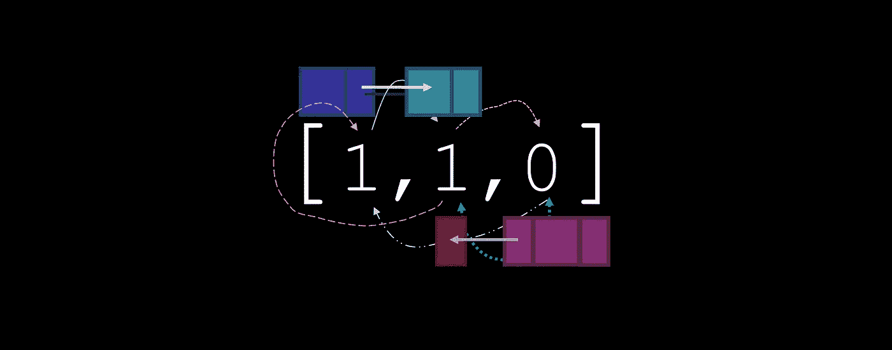
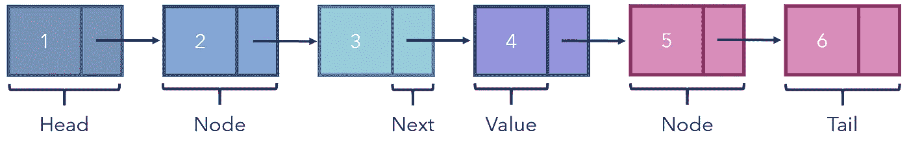
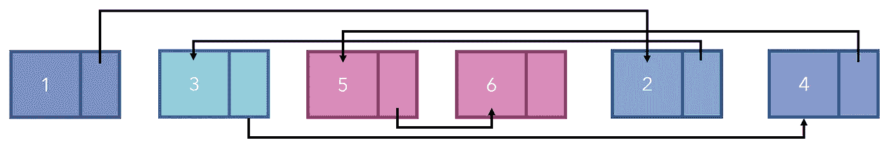
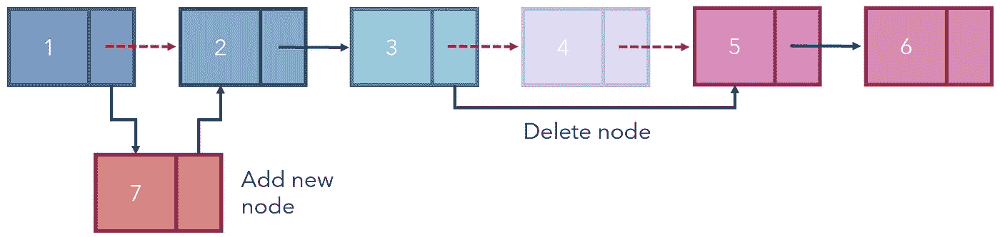
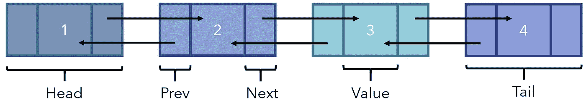
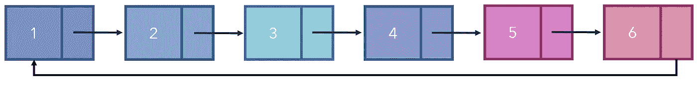
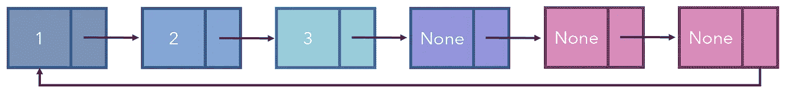
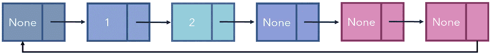
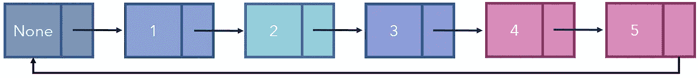
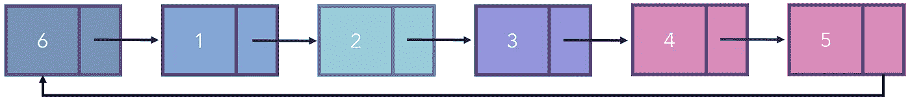

# 让你的列表更上一层楼:链表和队列数据结构

> 原文：<https://levelup.gitconnected.com/arrays-2-0-linked-list-queue-data-structures-26a65d3551b5>



## 直观地解释和可视化

当您想在程序中的某个地方存储几个元素时，go-to 数据类型是数组。但是有几个缺点:

*   元素必须按照一定的顺序存储，并且属于索引。这占用了跟踪的空间。
*   如果我们想从数组中删除一个元素，我们需要将它后面的所有元素向前移动一个索引。
*   如果我们想向数组中添加一个元素，我们需要将它后面的所有元素向后移动一个索引。

链表是数组的替代物。链表中的元素被表示为节点，而不是将列表元素存储在一个由数组结构限定的连续位置。每个节点包含两个值，一个值和一个链接到下一个节点对象的“下一个指针”。头部没有链接到它的下一个指针，尾部也没有下一个指针(一个`None`下一个指针)。



使用链表的一个优点是元素的顺序无关紧要，因为每个元素的下一个指针都链接到下一个元素，而不管它们的放置顺序。这显然在列表操作和内存使用方面有很多好处。



*请注意，即使链表没有元素的顺序，它们也将被可视化以便于理解。*

这意味着，如果我们想在一个索引处插入一个元素，我们实际上不必在某个顺序列表的那个位置插入它。人们可以在任意位置添加元素并重新设计链接。

在节点 *i* 和 *i+* 1 之间添加一个节点，其中 *i* 表示该节点在链表序列中的索引(对于第 4 个节点， *i =* 3):

*   用所需的值创建一个新节点。将其存储在任意位置。
*   设置节点 *i* 的下一个指针指向新节点。由于每个节点只能有一个 next 指针，这将“删除”指向节点 *i+* 1 的原始 next 指针。
*   设置新节点的下一个指针指向节点 *i* +1。



删除第 *i* 个节点:

*   设置第*I-*1 个节点的下一个指针等于第*I*+1 个节点。这具有“跳过”已删除节点的效果。
*   虽然这不是必需的，但是因为链接已经改变，所以可以从内存中物理地删除节点。

请注意，这比基于索引的数组要高效得多，在基于索引的数组中，在索引 *i* 处插入或删除一个元素会影响它之前的所有元素。

然而，遍历一个单链表——上面演示的，只有一个 next 指针——是低效的，因为我们只能向一个方向移动。如果我们想访问第四个元素，我们必须从头开始，向下遍历每个元素，直到到达第四个元素。之后，如果想要二次元，就必须从头再来。

双向链表通过提供前一个和下一个指针，在遍历中提供了更多的自由度。因此，为了在访问第四个元素之后访问第三个元素，可以只跟随前一个指针，而不需要在头部重置并跟随链到第三个元素。



使用双向链表插入和删除也更快。在单链表中，插入和删除都需要指定节点之后的上一个和下一个节点。为了访问前一个节点，必须从头开始遍历链表。在双向链表中，这可以简单地通过“前一个”指针来访问。

循环链表是因为尾节点链接回头节点而自我重复的链表。正因为如此，从技术上讲，循环链表中没有尾节点和头节点。



这些类型的列表对于队列数据结构和其他高效应用程序的实现非常有帮助。例如，如果我有下面的队列(一个固定长度的列表，其中两个操作，入队和出队，分别将项目添加到队列的末尾和从队列的前面移除项目—类似于商店结帐队列):



如果我想删除第一个元素，我可以把它设置为 None，但是没有理由花费大量的内存和能量来移动其他两个元素，原因你很快就会看到。



假设我决定将三个条目加入队列:如果这是一个常规列表，那么队列要么会满，列表会被编程(非常低效地)来移动列表，使得前面没有`None`对象，要么需要某种极其复杂的函数使用模将列表转换成某种循环列表。



对于循环链表，这个问题是不存在的，因为它们不仅没有顺序，也没有索引。



例如，当多个应用程序在您的电脑上运行时，操作系统会将每个正在运行的应用程序放在一个队列中，并快速循环，给每个应用程序一段时间来执行，然后暂停它们，让 CPU 专用于另一个应用程序。因为这些列表以闪电般的速度循环，所以列表必须是循环的。

此外，循环链表非常容易创建——只需在非循环链表中将尾节点链接到头节点。他们在创建能够处理海量数据的高效队列方面有无数的应用。

数组和链表的比较:

*   尽管链表可以非常快速地执行列表操作，但是为了访问一个元素，它必须遍历链表的至少一部分(O( *n* )时间来访问)，而数组只能引用一个索引。这是不被订购的部分成本。
*   链表通常更有效，尽管它们最适合 a)进行许多操作和 b)不需要经常提取元素值的用例。
*   为了存储指针(下一个或上一个和下一个)，链表比数组占用更多的内存(平衡速度和空间)。
*   数组比链表具有更好的缓存局部性。
*   链表中的随机访问是不允许的，任何元素的访问都必须从头部开始。因此，尽管有专门为链表设计的搜索方法，但执行标准的和完善的搜索过程，如二分搜索法，在链表中不起作用。

通常，链表由两个类实现。伪代码:

```
class Node (value, next=None) #none by default
    self.value = value #this is the value the node holds
    self.next = next #this will be another node objectclass LinkedList (head)
    self.head = head
    function add_at_index(): ...
```

每个节点都有一个值，并链接到下一个节点(假设是一个单链表)，对于链表来说唯一重要的变量是起始节点，因为它可以从该节点遍历到另一个所需的节点，以执行某些功能，如在某些索引处添加或删除节点。创建值为 1、2 和 3 的三个未连接的节点:

```
node1 = Node(value=1)
node2 = Node(value=2)
node3 = Node(value=3)
```

它们可以通过设置它们的。下一个属性。请注意，在本例中，我们创建了一个循环链表(它可以被重新用作队列)。

```
node1.next = node2
node2.next = node3
node3.next = node1
```

然后，可以附加一个头——在本例中，只是一个起点——来创建一个链表:`linked_list = LinkedList (head=node1)`。从这里开始，遍历就像`.next`一样简单:例如，`linked_list.head.next.next.value`将返回 3。解构命令:

*   `linked_list.head`是`node1`。
*   `node1.next`就是`node2`。
*   `node2.next`就是`node3`。
*   `node3.value`就是`3`。

# 要点

*   链表是一种特殊类型的列表，其中的元素不是存储在一个连续的位置，而是存储为带有指针的值，指针链接到下一个元素。
*   链表在执行插入和删除等操作时效率更高，但在访问值时效率较低，因为节点只能通过遍历链表来访问。
*   双向链表是一个既有上一个指针又有下一个指针的链表。
*   循环链表是这样一种链表，其中不存在头部或尾部，因为元素被链接使得列表循环。
*   可以用循环链表很好地实现的队列是一种数据结构，其中只能执行两种操作:入队，在队列末尾添加一个元素；出队，删除队列中的第一个元素。

[](https://towardsdatascience.com/shallow-deep-copies-stop-making-these-slicing-mistakes-12d02ffa2f7f) [## 浅拷贝和深拷贝——停止犯这些切片错误

### 正确管理你的记忆

towardsdatascience.com](https://towardsdatascience.com/shallow-deep-copies-stop-making-these-slicing-mistakes-12d02ffa2f7f) [](https://towardsdatascience.com/common-misconceptions-about-big-o-algorithmic-complexity-4a7601395038) [## 关于大 O 和算法复杂性的常见误解

### 你是不是用错了 Big-O？

towardsdatascience.com](https://towardsdatascience.com/common-misconceptions-about-big-o-algorithmic-complexity-4a7601395038) 

所有图片均由作者创作。