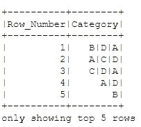
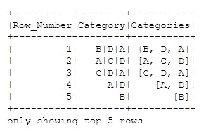
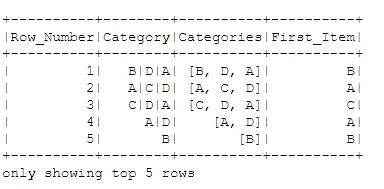
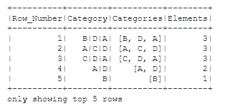
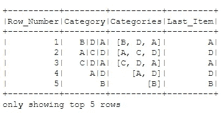

# PySpark 中的数组

> 原文：<https://levelup.gitconnected.com/arrays-in-pyspark-52c2268b380>

## PySpark 中的数组列示例


照片由 [aaron boris](https://unsplash.com/@aaron_boris?utm_source=medium&utm_medium=referral) 在 [Unsplash](https://unsplash.com?utm_source=medium&utm_medium=referral) 拍摄

[](https://jorgepit-14189.medium.com/membership) [## 用我的推荐链接加入媒体-乔治皮皮斯

### 阅读乔治·皮皮斯(以及媒体上成千上万的其他作家)的每一个故事。您的会员费直接支持…

jorgepit-14189.medium.com](https://jorgepit-14189.medium.com/membership) 

在 PySpark 数据框中，我们可以有带数组的列。让我们看一个数组列的例子。首先，我们将从 S3 加载 CSV 文件。

```
# read the data from the S3
df = spark.read.options(header=True).csv("s3://my-bucket/my_folder/my_file.csv")# select the Row_Number and Category column
df.select(['Row_Number', 'Category']).show(5)
```



假设我们想要创建一个名为“Categories”的新列，其中所有类别都将出现在一个数组中。我们可以通过使用函数中的 split()函数轻松实现这一点。

```
from pyspark.sql import functions as Fdf_new = df.withColumn('Categories', F.split(df.Category, '\|'))df_new = df_new.select(['Row_Number', 'Category', 'Categories'])df_new.show(5)
```



我们可以确认“Categories”列是一个“array”数据类型。

```
df_new.printSchema()
```

我们得到:

```
root
 |-- Row_Number: string (nullable = true)
 |-- Category: string (nullable = true)
 |-- Categories: array (nullable = true)
 |    |-- element: string (containsNull = true)
```

让我们看看我们可以用数组做一些很酷的事情，比如获取第一个元素。我们需要使用 getItem()函数，如下所示:

```
df_new.withColumn('First_Item',df_new.Categories.getItem(0)).show(5)
```



# 获取数组元素的个数

我们可以使用 **size()** 函数来获取数组的大小。

```
df_new.withColumn('Elements', F.size('Categories')).show(5)
```



# 获取数组的最后一个元素

我们可以通过组合使用 **getItem()** 和 **size()** 函数来获取数组的最后一个元素，如下所示:

```
df_new.withColumn('Last_Item',df_new.Categories.getItem(F.size('Categories')-1)).show(5)
```



最初由[预测黑客](https://predictivehacks.com/?all-tips=arrays-in-pyspark)发布