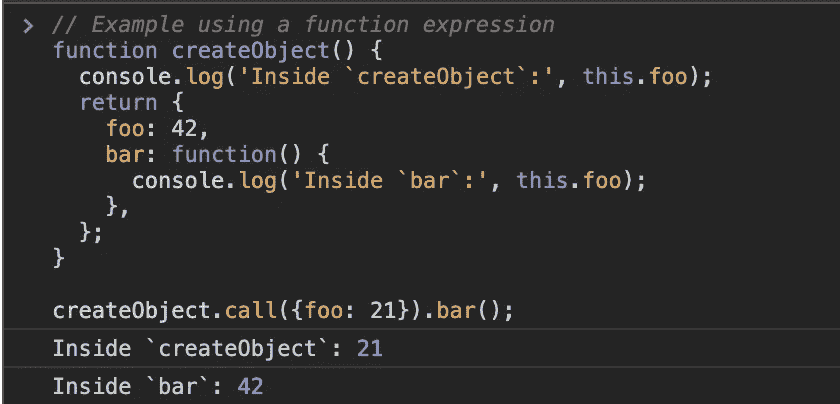
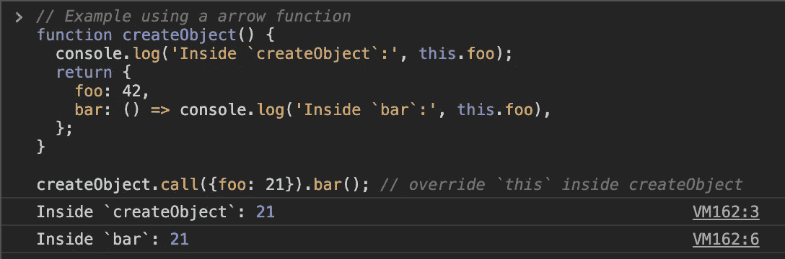
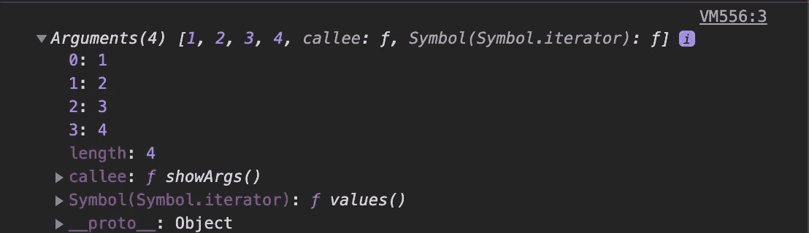
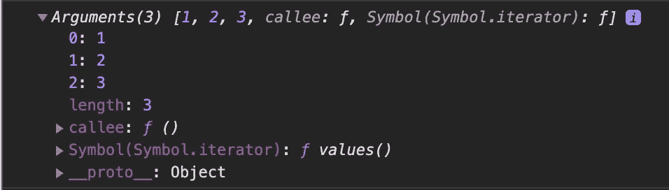

# JavaScript 中的箭头函数与常规函数

> 原文：<https://levelup.gitconnected.com/arrow-function-vs-regular-function-in-javascript-b6337fb87032>


自 ECMAScript 2015 以来，箭头函数已被采用，这是一个简单但非常强大的功能。然而，箭头函数不同于普通函数。那有什么不同？

# 语法:

```
// (param1, param2, paramN) => expression// ES5 Regular function
var add = function(x, y) { 
return x + y;
};// ES6 Arrow function
let add = (x, y) => { return x + y };
```

JavaScript 箭头函数大致相当于 python 中的 [lambda 函数或者 Ruby](https://www.programiz.com/python-programming/anonymous-function) 中的[块，但是它们有更复杂的细节。箭头函数允许开发人员用更少的代码行和大约一半的输入来完成相同的结果。](http://ruby-for-beginners.rubymonstas.org/blocks.html)

如果只有一个表达式，就不需要花括号，它会从函数中隐式返回这个结果。上面的例子也可以写成这样:

```
let add = (x, y) => x + y;
```


# `"this"` 装订

与常规函数不同，箭头函数没有自己的`this`或`arguments`绑定。相反，这些标识符像任何其他变量一样在词法范围内被解析。让我们看一个简单的例子:

```
name ="Arrow function"
let me = { 
 name: "Regular function", 
 thisInArrow:() => { 
   console.log("Example of " + this.name); //no 'this' binding here 
 }, 
 thisInRegular(){ 
   console.log("Example of " + this.name); //'this' binding works here 
 } 
};
me.thisInArrow(); 
me.thisInRegular();
```

与常规函数不同，箭头函数没有自己的`this`。在箭头函数的情况下，`this`指的是箭头函数在中定义的*环境中的`this`的值(即在箭头函数的“外部”)，并且在函数的整个生命周期中保持不变，并且总是绑定到最近的非箭头父函数中的`this`的值。*

让我们再看一个简单的例子:



在函数表达式中，`this`指的是在`createObject`中创建的对象。在箭头功能情况下，`this`是指`createObject`本身的`this`。

# “参数”绑定:

Arguments 对象在箭头函数中不可用，但在常规函数中可用。

***常规功能:***

```
let myFunc = { 
 showArgs(){ 
   console.log(arguments); 
 } 
}; 
myFunc.showArgs(1, 2, 3, 4);
```



**箭头功能:**

```
let myFunc = { 
 showArgs : ()=> {
      console.log(arguments); 
   }
}; 
myFunc.showArgs(1, 2, 3, 4);
```


# **箭头功能不能用【新**调用

ES6 区分了*可调用*的函数和*可构造*的函数。

如果函数是可构造的，可以用`new`调用，即`new User()`。如果一个函数是可调用的，那么不需要`new`就可以调用(即正常的函数调用)。

通过函数声明/表达式创建的常规函数既可构造又可调用。

```
let x = **function**(){
   console.log(arguments);
};**new** x =(1,2,3);
```



**箭头函数**(和方法)仅可调用，即箭头函数永远不能用作构造函数。因此，永远不能用关键字`new`调用它们。

```
let x = ()=> {
   console.log(arguments); 
};**new** x(1,2,3);
```


# 何时不使用箭头功能:

我希望你明白，箭头函数并不能在所有情况下取代常规函数。

在一些情况下，您不应该查看箭头函数，

**1。对象方法**

```
var cat = {
  lives: 9,
  jumps: () => {
    this.lives--;
  }
}
```

当你呼叫`cat.jumps`时，生命数量不减少。这是因为`this`没有绑定任何东西，将从其父作用域继承`this`的值。

**2。具有动态上下文的回调函数**

看看下面这个事件处理程序:

```
var button = document.getElementById('press');
button.addEventListener('click', () => {
  this.classList.toggle('on');
});
```

如果我们点击按钮，我们会得到一个类型错误。这是因为`this`没有绑定到按钮，而是绑定到了它的父作用域。

**3。承诺和承诺链**

箭头函数使代码更干净、更直观的另一个地方是管理异步代码。

[承诺](https://developer.mozilla.org/en-US/docs/Web/JavaScript/Guide/Using_promises)让管理异步代码变得更加容易。然而，使用 promises 仍然需要定义在异步代码或调用完成后运行的函数。

这是一个箭头函数的理想位置，特别是如果你的结果函数是有状态的，引用你的对象中的一些东西。

缺点是确保你再次理解`this`将如何工作。示例:

```
**this**.doSomethingAsync().then((result) **=>** { **this**.storeResult(result); });
```

**4。当它使你的代码可读性降低时**

有必要考虑一下我们前面提到的各种语法。有了常规函数，人们就知道会发生什么。使用箭头功能，可能很难直接破译你正在看的东西。

# 最后的想法💭 🤔

箭头函数是对 JavaScript 语言的一个很好的补充，在许多情况下可以实现更加符合人体工程学的代码。

然而，像其他功能一样，它们也有优点和缺点。我们应该把它们作为我们工具箱中的另一个工具，而不是作为所有功能的一揽子替代品。

谢谢😊看了我的文章，如果你喜欢就分享吧！查看我的其他文章

**延伸阅读:**

[](https://medium.com/better-programming/difference-between-regular-functions-and-arrow-functions-f65639aba256) [## 常规函数和箭头函数的区别

### 探索 ES6 中新的胖箭头功能

medium.com](https://medium.com/better-programming/difference-between-regular-functions-and-arrow-functions-f65639aba256) [](https://www.geeksforgeeks.org/higher-order-arrow-functions-in-javascript/) [## JavaScript - GeeksforGeeks 中的高阶箭头函数

### 先决条件:箭头函数高阶函数是一个接受函数作为自变量的函数，否则…

www.geeksforgeeks.org](https://www.geeksforgeeks.org/higher-order-arrow-functions-in-javascript/) [](https://www.freecodecamp.org/news/when-and-why-you-should-use-es6-arrow-functions-and-when-you-shouldnt-3d851d7f0b26/) [## 什么时候(为什么)应该使用 ES6 箭头功能，什么时候不应该使用

### 由辛西娅李何时(以及为什么)你应该使用 ES6 箭头功能-当你不应该箭头功能(也称为…

www.freecodecamp.org](https://www.freecodecamp.org/news/when-and-why-you-should-use-es6-arrow-functions-and-when-you-shouldnt-3d851d7f0b26/) [](https://stackoverflow.com/questions/34361379/are-arrow-functions-and-functions-equivalent-exchangeable) [## “箭头函数”和“函数”是等价的/可交换的吗？

### TL；玛:不！箭头函数和函数声明/表达式是不等价的，不能盲目替换…

stackoverflow.com](https://stackoverflow.com/questions/34361379/are-arrow-functions-and-functions-equivalent-exchangeable)