# 单元测试设计规范

> 原文：<https://levelup.gitconnected.com/art-of-unit-testing-with-swift-40bac64c1d9b>

**单元测试**是一种自动化测试，旨在验证一小部分孤立的代码(所谓的“单元”)是否如开发人员预期的那样运行。一个单独的单元测试被称为“**测试用例**”——由一段代码组成，这段代码以某种方式运行产品代码，然后验证结果是否与预期相符。

# 为什么要进行单元测试？

*   单元测试有助于在开发周期的早期修复错误并节省成本。
*   降低脆弱性——对现有代码进行更改会破坏代码或流程的另一个工作部分，这可以在开发阶段使用适当的单元测试来降低和识别。
*   好的单元测试就像项目文档，测试中的代码片段更多地解释了如何使用类或函数，而不是一段文档。
*   单元测试有助于代码重用。将代码和测试都迁移到新项目中。调整代码，直到测试再次运行。

# 写作考试小技巧

在 Swift 中编写测试时，我通常遵循 3 个技巧。

1.  设计可测试的代码
2.  清晰的 API 边界
3.  避免被实现细节所束缚

*注意:例子我使用过 swift，但它不是特定于 swift 的，它更多的是关于为单元测试设计&编码的函数式编程技巧。*

# 设计可测试的代码

`What makes a code easy to test?`

据我所知，当我们不做大量的模拟或黑客攻击或复杂的设置来测试一个 API 行为时，测试就很容易了。比如你给 ActivitiesPayloadResponse 结构给 ActivitiesViewModel，并从中获取视图数据，它可以是 activities 总计数测试用例或未读活动标题。

但是，我们没有像给出输入数据和验证输出那样简单的每个类或函数，有些地方我们需要做模拟和设置，但是让我们尽量保持它最小化。另一方面，想一想有人在回顾我们的测试，他不应该花超过 30 秒来理解它。

**设计可测试性代码的 3 个核心原则**

> 统一输入和统一输出

在函数式编程的世界里，有一个术语叫做纯函数，纯函数是一个接受输入并返回一个没有副作用的输出的函数，相同的输入每次都应该产生相同的预期输出，不管你调用它多少次。

> 保持州的地方性

我们倾向于在大多数地方使用 singleton，因为它易于使用，苹果自己也在许多地方使用它，singleton 可以很好地共享 API 和方便，但它也导致了共享状态的危险模式。

> 依赖注射

总是尝试注入在我们的类函数中使用的依赖对象，这意味着我们希望避免在我们的实现中作为共享实例访问那些对象，或者创建和访问本地实例。

理论到此为止，让我们实际一点，我不能不做实验就推销这个话题。

让我们用一个名为 FileLoader 的示例类来看看上述所有原则，感谢 John Sundell 从他的一次演讲中挑选了这些直观的例子。

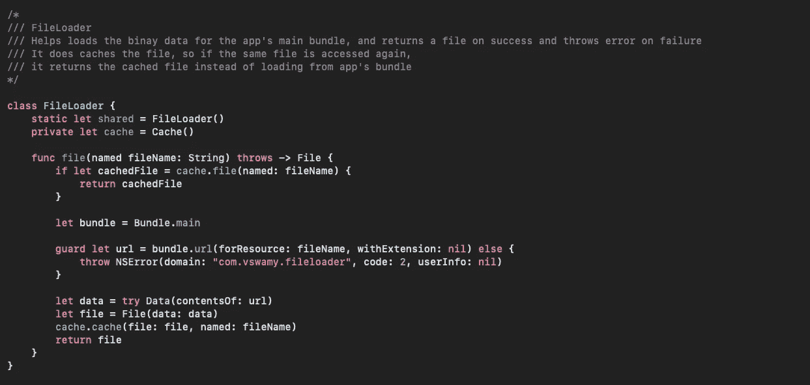

这是一个相当不错的类，如果 exist else 抛出一个错误，它从主包中加载给定文件名的文件，并且缓存文件，这实际上很好，所以我们不用每次都从主包中加载。现在让我们将`**Code for Testability**`的设计应用到上面的类中，并检查它是否适合单元测试。

**统一输入/输出**

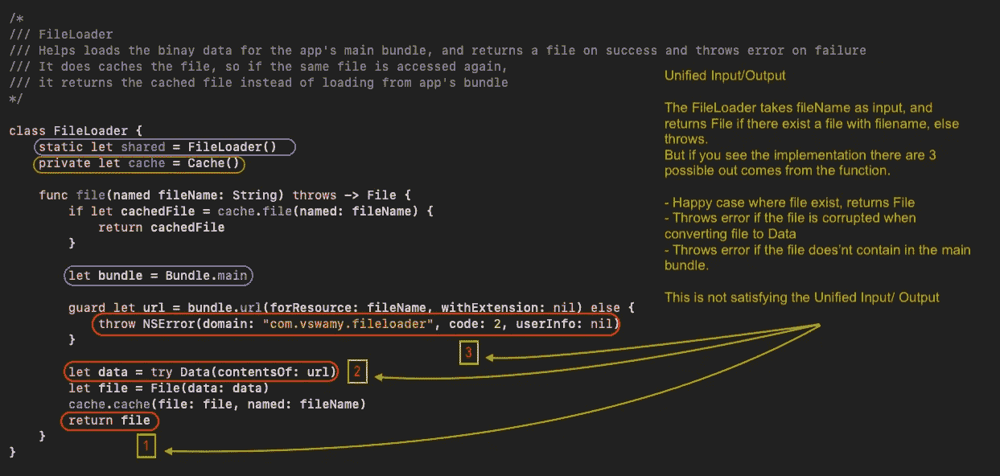

`FileLoader`将 filename 作为输入，如果带有 fileName 的文件存在于主包中，则返回`File`，否则抛出。但是如果你看到实现，这个函数有 3 种可能的结果。

*   一个文件存在的情况下，返回文件加载它或从缓存。
*   将文件转换为数据时，如果文件损坏，将引发 foundationKit 错误
*   如果文件不包含主包，我们抛出 NSError。

肯定的是，这里的输出不统一，这不符合`**Unified Input/ Output**`原理

**保持本地状态**

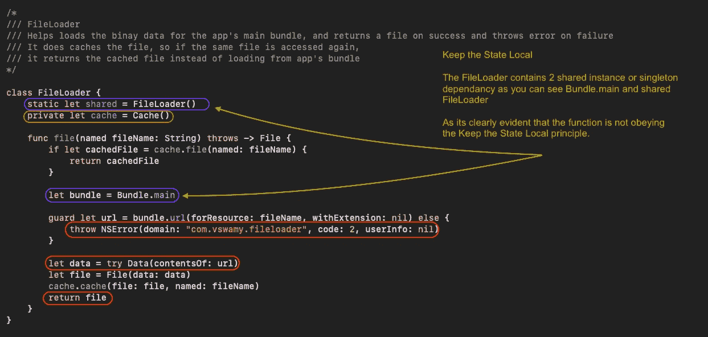

`FileLoader`包含共享实例或单例依赖，正如你所看到的 Bundle.main 和共享文件加载器，我们没有保持状态为本地。很明显，该函数不遵守`**Keep the State Local**`原理。

依赖注入

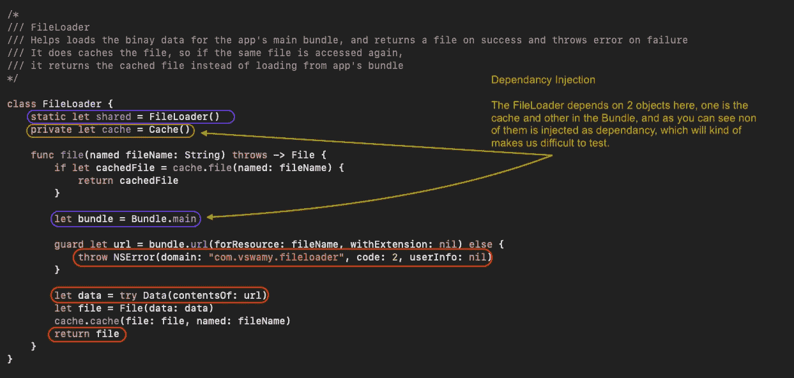

这里的`FileLoader`依赖于两个对象，一个是缓存，另一个是捆绑包，正如你所看到的，它们都不是作为依赖注入的，而是本地访问或者使用单例访问，这让我们很难测试。

这很有趣，我们体面的`FileLoader`类对于单元测试来说不再体面，所以让我们看看如何让它服从`**Code for Testability**`

# 应用可测试性原则的代码

让我们一个一个来看，将努力使文件加载器遵守`Unified Input/Output`原则。

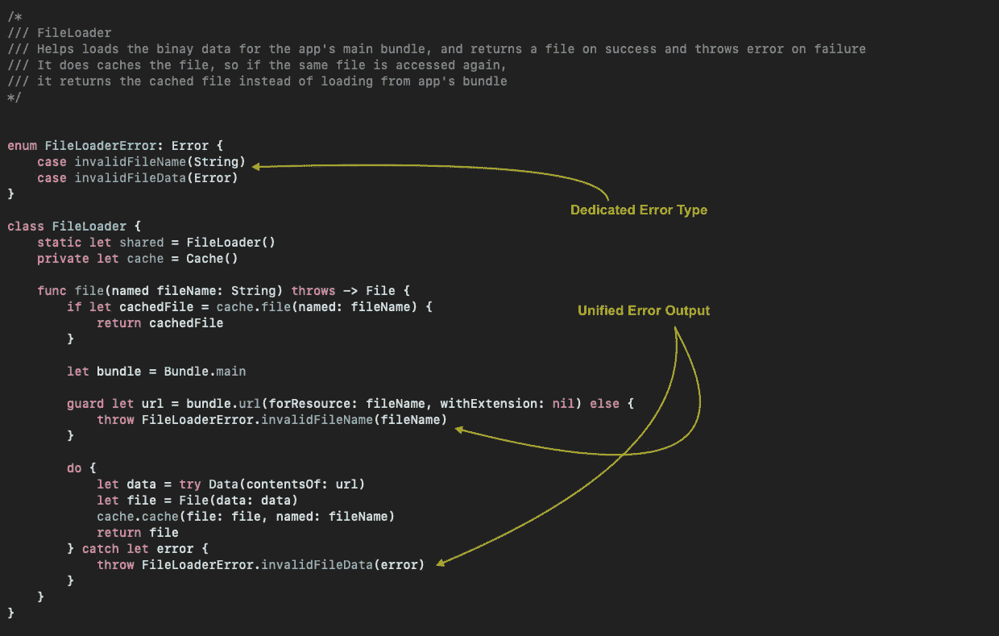

在这里你可以看到，`FileLoader`有一个专用的错误类型，对于无效的文件名错误，它返回`FileLoaderError.invalidFileName`，对于损坏的文件数据，它返回`FileLoaderError.invalidFileData`，而以前我们是返回 NSError，或者错误是从 try 数据(contentURL:)中抛出的，这种方式修改了代码，采用了统一的`Input (FileName String)`和统一的`Output (File or FileLoaderError)`。

接下来让我们试着移除共享实例，我们真的需要
`static let shared = FileLoader()`吗

很多时候，我们使用它是因为它易于访问和使用，如果我们认为，我们可能不需要这里的单例，而是每个需要它的类都可以创建和获取文件加载操作，或者它可以作为引用传递给需要它的类。

最后一个是`Dependancy Injection`，正如前面指出的，我们有 2 个依赖对象(缓存和绑定)供 FileLoader 使用。

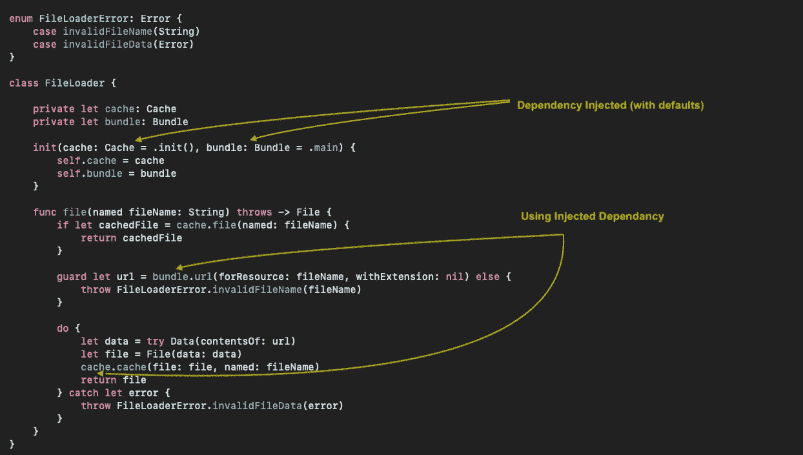

随着这一变化，我们将依赖对象作为初始参数传递，因此这在我们为其编写单元测试时将非常有帮助，这不必是对象本身，如果需要，它可以是 2 个协议，而且由于我们支持默认参数，除了单元测试之外，FileLoader 的用户不必担心注入的参数，他们仍然可以像 FileLoader()一样创建。

我们对代码做了很小的改动，现在文件加载器的种类已经从`**Hard to Test**` **→** `**Easy to Test**`。既然我说测试很容易，你们相信我吗？不需要让我们为 FileLoader 写一些测试，看看它是否真的容易测试。

我们将尝试测试我们想到的几个理想行为的缓存行为

*   首次从捆绑包加载文件时，将文件保存到缓存中
*   当文件已经存在于缓存中时，从缓存中检索文件。

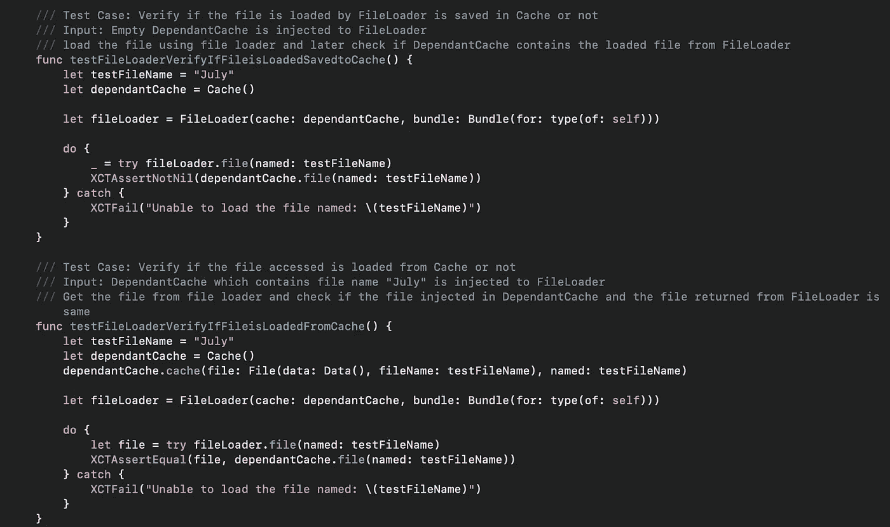

可以有很多情况，只是挑选这些来解释与缓存的依赖注入相关的东西。

*   第一个测试用例是对 FileLoader 加载的文件是否保存到缓存中进行单元测试。因为我们的文件加载器的一个很酷的特性是，它可以缓存从主包中加载的文件。
*   第二个测试用例是单元测试，如果 FileLoader 访问的文件是从缓存中检索的，假设我们已经有包含相同文件的依赖缓存并注入到 FileLoader 中，现在如果 FileLoader 访问文件，它应该从缓存中返回文件，而不是从主包中加载。

# 清晰的 API 边界

当我们通常编写测试时，我们倾向于编写两种类型，1 是单元测试，我们验证 API 是否正确工作，根据给定的输入验证输出，另一个测试是我们实际集成模块并进行集成测试。

很多时候，很难确定单元测试和集成测试之间的明确界限。如果我们看看**迈克尔·费哲**(`Working Effectively with Legacy Code`的作者)对单元测试的定义。

在下列情况下，测试不是单元测试:

*   *它与数据库对话*
*   *它通过网络进行通信*
*   *它触及文件系统*
*   *它不能与你的任何其他单元测试同时运行*
*   *你必须对你的环境做一些特殊的事情(比如编辑配置文件)来运行它*

好吧，好吧，那很好，但是为什么呢？

以下是他的解释。

第一，**速度**。当谈到单元测试最佳实践时，速度是其中最重要的。依赖数据库或网络会降低测试速度。

然后，我们有**决定论**。单元测试必须是确定性的。也就是说，如果它失败了，它必须继续失败，直到有人修改了测试中的代码。反过来也是正确的:如果一个测试正在通过，它不应该在没有修改它测试的代码的情况下开始失败。如果一个测试依赖于其他测试或者外部依赖，那么它可能会因为除了被测系统中的代码变化之外的原因而改变它的状态。

最后，我们有反馈的**范围。一个理想的单元测试覆盖特定的一小部分代码。当测试失败时，几乎可以肯定问题发生在代码的特定部分。也就是说，适当的单元测试是获得超级精确反馈的极好工具。**

另一方面，如果一个测试依赖于数据库、文件系统和另一个测试，那么问题可能出在其中的任何一个地方。

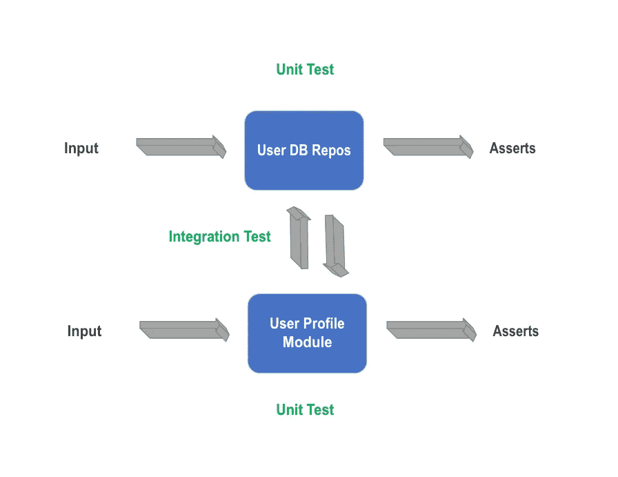

如上图所示，有两个模块`User Profile Module`(与用户配置文件相关的用户界面)和`User DB Repo`(数据库模块)，分别使用输入进行测试，并使用断言进行验证。

当我们对 UserProfile 模块进行单元测试时，我们肯定不会使用 userdbreo，而是在 UserProfile 模块和单元测试中模拟 userdbreo 接口，这样我们就不会进行 DB 或文件系统调用。
再次，当单元测试 userdbreo 模块时，我们将注入内存中的模拟 DBHandle，它处理 DB CRUD 操作，使用它我们可以单元测试 userdbreo 接口的所有可能的 API。

但当使用 UserDBRepo 测试 UserProfile 模块时，这通常不是单元测试，而是集成测试，并不是说我们不应该编写这些测试，编写这些测试是很好的，但通常这些测试很慢，不可靠，当项目增长时，这些集成测试将花费大量时间来构建和运行整个测试套件，有时如果测试失败，我们不确定是哪个模块导致了失败。

# 避免被实现细节所束缚

测试行为意味着测试**什么代码做了**。测试实现意味着测试**代码如何工作**。那么我们应该测试哪一个呢？

`Testing Behaviour`或`Testing Implementation`

# 行为的单元测试

当您编写行为测试时，您可以在不破坏测试的情况下秘密地重构您的代码(实现),只有当行为发生变化时，测试才会中断(无意中——这意味着您引入了一个 bug，或者有意地代码发生了新的变化，这意味着测试需要更新以适应新的行为)。这些类型的测试非常有价值，因为一个失败的测试意味着你的代码失败了。
测试行为**保证**你的代码按预期工作(对于你已经测试过的行为)。

# 关于实现的单元测试

当您为实现编写测试时，当您更改代码时，测试会中断，即使行为没有改变。这些类型的测试不是很有价值，因为一个失败的测试并不意味着你的代码失败了，一个通过的测试也不意味着你的代码像预期的那样工作。

测试实现只能保证你的代码在被测试的时候被编写。

# 对函数/类的行为而不是实现进行单元测试。

让我们看一个例子，让我们考虑简单的类 ImageViewController

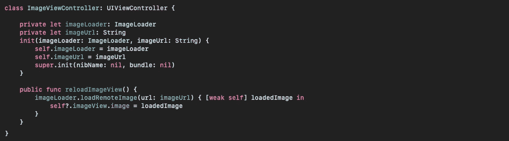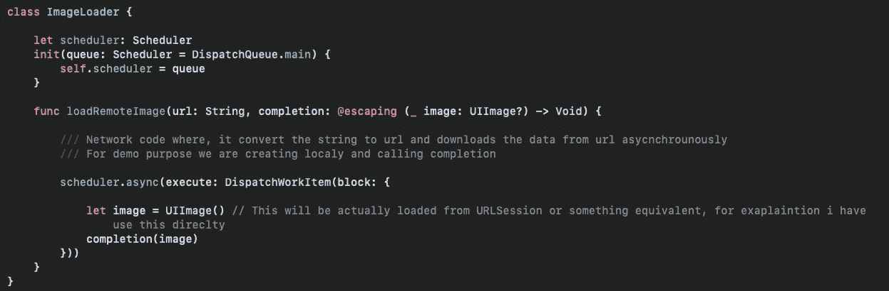

这是我们的 ImageViewController，它有一个相关的 ImageLoader 来加载远程 web 图像，ImageViewController 将下载的图像设置为它的 imageView。
现在我们来看看实现步骤是什么样子的

*   步骤 1 图像视图控制器创建
*   第二步通过`reloadImageView`从图像加载器调用`loadRemoteImage`，从远程网址下载图像。

如果我们为上面的实现步骤编写测试呢？

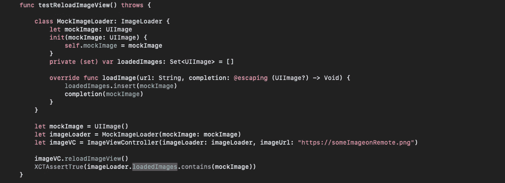

好的，我们已经模拟了`MockedImageLoader`的图像加载器，是的，因为我们从网络调用加载图像，所以可以理解。我们现在将同样的内容注入 ImageViewController 并调用 reloadImageView，稍后我们检查给予 MockedImageLoader 的 mockImage 是否被加载到 loadedImages 集合中。这是公平的，这正是已经实施的。

这看起来像是一个单元测试，但是我们真的在测试 ImageViewController 应该做什么吗？哦！不要！ImageViewController 假定从远程 URL 加载图像并在 imageView 中显示它。但是我们更倾向于单元测试 ImageLoader 的逻辑是否加载给定的图像，这是因为我们在编写测试时考虑了实现细节，这就是为什么我们结束了对 ImageLoader 而不是 ImageViewController 本身的测试。

现在让我们试着为 imageview controller reload imageview 行为编写一个测试。让我们稍微调整一下 ImageLoader，以便为 ImageViewController 行为编写单元测试。

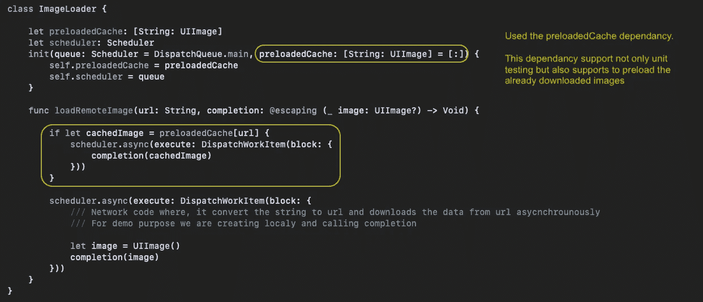

现在将看到验证 ImageViewController 的 reloadImageView 行为的单元测试。

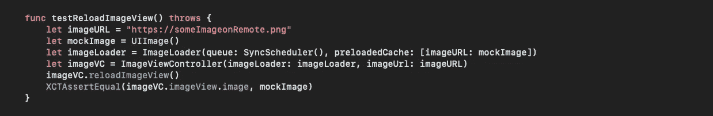

有趣吧？

我们没有模仿 ImageLoader，是的，我们不需要，我们正在验证 reloadImageView 的结果，它检查 ImageView.image 是否是通过 mockImage 发送的，还有一个优点是我们不需要更新单元测试，即使我们修改了 ImageViewController 和 ImageLoader 的实现，直到 ImageViewController 的行为 reloadImageView 是相同的。

这是一个针对类/函数行为而不是实现编写单元测试的非常简单的例子。