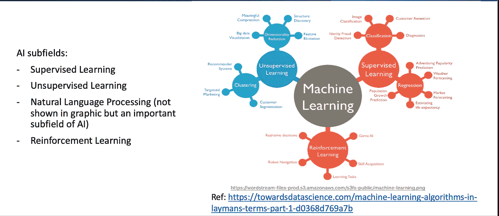
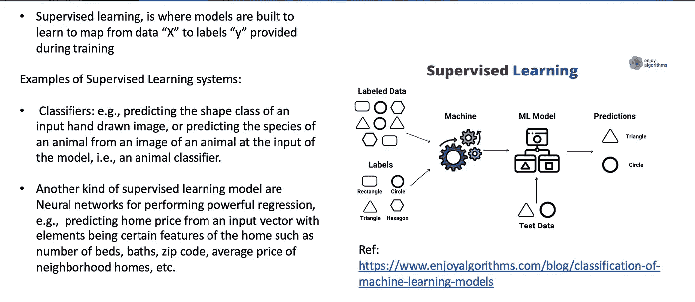
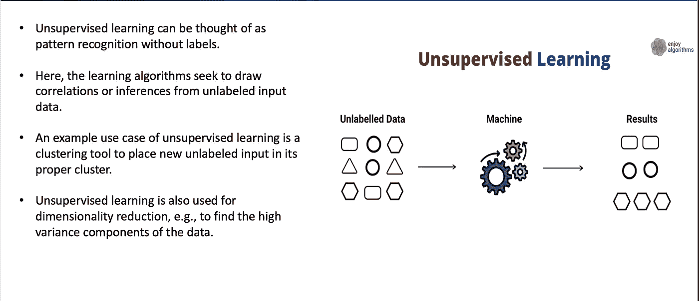
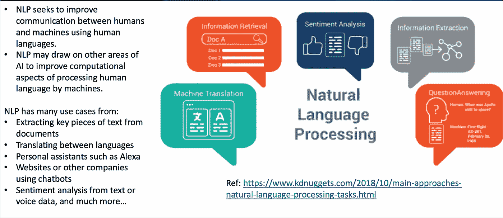
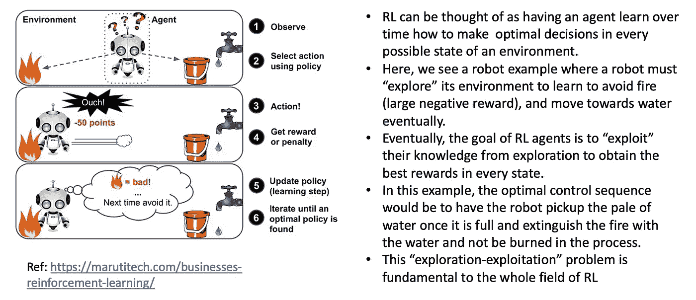

# 人工智能(AI)子领域

> 原文：<https://levelup.gitconnected.com/artificial-intelligence-ai-subfields-8d16509a3b36>

安德烈·德·森蒂斯峰在 [Unsplash](https://unsplash.com/s/photos/ai?utm_source=unsplash&utm_medium=referral&utm_content=creditCopyText) 上拍摄的照片

围绕人工智能(AI)是什么，以及它的子领域是什么，有很多误解。首先，让我们弄清楚什么是可接受的人工智能定义。人工智能是计算机科学的一个分支，它通过从数据中学习并不断适应新数据，来创建在任何任务中都能表现得和人类一样好或更好的程序或代理。

那么，人工智能的子领域是什么呢？在我看来，有四个主要领域——主导领域:

1.  监督学习，
2.  无监督学习，
3.  自然语言处理，以及
4.  强化学习。

前两个子领域，与精神心理过程和理性思考有关；第三个子领域，自然语言处理，是关于与人类交流和执行其他与语言相关的重要任务；最后一个子领域，强化学习，关注的是创造能够在任何给定环境中为某项任务做出最佳行为的人工智能。

# 人工智能子字段:

# 监督学习:

# 无监督学习:

# 自然语言处理(NLP):

# 强化学习(RL):

直到下一次，

凯勒。

考虑成为一个媒体成员，永远不会错过我的故事。无限制地访问我的作品和其他作者的作品:

 [## 加入我的介绍链接媒体-迦勒鲍耶

### 阅读凯莱布·m·鲍耶(以及媒体上成千上万的其他作家)的每一个故事。您的会员费直接支持…

medium.com](https://medium.com/@CalebMBowyer/membership)