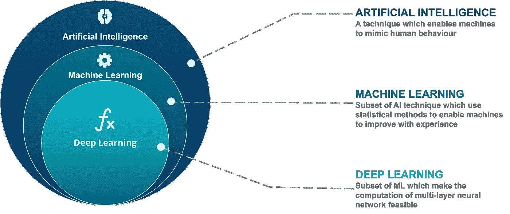

# 人工智能:初学者入门

> 原文：<https://levelup.gitconnected.com/artificial-intelligence-an-introduction-for-beginners-c90f5c3136dc>

([来源](https://dailytimes.com.pk/assets/uploads/2018/03/27/))

我们不时会遇到“人工智能”这个术语，或者更普遍的说法是“AI”。但是你有没有想过为什么它是所有其他讨论的中心？为什么组织和个人投入如此多的资金和精力？模糊到底是怎么回事？无论你是一个想要学习新技能的学生，一个试图赶上人工智能潮流的专业人士，或者仅仅是一个好奇的人，这个博客将向你介绍人工智能的世界。那么，AI 到底是什么？

让我们首先从人工智能的一个非常正式的定义开始(来源:[牛津](https://www.lexico.com/definition/artificial_intelligence)

> 计算机系统的理论和发展，能够执行通常需要人类智能的任务，如视觉感知、语音识别、决策和语言间的翻译

从上面的定义可以清楚地看出，人工智能由试图模仿人类行为和智力的计算机组成。

人工智能 vs 机器学习 vs 深度学习([来源](https://www.edureka.co/blog/ai-vs-machine-learning-vs-deep-learning/))

但是，我们如何知道机器是否已经学到足够多的知识，能够像人类一样思考？这就是图灵测试发挥作用的地方。

# 图灵检定

图灵测试的设置([来源](https://en.wikipedia.org/wiki/Turing_test))

1950 年，艾伦·图灵(Alan Turing)开发了一项测试，也就是今天众所周知的图灵测试，来检验机器模仿人类的能力。测试由一个基本程序组成，机器和人被问同样的问题。如果不知道答案来源的法官不能识别答案是来自人还是机器，那么机器就被认为通过了测试，具有人类的智能。测试结果不取决于机器对问题给出正确答案的能力，而取决于它的答案与人类给出的答案有多接近。

**机器的目标是欺骗提问者，让他相信机器就是人类。**

艾伦·图灵预言机器最终能够通过测试；事实上，他估计到 2000 年，拥有大约 100 兆存储空间的机器将能够在五分钟的测试中骗过 30%的人类法官。但是，到目前为止，还没有具体的证据证明机器通过了这项测试。虽然，在 2014 年，一个名为 **Eugene Goostman** 的聊天机器人，模拟了一个 13 岁的乌克兰男孩，据说通过欺骗伦敦皇家学会 33%的法官说它是人类而通过了这个测试([来源](https://www.bbc.com/news/technology-27762088))。但是否真的通过了还值得商榷。

# 应用程序

你现在一定在想“得了吧，伙计，这个理论已经够了，但是我们到底在哪里使用它呢？”环顾四周，你会发现许多东西都利用了这项技术。无论是你手机里的 Siri(或谷歌助手)，你房间里的 Alexa，还是 PUBG 里的机器人(是的，那些愚蠢的电脑玩家)，都是人工智能的产品。不仅仅是这些应用利用了人工智能，它还被用于一些超级先进的东西，如自动驾驶汽车和机器人，这些在过去似乎是不可能的。

谷歌的无人驾驶汽车原型

为了了解这项技术的准备情况，我想问几个问题，“你能信任人工智能吗？你能坐在一辆没有人工干预的自动驾驶汽车里自己驾驶吗？你能接受机器人在没有医生监督的情况下进行手术吗？”。如果任何一个问题的答案是“不”，那么，你可以理解在这个领域还有很多发展空间。从技术上来说，至少在不久的将来，不可能说在人类生命受到威胁的情况下可以完全信任人工智能，但以技术进步的速度来看，这也不是一件遥远的事情。

我们现在在人工智能发展方面处于什么位置？([来源](https://www.callaghaninnovation.govt.nz/blog/ai-demystified))

所以这是人工智能的基本介绍，它的目标是那些刚刚开始涉足这个充满无限可能的巨大领域的人。敬请关注更多关于机器学习、深度学习和数据科学的文章。

这是我的第一篇文章，如果你喜欢，请留下“掌声”👏。这对我会很有激励作用。

在 Github 和 LinkedIn 上关注我，了解更多信息。