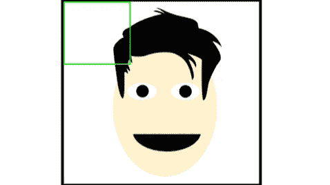
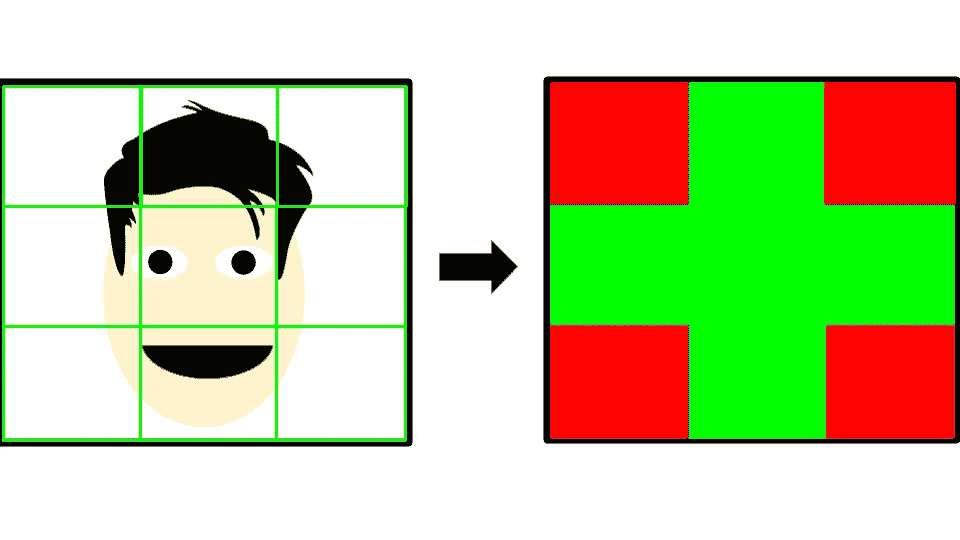
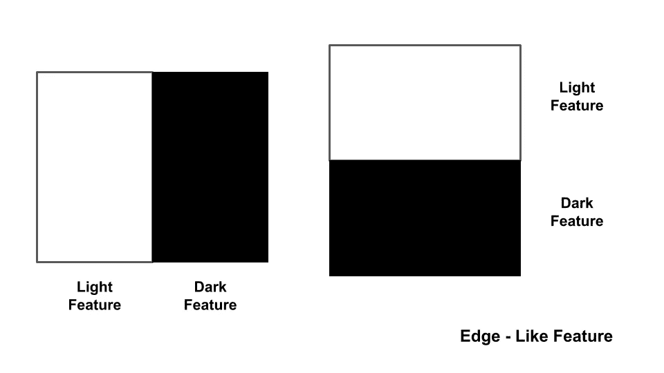
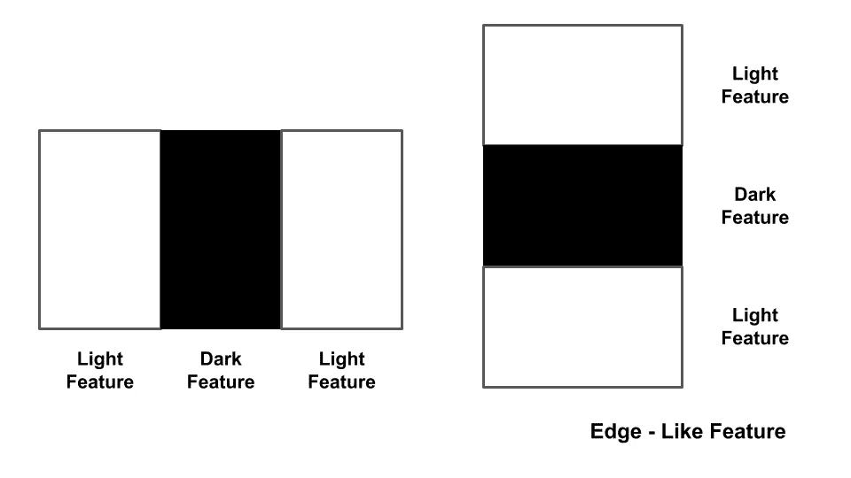
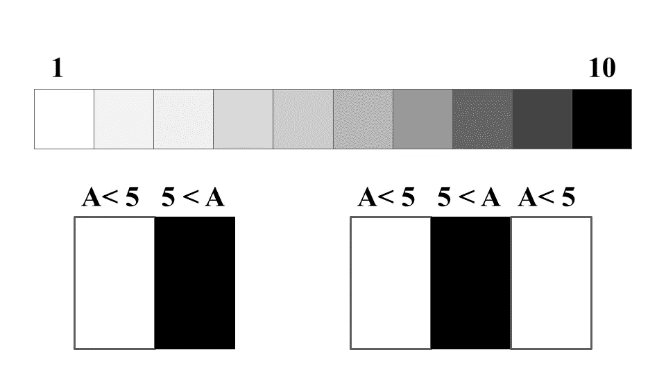
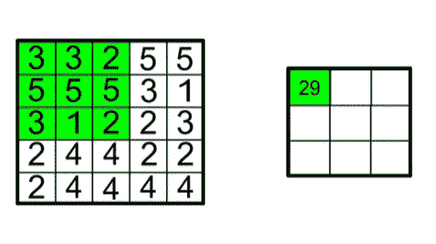
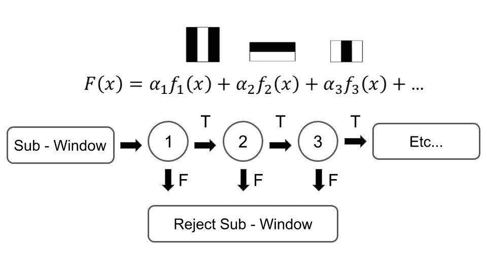

# 人工智能:Viola-Jones 算法如何帮助物体检测？

> 原文：<https://levelup.gitconnected.com/artificial-intelligence-how-the-viola-jones-algorithm-help-in-object-detection-28320596a81c>

所有人每天都会探测到许多物体，比如汽车、树木，甚至其他人。检测物体对我们来说是很平常的事情，但是你有没有想过计算机也像我们一样检测物体。这听起来可能很疯狂，但从手机到汽车，它们内部都存在某种形式的物体检测，以了解真实世界。物体检测正在帮助人工智能发挥其全部潜力，Viola-Jones 算法是帮助检测物体的一种方式。

Viola-Jones 算法是如何工作的？

Viola-Jones 算法的主要目标是检测人脸。为了做到这一点，它将首先查看人脸的正面视图。该算法会将图像分成几个部分(绿色方框)。它将检查每一部分，并尝试看看是否在那里看到任何面部特征。如果它看不到所有的特征，它将向另一部分移动一点，并尝试再次找到这些特征。Viola-Jones 算法主要在面部寻找的特征是眼睛、嘴、鼻子、脸颊等等。

面部可以代表地图，并且面部特征可以代表地图上的地标。该算法就像一个人试图找到所有地标都在一个位置的区域。

每当该算法检测到一张脸时，它会在图片上标记出它在哪里找到的，并不断重复这一过程，直到它检查完整张图片。当算法扫描完人脸后，会有一堆方框标出人脸所在的位置。然后，该算法将找到人脸所在的平均位置。算法如何检测人脸的特征？

**有哪些类似哈尔的特征？**

Haar-like features 是一种允许算法检测人脸特征的方法。有两种主要类型的类哈尔特征，即边缘特征和线特征。

边要素查找一侧亮而另一侧暗的要素。眉毛可能是边缘特征的一个例子，因为眉毛比它上面的皮肤更暗。

线要素查找中间有暗线且周围有亮线的要素。嘴可能是线要素的一个示例，因为嘴唇相交的地方比嘴唇本身更暗。

**检测特征**

当算法查看一个区域时，它首先从 1 到 10 绘制出竞技场的黑暗程度，其中 1 是最亮的，10 是最暗的。对于确定哪个区域是暗的哪个区域是亮的算法，它找到该区域的平均暗度。如果平均暗度超过 5，则该区域是暗的，如果平均暗度小于 5，则该区域是亮的。例如，在边缘特征中，该算法寻找一个暗区域和它旁边的亮区域。这就是它如何找到脸上的每一个特征。

找到每个区域的平均值需要大量的时间和计算能力。为了提高效率，使用了一种叫做内部成像的系统。内部成像从每个点开始计算每个方块的总和。在上图中，为了找到灰框的值，算法将灰框上方和右侧区域的值相加。内部成像创造了一种更快、更有效的方法来寻找面部特征。为了让算法识别面部的各种特征，它需要知道什么特征具有什么百分比的暗度和明度。这是通过训练算法来实现的。

**如何训练 Viola-Jones 算法？**

Viola-Jones 算法通过拍摄人脸和非人脸的照片进行训练。该算法将首先获取面部图像，并查看所有图像之间的相同之处。例如，在第一幅图像中，这个人脸上有雀斑，而第二幅图像中没有。这让算法知道不是所有的脸都会有雀斑，因此它不会在图像中寻找它。该算法检测这些特征的方式是通过使用 Haar-like 特征，并映射在面部的该部分存在 Haar-like 特征。非人脸图片教会算法什么不是人脸，以便它可以与人脸进行比较，并找到更多使人脸不同于其他任何东西的差异。

**什么是层叠？**

每次该算法在每个框中寻找面部特征时，都需要花费大量的时间和计算能力来寻找数百个特征。这就是级联的用武之地。层叠的工作原理是寻找一个特征，如果在框内没有找到该特征，算法将移动到下一个框。但是，如果在框内找到了该特征，算法将寻找下一个特征。假设算法在找鼻子。在第一个盒子里，它没有找到鼻子，所以它开始看下一个盒子。在第二个框中，算法找到了鼻子，然后开始寻找嘴。层叠是有帮助的，因为即使一个特征不存在，它也不会寻找每个特征，如果一个特征不存在，它将移动到下一个框。

**物体检测的应用日益增多**

对象检测为我们大多数人每天使用的应用程序提供智能，并正在改变计算机与世界交互的方式。目前，对象检测以各种方式帮助个人和公司。物体检测正被用于自动驾驶汽车和无人机，以帮助它们在不撞到物体的情况下移动。它现在广泛应用于手机的面部识别。物体检测在未来有很大的帮助。虽然 Viola-Jones 算法可以应用于许多不同的领域，但它不是我们目前拥有的最强大的对象检测模型。Viola-Jones 算法不具备像深度学习模型那样计算出它从未见过的对象的功能。即使 Viola-Jones 算法有局限性，它也是释放物体检测全部潜力的基础工具之一。

你好，我是尼万·古杰拉尔！我是一个 13 岁的孩子，对人工智能和航空航天的交叉充满热情。如果你想进一步讨论这篇文章或只是谈谈，请发邮件到 nivangujral@gmail.com 给我。