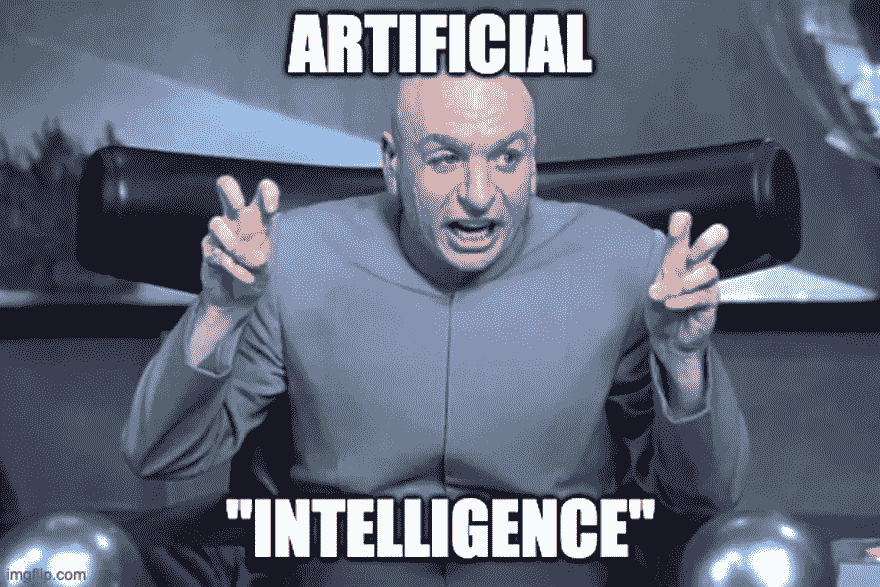

# 简而言之，人工智能

> 原文：<https://levelup.gitconnected.com/artificial-intelligence-in-a-nutshell-96f1841a11a8>

## 人工智能的基础

在 [Unsplash](https://unsplash.com?utm_source=medium&utm_medium=referral) 上 [NeONBRAND](https://unsplash.com/@neonbrand?utm_source=medium&utm_medium=referral) 拍摄的照片

**人工智能** (AI)是计算机科学的基本课题之一。因此，需要有一个基本的理解，才能从正确的角度来看待具体的主题。

假设你想定义术语*智能*。在这种情况下，你会很快意识到这一点都不容易，这是一个挑战，因为光是智力这个词就只能被模糊地定义。大家对什么叫聪明只有一个大概的概念，没有确切的定义。

然而，很明显，人工智能是**计算机科学**的一个子领域，人工智能旨在人工再现智能行为或学习。目标是让计算机变得独立并适应不断变化的环境。

这应该在软件没有为各种场景专门编程的情况下工作，这意味着软件应该独立开发，而不是指令性的。

在人工智能中，现在对所谓的强人工智能和弱人工智能进行了区分。这是指人工智能是否与人类不相上下，或者是否专门从事某项特定的任务。

而**弱 AI** 则是满足于模拟智能行为，所以我们这里说的不是真正的智能。有人可能会说，弱人工智能只是假装聪明，以便从外部看起来，它的行为是智能的。

这也很管用，弱人工智能领域的进步近年来正在大踏步前进并取得成就。

s **trong AI** 的不同之处在于它显示一般的智能行为，因此它不是为任务而编程的，而是可以一般地适应任务领域，因此与人类一样。

很容易陷入哲学问题和伦理问题。这里你遇到了不同的意见，因为你根本不知道这是否应该是可取的，而另一方声称这是因为技术进步而不可避免的。

在过去的几年和几十年里，强人工智能领域几乎没有发生任何事情，几乎没有什么进展，我们还没有走到那一步。

# 有监督和无监督

当谈到人工智能的学习时，区分两种类型的学习非常重要。一方面，有**监督学习**，其中 AI 从外部接收**反馈，它可以使用这些反馈来定位自己并适应。**

另一方面，还有**无监督学习**，可以说，在这种学习中，人工智能被留给了自己的设备。对于人工智能来说，典型的不同类型的问题很好地说明了这一点。

第一类问题是所谓的**分类**，它涉及到将数据分配到预定义的类别。这方面的例子是识别癌细胞、植物等。由于人工智能无法自己知道哪个分配有意义，哪个没有意义，这必须首先从外部指定——算法是“训练过的”。因此，分类是“受监督的”。

[BOC helly](https://unsplash.com/@bochelly?utm_source=medium&utm_medium=referral)先生在 [Unsplash](https://unsplash.com?utm_source=medium&utm_medium=referral) 上的照片

另一类同样被监督的问题是**回归分析**。它是关于价值的预测，例如，待售房屋的最高可能价格。虽然这里的目标与分类不同，但程序是相似的:算法是用已知数据和结果**训练的，然后能够进行预测。**

所谓的**聚类**的情况有所不同，在聚类中，数据也要被分类——然而，与分类相反，分类没有被指定，只有它们的数量。然后，人工智能应该自己找到类别。很明显，这可以对数据进行陈述，但不能应用语义。

照片由[法比奥](https://unsplash.com/@fabioha?utm_source=medium&utm_medium=referral)在 [Unsplash](https://unsplash.com?utm_source=medium&utm_medium=referral) 上拍摄

# 训练算法

如前所述，人工智能算法需要“训练”。这意味着对已知数据的算法调整，由此这种调整自动发生。你只是用数据“喂”算法，然后希望算法“印”在你所学的东西上。为了将算法引向正确的方向，可以选择监督程序，但这取决于给定的问题和数据。

在训练中，对确定性程序**和随机程序**进行了区分。虽然相同起点和相同数据的确定性训练总是会导致相同的结果，但随机训练涉及到机会。因此，随机训练的算法更难评估，但通常更有效。

对于人工智能算法来说，处理数据首先必须转换成适当的格式——这通常意味着将其转换成数字，主要是向量和矩阵。出于这个原因，擅长向量和矩阵的编程语言、库和硬件，如 Python、NumPy 和 GPU，特别适合 AI。

# 标准化数据

此外，将数据放在一个共同的标准上也很重要，例如，能够处理不同的大小。因此，在训练和应用之前，必须先将**数据归一化**。这是如何工作的取决于特定的规模。最终，目标总是将数据规范化到 0 和 1 之间的范围(或者，根据算法，规范化到-1 和 1 之间的范围)。

要做到这一点，你必须考虑什么样的数据是可用的。例如，标称刻度的规范化不同于序数刻度，间隔和比率刻度的处理也不同。名义尺度可以用一键编码表示，顺序尺度可以用百分比表示。原则上，区间和比率标度上的值已经可以作为数字使用，它们只需映射到所需的范围。

将输入数据转换为数字时，可能需要确保数据量不会变得太大。例如，如果您要转换 1000 x 1000 像素的图像，您将获得三百万个数据点(红色、绿色和蓝色通道各一百万像素)。因此，建议首先降低图像或其他输入数据的分辨率。

由[卡洛斯·穆扎](https://unsplash.com/@kmuza?utm_source=medium&utm_medium=referral)在 [Unsplash](https://unsplash.com?utm_source=medium&utm_medium=referral) 上拍摄的照片

# 过度拟合和欠拟合

如果人工智能算法现在面临准备好的数据，就有必要留下反馈(至少在监督算法的情况下)。为此，需要计算实际结果和预期结果之间的差异。这种偏差被称为“误差”，旨在随着时间的推移而最小化。然而，必须注意的是，正负误差不会相互抵消，这就是为什么误差通常仍然是平方的原因。

如果将误差平方相加，就得到误差平方和(SSE)。然而，这仅在有限的范围内有意义，因为由于显而易见的原因，对于大量数据来说，它会更大。因此，通常仍取平均值，这称为均方误差(MSE)。偶尔，也取这个值的平方根，这提供了均方根(RMS)。然而，在实践中，MSE 经常被使用。

现在可以基于这些值来评估算法的质量，但在这里您仍然需要小心:如果您最终只是选择误差最低的算法(或算法的配置)，很可能，这不是一个好的选择。在这种情况下，所谓的过拟合生效。

该算法在训练过程中没有进行归纳，只是学习了确切的值——它只能重现已经“看到”的东西。与此相反的是拟合不足，这意味着算法没有学会正确分类数据，最终或多或少不加选择地接受一切。

为了防止这些问题，输入数据被分成三个子组:第一组用于训练算法，第二组用于决定更仔细地查看哪个配置，第三组用于测试算法。这三组数据不能混合，这样算法就可以对各自的数据做出“无偏见”的反应。

# 想成为 AI 专家？

有一个很酷的知识库你应该去看看。人工智能专家路线图是 Github 上的一个免费资源库，它给出了如何成为人工智能专家的详细路线图。

 [## GitHub-AMAI-GmbH/AI-Expert-Roadmap:2022 年成为人工智能专家路线图

### 2022 年成为人工智能专家的路线图下面是一组展示路径的图表…

github.com](https://github.com/AMAI-GmbH/AI-Expert-Roadmap) 

# 结论

为了能够领会和理解人工智能和 AI 算法是如何工作的，建议首先了解几个基本术语。这里潜伏着一些陷阱，尤其是对初学者来说，因为他们仍然没有选择数据、标准化和评估算法的经验。

尽管如此，了解这些术语还是有好处的，因为这是更好地理解人工智能的第一步。有了这些先前的知识，你现在可以开始处理第一个算法，例如，k-means，遗传算法，甚至神经网络。

感谢您阅读我关于人工智能基础知识的文章。我希望，你能从中吸取一些东西。

干杯！

我希望你喜欢读这篇文章。如果你愿意支持我成为一名作家，可以考虑[成为一名媒体成员](https://medium.com/@hellokevinvogel/membership)。每月只要 5 美元，你就可以无限制地使用 Medium。

想支持我？请给我买一杯 T2 咖啡。

# 接下来阅读

 [## 在 Go with Gin 中构建可伸缩的 API

### 使用 Gin、GORM 和 Postgres 在 Go 中创建可伸缩 API 的指南

better 编程. pub](https://betterprogramming.pub/build-a-scalable-api-in-go-with-gin-131af7f780c0)  [## 微软如何改变 TypeScript

### 这个由微软支持的提议可能会改变我们所知道的打字稿

better 编程. pub](https://betterprogramming.pub/how-microsoft-wants-to-destroy-typescript-1f1a53b18de6)