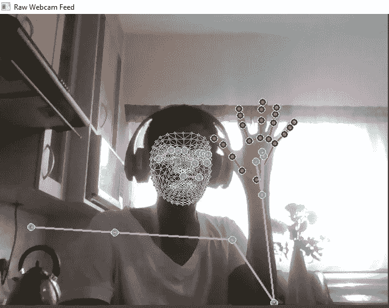
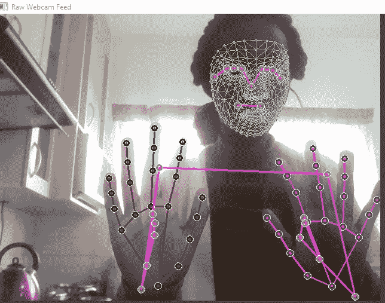
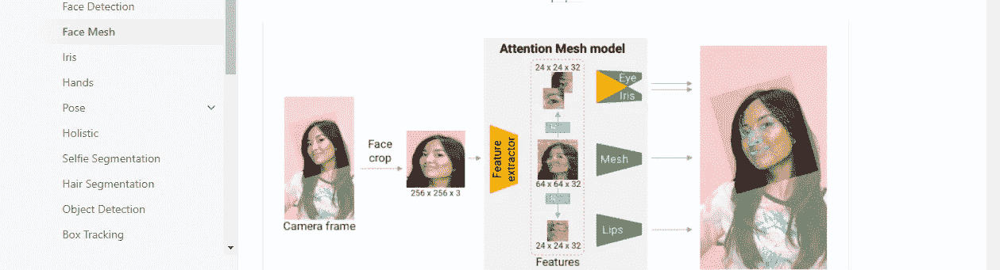
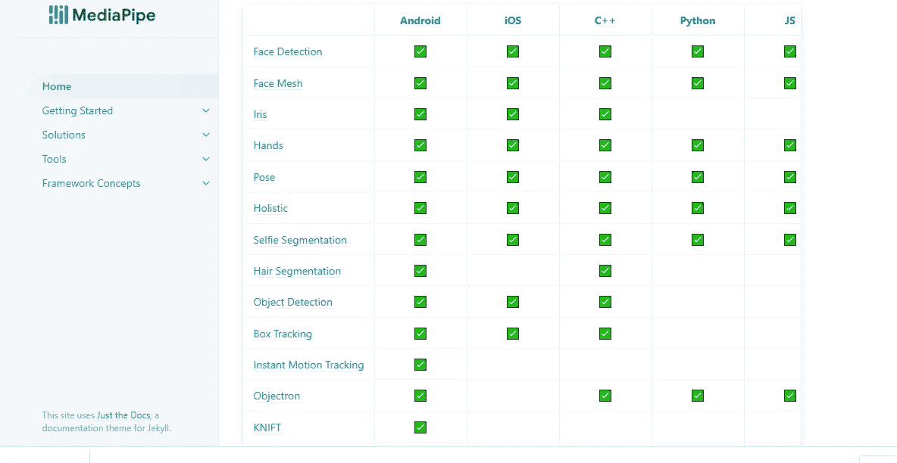
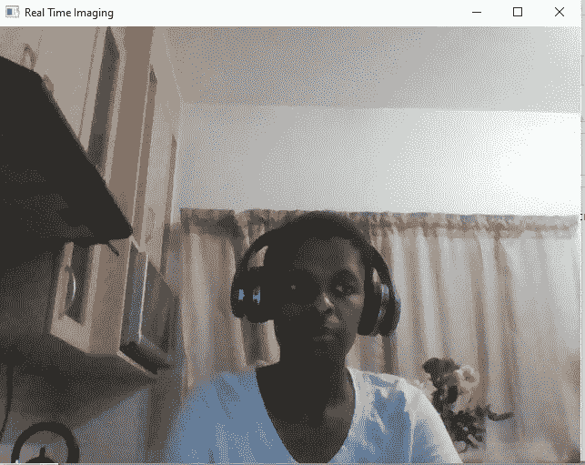
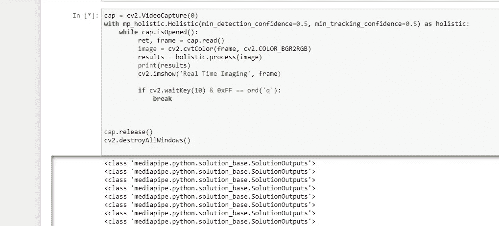
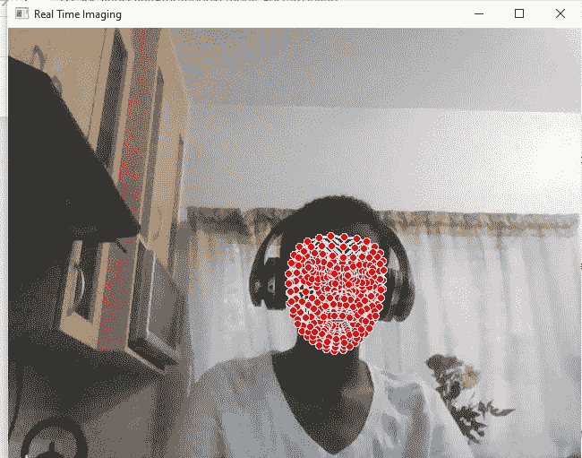
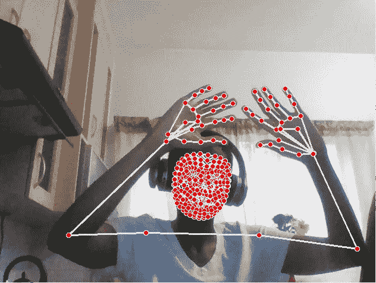
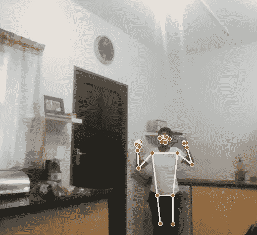
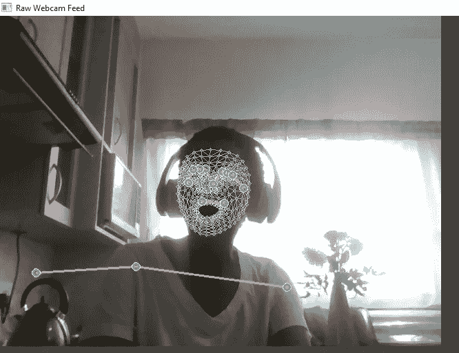

# 人工智能项目:姿态检测

> 原文：<https://levelup.gitconnected.com/artificial-intelligence-project-pose-detection-564dead6f10c>

我被问了很多问题，如何使用人工智能来检测特定的 posepostures，以及是否有可能从中获得情感。

嗯，我和我的同事决定试试人工智能追踪。



上图是最终目标，使用人工智能识别姿势并最终识别情绪。

# 设置我们的环境

我们将使用 open CV 进行图像识别，使用 media pipe 进行姿势识别。

```
!pip install mediapipe opencv-python
```

我们将只使用两个依赖项和时间来设置 opencv 中的实时提要。

为了设置我们的实时提要，我们需要导入我们的依赖项；

```
import mediapipe as mp
import cv2
```

让我们从设置媒体管道开始

```
mp_drawing = mp.solutions.drawing_utils
mp_holistic = mp.solutions.holistic
```

因此，我们设置了绘图工具，通过 open cv 将我们整体模型中的不同检测绘制到屏幕上。

那么整体性只是引入了我们的整体性模型。

在媒体管道中，我们有各种各样的模型可以使用，即:

人脸网格，虹膜，手，姿势，整体，自拍分割。



现在，我们要设置开放的实时成像 cv；

```
cap = cv2.VideoCapture(0)
while cap.isOpened():
    ret, frame = cap.read()
    cv2.imshow('Real Time Imaging', frame)

    if cv2.waitKey(10) & 0xFF == ord('q'):
        breakcap.release()
cv2.destroyAllWindows()
```

我们将第一行代码声明为变量 cap，并将 cv2(调用 open cv 的别名)分配给 VideoCapture，并选择 0 作为默认摄像头端口。

我们开始我们的 wile 循环，通过告诉 open cv 当 cap，我们的变量是开放的，然后返回 frame 并读取/渲染 cap 到屏幕上。

然后我们使用 imshow 函数来渲染帧中的图像，并将该帧标记为实时成像。

我们的条件 if 语句开始语句的 break 部分，我们对 cv2 说等待 10 毫秒，然后当我按 q 时，中断正在运行框架的 while 循环。

然后释放程序，打破所有窗口。

有时从 if 语句中，break 和 q 不起作用，因此我们可以只使用下面的代码。只是为了确保密码被破解。

```
cap.release()
cv2.destroyAllWindows()
```

现在我们想将我们的媒体管道整体组件覆盖到 opencv 上。

我们首先将开放的 cv 代码复制到下一个 Jupyter 单元格，然后我们将整体代码添加到其中。

```
cap = cv2.VideoCapture(0)
with mp_holistic.Holistic(min_detection_confidence=0.5, min_tracking_confidence=0.5) as holistic:
    while cap.isOpened():
         ret, frame = cap.read()
         image = cv2.cvtColor(frame, cv2.COLOR_BGR2RGB)
         results = holistic.process(image)
         print(results)
         cv2.imshow('Real Time Imaging', frame)

         if cv2.waitKey(10) & 0xFF == ord('q'):
             breakcap.release()
cv2.destroyAllWindows()
```

我们添加的新代码，使用了 wit 语句和我们之前导入的 MP _ global。在 MP . global 方法中，我们添加了 min_detection_confidence 和 min_tracking_confidence，并将其赋值为 0.5。

```
with mp_holistic.Holistic(min_detection_confidence=0.5, min_tracking_confidence=0.5) as holistic:
```

我们会将整个行设置为整体，因为我们不想每次都键入整体。

对于具有高跟踪置信度的模型，我们可以将 min_detection 置信度和 min_tracking_confidence 设置为更高的值。

我们还添加了以下代码行:

```
image = cv2.cvtColor(frame, cv2.COLOR_BGR2RGB)
         results = holistic.process(image)
         print(results)
```

第一行代码我们重新着色我们的图像，抓取我们上面的框架，并使用 cv2 重新着色框架中返回的内容。COLOR-BGR2RGB，我们希望模型的颜色用 RGB 表示。

我们将正在重新着色的图像传递给整体模型，并分配一个名为 results 的变量。然后我们打印出我们的结果，因为我们还没有在屏幕上画任何东西。

当我们运行代码时，我们会看到一个弹出窗口。



然后打印出我们需要的东西，只是为了检查我们是否还在按计划进行。



现在，我们已经检查了所有工作正常，我们可以继续前进，并绘制到我们的屏幕上，从面部标志开始，我们可以删除打印并添加绘制。

```
image = cv2.cvtColor(image, cv2.COLOR_RGB2BGR)
mp_drawing.draw_landmarks(image, results.face_landmarks, mp_holistic.FACEMESH_TESSELATION)
         cv2.imshow('Real Time Imaging', frame)
```

第一行代码 image = cv2.cvtColor(image，cv2。COLOR_RGB2RGB2)将图像的渲染从 BGR(我们在上面进行了转换)转换回 RGB，因为这是 open cv 想要的图像。

然后我们继续绘制，使用 mp_drawing.draw_landmarks，我们从上面传入图像变量，从我们的 face_landmarks 和 MP . overall . face mesh _ TESSELATION 模型传入结果。

所以我们想改变我们正在渲染的图像，所以我们想把我们的原始帧图像改变成我们的图像变量。



所以我们在屏幕上画出了我们所有不同的面部标志，这很酷也很吓人，我向任何方向移动我的脸，它都会跟踪我的脸。

现在我们要画出我们的其他标志，也就是姿势，右手和左手。



```
mp_drawing.draw_landmarks(image, results.face_landmarks, mp_holistic.FACEMESH_TESSELATION)
         mp_drawing.draw_landmarks(image, results.right_hand_landmarks, mp_holistic.HAND_CONNECTIONS)
         mp_drawing.draw_landmarks(image, results.left_hand_landmarks, mp_holistic.HAND_CONNECTIONS)
         mp_drawing.draw_landmarks(image, results.pose_landmarks, mp_holistic.POSE_CONNECTIONS)
         cv2.imshow('Real Time Imaging', image)
```

正如上面看到的，这个模型正在跟踪我的脸，左右手，包括我的姿势，非常准确，非常快。我们也可以用姿态跟踪来跟踪整个身体。



我们有白色和红色，我们想给我们的地标上色，我们将通过使用绘图规范模型来完成。

```
mp_drawing**.**DrawingSpec(color**=**(0,0,255), thickness**=**2, circle_radius**=**2)
```

我们能够传递颜色、粗细和圆的半径，我们要传递线条和圆的颜色。

```
mp_drawing**.**DrawingSpec(color**=**(0,0,255), thickness**=**2, circle_radius**=**2)
```

我们将这样做的脸，姿势和手。

```
cap = cv2.VideoCapture(0)
# Initiate holistic model
with mp_holistic.Holistic(min_detection_confidence=0.5, min_tracking_confidence=0.5) as holistic:

    while cap.isOpened():
        ret, frame = cap.read()

        # Recolor Feed
        image = cv2.cvtColor(frame, cv2.COLOR_BGR2RGB)
        # Make Detections
        results = holistic.process(image)
        # print(results.face_landmarks)

        # face_landmarks, pose_landmarks, left_hand_landmarks, right_hand_landmarks

        # Recolor image back to BGR for rendering
        image = cv2.cvtColor(image, cv2.COLOR_RGB2BGR)

        # 1\. Draw face landmarks
        mp_drawing.draw_landmarks(image, results.face_landmarks, mp_holistic.FACEMESH_TESSELATION, 
                                 mp_drawing.DrawingSpec(color=(80,110,10), thickness=1, circle_radius=1),
                                 mp_drawing.DrawingSpec(color=(80,256,121), thickness=1, circle_radius=1)
                                 )

        # 2\. Right hand
        mp_drawing.draw_landmarks(image, results.right_hand_landmarks, mp_holistic.HAND_CONNECTIONS, 
                                 mp_drawing.DrawingSpec(color=(80,22,10), thickness=2, circle_radius=4),
                                 mp_drawing.DrawingSpec(color=(80,44,121), thickness=2, circle_radius=2)
                                 )# 3\. Left Hand
        mp_drawing.draw_landmarks(image, results.left_hand_landmarks, mp_holistic.HAND_CONNECTIONS, 
                                 mp_drawing.DrawingSpec(color=(121,22,76), thickness=2, circle_radius=4),
                                 mp_drawing.DrawingSpec(color=(121,44,250), thickness=2, circle_radius=2)
                                 )
 # 4\. Pose Detections
        mp_drawing.draw_landmarks(image, results.pose_landmarks, mp_holistic.POSE_CONNECTIONS, 
                                 mp_drawing.DrawingSpec(color=(245,117,66), thickness=2, circle_radius=4),
                                 mp_drawing.DrawingSpec(color=(245,66,230), thickness=2, circle_radius=2)
                                 )

        cv2.imshow('Raw Webcam Feed', image)if cv2.waitKey(10) & 0xFF == ord('q'):
            breakcap.release()
cv2.destroyAllWindows()
```



它看起来颜色更好，这是我们跟踪的第一步。

# 附加阅读

[](https://google.github.io/mediapipe/) [## 主页

### MediaPipe 为直播和流媒体提供跨平台、可定制的 ML 解决方案。

google.github.io](https://google.github.io/mediapipe/) [](https://colab.research.google.com/drive/1LXvSRpg0hNMT9u00p3sJmUweaXGYmtVW?usp=sharing) [## 谷歌联合实验室

### 编辑描述

colab.research.google.com](https://colab.research.google.com/drive/1LXvSRpg0hNMT9u00p3sJmUweaXGYmtVW?usp=sharing)