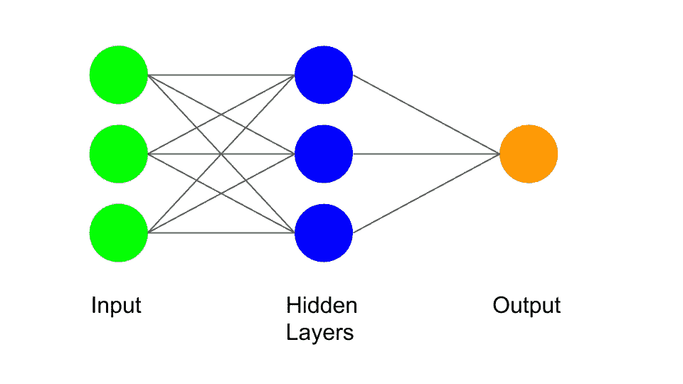
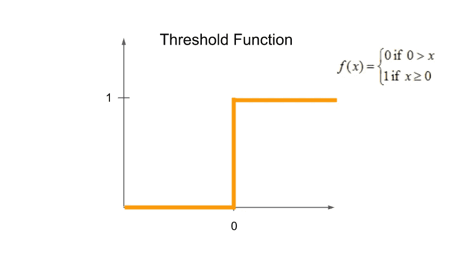
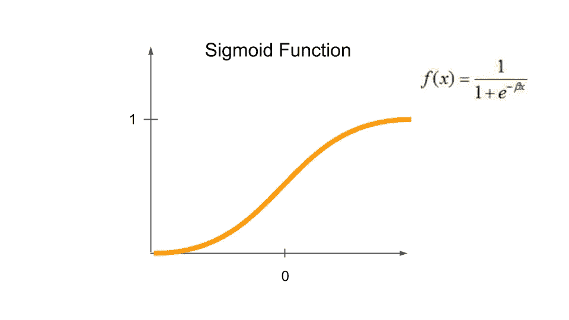
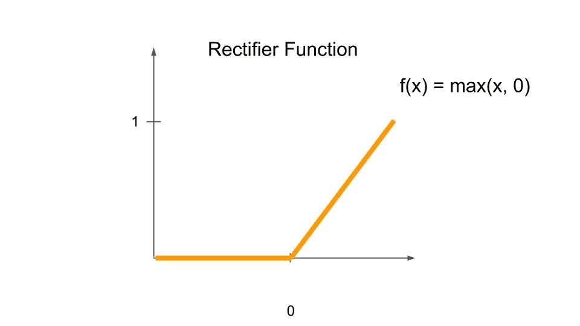
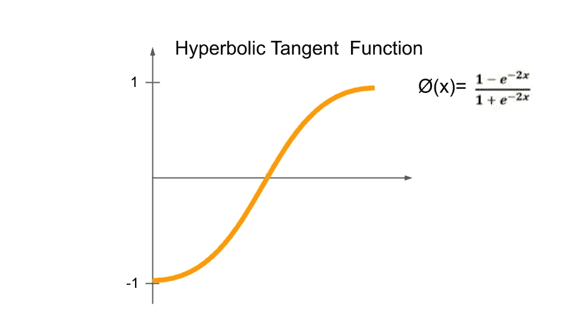
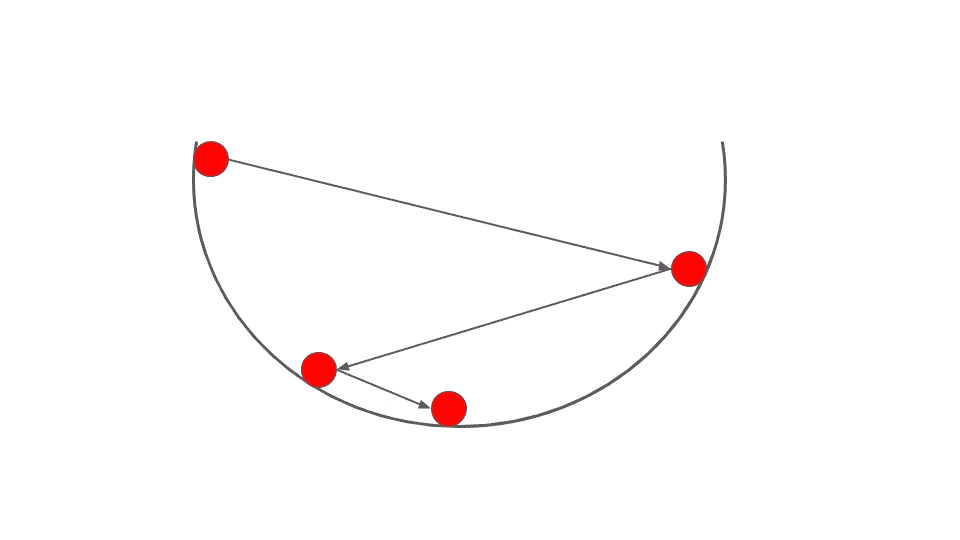

# 人工智能:什么是神经网络？

> 原文：<https://levelup.gitconnected.com/artificial-intelligence-what-are-neural-networks-3ea52ba6d010>

你曾经使用过电脑、智能手机或任何数字设备吗？那么很有可能，你经历过人工智能。人工智能(AI)是指计算机展示与人类智能相关的行为。人工智能是一个广阔的领域，影响着从农业到医疗保健的方方面面。人工智能的核心是神经网络。他们可以很容易地在数据中找到人类很难找到的模式。它们也为其他模型的分支和用于更具体的分析奠定了基础。

**神经网络的组成部分**

在神经网络中，有三个不同的部分，即输入、隐藏层和输出。绿色圆圈代表输入，蓝色圆圈代表隐藏图层，橙色圆圈代表输出。输入是提供给神经网络的值，用于完成某项功能。隐藏层通过使用输入给出的一些值来完成功能。在一个神经网络中可以有多个隐藏层，这取决于它的目标。输出是所有功能发生后的最终结果。

将输入连接到隐藏层的线称为突触。每个突触都被赋予一个权重，决定哪个信号是重要的。我们假设输入和隐藏层是火车站，突触是火车轨道，信号是火车。火车在铁轨上行驶，从一个车站到另一个车站。在轨道上，有许多列车通过，这导致了倒车的发生。为了让列车再次平稳运行，会分配一个重量，让重要的列车先通过，然后让不重要的列车通过。

**激活功能**

隐藏层中的每个圆圈代表一个神经元。在神经元中，与该神经元关联的所有值都是通过加权值相加而得到的。在所有的值彼此相加之后，激活功能发生。

一种类型的激活函数被称为阈值函数。X 轴上是加权值的总和，Y 轴上是从 0 到 1 的值。该函数的工作方式是，如果加权值之和小于 0，则输出 0，如果加权值之和大于或等于 1，则输出 1。该功能最常用于“是”或“否”情况。

另一种类型的激活函数被称为 Sigmoid 函数。就像 X 轴上的阈值函数一样，这里是加权值的总和，Y 轴上是从 0 到 1 的值。这个函数更多的是一个渐进的过程，不像阈值函数那样是从一个直接到另一个。如果这些值的总和小于 0，则这些值将接近于 0。如果这些值的总和大于 1，则该值将接近 1。该函数最常用于尝试和预测概率。

第三种激活功能称为整流器功能。就像 X 轴上的阈值函数和 Sigmoid 函数一样，有加权值的和，但是 Y 轴没有极限，继续向上。该函数从 0 开始，随着 X 值的增加而逐渐增加。这个函数是神经网络中最常用的激活函数。

最后一种激活函数称为双曲正切函数。就像前面 X 轴上的函数一样，有加权值的和，但是在这个函数上，Y 轴从 1 到 0 和从 0 到-1。这个函数就像 Sigmoid 函数，它有一个渐进的过程，但是这个函数也有负的部分。

**如何训练一个神经网络？**

为了训练神经网络，有两个输出，即实际值和输出值。输出值是神经网络基于输入值给出的值。实际值是应该从神经网络得出值。在这些值经过神经网络并得到输出值之后，它计算出成本函数。

通过输出值和实际值的平方差的 1/2 找到成本函数。成本函数表示神经网络产生的误差。神经网络需要降低成本函数值，因为这意味着神经网络将更加准确。成本函数将被反馈到神经网络中，然后权重将被更新。重复该过程，直到成本函数为 0。

**梯度下降**

梯度下降是降低成本函数以找到正确权重的一种方式。让我们想象一个球在当前重量的位置上。它的工作原理是从一个随机权重开始，然后找到该点的斜率。如果斜率是负的，那么图形会向下走，然后球会滚下来。当球停在一个点时，它会再次找到斜坡，并重复这个过程，直到球到达中心。这基本上就是梯度下降法如何找到合适的权重。

**神经网络人工智能的基础**

神经网络接受输入，然后通过专门用于手头任务的激活功能进行处理。对于要训练的神经网络，它试图使用梯度下降等方法将成本函数一直降低到 0。神经网络有助于完成许多与在数据中寻找颜色相关的工作。它们是其他更具体的训练模型(如 RNNs 和 CNN)的基础。rnn 用于查找随时间变化的数据中的颜色，而 CNN 用于查找图像中的颜色。因此，神经网络构成了人工智能的关键基础。

如果你想进一步讨论这篇文章或只是谈谈，请给我发电子邮件到 nivangujral@gmail.com。