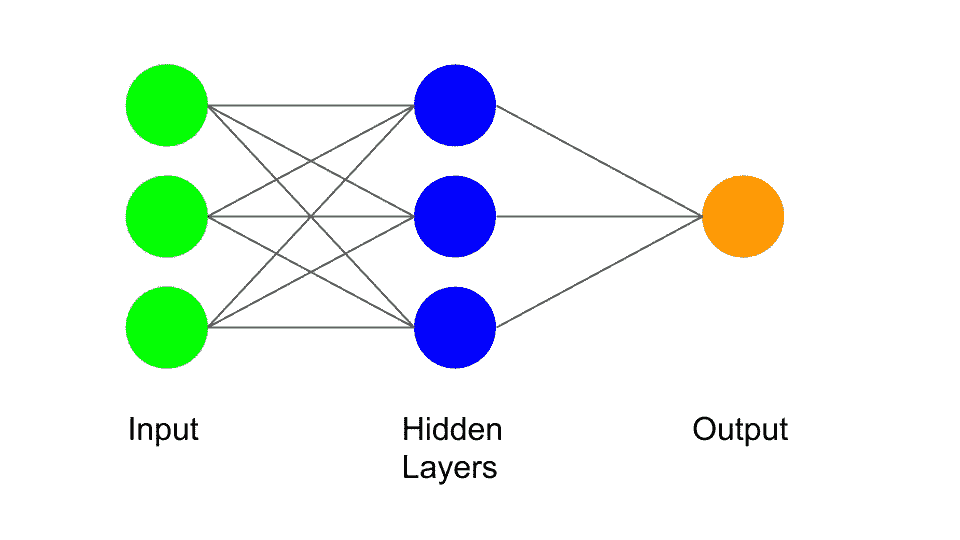
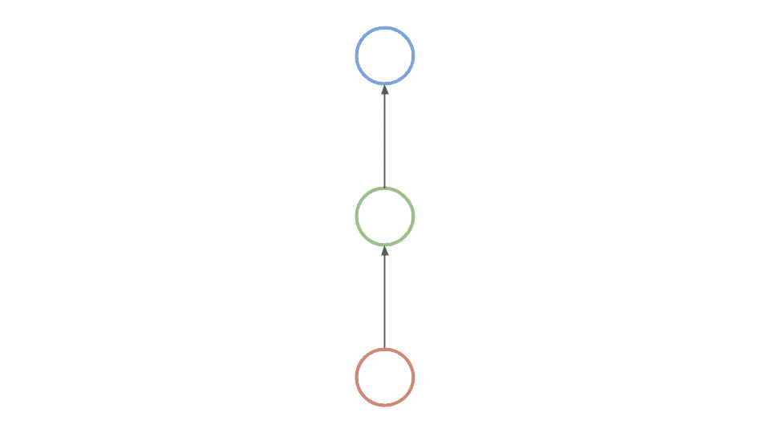
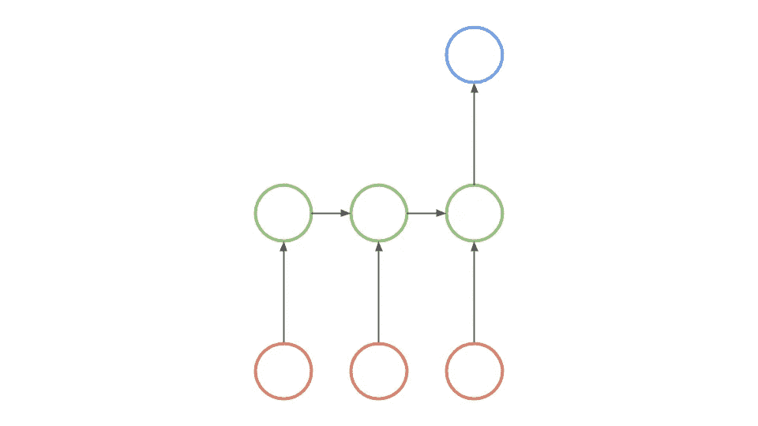
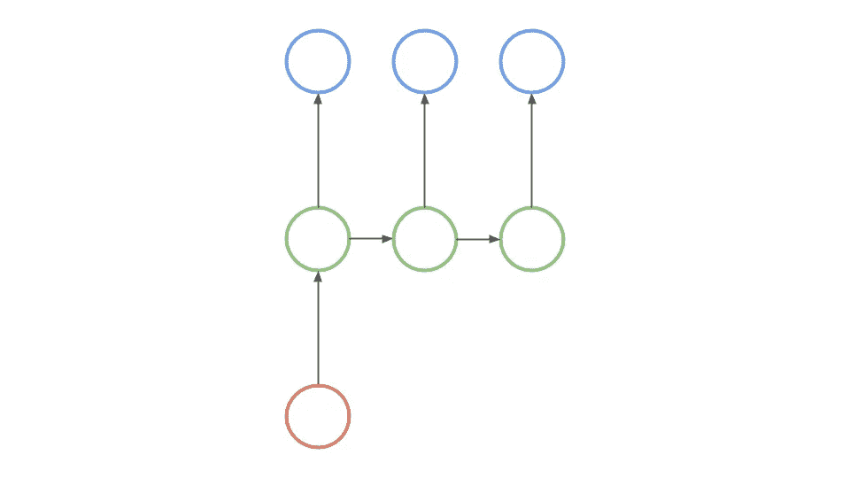
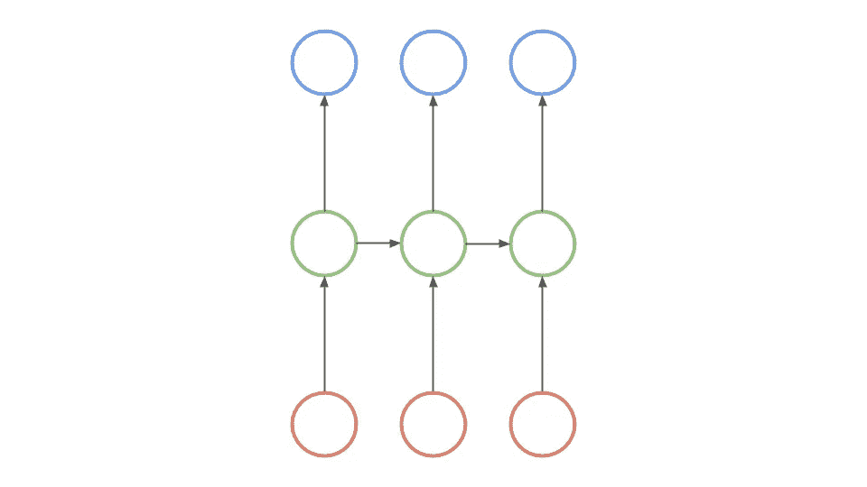

# 人工智能:什么是递归神经网络？

> 原文：<https://levelup.gitconnected.com/artificial-intelligence-what-are-recurrent-neural-networks-1aa72d60ad7>

[https://unsplash.com/photos/aW9_Lo2AiGg](https://unsplash.com/photos/aW9_Lo2AiGg)

你可能遇到过虚拟助理(苹果 Sri 或亚马逊 Alexa)，翻译器(谷歌翻译)，或任何分析文本或语音的设备。这些设备越来越受欢迎，用于向消费者提供服务，例如提供信息、翻译等。你有没有想过它们实际上是如何工作的？递归神经网络是这些不同技术的核心。什么是递归神经网络？

**神经网络**

为了理解递归神经网络如何工作，我们需要首先理解神经网络如何工作。

神经网络是人工智能的核心。他们可以很容易地在数据中找到人类很难找到的模式。它们还为其他机器学习模型的分支奠定了基础，并用于更具体的分析。

在神经网络中，有三个不同的部分，即输入、隐藏层和输出。输入是提供给神经网络的值，用于完成某项功能。隐藏层通过使用输入给出的一些值来完成功能。在一个神经网络中可以有多个隐藏层，这取决于制造它的目的。输出是所有功能发生后的最终结果。

*如果你想了解更多关于神经网络的知识，可以看看我写的这篇关于神经网络的文章***。**

***递归神经网络***

*尽管神经网络真的很擅长在数据中寻找相关性，但它们不会记住所接收到的输入。他们也很难预测接下来会发生什么，因为神经网络只考虑当前的输入。这意味着它没有时间顺序的概念。递归神经网络是一种使用顺序数据或时间序列数据的神经网络。对于语言翻译、自然语言处理、语音识别和图像字幕等顺序问题，递归神经网络得到了广泛的应用。*

***递归神经网络的功能***

*就像神经网络一样，递归神经网络有三个不同的部分，即输入、隐藏层和输出。它们也具有与神经网络相同的功能。*

**

*然而，在 RNN 中，神经元通过时间相互连接。当你沿着 RNN 前行时，时间会越来越长。这种连接允许循环神经网络体验时间感。让我们设想第一组输入、隐藏层和输出是一部电影的第一部分。那么第二套就是 part 2，以此类推。如果神经元之间的连接从未发生，那么计算机可以说电影顺序是“第 5 部分，第 1 部分，第 3 部分…”。然而，这种连接允许计算机理解序列。这意味着电脑会说电影顺序是“第一部，第二部，第三部……”。*

*由于其内部记忆，递归神经网络能够记住过去的输入。在它给出一个输出后，它复制这个输出，并把它返回到算法中。RNNs 中最常用的算法叫做长短期记忆。*

*让我们想象一下，一个神经网络正在试图处理“蓝色”这个词。神经网络将一个字符一个字符地处理这个单词。当它到达“e”的时候，它将已经忘记了“b”、“l”和“u”。然而，在 RNN 的情况下，它将能够记住这些字母，即使它正在处理更多的字母。*

***递归神经网络结构的类型***

*递归神经网络有多种不同的结构，用于完成某项任务，常见的递归神经网络结构有三种，分别是*长短期记忆、门控递归单元和双向 RNNs。**

****长短期记忆****

*RNNs 中最常用的算法叫做长短期记忆。LSTMs 解决了长期依赖的问题。在神经网络的隐藏层中，LSTMs 具有带三个门的“单元”,一个输入门、一个输出门和一个遗忘门。这些门控制着预测输出所需的信息流。*

****门控循环单元****

*门控循环单位结构类似于 LSTM，因为它们有助于解决 RNN 的短期记忆问题。它使用隐藏状态而不是使用“单元状态”来控制数据，并且它有两个而不是三个门——复位门和更新门。与 LSTMs 内部的门类似，复位和更新门监控要维护多少数据和什么数据。*

****双向 RNNs****

*rnn 有一个缺点，它以严格的顺序处理输入。这意味着当前的反馈是基于过去的输入，而不是潜在的。双向 rnn 使用未来数据使其更加准确，而单向 rnn 使用以前的输入进行预测。这允许双向 rnn 也具有未来的上下文。*

***递归神经网络的使用***

*递归神经网络有许多不同的应用，但所有的用例都属于 4 个主要类别。这四类是“一对一”、“一对多”、“多对一”、“多对多”。*

****一对一****

**

*“一对一”用例是算法接受 1 个输入，同时给出 1 个输出。让我们假设算法有一张猫的图像，并试图确定它是什么。句子的输入是图像，输出是对图像的一个词的描述。在这种情况下，描述将是“猫”。*

****一对多****

**

*“一对多”用例是算法接受 1 个输入，给出多个不同的输出。这方面的一个例子是算法试图描述一幅图像。图像是输入，因为它是算法完成任务的输入。描述是算法完成任务后的输出。*

****多对一****

**

*“多对一”用例是算法接受多个不同的输入，并给出 1 个输出。让我们假设算法有一个句子，并试图确定这个句子是肯定的还是否定的。句子是算法的输入，如果句子是肯定的或否定的，则输出。*

****多对多****

**

*“多对多”用例是算法接受多个不同的输入，同时给出多个不同的输出。“多对多”用例的一个例子是 Google Translator。让我们想象你正试图翻译，“你好！“意大利人，我叫鲍勃。您首先从多个不同的单词作为输入开始。算法翻译完句子后，会给出一个输出，“Ciao！米基亚莫鲍勃”。输出也有多个不同的单词。*

***递归神经网络的问题***

*虽然递归神经网络在记住以一定顺序发生的事情方面令人惊讶，但它们仍然存在问题。两个主要问题是爆炸渐变和消失渐变。*

****爆炸渐变****

*误差梯度是在训练神经网络期间梯度中的错误。误差梯度用于更新权重，以使其更加准确。当梯度彼此重复相乘，出现指数增长时，就会发生爆炸。问题是当存在巨大的误差梯度时。这会导致神经网络不稳定，从而在梯度更新时产生错误。*

****消失渐变****

*基于梯度的方法通过知道参数值的微小变化如何影响网络的性能来学习参数值。如果参数值的变化引起网络性能的微小变化，网络就不容易解释该参数。在梯度消失的问题中，网络输出的梯度变得非常小。这也会导致神经网络不稳定。*

***结论***

*递归神经网络是一种分析序列数据的惊人而有效的算法。这是一个非常好的选择来分析语音或任何形式的文本。循环神经网络正以各种方式在各部门得到利用，并在这些领域产生积极影响。*

*让我们回顾一下你们可能来到这里的原因。什么是递归神经网络？*

> **递归神经网络是一种使用顺序数据或时间序列数据的神经网络。他们使用 LSTMs、门控循环单元、双向 rnn 等功能来记忆过去的数据。**

*递归神经网络目前是机器学习的关键工具，其应用每天都在扩展。*

**尼万是一名 14 岁的人工智能开发者，他希望利用技术来帮助解决世界上的问题。他目前正在建立一家名为 Lemonaid 的公司，这是一个将青少年与需要志愿者/实习生招聘帮助的组织联系起来的平台。如果你想进一步讨论这篇文章或只是谈谈，请发邮件到 nivangujral@gmail.com 给我。**