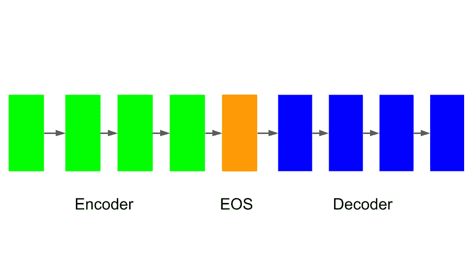
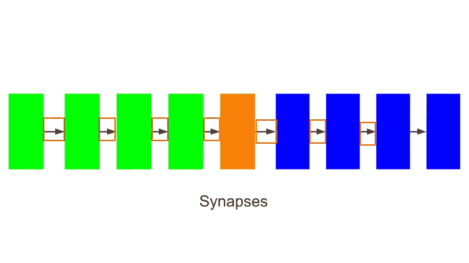
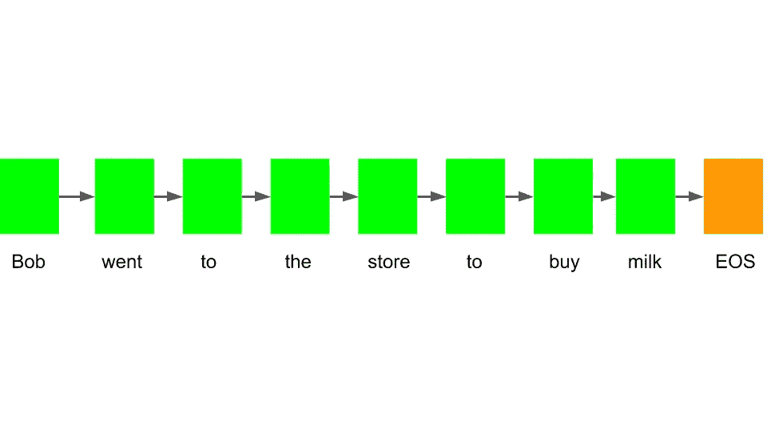
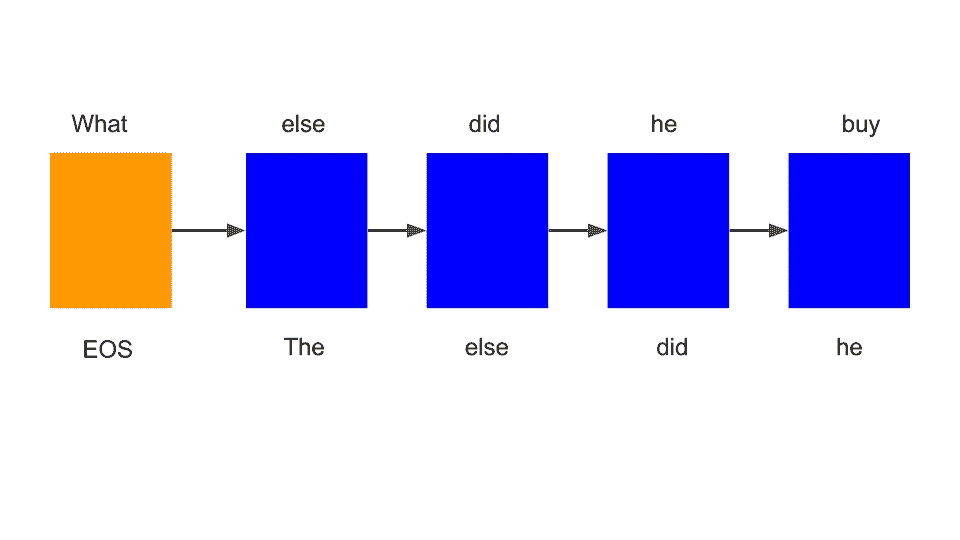
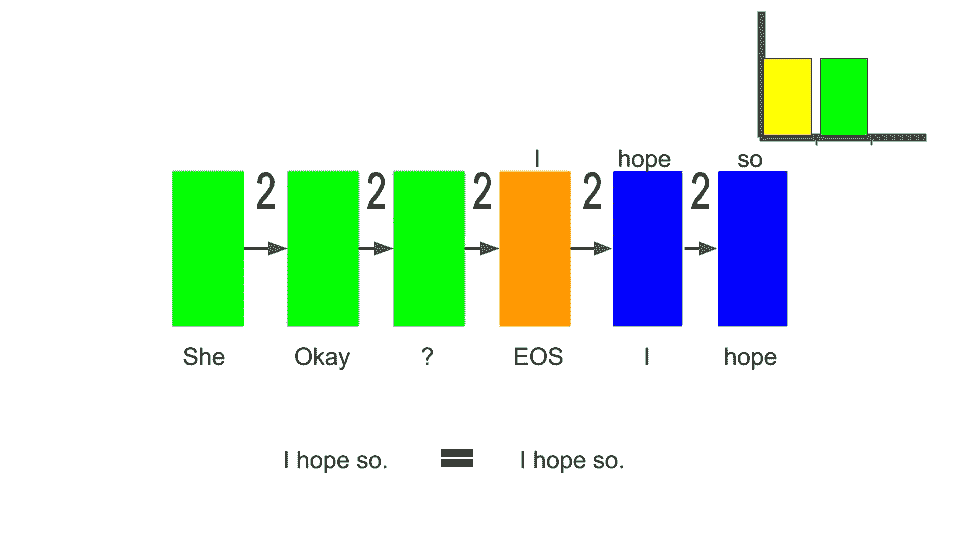

# 人工智能:SEQ2SEQ 训练模型是什么？

> 原文：<https://levelup.gitconnected.com/artificial-intelligence-what-is-the-seq2seq-training-model-c6a3f885daa9>

当我们说“你好”时，我们可以理解它的意思，但它只能理解一台计算机 11110001111。计算机很难理解人类的语言，而我们人类可以不用思考就能理解。自然语言处理(NLP)是一种计算机通过使用人工智能算法来学习人类文本或语音的技术。SEQ2SEQ 训练模型是一种用于 NLP 的人工智能算法。最近，我用这个训练模型创建了一个聊天机器人。聊天机器人可以通过提问和回答用户的问题来与用户进行积极的对话。SEQ2SEQ 训练模式是如何运作的？

**seq 2 seq 训练模型的结构**

SEQ2SEQ 训练模型有两个主要部分，即编码器和解码器。编码器充当训练模型的输入，而解码器充当输出。在上面的 SEQ2SEQ 训练模型图中，每个块代表一个单独的神经网络。绿色模块代表编码器的神经网络，红色模块代表解码器的神经网络。每个编码器的神经网络都有一个输入和一个输出，而每个解码器的神经网络都有一个输入和两个输出。

SEQ2SEQ 训练模型的另一个重要部分是 EOS，它代表“句子结束”或“字符串结束”。EOS 用于确定句子或字符串何时结束。EOS 还用于存储来自编码器的所有值，并将其传输到解码器。

SEQ2SEQ 训练模型的最后一部分是突触，突触是将每个神经网络连接在一起的线。突触用于将信号从一个神经网络传递到另一个神经网络。每个突触都有一个属于它的权重，这个权重决定了通过哪个信号是最重要的。我们假设输入和隐藏层是火车站，突触是火车轨道，信号是火车。火车在铁轨上行驶，从一个车站到另一个车站。在轨道上，有许多列车通过，这导致了倒车的发生。为了让列车再次平稳运行，每辆车都有一个权重，使得重要的列车比不重要的列车先通过。

**seq 2 seq 训练模式如何运作？**

SEQ2SEQ 训练模型为了给出响应所做的第一步是接收它将要响应的文本。让我们以这个句子为例，“鲍勃跑去商店买牛奶。”然后它把文本分割成不同的单词和短语。因此句子“鲍勃跑去商店买牛奶。”会变成'鲍勃'，'冉'，'向'，'商店'，'向'，'买'，'牛奶'，'。

然后，SEQ2SEQ 训练模型将获取每个单独的单词，并将它们放入编码器的神经网络的输入中，以便每个神经网络与它自己的单词相关联。每个神经网络将相互连接，以确保训练模型知道单词是相互连接的。所有这些信号都将被传输到 EOS。

在所有的信号被发送到 EOS 之后，它们将被传送到解码器。然后解码器会查看句子，看看输入后最有可能出现的单词是什么。然后这个单词将被送到下一个神经网络的输入端。这样做是为了确保一个句子中的所有单词相互匹配。每个单词相继出现的概率由权重决定。SEQ2SEQ 训练模型还不知道权重的概率，但它需要学习并弄清楚。

**seq 2 seq 训练模型怎么训练？**

SEQ2SEQ 训练模型通过获取样本输入和输出进行训练，因此它可以从中学习。对于我的聊天机器人，我通过使用电影中的台词来训练训练模型。让我们以红色方框中的两条线为例。输入是“她还好吗？”输出是“我希望如此。”

SEQ2SEQ 训练模型将首先获取输入，并在所有单个单词和标点符号之间进行分割。然后，它会将每个单词放入编码器中自己的神经网络中。那么所有的值都将进入 EOS 并被传送到解码器。

在解码器中，训练模型将尝试预测答案应该是什么。然后，它会将预测值与数据中的正确答案进行比较。然后，它将找到发生错误的成本函数。如果没有成本函数，那么这意味着 SEQ2SEQ 训练模型的权重是正确的。如果有一个成本函数，那么它将被发送回模型，然后更新该函数。它会不断重复这个过程，直到预测与正确答案相匹配。

让我们想象一个人学习美国的首都是什么。当他们被问到这个问题时，他们的回答是，“这是纽约”。问问题的人回答说“不，是华盛顿·DC”。收到问题的人会试图找出他犯了什么错误，并从中吸取教训。当这个人再次被问到这个问题时，他下次应该能答对。

**SEQ2SEQ 语言之钥**

NLP 为我们大多数人每天使用的应用程序提供智能，并正在改变人类和计算机相互通信的方式。目前，聊天机器人将帮助客户开门见山，无需等待，随时回答客户的问题，并指引他们找到相关的资源和产品。NLP 还使人们能够更智能地搜索，找到他们想要表达的意思，而不仅仅是关键词。NLP 在未来可以提供很多帮助，SEQ2SEQ 训练模型是释放 NLP 全部潜力的关键。