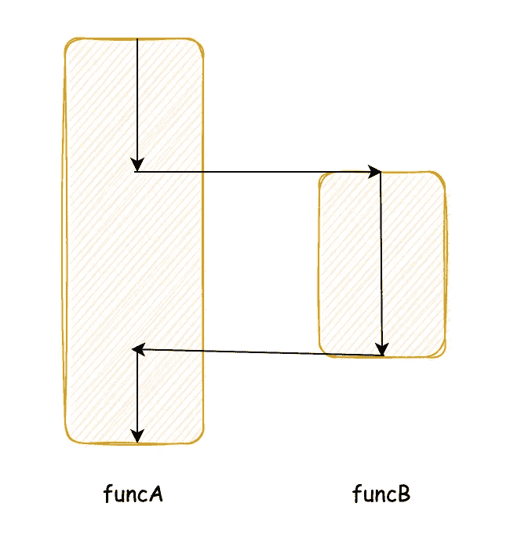
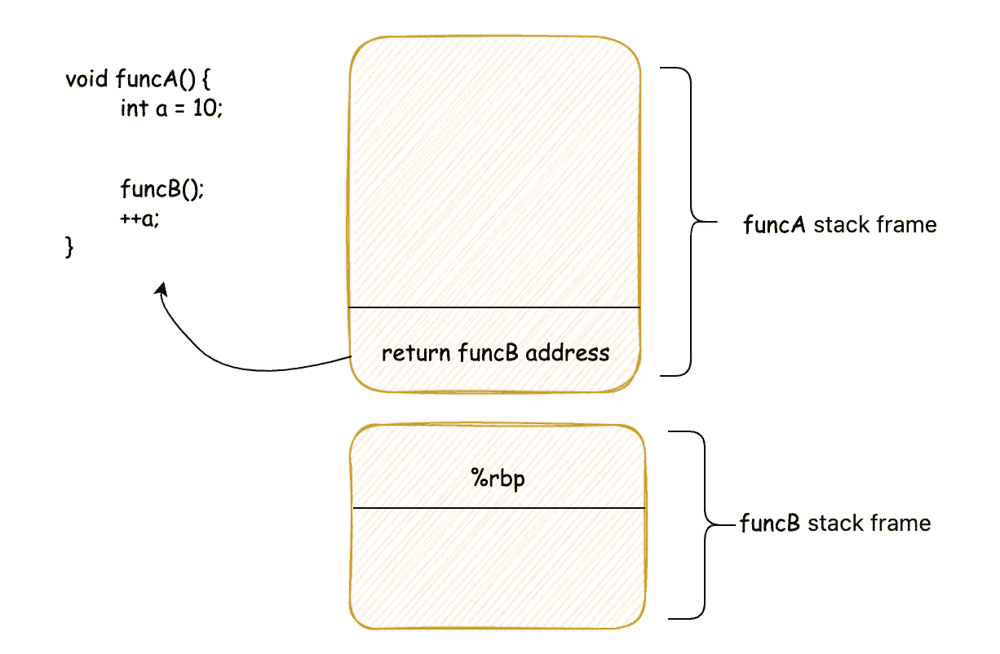
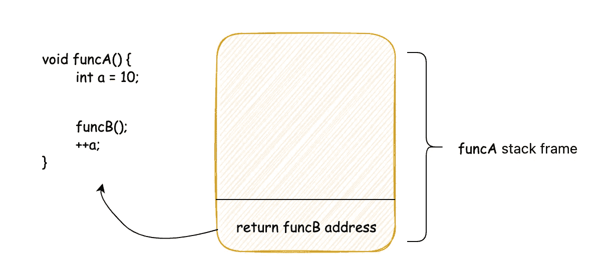
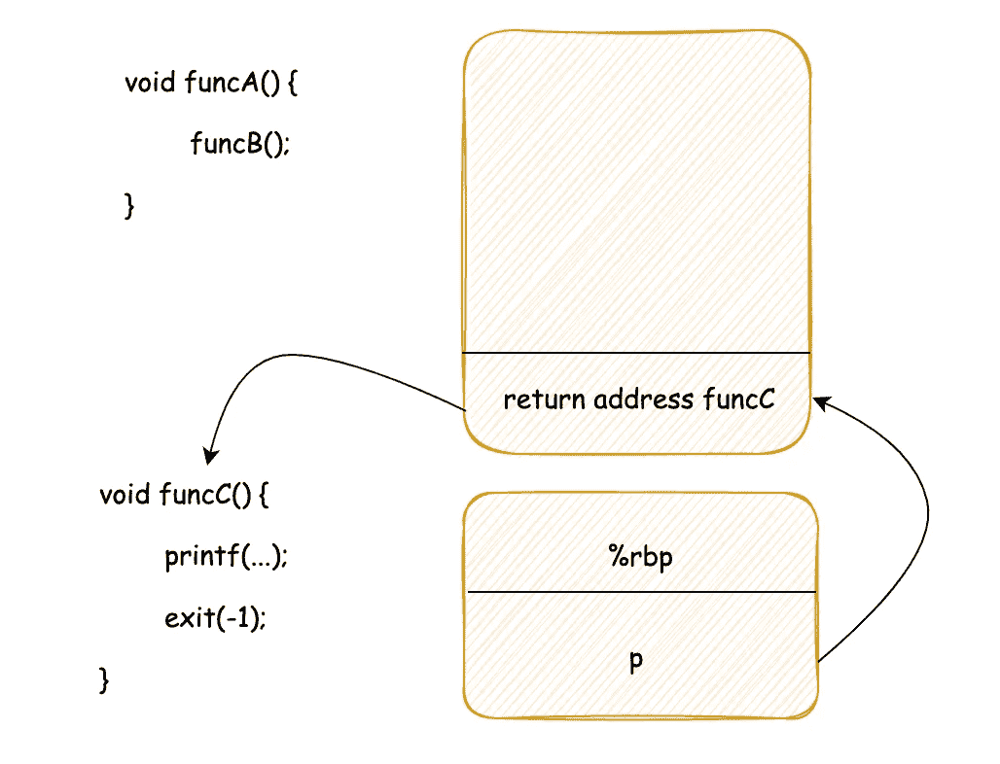

# 作为一个程序员，你应该知道进程切换的本质是什么。

> 原文：<https://levelup.gitconnected.com/as-a-programmer-you-should-know-what-the-essence-of-process-switching-is-cf1774b3a233>


照片由[布鲁克·卡吉尔](https://unsplash.com/@brookecagle?utm_source=medium&utm_medium=referral)在 [Unsplash](https://unsplash.com?utm_source=medium&utm_medium=referral) 上拍摄

我们都知道操作系统最重要的功能之一就是多任务能力，可以运行超过`CPUs`数量的程序。为了实现这个功能，它必须能够在多个进程之间分配有限的`CPU`资源。从程序员的角度来看，我们的程序一直在运行，但从`CPU’s`的角度来看，程序实际上是“走走停停”的。当程序开始和停止时，就涉及到切换的过程。那么流程切换的本质是什么呢？

本质上，函数调用和进程切换非常相似，人们可能会想，这怎么可能呢？别急，看完这个你就明白了。

# 函数调用

我们先来看看函数调用。函数调用是这样的。当`B function`被执行时`A function`调用`B function.`，它将跳回`A function`(此时`A function`和`B function`在同一进程中)

过程是这样的



`function B`执行完成后，控制权将转移到`A`。所谓控制权是指告诉 CPU 继续执行`function A`。

但是你有没有想过`function A`调用`function B`，当`function B`执行完毕的时候`function B`一定要跳回`function A`？不一定，既然`function B`可以把控制权转移给`A`，那么它也可以把控制权转移给`function C`。

听起来很神奇，不是吗？`A function`调用`B functio` n，当`B function`被执行时，可以跳转到`C function`，但是如何做到这一点呢？让我们来看一段神奇的代码。

一段神奇的代码

想想这段代码运行时的输出？

有的同学可能会说，主函数调用`funcA`，`funcA`函数调用`funcB`，`funcB`函数看起来就是一堆作业。执行完成后返回`funcA`，`funcA`返回主函数，所以执行后不会输出任何东西。

是这样的吗？我们编译运行一下吧(我用的是 GCC 5 . 2 . 0 版，64 位机，没有启用编译优化，不同编译器版本运行效果可能不一样)。

```
$ ./a.out
jump to funcC !!!
```

可能有人会惊讶，这怎么可能？

这一段没有调用`funcC`，但是为什么会运行`funcC`函数？

程序员常说“**代码**里没有秘密”，这句话不完全对，应该是“机器指令里没有秘密”，后来我想了想，这句话也不完全对，因为对于我们来说`CPU`如何执行机器指令是一个黑盒。我们只能从一般原理上讲出`CPU`是如何执行一条机器指令的，但这里真正的细节只有`intel/AMD`等处理器厂商知道。而有些魔鬼就在这些细节里。

# 魔鬼细节

现在，让我们回到本文的主题，首先看看生成的机器指令是什么样子的:

这些说明在说什么？

让我们首先看看普通的函数调用



当`function B`执行完毕时，此时的堆栈帧为



`function B`的最后一条机器指令通常是:`ret`。该指令的目的是将当前栈顶的内容弹出到`%rip`寄存器中。`CPU`将从内存中取出指令，并根据 rip 中的值执行。`ret`指令会将之前保存的返回地址放入 rip 寄存器，以便`CPU`可以继续执行`A function`中的后续代码，即`++a`行代码。

可能有人看到了，如果我们有办法修改`A stack`帧上的返回地址，不就可以实现“打到哪里”了吗？

`*(p+2) = (long)funcC`在代码中，这一行将原本指向 funcB 的返回地址修改为指向`funcC`



这样，当 funcB 函数完成后，会直接跳转到`funcC`函数，从而实现可控的执行流程切换。进程切换的本质与此相同，只是进程切换需要将`stack`(和地址空间)一起切换。切换过程的上下文也被保存。

可能有人看到了，上面的进程叫做缓冲区溢出攻击，要达到的目的和进程切换是一样的:实现控制权的转移，但缓冲区溢出攻击是非法的，不符合预期(符合黑客的预期，但不符合`OS`设计师制定的游戏规则)，而进程切换是合法的，是预期的(符合`OS`设计师的预期)。

而且有时候，黑客(真正意义上的)和`OS`设计师是一堆人。

好了，现在你应该对进程切换有了更直观的认识。

# 最后

**感谢阅读。**我期待着您的关注和阅读更多高质量的文章。


[omgzui](https://medium.com/@omgzui?source=post_page-----cf1774b3a233--------------------------------)

## 更好的编程

[View list](https://medium.com/@omgzui/list/better-programing-9b4c9bb174aa?source=post_page-----cf1774b3a233--------------------------------)108 stories

[omgzui](https://medium.com/@omgzui?source=post_page-----cf1774b3a233--------------------------------)

## 新闻

[View list](https://medium.com/@omgzui/list/news-67ec0a972660?source=post_page-----cf1774b3a233--------------------------------)23 stories

# 分级编码

感谢您成为我们社区的一员！在你离开之前:

*   👏为故事鼓掌，跟着作者走👉
*   📰查看[升级编码出版物](https://levelup.gitconnected.com/?utm_source=pub&utm_medium=post)中的更多内容
*   🔔关注我们:[Twitter](https://twitter.com/gitconnected)|[LinkedIn](https://www.linkedin.com/company/gitconnected)|[时事通讯](https://newsletter.levelup.dev)

🚀👉 [**加入升级人才集体，找到一份惊艳的工作**](https://jobs.levelup.dev/talent/welcome?referral=true)