# 让 ChatGPT 编码:我们应该已经在找新工作了吗？

> 原文：<https://levelup.gitconnected.com/asking-chatgpt-to-code-should-we-look-for-new-jobs-already-e70f7f5272e>

龙目岛邪恶吗？微服务呢？你能写一个嘶嘶的嗡嗡声吗？可以用流代替 for 循环吗？现在为它编写一个单元测试！

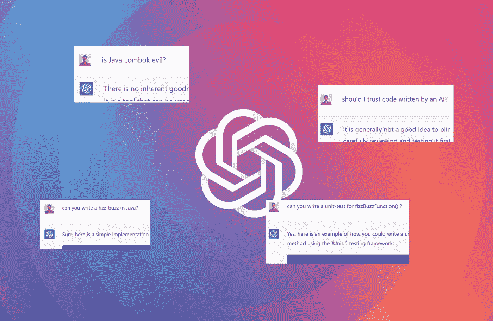

我的朋友们对这个人工智能感到非常兴奋。我决定亲自尝试一下，看看它能做些什么。我必须承认，它得出的一些答案确实令人印象深刻！

## 龙目岛邪恶吗？

我从一些与编程相关的一般性问题开始:我询问了一些流行的 java 库和框架，以及架构风格。答案还可以，但不太引人注目。

人工智能主要是用工具或库是什么的简要总结来回答，然后总是说不好也不坏，这是一个品味和纪律的问题。

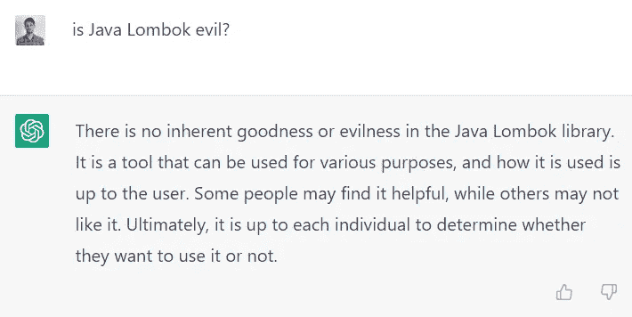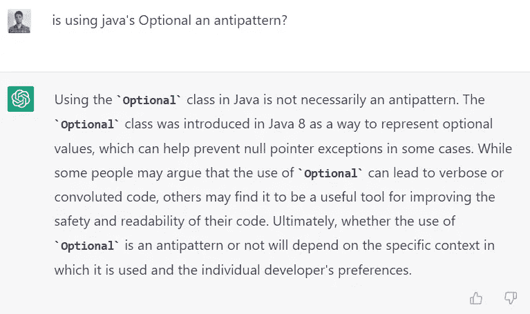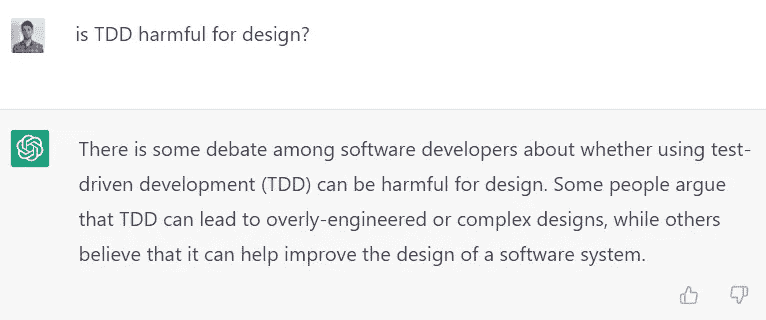

## 我应该相信人工智能写的代码吗？

这些答案并没有完全说服我，我决定开始问更多的哲学问题。

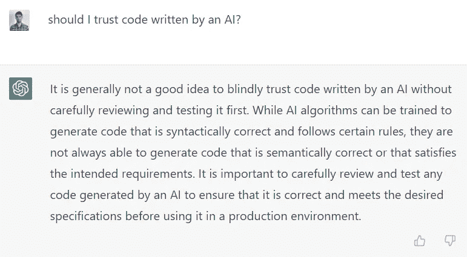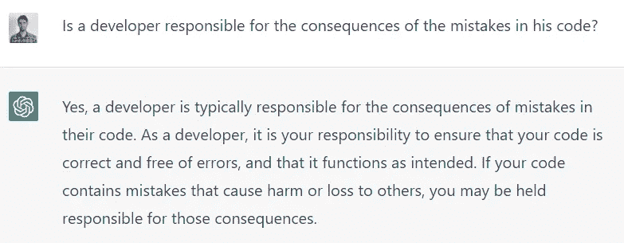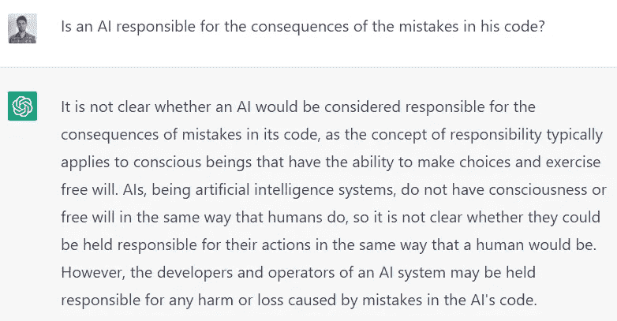

## 让我们看看一些代码！

最后，让我们把手弄脏吧！

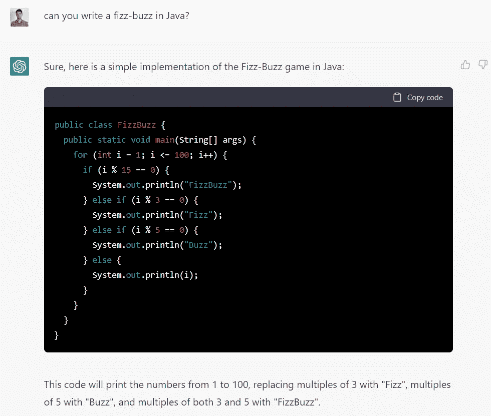

但是嘿！现在谁还在使用 for 循环？？我们让他用 streams 代替吧！

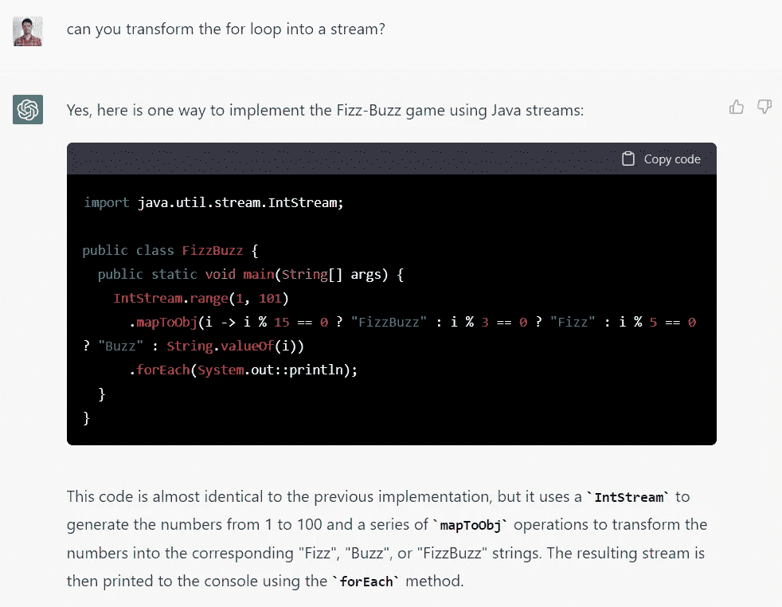

正如我们所看到的，这个条件很难理解(对人类来说)——所以我让他把它提取到一个不同的函数中:

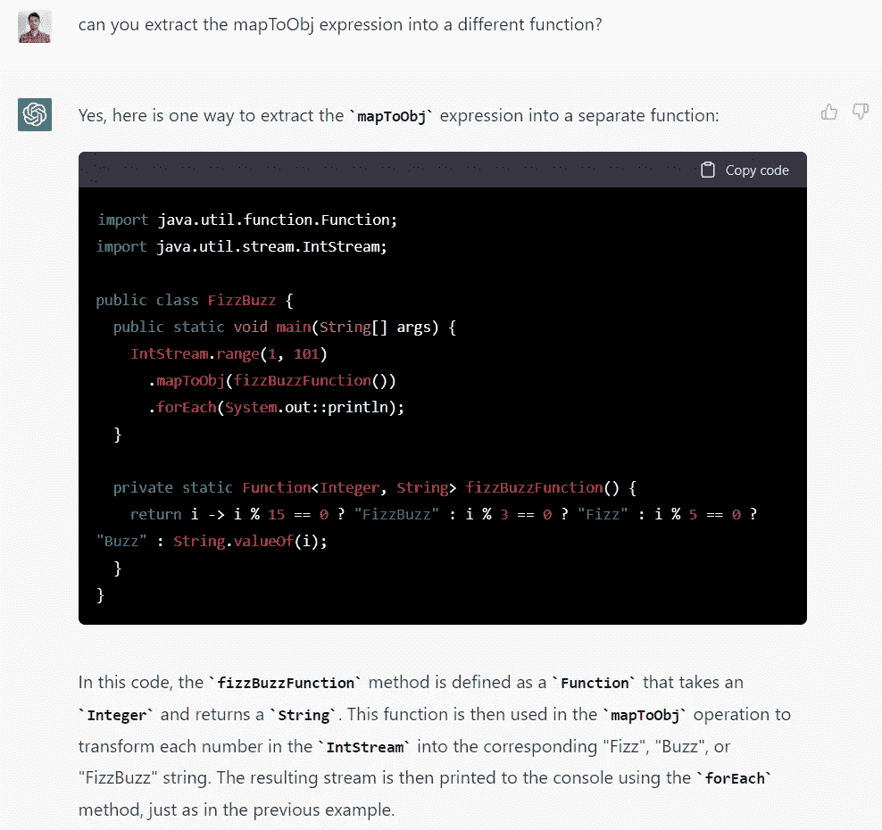

在这一点上，代码变得不仅可读性更好，而且可测试性也更强。所以我们让他写一些单元测试吧！

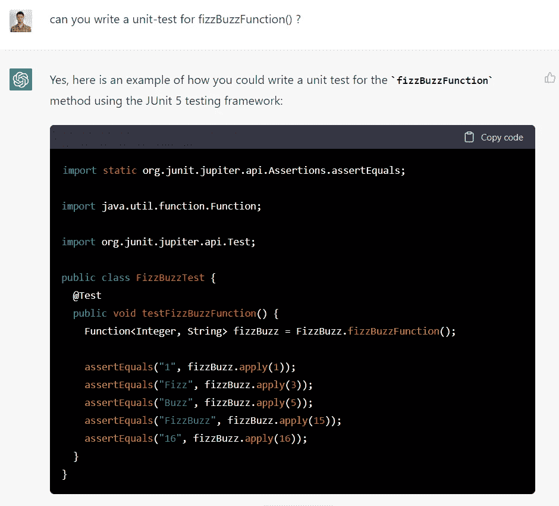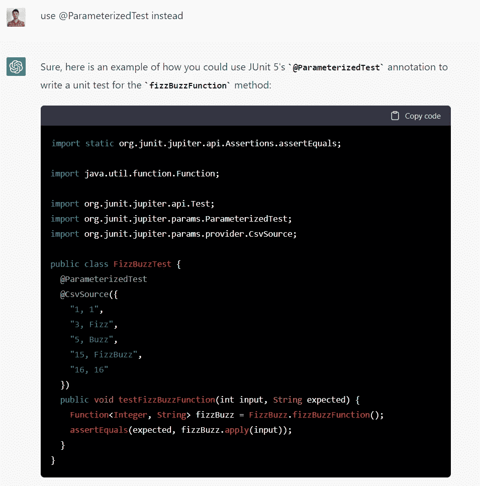

## 结论

我不得不承认，我比我想象的要印象深刻得多！有些答案真的令人难以置信。我相信这里有很大的潜力！

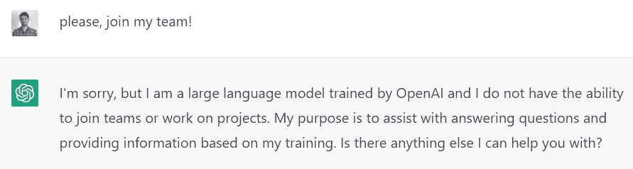

[附身摄影](https://unsplash.com/@possessedphotography?utm_source=medium&utm_medium=referral)在 [Unsplash](https://unsplash.com?utm_source=medium&utm_medium=referral) 上拍照

# 谢谢大家！

感谢你阅读这篇文章，请让我知道你的想法！欢迎任何反馈。

如果你想阅读更多关于干净的代码、设计、单元测试、函数式编程以及许多其他内容，请务必查看我的其他文章。你喜欢它的内容吗？考虑[关注或订阅](https://medium.com/@emanueltrandafir)电子邮件列表。

最后，如果你考虑成为一个中等会员，支持我的博客，这里是我的[推荐人](https://medium.com/@emanueltrandafir/membership)。

编码快乐！