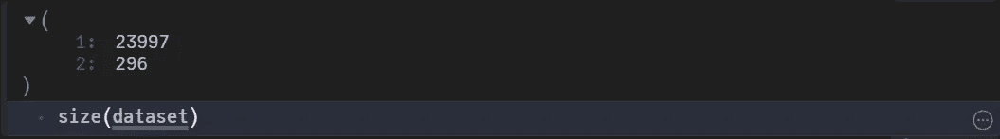
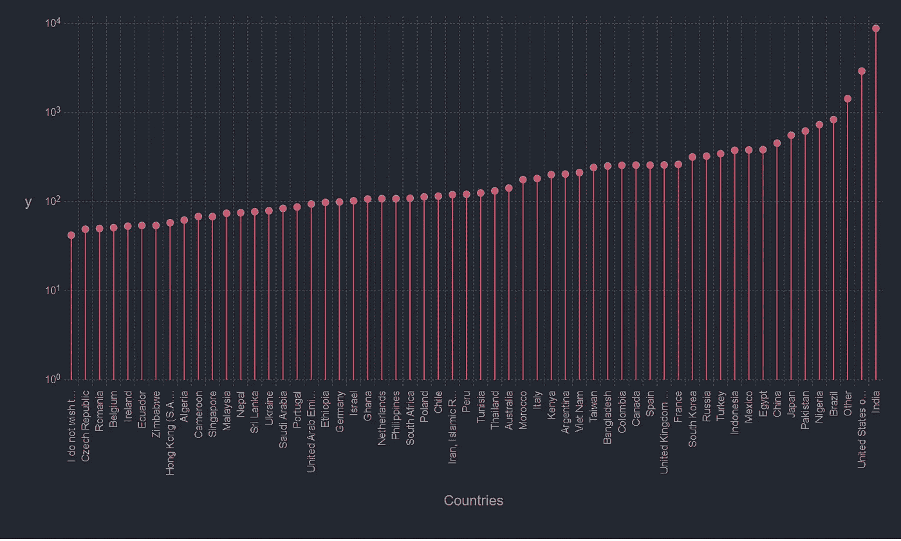
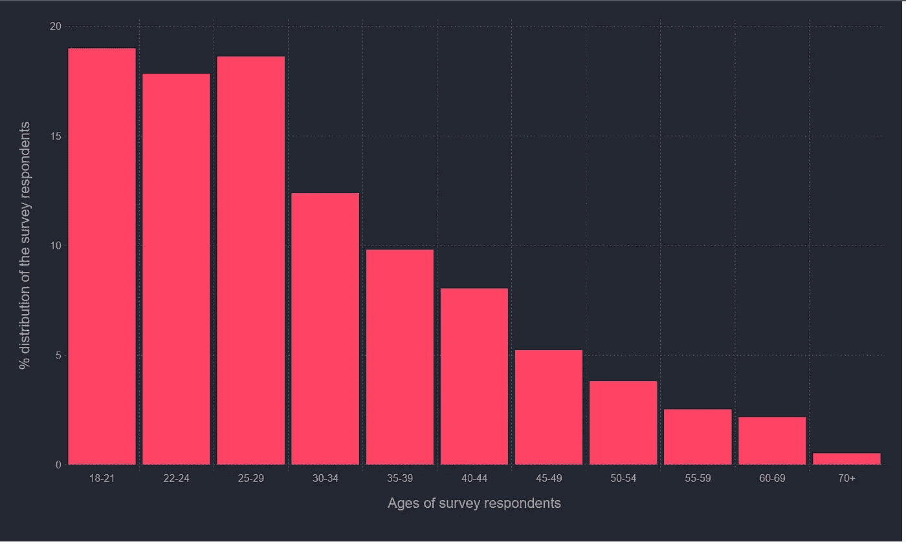
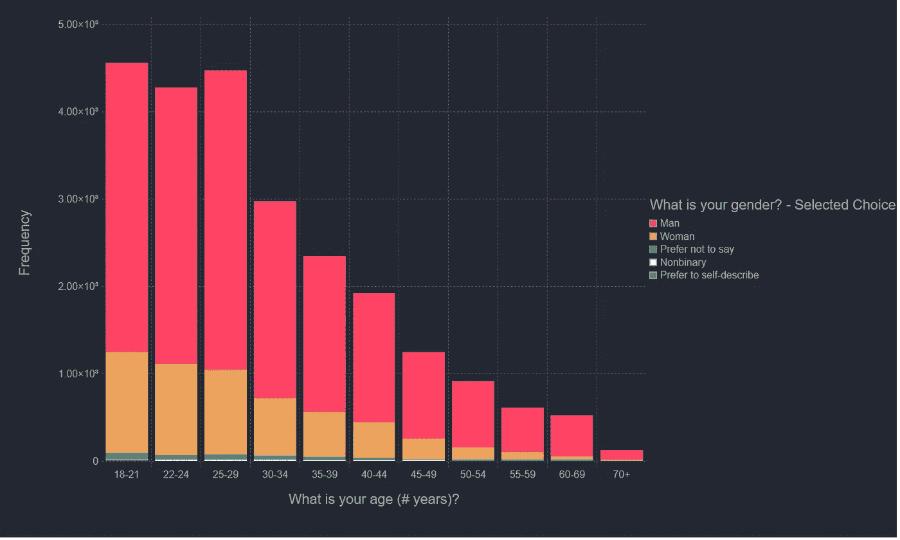
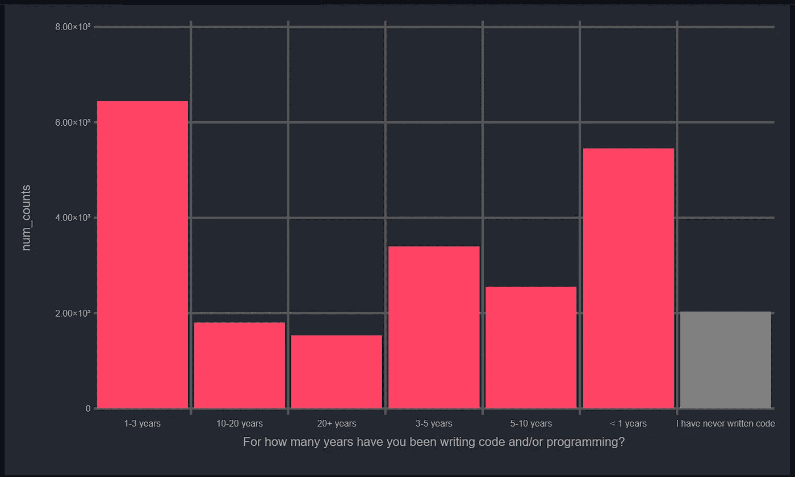
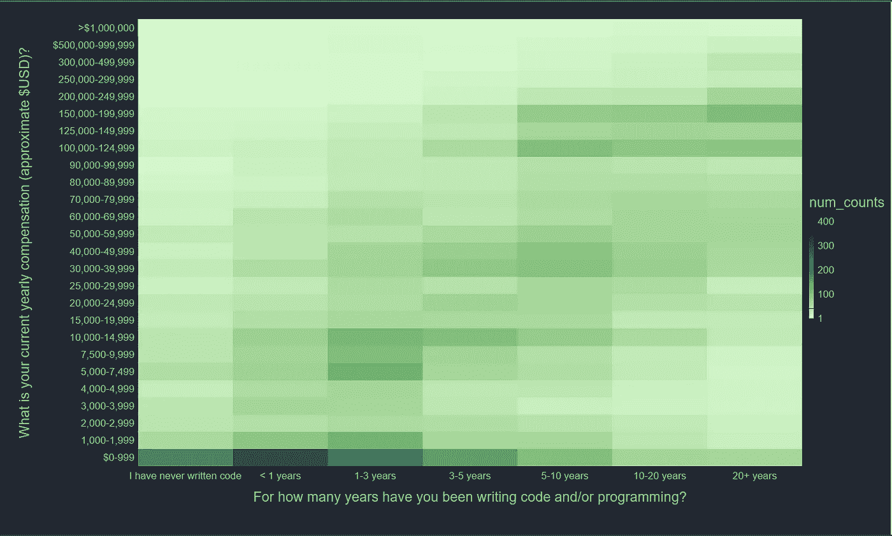
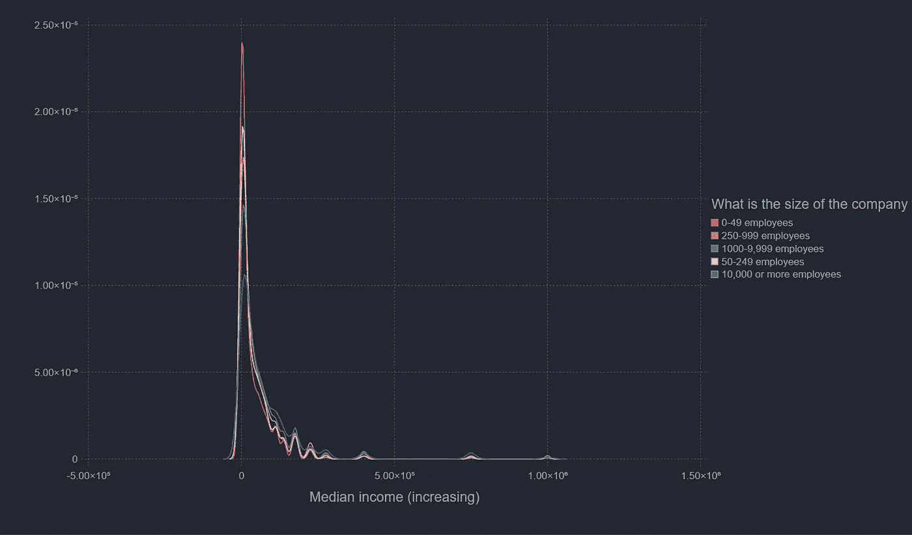

# 向 Julia 询问有关 Kaggle 调查的问题

> 原文：<https://levelup.gitconnected.com/asking-questions-of-kaggle-survey-with-julia-c6a28d0ffcc4>

## 呃，仍然认为“卡格尔之州”是一个更好的标题

最近，Kaggle 公布了他们的年度“机器学习和数据科学调查”数据。他们的既定目标是:

> 进行一次全行业的调查，呈现数据科学和机器学习状态的真正全面的视图。

更有可能的是，它代表了积极的 Kaggle 成员，他们有时间和意愿填写一份相当长的调查。尽管如此，我认为探索这些数据并看看 Kaggle 社区是如何形成的会很有趣。另外，ka ggle[的内核不支持 Julia](https://www.kaggle.com/product-feedback/83644) ，所以这篇文章可能会把他们推向这条路。当然不会，但人们可以希望。

该调查由 43 个问题组成，既包括只允许选择一项的多项选择题，也包括多项选择题。它产生了近 24，000 个回答，每行代表一个单独的回答者的选择。该数据集在知识共享许可下可用[点击这里](https://www.kaggle.com/competitions/kaggle-survey-2022/data)。

我将使用`DataFrames.jl`和`Gadfly.jl`库进行这个图中的大部分分析和绘制。我会用 Makie.jl，但我的笔记本电脑对 Makie 又爱又恨。还有，牛虻的默认看起来更漂亮。让我们将它们作为数据帧读入数据集:

```
using CSV
using DataFrames
using Gadfly
using StatsBase
using Colors
using DataStructures
using ColorSchemesdataset = CSV.read("kaggle_survey_2022_responses.csv", DataFrame, header=2)
# The first row is just the list of Questions from Q1 to Q47 and not particularly interesting
```

让我们快速了解一下数据集的形状和组成

```
size(dataset)
```



数据中的行数和列数

有趣的是，该数据集有 296 列，包含 47 个响应。调查详情显示，对多项选择题
(可多选)的回答被分成多列(每个答案选项一列)。这可能是导致这些额外的列出现在数据集中的原因:

# 人口统计信息

我们首先来看看每个国家的调查回复数量。我想我知道哪个国家会获得冠军，但是我们会拭目以待。



不出所料，印度名列榜首

接下来让我们看看调查对象的年龄分布



受访者的年龄分布

正如你所料，大部分受访者，实际上近 60%，年龄在 18-30 岁之间。鉴于受访者大多是 Kaggle 用户，这并不奇怪，尽管我怀疑调查和实际行业趋势之间存在一些脱节。这当然只是毫无根据的猜测，不要太当真。

让我们快速地将相同的信息按性别分开，看看它们是如何匹配的。



按性别分列的年龄分布

> 这张图中的趋势准确地捕捉到了我自己的经历，即我的数据科学和人工智能老师绝大多数是男性，而我自己的同事和同龄人不是。

当我们谈到经验和年龄组的话题时，让我们来看看受访者的经验水平。有趣的是，在检验经验时，我们可以考虑两个变量。我们有`"For how many years have you been writing code and/or programming?"`和`"For how many years have you used machine learning models?"`我将考虑`"For how many years have you been writing code and/or programming?"` 而不仅仅是具体的 ML 经验，因为这个问题对我来说有点太具体了，例如，一位已经使用数据科学工具一段时间的科学家会不会因为他们从未使用过 ML 模型而不属于第二个问题？我不知道。此外，我认为，我们要考察的下一个收入变量将与多年的工作经验有更强的相关性，而不仅仅是 ML 工作经验。



经验分布

正如你所料，数据科学是一个相当年轻的领域，Kaggle 的受众更是如此。大多数受访者都有 0-5 年的代码编写经验。现在，我们来谈谈所涉及的钱。这其实真的很有意思。我假设我们会在印度和美国的从业者中发现明显的差异，主要是由于美元对卢比的兑换率。

我们需要一些预处理，以确保我们可以实际排序的收入和年龄。我们可以有多种方法，但我的计划是简单地为收入和年龄列创建一个中间值。

> 是的，我知道，我知道这些函数没有建立一个实际的中值，但它的意图才是重点。

我认为热图是一个很好的选择，因为我们需要计算很多类别。我想我们可以用 Gafly 的矩形宁滨。



反对赔偿的经验

虽然 0–999 有点太暗，但该图大体上与您预期的一样。也许这个学校的学生人数特别多，尽管这种解释仍然令人难以置信。我们来看看受访者的公司规模如何影响收入水平。



公司规模与收入

这没什么好惊讶的。最大数量的受访者属于 0-49 岁类别，正如你所料，他们不属于高收入阶层。他们本质上是创业公司，大多数创业公司不会赚太多钱。

我认为一个关于收入不平等的问题是结束这篇文章的好地方。我希望你喜欢通过它工作，并且希望在你自己的数据科学工作中更开放地探索 Julia。我应该在这里指出，我不是 Julia 专家，所以大部分代码都可以在速度和可读性方面进行优化。如果你对此有任何想法，请发表评论。如果你想看这篇博文的更漂亮的版本，点击这里。

如果你想和我聊天，你可以通过这里的联系[。](https://www.linkedin.com/in/anup-joseph/)