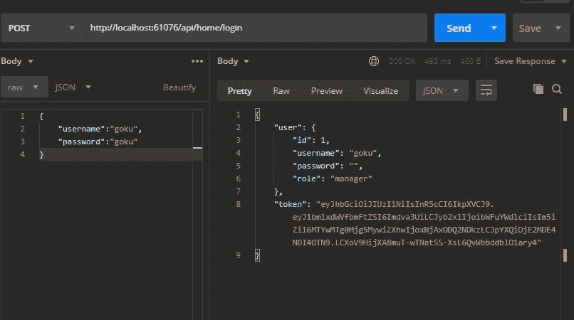
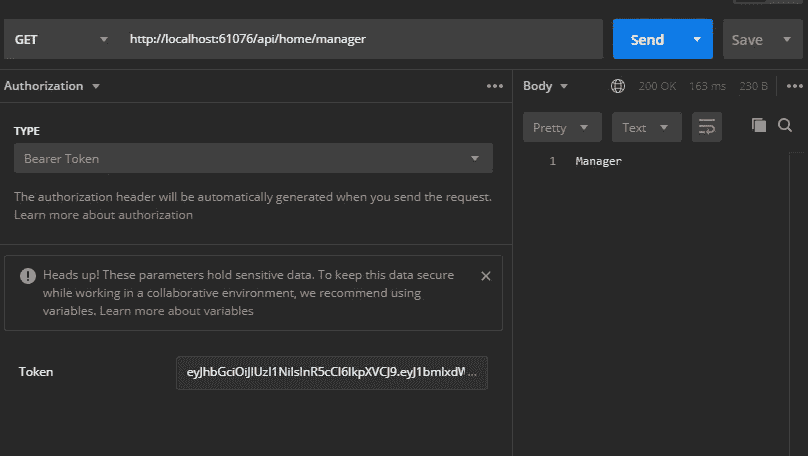

# ASP.NET 协议 5:无记名和 JWT 的授权和认证

> 原文：<https://levelup.gitconnected.com/asp-net-5-authorization-and-authentication-with-bearer-and-jwt-2d0cef85dc5d>

## 本文的目的是展示授权、无记名身份验证和 JWT (JSON Web Token)在。NET 5 应用程序。


克里斯·帕纳斯在 [Unsplash](https://unsplash.com?utm_source=medium&utm_medium=referral) 上的照片

[ASP.NET 核心 3 —授权和认证，使用不记名和 JWT](https://medium.com/the-innovation/asp-net-core-3-authorization-and-authentication-with-bearer-and-jwt-3041c47c8b1d)

在本文中，我将展示如何在 ASP.NET 5 中基于用户角色创建授权和认证模式。

本文不会显示数据库中的用户注册，为此，我将用“硬代码”进行模拟。我们不会与数据库进行交互。

# 要求

为了构建我们的应用程序，我们需要一些工具:

*   IDE: [Visual Studio 社区预览](https://visualstudio.microsoft.com/thank-you-downloading-visual-studio/?sku=community&ch=pre&rel=16)
*   [。净 5](https://dotnet.microsoft.com/download/dotnet/5.0)
*   [邮递员](https://www.postman.com/downloads/)

# 你准备好了吗？我们走吧！！

我们需要创建一个新项目 ASP.NET1️⃣核心网络应用程序

2️⃣我们需要添加下一个包:

```
**dotnet** **add** **package** Microsoft.AspNetCore.Authentication 
**dotnet** **add** **package** Microsoft.AspNetCore.Authentication.JwtBearer
```

要执行身份验证，我们需要用户名、密码和“配置文件角色”。就像我之前说过的，这篇文章并不涉及数据访问，我们将用户设置在一个“硬代码”存储库中。

3️⃣:我们将在根目录下创建一个名为 Models 的文件夹，并在其中放入包含以下代码的“User.cs”文件。

4️⃣:我们的下一个项目是存储库，为此，我们将在根目录下创建一个名为 Repositories 的文件夹，并在其中创建“UserRepository.cs”文件，代码如下

5️⃣最后，我们需要一个密钥，一个秘密，来生成令牌，这个密钥必须是一个只有服务器知道的字符串，它被称为私钥。对于这个场景，我们将使用以下代码在应用程序的根目录下创建一个名为“Settings.cs”的文件。

在生产场景中，我们应该把这个键放在设置中。

# 如何创建令牌？

“微软上了。Authentication.Jwt "包我们有用于生成令牌的类***JwtSecurityTokenHandler***，但是我们需要提供一些信息，即所谓的***SecurityTokenDescriptor、*** 在这里，我们有用户配置文件信息、过期时间以及其他信息。

在这个例子中，我们将创建一个服务来**生成** **令牌**，以便能够在任何我们想要的地方调用它，而不必复制我们的代码。

为此，我们将创建一个名为“Services”的文件夹，并在其中创建一个名为“TokenService.cs”的文件，代码如下:

这正是我们创建令牌所需要的。

# 添加身份验证和授权🔐

现在，我们需要通知我们的应用程序，我们希望使用身份验证、授权和令牌格式，在我们的例子中是 JWT。

为此，在 *ConfigureServices* 方法上的“Startup.cs”类中，我们需要通知 ASP.NET 我们正在使用身份验证，为此，我们使用了 **AddAuthentication** 功能，在这种情况下，我们通知谁是类型和挑战。仍然在 *ConfigureServices 中，*我们通知我们将使用 JwtBearer 及其配置，这是在 AddJwtBeater 方法中完成的。接下来，我们有“Startup.cs”类。

# 证明

为了举例说明身份验证，我们需要创建一个控制器，如下面的代码所示。

现在我们需要运行 API 并使用 Postman 执行一个 **Post** 请求，如下图所示。



使用邮递员的操作

结果，我们有了用户信息和 t **oken。**

**注意:**注意端口，在我这里是“61076”请检查你的。

# 批准

最后，让我们在控制器中添加一些方法，看看我们使用授权时的可能性，但在此之前，有一个简单的解释:

*   **AllowAnonymos** :允许匿名访问，无需任何认证；
*   **授权**:要访问，用户必须经过身份验证，但本例中“角色”不适用；
*   **Authorize(Roles="role1，role2，role3"):** 用户必须经过身份验证，并且需要拥有列表中的某个角色。

让我们看看“HomeController.cs”中的最终代码是什么样子，如下所示。

现在我们能够在这个控制器中测试新的端点，为此我们再次使用 postman，不要忘记我们需要通知令牌，如下所示。



# 结论

您可以看到使用不记名和 JWT 实现授权和认证是多么容易。净 5。

我在这个库上传了普通实现[的代码](https://github.com/MarcosdrVinicios/Net5.JWT.API)

# 其他文章

[](/asp-net-core-user-secrets-2964219f675b) [## ASP。网络核心-用户秘密

### 本文解释了在 ASP.NET 核心开发过程中存储和检索敏感数据的技术

levelup.gitconnected.com](/asp-net-core-user-secrets-2964219f675b) [](https://medium.com/the-innovation/cqrs-what-is-35a7a39aadf) [## CQRS——什么是？

### 如今，我们听到和读到关于 CQRS 的报道，尤其是在可扩展的架构模式中。

medium.com](https://medium.com/the-innovation/cqrs-what-is-35a7a39aadf)