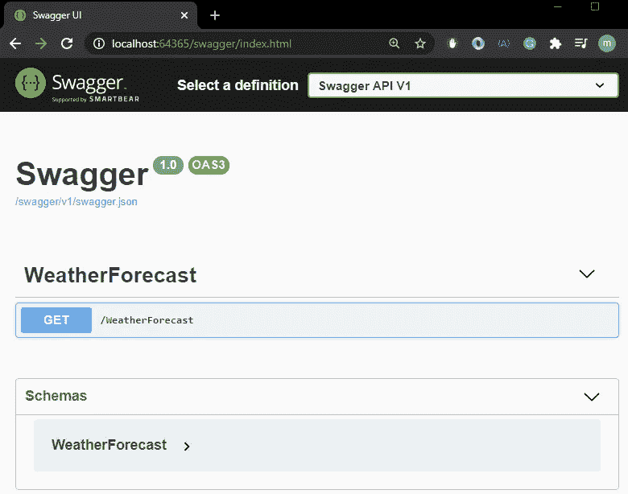

# ASP.Net 核心 3 -霸气

> 原文：<https://levelup.gitconnected.com/asp-net-core-3-swagger-5be00fc1fa1b>

## 本文解释了如何将 swagger 与 ASP.Net 核心一起使用。


由[维克多·塔拉舒克](https://unsplash.com/@viktortalashuk?utm_source=medium&utm_medium=referral)在 [Unsplash](https://unsplash.com?utm_source=medium&utm_medium=referral) 上拍摄的照片

# 什么是霸气？

来自*霸气站点的防御:*

*Swagger 是面向 OpenAPI 规范(OAS)的全球最大的 API 开发工具框架，支持从设计和文档到测试和部署的整个 API 生命周期的开发。*

# 要求

为了构建我们的应用程序，我们需要一些工具:

*   IDE: [Visual Studio 社区](https://visualstudio.microsoft.com/vs/community/)或 [Visual Studio 代码](https://code.visualstudio.com/download)
*   [。网芯 3.0](https://dotnet.microsoft.com/download/dotnet-core/3.0)

对于本文，我将使用 Visual Studio。

# 你准备好了吗？我们走吧！！

我们需要创建一个新项目 ASP.NET1️⃣核心网络应用程序

2️⃣我们需要在*软件包管理器控制台*上添加下一个软件包:

```
Install-Package Swashbuckle.AspNetCore
```

3️⃣Add 将大摇大摆的生成器添加到`Startup.ConfigureServices`方法中的服务集合中(第 22 行)；

4️⃣in`Startup.Configure`方法，启用中间件来服务生成的 JSON 文档和 Swagger UI(第 33 到 38 行):

5️⃣:现在我们需要运行 API，并转到链接[http://localhost:64365/swagger/index . html。](http://localhost:64365/swagger/index.html.)

**注意:**注意端口，在我这里是“64365”请检查你的。



Swagger UI

# 结论

你可以看到配置 ***霸气***in.Net 核心 3 是多么容易。

我在这个库上传了项目[的代码。](https://github.com/MarcosdrVinicios/Swagger.NetCore)

留下你对这篇文章的看法。

# 参考

[](https://docs.microsoft.com/en-us/aspnet/core/tutorials/getting-started-with-swashbuckle?view=aspnetcore-3.1&tabs=visual-studio) [## 开始使用 Swashbuckle 和 ASP.NET 核心

### 由 Shayne Boyer 和 Scott Addie 查看或下载示例代码(如何下载)有三个主要组件…

docs.microsoft.com](https://docs.microsoft.com/en-us/aspnet/core/tutorials/getting-started-with-swashbuckle?view=aspnetcore-3.1&tabs=visual-studio) 

# 其他文章

[](https://medium.com/the-innovation/asp-net-core-3-authorization-and-authentication-with-bearer-and-jwt-3041c47c8b1d) [## ASP。网络核心 3 -使用载体和 JWT 进行授权和认证

### 本文的目的是展示授权、无记名身份验证和 JWT (JSON Web Token)在

medium.com](https://medium.com/the-innovation/asp-net-core-3-authorization-and-authentication-with-bearer-and-jwt-3041c47c8b1d) [](https://medium.com/the-innovation/asp-net-core-user-secrets-2964219f675b) [## ASP。网络核心-用户秘密

### 本文解释了在 ASP.NET 核心开发过程中存储和检索敏感数据的技术

medium.com](https://medium.com/the-innovation/asp-net-core-user-secrets-2964219f675b)