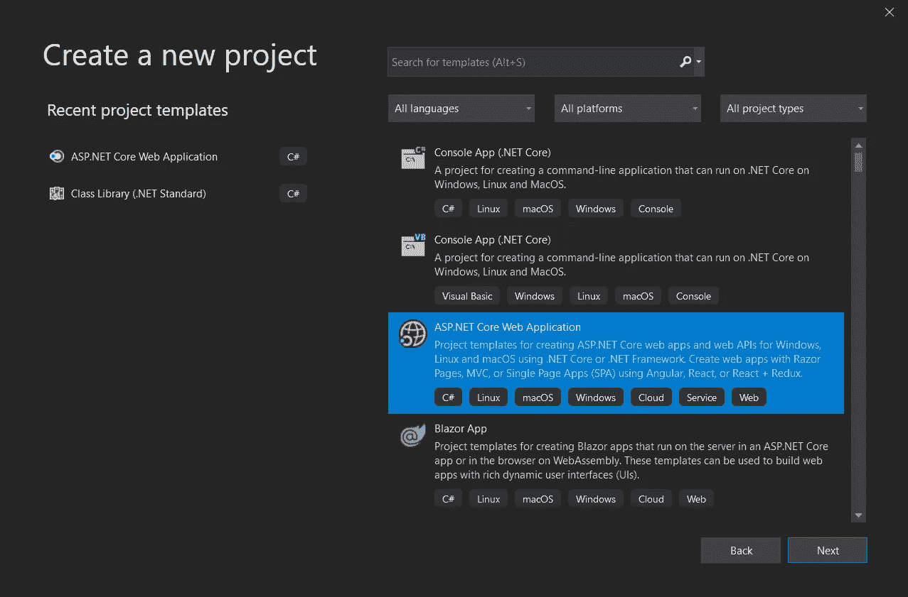
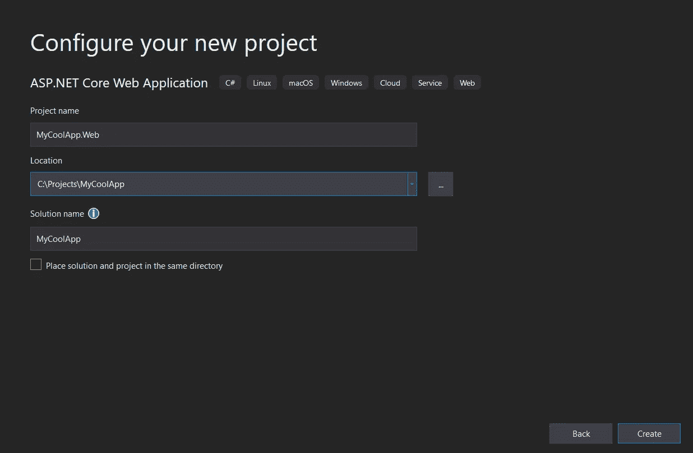
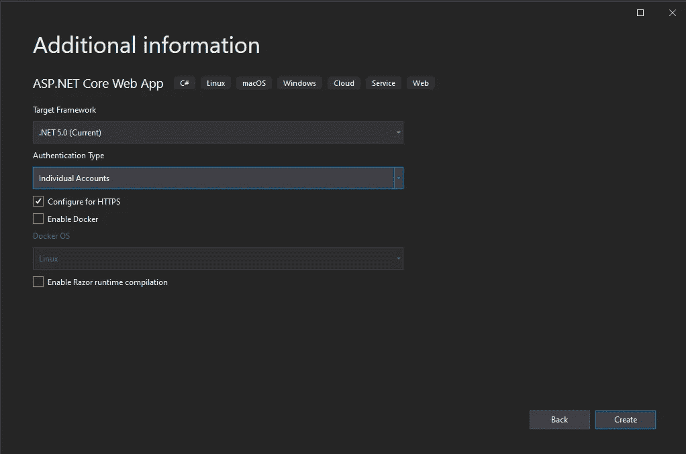
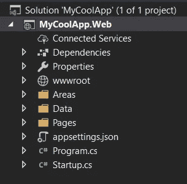

# ASP.NET 核心默认项目结构解释(第 1 部分)

> 原文：<https://levelup.gitconnected.com/asp-net-core-default-project-structure-explained-part-1-cfaffba94762>


# 介绍

当你开始学习一门编程语言时，你的第一个练习可能是写一个“Hello World”应用程序来弄清楚基本概念。如果您正在编写一个简单的控制台程序，只在屏幕上打印问候语，那么这个练习非常有用。

然而，一旦你开始学习使用一个新的框架来编写 web 应用，比如 ASP.NET 核心，这么简单的代码是不够的——部分原因是 web 应用更加复杂。还因为，一旦规模扩大，用于编写 web 应用程序的工具和框架就试图引入先进的技术和方法来构建和维护它们。

这对初学者来说似乎太难了。在这里，我们将把默认的 apart 核心解决方案模板一部分一部分地拆开，然后找出每一部分的用途以及它到底是如何工作的。

请注意，这不是一个关于在 ASP.NET 核心中创建 web 应用程序的所有方面的全面教程。相反，它是一个简短的指南，您可以在其中检查为什么将某个特定部分添加到您的项目中，或者找到一段代码和相关文档的链接来详细解释它。

作为一个例子，我使用了一个新的解决方案。净 5。然而，本文的大部分信息也与 ASP.NET 的核心项目相关。网芯 3.1 或即将推出。NET 6。

# 创建新的 Web 项目

让我们从使用 Visual Studio 中的“创建新项目”向导创建一个新的空 web 应用程序开始。

这一步应该是这样的:



当您按[下一步]时，精灵会要求您选择新方案和专案的名称，以及放置方案档案的资料夹:



> ***提示#1*** *:将项目和解决方案放在单独的文件夹中。只有对于非常小的应用程序，为两者选择相同的位置才是方便的。一旦您开始向解决方案添加其他层(域类、数据层、API 等)。)，将它们放在单独的项目中会更实用。*
> 
> ***提示#2*** *:使用应用程序的通用名称作为解决方案的名称(如“MyCoolApp”)，并添加“.”。项目名称的“Web”后缀(例如，“MyCoolApp。Web”)。*

最后，您需要选择一些额外的项目选项。



这里最重要的选项是:

*   **目标框架**。我建议选择最新的(暂时)，*。NET 5* ，但是本文中的所有信息都与*相关。网芯 3.1* 或*。NET 6* (现在处于预发布状态)项目也是如此。
*   **认证类型**。在本文中，我们假设该选项设置为*个人账户*。这个值意味着我们的新 web 项目将包含一些管理用户帐户的方法，并为基本的身份验证操作提供 UI:登录、注册、重置密码等。

一切就绪后，让我们单击“Create ”,获得我们的新解决方案。

# 项目结构

完成上述步骤后，您就有了一个包含一个项目的新解决方案。

该项目的结构将与下面的类似(甚至相同):



让我们仔细看看你的新项目的每个部分。

# 1.互联服务

这是项目结构中的第一个节点，也可能是最少使用的节点。它旨在自动化将项目连接到外部服务(如 Azure Storage 或 Application Insights)所需的多个步骤。您可以右键单击此节点并选择“添加连接的服务…”来运行向导，该向导将引导您完成整个过程。通常，它只是添加必要的软件包，并为您提供如何开始使用应用服务的基本说明。正如我已经提到的，在项目的生命周期中，您很有可能不会使用这个节点。

# 2.属国

项目结构的这个元素包含了您的项目所依赖的所有包或其他项目。

该节点中有四个主要文件夹:

*   分析器
    它们帮助你使你的代码更好:更干净，没有错误。每个分析器检查您的代码是否满足其中包含的一系列规则。如果代码的任何部分不适用于其中一个规则，您将在构建项目时看到警告或错误。

> *注意:请注意，分析器只在编译时工作，不会影响最终的应用程序。*

*   **框架** 这个文件夹包含了你的项目所依赖的框架列表。如果你[将你的 web 应用发布为一个依赖于运行时的](https://docs.microsoft.com/en-us/dotnet/core/deploying/)(相对于一个独立的应用)这个信息是很重要的。在这种情况下，这里列出的所有框架都必须安装在运行应用程序的服务器上。

> *注意:您可以使用* `*dotnet --info*` *控制台命令查看已安装框架的列表。*

*   **套餐**
    这是本节点中的主项。它列出了您添加(安装)到项目中的所有 NuGet 包。如果这些包中的任何一个依赖于其他包，它们将被自动安装并被列为根级包的子节点。您可以在此移除每个已安装的软件包(右键单击/移除)。
*   这是您当前项目所依赖的解决方案中其他项目的列表。您可以使用右键菜单中的“添加引用”命令来引用其他项目。显然，这个节点现在是空的，因为我们在解决方案中只有一个项目。

# 3.性能

此部分包含项目的不同属性，您可以通过在解决方案资源管理器中双击此节点来修改这些属性。那里的大多数属性都会影响项目的编译和调试时行为。

这个节点中唯一的项目是一个包含启动概要文件的*“launch settings . JSON”*文件。每个配置文件都定义了当您在 Visual Studio 中单击“运行”按钮时如何运行您的项目。

# 4.wwwroot

该文件夹包含 web 应用程序的所有静态文件:CSS 文件、JavaScript 文件、图像和图标。正如您可能从它的名字中发现的，这将是您的 web 应用程序的根文件夹。因此，如果您将“image1.png”文件放入“wwwroot/images/dir1”文件夹，就可以通过“/images/dir/image1.png”地址在浏览器中访问该文件。

# 5.区域

添加此文件夹是因为我们在创建项目时为“身份验证类型”选项选择了“个人帐户”值。

除了核心认证/授权包(称为[ASP.NET 核心身份](https://docs.microsoft.com/en-us/aspnet/core/security/authentication/identity))，默认模板还添加了“微软。AspNetCore.Identity.UI "包。这是一个 [Razor 类库](https://docs.microsoft.com/en-us/aspnet/core/blazor/class-libraries)，它包含了用于认证和用户管理的所有表单和部分视图:登录、注册、重置密码、用户配置文件以及许多其他内容。所有这些表单都将使用您的布局(在*“Pages/Shared/_ layout . cs html”*中定义)，因此将与您的网站设计相匹配。

但是，您可能仍然希望更改其中的一些形式(或者甚至是全部形式)。在这种情况下，您可以使用 [Scaffold 命令](https://docs.microsoft.com/en-us/aspnet/core/security/authentication/scaffold-identity)并将必要的文件添加到您的项目中。脚手架文件将被添加到*“区域/标识”*文件夹中。

# 6.数据

和前面的例子一样，这个文件夹出现在我们的新项目中，因为我们在开始时打开了“Authentication Type”选项。

默认情况下，所有与用户相关的信息(用户、他们的角色、声明等。)存储在用[实体框架核心](https://docs.microsoft.com/en-us/ef/core/) ORM(对象关系映射)框架访问的数据库中。如果你不熟悉 EF 核心，你可以在[微软文档](https://docs.microsoft.com/en-us/ef/core/get-started/)上找到很多教程。

“Data”文件夹包含名为“ApplicationDbContext”的数据库上下文类。此类是从“Microsoft”中定义的“IdentityDbContext”类派生的。AspNetCore . identity . entityframeworkcore”程序集，它包括存储用户相关信息所需的所有数据库集(表)。

您可以使用这个类或创建另一个 DbContext 类来添加您的模型。

此外，“数据”文件夹还包括“迁移”子文件夹，其中包含所有的[实体框架核心迁移](https://docs.microsoft.com/en-us/ef/core/managing-schemas/migrations/)。

# 7.页

该文件夹包含您的 web 应用程序的所有页面(表单)。ASP.NET 核心有两种默认的内容呈现方法:MVC(模型视图控制器)和 [Razor Pages](https://docs.microsoft.com/en-us/aspnet/core/razor-pages) (实际上，这是一种 MVC，其中每个控制器和相应的视图都存储在一起)。这两种方法都使用 [Razor 语法](https://docs.microsoft.com/en-us/aspnet/core/mvc/views/razor)，你可以把它想象成 HTML + C#。

每个 Razor 页面由一个*表示。cshtml"* 文件。与之相关的代码存储在一个名称相同、扩展名为“. cshtml.cs”的所谓“代码隐藏”文件中。

从一开始，“页面”文件夹就包含一些默认页面，如索引(web 应用程序的主页)、隐私和错误。另外，您可以在*“Pages/Shared”*文件夹中找到主布局文件( *_Layout.cshtml* )和一些局部视图。

**注意**:布局和局部视图的名称前加上`_`符号是一种常见的做法。

# 8.根文件夹文件

现在，当我们已经查看了使用默认的 ASP.NET 核心应用程序模板创建的所有主文件夹时，让我们更仔细地看看存储在项目的根文件夹中的文件。他们是这个项目最重要的部分。

## 程序. cs

这个文件用一个静态方法“Main”定义了“Program”类，它是 web 应用程序的入口点。

这个方法的唯一目的是定义[主机](https://docs.microsoft.com/en-us/aspnet/core/fundamentals/?view=aspnetcore-3.1#host)，然后将控制权传递给启动类。有关默认主机构建器的更多信息，请查看微软文档中一篇关于[通用主机](https://docs.microsoft.com/en-us/aspnet/core/fundamentals/host/generic-host)的文章。

## 应用程序.设置

这是一个存储应用程序设置的 JSON 文件。这些设置有一个层次结构，可以通过在启动类中定义的配置对象来访问，也可以在程序中注入`IConfiguration`服务的任何地方访问。例如:

```
var defaultLogLevel = Configuration.GetValue<string>("Logging:LogLevel:Default");
```

不同层级由冒号(`:`)符号分隔。

默认情况下，除了*“application . settings”*，ASP.NET 核心模板还包括一个“应用程序”。Development.settings”文件。此文件中定义的设置仅加载到开发环境中，在生产环境中不可用。了解更多信息”。设置"文件和配置 ASP.NET 核心项目中的一般内容，请阅读[这篇文章上的](https://docs.microsoft.com/en-us/aspnet/core/fundamentals/configuration/?view=aspnetcore-3.1)微软的 Docs。

## Startup.cs

这是 ASP.NET 核心项目结构的最后一部分。“Startup”类有三个主要用途:

*   它执行所有初始化任务(设置应用程序范围的常量、数据库播种、迁移等。).
*   它在[DI(依赖注入)容器]([https://docs . Microsoft . com/en-us/aspnet/core/fundamentals/dependency-injection](https://docs.microsoft.com/en-us/aspnet/core/fundamentals/dependency-injection))中注册了这个项目中使用的所有服务。
*   它定义了 web 应用程序的[中间件管道]([https://docs . Microsoft . com/en-us/aspnet/core/fundamentals/dependency-injection](https://docs.microsoft.com/en-us/aspnet/core/fundamentals/dependency-injection))。

这个类从一开始就包含了大量的代码(对于一个刚刚创建的项目而言),当您开始向应用程序添加新功能时，这个类会变得更大。

我们将在下一篇文章中更详细地了解它。

*最初发表于*[*【https://korzh.com/blog】*](https://korzh.com/blog/asp-net-core-project-structure-explained-part1)*。*