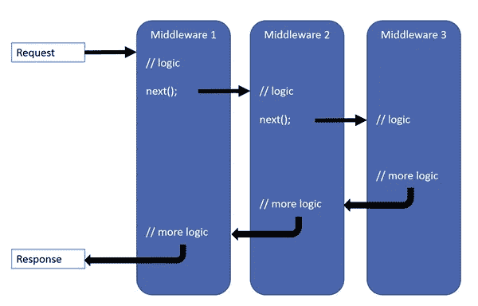

# ASP.NET 核心默认项目结构解释(第二部分)

> 原文：<https://levelup.gitconnected.com/asp-net-core-default-project-structure-explained-part-2-e68360b2a227>


# 启动类

正如我们在第一篇文章中提到的，启动类是应用程序中所有初始化代码的入口点。长话短说，初创公司定义了你的应用程序将做什么，以及它将如何工作。

默认情况下，ASP.NET 核心应用程序中的任何启动类都包括三个主要部分:

*   **构造函数**，在这里你可以定义一些内部变量，设置一些配置设置，或者执行应用程序范围的初始化。例如，我们建议用户在这里为我们的 EasyQuery 库设置他们的许可证密钥。
*   **配置服务**方法。这里，我们在 DI(依赖注入)容器中注册所有必要的服务，并为其中一些服务定义配置设置。如果你不知道什么是依赖注入，这里有一篇我们博客上的文章，用简单的语言解释了这个概念。
*   **配置**方法。这是为项目设置中间件管道的阶段。

当应用程序启动时，`ConfigureServices`和`Configure`方法都被自动调用。你只需要相应地定义服务和中间件。

现在，让我们更详细地看一下每一部分。

# 启动类构造函数

默认的 ASP.NET 核心项目模板在构造函数中仅包含以下一行代码:

```
public Startup(IConfiguration configuration) 
{ 
    Configuration = configuration; 
}
```

它只是将 DI 容器传递到这里的配置对象[保存在 class 属性中，所以我们可以在其他方法中使用它。在](https://docs.microsoft.com/en-us/aspnet/core/fundamentals/configuration/?view=aspnetcore-3.1)[第一篇文章](/asp-net-core-default-project-structure-explained-part-1-cfaffba94762)中，我们已经考虑了 ASP.NET 核心应用中使用的配置机制。

# ConfigureServices 方法

如前所述，`ConfigureServices`方法包含在 DI 容器中注册不同应用服务的函数调用。这些可以是认证/授权服务、MVC 或 Razor Pages 引擎、用于使用 DB 的类或任何其他可能的服务。

`ConfigureServices`方法的唯一参数具有代表一列`ServiceDescriptor`项的`IServiceCollection`类型。这些项目中的每一个都将某种类型(通常是一个接口)映射到这种类型的特定实现。

根据界面，我们只能使用常用的`IList`或`ICollection`功能，如`Add`、`AddRange`、`Remove`等方法。然而，正如您已经注意到的，`ConfigureServices`包含了诸如`services.AddDbContext`、`services.AddRazorPages`以及类似的调用。你可能会问，“怎么可能？”答案是**扩展方法**。我们项目中使用的每个子系统(如实体框架核心或 MVC 引擎)都为`IServiceCollection`接口定义了一个扩展方法(有时甚至是几个),以简化 DI 中的注册和子系统中可用服务的配置。

**NB** :请注意，您在`ConfigureServices`方法中注册的服务的顺序并不重要。这个方法只在应用程序启动时执行一次。

因此，让我们仔细看看默认的 ConfigureServices 的内容。

```
public void ConfigureServices(IServiceCollection services) 
{ 
    services.AddDbContext<ApplicationDbContext>(options =>     options.UseSqlServer( Configuration.GetConnectionString("DefaultConnection")));     services.AddDefaultIdentity<IdentityUser>(options => options.SignIn.RequireConfirmedAccount = true)
        .AddEntityFrameworkStores<ApplicationDbContext>(); 
    services.AddRazorPages(); 
}
```

所以，那里只有三个调用:`AddDbContext`、`AddDefaultIdentity`和`AddRazorPages`。让我们分别检查它们。

## AddDbContext

该方法由[实体框架核心](https://docs.microsoft.com/en-us/ef/core/)框架提供。它注册并配置我们的数据库上下文。参数中传递的`Action`委托允许我们定义这个 DbContext 的参数。例如，通过`UseSqlServer`调用，我们告诉 DbContext 使用带有特定连接字符串的特定类型的连接(`SqlConnection`)。连接字符串本身取自配置，因此可以在开发或生产环境中轻松更改。您可以在`appsettings.json`配置文件中找到默认的连接字符串，我们已经在[第一篇文章](/asp-net-core-default-project-structure-explained-part-1-cfaffba94762)中分析过了。

关于“构建器”模式的一些话。

您可能已经注意到传递 DbContext 设置的一种有趣方式。我们不发送带有选项的对象，而是使用带有 DbContextOptionsBuilder 类型的单参数选项的过程(Action)。

这是因为，为了正确地构造 DbContext 设置，实体框架核心使用了**构建器模式**。当您需要执行几个步骤来构造一些复杂的对象，而仅仅定义一个类或结构是不够的时候，这种模式非常有用。例如，当您需要根据配置中的设置调用一些方法时。就像我们遇到的`UseSqlServer()`一样。

我们使用委托(函数)而不是普通对象还有一个原因。可能有一种情况，你根本不需要那个服务(DbContext)。例如，您的 web 应用程序有一些不需要数据库访问的操作。永远不会为这样的请求创建 DbContext 对象，因此，我们不需要设置它的选项。委托的好处在于，当您需要构造必要的对象时，可以准确地调用它。

我非常关注这个模式，因为它经常被使用，尤其是在 DI 中注册服务的过程中(我们也将在下一个函数调用中使用它)。

## AddDefaultIdentity

这里添加了`ConfigureServices`中的第二个函数调用，因为我们在创建项目时打开了认证选项。它注册了一堆用于认证和授权任务的服务，比如`IUserStore`、`IRoleStore`、`IPasswordHasher`、`UserManager`、`SignInManager`等等。它们都是 ASP.NET 核心身份子系统的一部分。

这个方法也使用构建器模式，但是方式略有不同。该函数返回 IdentityBuilder 对象，而不是在委托的参数中传递 builder，因此您可以通过简单的链接调用其他函数。

那里唯一调用的函数是`AddEntityFrameworkStores`。它告诉 ASP.NET 身份在哪里存储授权任务所需的所有实体(用户、角色、声明等)。).顾名思义，我们将使用我们的实体框架服务来完成这些任务。该方法中的参数类型(在`< .. >`之间)定义了用于存储所有 auth 对象的`DbContext`类。

# 添加 RazorPages

`ConfigureServices`中的最后一个函数调用添加了 Razor Pages 引擎所需的服务。它出现在这里是因为我们一开始选择的模板。如果我们当时选择了一个模型-视图-控制器方法的模板，我们在这里就会有类似于`services.AddMvc()`的东西。

# 配置方法

Startup 类中的最后一个方法定义了 ASP.NET 核心程序的中间件管道。
如果您不知道什么是中间件管道，您可能想了解更多，因为它决定了您的 web 应用程序如何处理 HTTP 请求。



与在`ConfigureServices`中注册的服务不同(记住，它们的顺序并不重要)，在`Configure`中定义的中间件的顺序具有至关重要的意义。从上图可以看出，每个请求都会调用第一个定义的中间件，而管道中的下一个中间件只处理那些没有被之前定义的中间件处理的请求。

因此，在管道的开始，我们需要放置辅助任务(如日志或身份验证)所必需的中间件，这些中间件不会消耗大量内存和处理时间。

让我们来看看这个方法对于所选项目模板的默认实现:

```
public void Configure(IApplicationBuilder app, IWebHostEnvironment env)
{
    if (env.IsDevelopment()) {
        app.UseDeveloperExceptionPage();
        app.UseDatabaseErrorPage();
    }
    else {
        app.UseExceptionHandler("/Error");
        app.UseHsts();
    } app.UseHttpsRedirection();
    app.UseStaticFiles(); app.UseRouting(); app.UseAuthentication();
    app.UseAuthorization(); app.UseEndpoints(endpoints => {
        endpoints.MapRazorPages();
    });
}
```

所以，让我们一个一个的过一遍这里定义的中间件。

## 异常处理和安全传输

第一行为开发和生产模式定义了不同的中间件。如果我们处于开发模式，我们定义中间件来捕捉管道中的所有异常，并显示一个特殊页面，其中包含关于错误的额外信息(异常消息、堆栈跟踪等)。).

这样做是可能的，因为(正如您从上图中看到的)请求的处理在被发送回客户端之前被返回到管道中的第一个中间件。

在生产模式中，我们还捕获所有异常，然后用指定的路径(在我们的例子中是/Error)重新执行请求。

仅在生产中执行的第二个调用是`UseHsts`。它增加了一个实现 HTTP 严格传输安全协议的中间件。

下一个正在酝酿中的是 HTTPS 重定向中间件(`app.UseHttpsRedirection`)。这个名字不言自明。它只是将所有 HTTP 请求重定向到 HTTPS 请求。添加这两个中间件(`app.UseHsts`和`app.UseHttpsRedirection`调用)是因为我们在项目创建期间打开了**为 HTTPS 配置**选项(实际上，它是默认打开的)。

## 处理静态文件(使用静态文件)

下一个中间件(由`app.UseStaticFiles()`调用添加)负责所有静态文件。简而言之，如果应用程序收到一些。js，。css 或图像文件(。png，。jpg 等。)，这个中间件在`wwwroot`文件夹中查找具有所请求名称的文件，并返回它作为响应(如果找到了该文件)。如果没有，它会发回一个带有 404 状态代码(“未找到”)的响应。

有`UseStaticFiles`函数的重载，允许我们为静态文件定义另一个根文件夹，并设置一些其他选项。

## 路由(用户路由和用户端点)

下一对中间件可能是管道中最重要的，因为它们定义了 web 应用程序中所有其他端点的路由。

简而言之，它们将特定的请求匹配到特定的端点，即处理请求的一段可执行代码。

那么，它到底是如何工作的呢？

在`Configure`方法中，我们调用`app.UseRouting()`将`EndpointRoutingMiddleware`添加到我们的管道中。

之后，我们调用`app.UseEndpoints()`将`EndpointMiddleware`添加到管道中并定义端点。每个端点都是一个对象，包含(如上所述)一个实际处理请求的委托(也就是一段代码)，以及一些元数据(比如授权策略)。

我们可以使用诸如`MapGet`、`MapPost`等扩展方法来添加与特定请求路径或路径模板匹配的端点。例如，以下模式`/something/{path*}`，将与所有以`/something/`开始的请求相匹配。

此外，其他服务可以定义自己的扩展功能，用于创建必要的端点。例如，您可以将`MapRazorPages`功能用于 Razor 页面，或将`MapHub`功能用于 SingleR 页面。在我们的 [EasyData 库](https://github.com/KorzhCom/EasyData)中，我们定义了`MapEasyData`函数，它为处理所有 CRUD 操作的 API 添加了一个端点。

当我们的 web 应用程序收到一个新的请求时(它没有被任何在`UseRouting`之前定义的中间件处理过)，`EndpointRoutingMiddleware`将它匹配到某个端点。因此，在应用程序启动时定义的所有端点中，有一个端点在那一刻被选中。

然后`EndpointMiddleware`实际调用端点的委托来处理请求。在`app.UseRouting()`之后但在`app.UseEnpoints()`之前添加的其他中间件可以“看到”哪个端点被选择，并且可以在`EndpointMiddleware`分派到所选择的端点之前改变某些东西(例如，应用授权策略)。

## 认证/授权(使用认证，使用授权)

这两个中间件被添加到`Configure`中，因为我们在创建项目时打开了身份验证选项。如上所述，他们已经知道选择了哪个端点，因此可以向请求的上下文添加一些额外的与身份相关的信息(如填充其`User`属性),或者如果没有附加身份验证信息，但所选端点需要授权，则将请求重定向到“登录/注册”页面。

# 包扎

因此，在本文中，我试图涵盖最常用的 ASP.NET 核心应用程序模板的所有部分，并弄清楚为什么使用它们以及它们是如何工作的(从一个非常一般的角度)。

我希望这些信息能够帮助您更好地理解 ASP.NET 核心框架的内部机制，并使您的代码更加清晰高效。

感谢你的阅读，保重！

*最初发表于*[T5【https://korzh.com】](https://korzh.com/blog/asp-net-core-project-structure-explained-part2)*。*