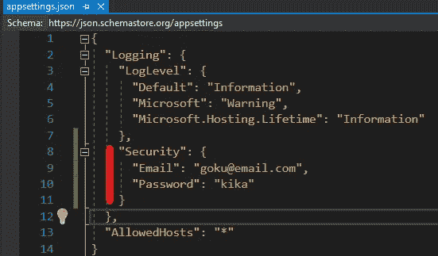
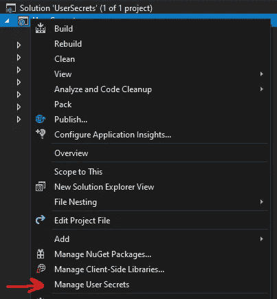
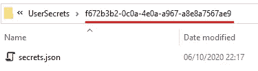
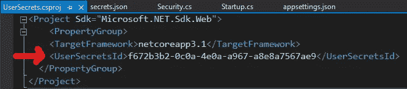
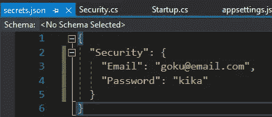
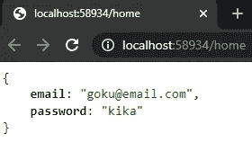

# ASP.NET 核心 3 -用户秘密

> 原文：<https://levelup.gitconnected.com/asp-net-core-user-secrets-2964219f675b>

## 本文解释了在开发机器上开发 ASP.NET 核心应用程序期间存储和检索敏感数据的技术

照片由[戴恩·托普金](https://unsplash.com/@dtopkin1?utm_source=unsplash&utm_medium=referral&utm_content=creditCopyText)在 [Unsplash](https://unsplash.com/s/photos/security?utm_source=unsplash&utm_medium=referral&utm_content=creditCopyText) 上拍摄

# 为什么要使用用户机密？

通常，设置放在“appsettings.json”文件中，但有些设置我们不想在该文件中共享，比如密码。

因此，当我们使用用户密码时，这些设置只存在于我们的机器上。

# 让我们看看如何配置

让我们想象一下，在“appsettings.json”文件中有我们的电子邮件和密码，我们想把它放在**用户机密中。**

appsettings.json 文件中的数据

1️⃣要添加用户密码，我们需要右键单击该项目并选择“管理用户密码”。

添加用户机密

此操作会创建一个名为“secrets.json”的文件。

**注意**:当我们创建文件“secrets.json”时，这是在解决方案的之外创建的**，散列被添加到。 **csproj** ，如下图所示。**

创建 secrets.json 的文件夹

哈希自动添加到。csproj

2️⃣进入“secrets.json”文件，我们复制我们想要的设置。

Secrets.json 文件

3️⃣现在我们需要创建一个如下所示的类“Security.cs”。

4️⃣在“Startup.cs”中我们需要添加第 23 行，以读取“安全”部分的配置。

5️⃣为了查看代码的工作情况，我们将创建一个如下所示的“HomeController.cs”。

*为了确保它正常工作，我们将删除“appsettings.json”文件中的“security”部分。*

6️⃣运行应用程序来查看结果

带有用户秘密数据的请求的结果

# 结论

您可以看到使用配置用户密码是多么容易。网芯 3。

我上传了这个库中项目[的代码。](https://github.com/MarcosdrVinicios/NetCore3.UserSecrets)

请留下您对这篇文章的看法。

# 参考

 [## 在 ASP.NET 核心区安全存储开发中的应用程序机密

### 由里克安德森，柯克拉金，丹尼尔罗斯，斯科特阿迪查看或下载样本代码(如何下载)这…

docs.microsoft.com](https://docs.microsoft.com/en-us/aspnet/core/security/app-secrets?view=aspnetcore-2.2&tabs=windows) 

# 其他文章

 [## ASP。网络核心 3 -使用载体和 JWT 进行授权和认证

### 本文的目的是展示授权、无记名身份验证和 JWT (JSON Web Token)在

medium.com](https://medium.com/the-innovation/asp-net-core-3-authorization-and-authentication-with-bearer-and-jwt-3041c47c8b1d)  [## CQRS——什么是？

### 如今，我们听到和读到关于 CQRS 的报道，尤其是在可扩展的架构模式中。

medium.com](https://medium.com/the-innovation/cqrs-what-is-35a7a39aadf)