# 资产风险管理战略——最大提取

> 原文：<https://levelup.gitconnected.com/asset-risk-management-strategy-maximum-drawdowns-9ce70c170946>


迈克尔·朗米尔在 [Unsplash](https://unsplash.com?utm_source=medium&utm_medium=referral) 上的照片

## 投资

## 用 Python 实现股票市场风险分析策略

资产和投资组合管理的一个关键因素是准确评估投资的风险。研究人员和对冲基金经理为此提出了多种方法，在本文中，我将讨论其中一种方法，并教你如何用 Python 实现它。

# 介绍

大多数风险管理技术处理偏离，这意味着如果股票的回报在任何一个方向上离股票太远，它就会被贴上风险标签。虽然这种方法在一定程度上是有道理的，但有人会说，正背离并不是一件坏事，只有负背离才会损害我们的投资，你可能是对的。因此，我将要讨论的策略是，试图只根据负偏差来估计风险，并认为正偏差是一件好事。这一策略被称为**最大削减。**

## 定义

最大提款(MDD)可以定义为在达到新的峰值之前，从投资组合的峰值到谷值的最大观察损失。最大提款权是一个特定时期内下行风险的指标。更简单的说，就是计算一只股票的峰值和随后的最低值之差，并计算差值。它表明，如果一个人在股票的最高点买入，在随后的最低点卖出，导致该证券最大可能的损失，他将会损失多少钱。

## 公式

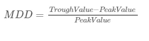

计算提款的公式

首选较低的最大提款，因为这表明投资损失较小。如果一项投资从未损失一分钱，那么最大提取金额将为零。最坏的可能是 100%，这意味着投资完全没有价值。[1]

# 代码实现

让我们来看看 python 的实现。你可以通过查看[我的笔记本](https://www.kaggle.com/prakharrathi25/maximum-drawdown-strategy)来跟进，在那里我对这个策略做了更详细的分析。在这个练习中，我使用的是法国 Fama 数据集，它有一个 CSV 文件，记录了从 1926 年到 2018 年的月度股票回报。相当令人印象深刻！你可以在这里找到数据[。](https://www.kaggle.com/kaiyrbekkabdol/python)

## 数据预处理

首先导入必要的库并读取数据。

```
# Data Analysis
import numpy as np 
import pandas as pd# Data Visualisation 
import matplotlib.pyplot as plt 
import seaborn as snsmonthly_data = pd.read_csv('Portfolios_Formed_on_ME_monthly_EW.csv',
                           header=0, index_col=0, parse_dates=True,                             na_values=-99.99)print(monthly_data.shape)
monthly_data.head()
```

数据帧的形状是(1110，19)并且头部看起来像

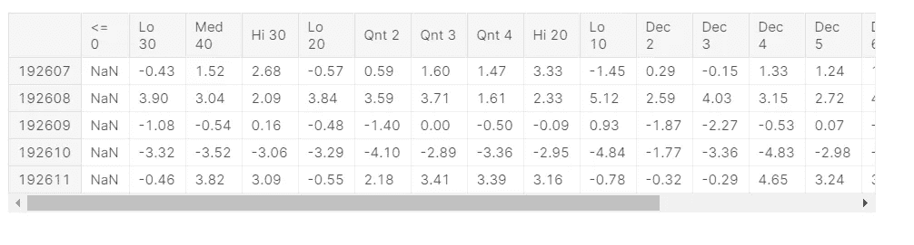

数据预览

对于这个分析，我想比较小盘股和大盘股公司，因此，我们将看到**低 10** 和**高 10** ，它们包含了最低 10%和最高 10%公司的回报。

```
*# Extract the data*
returns = monthly_data[['Lo 10', 'Hi 10']]
returns.columns = ['SmallCap', 'LargeCap']
returns.head()
```

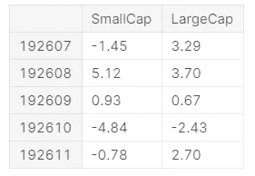

小型股和大型股收益

我们希望处理百分比回报，使其独立于投资额。

```
*# Convert Returns to percentages* 
returns = returns/100
returns
```

我们可以使用内置的 pandas 函数来快速绘制。

```
*# Make a line plot of the returns*
returns.plot.line()
```

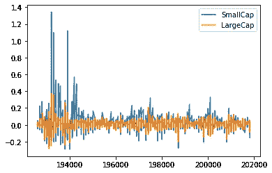

绘制整个数据的两个指数的回报

查看该指数，可以清楚地看到，该指数是由年和月连接在一起的，将该指数转换成这种格式以执行有趣的时间序列分析是很重要的。以下代码将索引转换为日期时间格式。

修复数据索引的代码

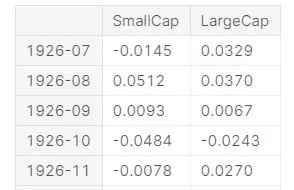

数据的固定索引

新的绘图对于日期时间索引也更有意义。

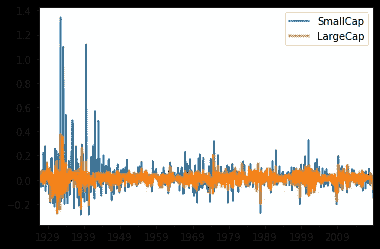

由于索引是时间序列格式，我们可以很容易地使用日期进行大量的数据操作。我们也可以快速提取截面。

```
*# Get the data in the year 1960* 
returns['1960']
```

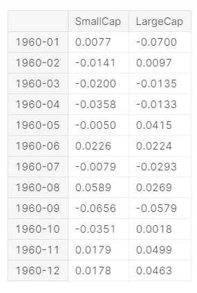

1960 年的数据摘录

## 计算提款

这个过程包括三个步骤。

1.  计算财富指数
2.  计算以前的峰值
3.  计算提款

**第一步:计算财富指数**

财富指数基本上是从 1926 年到 2018 年所有月收益的累积产物。它计算我们的投资如何在每个月的回报上复合。假设我们从 1000 美元开始。我先从**大盘股**说起。

```
*# Compute the wealth index by starting with 1000 dollars*
*# The starting value won't matter with drawdowns*

wealth_index = **1000 * (1+returns['LargeCap']).cumprod()**
print(wealth_index.head())
```

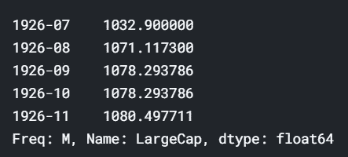

财富指数值

由于提款将以百分比回报计算，所以初始投资并不重要。很明显，除了 0，你可以保留它。

此外，我们可以画出这个图来形象化我们的回报会是什么样子。你会发现累积效应很明显。

```
*# Plot the wealth index over time* 
wealth_index.plot.line()
```

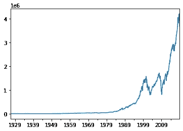

历年财富指数

**第二步:计算之前的峰值**

前面的峰值可以通过取财富指数的累计最大值来计算。因此，它遵循几乎相同的趋势，除了在财富指数出现亏损或负偏离的情况下，它将是平坦的。这就是我们如何只关注负偏差并接受正偏差。

```
*# Compute the previous peaks* 
previous_peaks = wealth_index.cummax()*# Plot the previous peaks*
previous_peaks.plot.line()
```

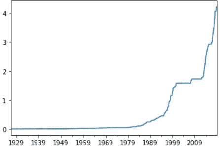

以前的峰值图

**第三步:计算提款**

这是最后一步。正如我们在上面的公式中所讨论的，我们将根据之前峰值之间的百分比变化来计算下降。

```
*# Calculate the drawdown in percentage*
drawdown = (wealth_index - previous_peaks)/previous_peaks*# Plot the drawdown* 
drawdown.plot.line()
```

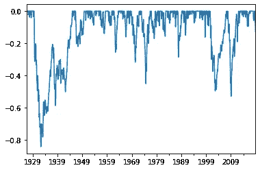

水位下降图

提款是计算负收益，因此，它们在 0 和-1 之间。我们可以看到，1929 年的崩盘比 2000 年或 2008 年严重得多，当时人们损失了超过 80%的财富。这是大屠杀。让我们来看看一些重要的价值观。

```
*# Get the worst drawdown and the date it happened* 
print(drawdown.min())
print(drawdown.idxmin()) **Output:**
-0.8400375277943123
Period('1932-05', 'M')
```

最严重的下降大约是 84%,发生在 1932 年至 2005 年。作为一个时间序列，我们可以对这些数据进行许多其他操作。

```
*# Get the worst drawdown since 1975*
print(f"The worst drawdown since 1975 was **{**drawdown['1975':].min()**}** on **{**drawdown['1975':].idxmin()**}**")**Output:** The worst drawdown since 1975 was -0.5280945042309304 on 2009-02\. 
```

最后，我们需要绘制一个峰值财富指数的组合图，以直观显示提款情况。

```
# Combine Plots plt.figure(figsize=
wealth_index.plot.line()
previous_peaks.plot.line()
```

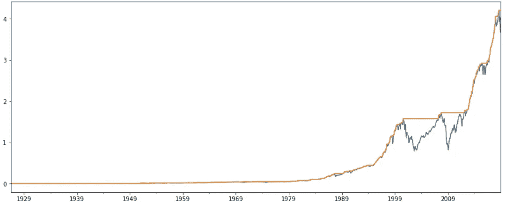

财富指数和峰值

你可以理解为财富指数(蓝色)和峰值(橙色)之差。我们也可以为其创建一个函数，将一个序列作为输入，并返回财富指数、以前的峰值和下降值。

我们可以用下面的方法得到小盘股的同样的数据框架。

```
# Get the data for small cap stocks 
small_cap_drawdowns = compute_drawdown(returns[‘SmallCap’])
small_cap_drawdowns
```

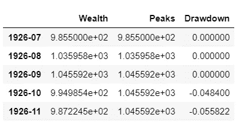

包含财富指数、峰值和下降值的数据框架

绘制小盘股下跌的结果如下图所示。

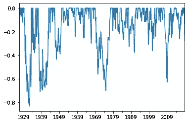

小盘股提款

在观察了小盘股的下跌后，我们可以明确地说，它们比大盘股的风险更大，我们可能会损失更多的钱，这符合我们目前对小盘股的理解。

这种技术在比较不同股票及其数据时最有用。你可以在[这本笔记本](https://www.kaggle.com/prakharrathi25/maximum-drawdown-strategy)里找到更详细的分析。

# 限制

值得注意的是，由于以下原因，这一措施远非完美。它只衡量最大损失的程度，不能考虑损失的频率。此外，它没有告诉我们特定证券的回收率或恢复期。正如我们在上面看到的，这更像是一种比较策略。

我希望你从中学到了一些有趣的东西，并且你也可以实际地实现它。我会添加更多这样的文章，我简化财务和代码。请分享你的想法。感谢阅读！

# 参考

1.  [Investopedia](https://www.investopedia.com/terms/m/maximum-drawdown-mdd.asp#:~:text=A%20maximum%20drawdown%20(MDD)%20is,over%20a%20specified%20time%20period.)
2.  [EDHEC 商学院](https://www.coursera.org/learn/introduction-portfolio-construction-python/home/welcome)