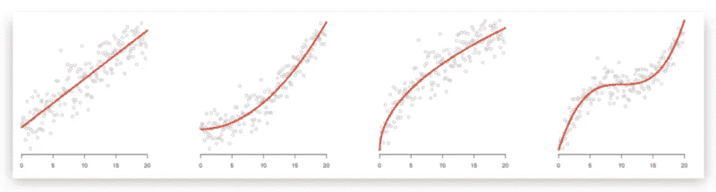
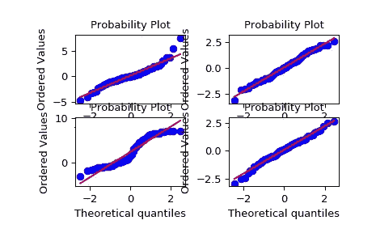
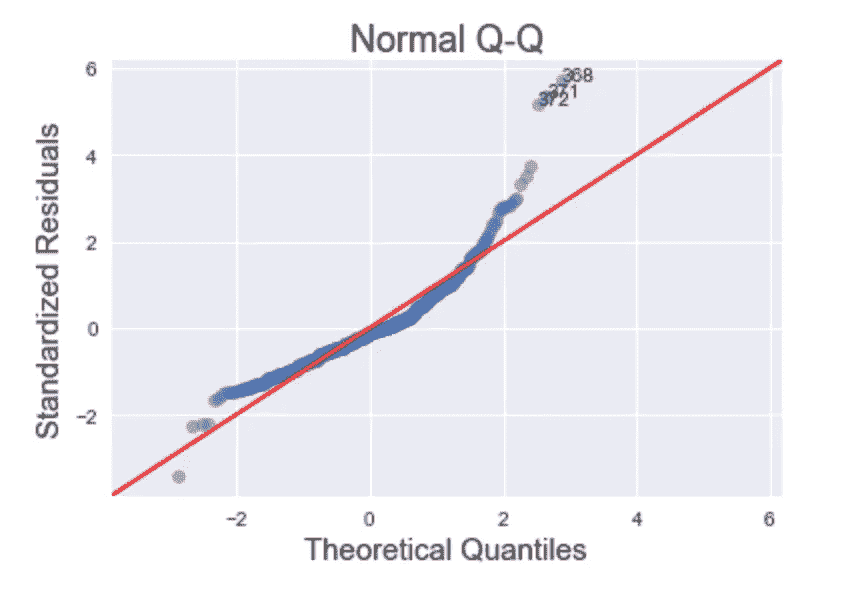
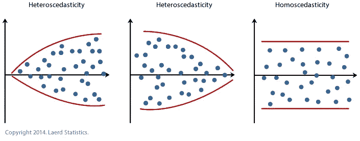

# 线性回归的假设

> 原文：<https://levelup.gitconnected.com/assumptions-of-linear-regression-f99dc9c6f051>

线性回归是进行预测的一个非常强大的工具。但是我们怎么知道我们可以相信线性回归得到的结果呢？

只有满足三个条件，我们才能得到最佳可靠的结果。没有这些，我们会得到有偏见的、不可靠的预测。在这篇博客中，我将讨论这三个假设，以及如何检查它们，以确保在执行线性回归时可以信任结果。为了简单起见，我将假设一个简单的线性回归。

## 线性

第一个假设可能是最明显的假设。线性意味着自变量(特征变量)和因变量(目标变量)之间必须存在线性关系。没有这种线性关系，就无法做出准确的预测。

我们测试线性的方法是创建自变量和因变量的散点图。一旦创建了散点图，我们就要寻找两件事情。第一种是大致线性的形状(方向性不重要)。第二个是，如果有一个线性形状，我们希望确保没有异常值。



线性回归要求自变量和因变量具有线性关系。[来源](https://www.freecodecamp.org/news/learn-how-to-improve-your-linear-models-8294bfa8a731/)

您可以使用下面的代码来绘制散点图。

```
import matplotlib.pyplot as plt
plt.scatter(df.x, df.y)
plt.show();
```

如果发现没有线性关系，可以执行变换(如对数变换)来获得线性形状。还有其他回归工具，如多项式回归，可能会产生更好的结果。

如果您有一个异常值，您需要考虑这个异常值是如何产生的，以及是否应该忽略它。

## 常态

常态，这通常是一个听起来直截了当的假设，但它实际上并不意味着自变量是正态分布的。事实上，对于非正态分布的变量，线性回归可能是成功的。相反，正态假设意味着从线性回归模型得到的**残差**应该是正态分布的。

我们只能在创建模型后收集残差。为了收集残差，我们可以使用以下代码:

```
residuals = model.resid
```

我们可以直观检查残差正态性的第一件事是使用 Q-Q(分位数-分位数)图。Q-Q 图是*一种概率图，是一种通过绘制两个概率分布的分位数来比较它们的图形方法*。此图允许我们预测一组数据是否来自已知分布(如正态分布)。通过 Q-Q 图，他们确实证实了某些东西不是正态分布的

我们可以使用残差和以下公式绘制 Q-Q 图:

```
import scipy.stats as stats
fig = sm.graphics.qqplot(residuals, dist=stats.norm,
                         line='45', fit=True)
fig.show()
```



我们正在寻找与红线大致对齐的点(蓝色)。[来源](https://docs.scipy.org/doc/scipy/reference/generated/scipy.stats.probplot.html)

当我们看 Q-Q 图时，我们在寻找与 45 度线对齐的点。如果偏离红色太多，我们可以假设残差不是正态分布的。我们还应该预料到*在图的边缘会有一些*弯曲。当它太完美地拟合时，我们希望对数据保持谨慎。



这个 Q-Q 图不是我们在检验正态假设时要寻找的。[来源](https://robert-alvarez.github.io/2018-06-04-diagnostic_plots/)

检查残差的直方图以了解它是否正常也很重要。

## 同方差性

当我们谈论同异方差时，我们也想谈论异方差。

> 异方差是指因变量在预测值范围内不相等的情况。
> 
> 因此，我们可以说，同方差指的是因变量在整个预测值范围内相等的情况。

这意味着，如果您要绘制独立变量的残差，它应该围绕 x 轴大致对称，并且应该一致地分布在预测值上。围绕 x 轴对称意味着正方向和负方向的残差值相似。一致的分布意味着特定的预测值不会对模型产生更大的影响，因为残差会随着这些值的变化而变化。

我们希望有同质性。为了检查同异方差，我们使用残差对自变量的散点图。一旦这个地块被创建，我们正在寻找一个矩形形状。这个矩形表示同质性。如果我们看到一个圆锥形，这表明异方差。



同方差是线性回归的第三个假设。[来源](https://www.albert.io/blog/key-assumptions-of-ols-econometrics-review/)

## 结论

当我们创建一个模型时，我们不仅要做一个预测，而且还要确保这个预测是可靠的。对于线性回归，我们需要满足三个假设才能对结果有信心，即线性、正态性和均方误差。