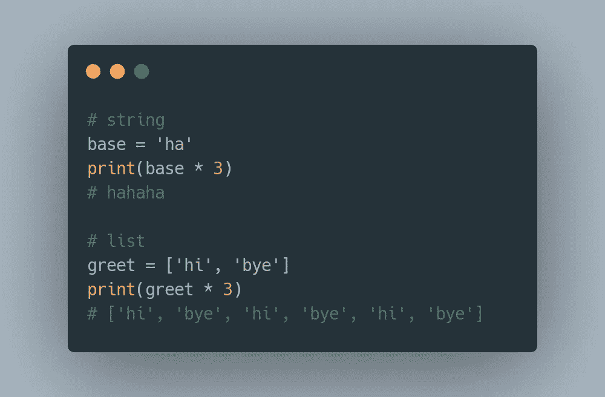

# 星号(*)不仅仅是乘法

> 原文：<https://levelup.gitconnected.com/asterisk-is-more-than-just-multiplication-18d494f3efb5>

## 你知道 Python 中有多少星号的用例？


照片由[蒂姆·莫斯霍尔德](https://unsplash.com/@timmossholder?utm_source=medium&utm_medium=referral)在 [Unsplash](https://unsplash.com?utm_source=medium&utm_medium=referral) 上拍摄

许多 Python 编码者，包括一些中级水平的编码者，经常不知道他们在 Python 中用星号字符做了什么。

让我们通过一些例子来释放 Python 中星号操作符的全部潜力。

# 算术

在最基本的形式中，它将两个数字相乘得到乘积。然而，它还可以执行另一种数学运算…

**求幂运算**

使用双星运算符`**`，基数可以被提升到指数的幂，`n`


指数运算。10 的 3 次方等于 1，000

# 复制

我们都知道`var*2= 4`如果`var= 2`。但是如果`var`不是一个数字呢？



字符串和列表元素的重复

## 字符串中的字符

如果变量是一个字符串，(在我的例子中是`base`)它将被复制`n` 次。

## 列表中的元素

当一个列表被乘以`n`倍时，列表中的元素将被复制`n`倍。注意，并不是这个列表被复制了`n`次，嵌套在另一个列表中→ `[[‘hi’, ‘bye’], [‘hi’, ‘bye’], [‘hi’, ‘bye’]]`

# 函数中的参数

这是由于其*打包*的性质，这意味着*一次捕获多个元素。在定义函数的时候特别有用。让我们探索更多…*

## 位置参数

当定义一个函数时，单个星号操作符`*`可用于捕获提供给该函数的任意数量的*位置参数* 。

这些参数被捕获到一个元组中。请注意，这些参数的顺序很重要(因此称为*位置*)。


捕获所有位置参数。请注意输入数量的差异。

## 关键字参数

双星号`**`用于在定义函数时捕获未知数量的*关键字参数* 。

关键字参数是传递给函数的值(*参数*)，由特定的*名称*标识。因此，它也被称为*命名参数*。顾名思义，参数的顺序并不重要。


捕获任意数量的关键字参数

在下面的例子中，我强调了一个在定义函数时既有位置参数又有关键字参数的例子，`func(*args, **kwargs)`


组合位置和关键字参数来处理不同数量的参数

# 打开集装箱包装

从根本上说，有了`*`操作符，容器(比如 list、tuple、dict)就可以被*解包*(不再括起来，也不用逗号分隔)如下图所示。由于这种解包性质，还有其他高级功能。


解包元组中的元素

## 元组解包

也称为多重赋值或可迭代解包。虽然它经常与元组一起使用(因此得名)，但我们也可以将它与列表一起使用。

在下面的第一个例子中，`title`被分配了`Mr`，而`lastName`被分配了最后一个元素`Teh`。`Jia`和`Wei`都被打包到变量`firstName`中。

类似地，在第二个例子中，3 个元素:`Jia`、`Wei`和`Teh`被打包到变量`fullName`中。


元组解包和列表打包

## 扩展/合并列表

在我的例子中，`*small`解包来自`small`的元素，在创建新列表`extended`时将它们和`10, 20, 30`一起添加。

当应用于多个列表时，这些列表的元素将被组合。


通过组合其他列表中的元素来创建新列表

## 合并两本词典

通过使用双星号`**`，这是将两个唯一键的字典组合在一起的一种优雅方式。


通过合并两个词典来创建新词典

# 正则表达式

与正则表达式(RegEx)一起使用时，`*`充当通配符。`*`匹配其左侧模式的 0 次或多次出现。

在下面的例子中，它会找到后面跟有任意数量小写字母`[a-z]`的短语。


在正则表达式中充当通配符

注意`The`不包括在结果中，因为搜索区分大小写。要忽略大小写，请包含参数`re.IGNORECASE`

```
re.findall('t[a-z]*', text, re.IGNORECASE)# ['The', 'thief', 'testing', 'those', 'tyres']
```

# 结论

通过回顾一些可能的操作，我们见证了明星(`*`)的力量，无论是单星`*`还是双星`**`。

我希望这篇文章对你有所启发，是一篇有趣的读物。请在评论区分享您对该主题的想法，以及是否有我错过的其他`*`用例。感谢阅读。

您可以在 [Medium](https://jiaweiteh.medium.com/) 上关注我即将发布的帖子，并在 [LinkedIn](https://www.linkedin.com/in/jia-wei-teh/) 和 [Twitter](https://twitter.com/jia_wei_teh) 上与我联系。