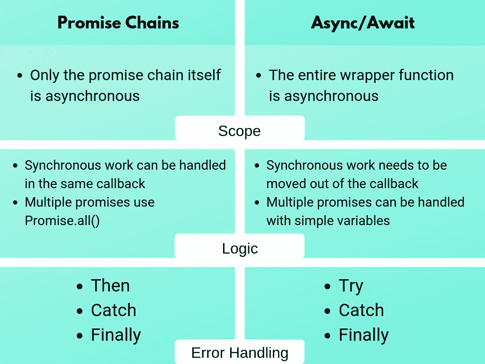
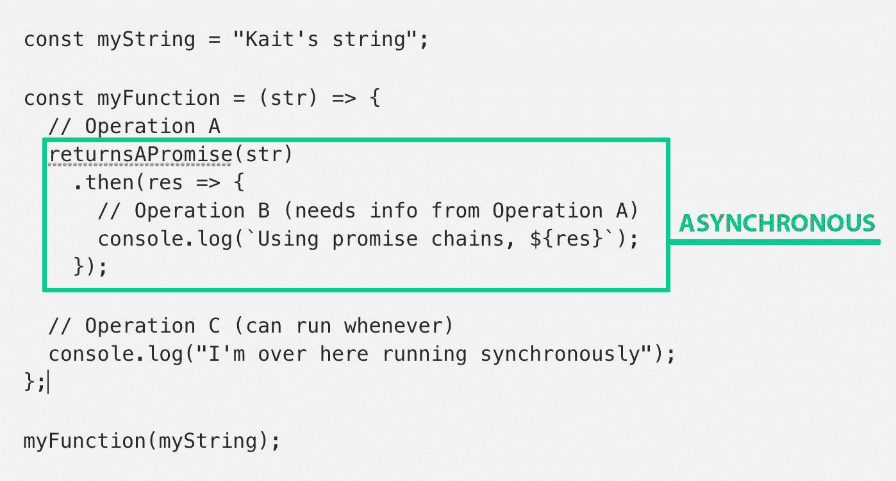
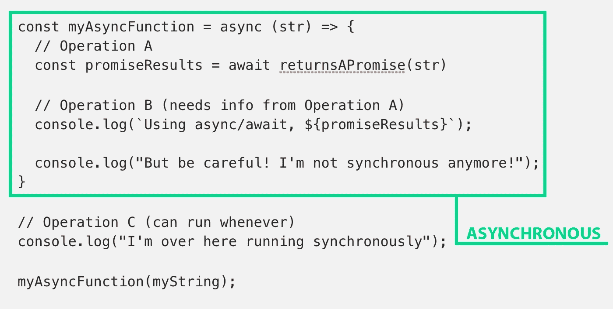

# 异步/等待 vs 承诺—指南和备忘单

> 原文：<https://levelup.gitconnected.com/async-await-vs-promises-4fe98d11038f>

我的第一份全职工作是软件工程师，已经工作了几个月了(这是一个值得庆祝的时刻:🎉 🤓)在现实世界中，我首先处理的事情之一就是 async/await。

我觉得我对 JavaScript 中的[异步工作流有了很好的理解，并且已经做了很多承诺，但是我在切换到 async/await 时遇到了一些困惑，所以我整理了一个指南和备忘单来说明两者之间的区别。](https://medium.com/@kvosswinkel/is-javascript-synchronous-or-asynchronous-what-the-hell-is-a-promise-7aa9dd8f3bfb)



> **关于语法糖的一个提示:**在我们开始之前，重要的是要提到 async/await 只是一个重新设计代码的包装器，使承诺在某些情况下更容易阅读和使用。在其核心，async/await 仍然使用承诺。如果您不确定承诺是如何工作的，或者需要更好地理解 JavaScript 中的异步，请查看[这篇概述](https://medium.com/@kvosswinkel/is-javascript-synchronous-or-asynchronous-what-the-hell-is-a-promise-7aa9dd8f3bfb)。

示例时间。假设我们想用一个承诺来打印一个字符串。我们将通过用我们的字符串记录一条消息来解析这个承诺，如果我们得到的不是字符串，我们将拒绝这个承诺。这很傻，但它能很清楚地说明我们在做什么:

```
const returnsAPromise = function(string) => {
  return new Promise((resolve, reject) => {
    if (typeof string === 'string') {
      resolve(`${string} is a resolved promise now`);
    } else {
      reject('Not a string!');
    }
  });
};
```

如果您想要一个稍微实用一点的例子，可以看看这个异步调用数据库的小要点:

# 范围

我注意到承诺和 async/await 之间最大的区别是异步的范围。

## 承诺

如果我们使用我们的承诺返回函数，并将结果保存在一个标准的承诺链中，它将类似于下面的函数。这里的异步都包含在承诺链中。像任何回调一样运行，同步运行。在`returnsAPromise`解析之前，我们的最后一个日志将打印“我在这里同步运行”。



## 异步/等待

现在，使用 async/await，我们的代码可能看起来像下面的函数。在我们的 async/await 版本中，我们必须使我们的*整个包装函数*异步。这有几个影响——现在，`myAsyncFunction`返回一个承诺，我们想要运行的任何同步代码都必须完全从函数中取出。



[查看代码片段的要点](https://gist.github.com/k-vosswinkel/53329056e449da640b9598a6d1b8990c)

# 逻辑流程

因为 promise chains 和 async/await 之间的范围略有变化，所以我们可以看到代码的逻辑也将发生变化。说明这种方法转变的一个很好的方式是，看看这两种方法是如何解决多重承诺的。我们再用`returnsAPromise`吧。

## 承诺

要使用承诺链解决多个承诺，我们可以使用`Promise.all()` *:*

```
const myFirstString = "Kait's first string";
const mySecondString = "Kait's second string";// Operation A & Operation B can run in parallel
Promise.all([returnsAPromise(str1), returnsAPromise(str2)])
 .then(res => {
   // Operation C needs info from Operations A & B
   console.log(`Promise.all() gives us an array: ${res}`)   
})
```

## 异步/等待

要使用 async/await 解析多个承诺，我们可以简单地等待两个承诺，将结果存储在变量中，稍后在代码块中使用它们。

```
const multipleAwaits = async (str1, str2) => {
  // Operation A runs
  const promiseResult1 = await returnsAPromise(str1); 
  // Then Operation B runs
  const promiseResult2 = await returnsAPromise(str2);

  // Then, Operation C runs
  console.log(`With multiple awaits, we can use the variables 
  directly: ${promiseResult1} AND ${promiseResult2}`);
}
multipleAwaits(myFirstString, mySecondString);
```

> **关于 Promise.all()** 的说明:使用多个 await 语句与我们的 promise chain 方法略有不同。在这里，操作 B 将等待操作 a 的完成。如果你真的希望你的承诺同时运行，你仍然可以使用 Promise.all()和你的异步函数，并使用[数组析构](https://developer.mozilla.org/en-US/docs/Web/JavaScript/Reference/Operators/Destructuring_assignment)来获取结果。它看起来像这样:

```
const multipleAwaits = async (str1, str2) => {
  // Operation A & Operation B can run in parallel
  const [promiseResult1, promiseResult2] = await  
    Promise.all([returnsAPromise(str1), returnsAPromise(str2)]);

  // Then, Operation C runs
  console.log(`With multiple awaits, we can use the variables 
  directly: ${promiseResult1} AND ${promiseResult2}`);
}
multipleAwaits(myFirstString, mySecondString);
```

# 使用 Catch & Finally 处理错误

promises 和 async/await 的错误处理非常相似。对于成功解决的承诺，我们将使用`then`或`try`。对于拒绝的承诺，我们将使用`catch`。对于我们希望在承诺被处理后运行的代码，不管它是被解决还是被拒绝，我们将使用`finally`:

## 承诺

```
let isOurPromiseFinished = false;
returnsAPromise(str)
  .then(res => {
    // If the promise resolves, we enter this code block
    console.log(`using promise chains, ${res}`);
  })
  .catch(err => {
    /* If the promise rejects, or if any of the code in our .then 
    statement throws, we enter this code block */
    console.log(err);
  })
  .finally(() => {
    /* This is for code that doesn't rely on the outcome of the 
    promise but still needs to run once it's handled */
  isOurPromiseFinished = true;   
 })
```

## 异步/等待

```
let isOurPromiseFinished = false;const myAsyncAwaitBlock = async (str) => {
  try {
    // If the promise resolves, we enter this code block
    const myPromise = await returnsAPromise(str);
    console.log(`using async/await, ${res}`);
  } catch(err) {
    // If the promise rejects, we enter this code block
    console.log(err);
  } finally {
    /* This is for code that doesn't rely on the outcome of the    
    promise but still needs to run once it's handled */
    isOurPromiseFinished = true;
  }
}
myAsyncAwaitBlock(myFirstString);
```

# 摘要

## 但是真的…我该用哪一个呢？？？

虽然承诺链和 async/await 都是建立在承诺之上的，但是它们之间的语法差异会对代码的逻辑和布局产生真正的影响。

如果你试图快速简洁地从承诺中获得结果，用一两种不同的方式使用它们，承诺链可能仍然是一个不错的选择。当一个简单的`.then`就可以了，承诺链将允许你避免写一堆不必要的包装函数。

如果您发现自己正在编写又长又复杂的`.then`语句，Async/await 是一个很好的选择。Async/await 将允许您将其整理成一个可读的异步回调函数。


猫税。

[](https://levelup.gitconnected.com)[](https://gitconnected.com/learn/react) [## 学习 React -最佳 React 教程(2019) | gitconnected

### 前 45 名 React 教程。课程由开发人员提交并投票，使您能够找到最佳反应…

gitconnected.com](https://gitconnected.com/learn/react)