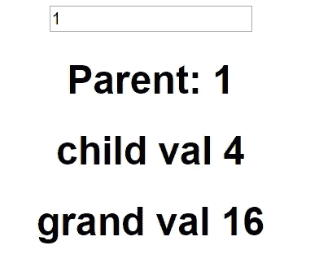
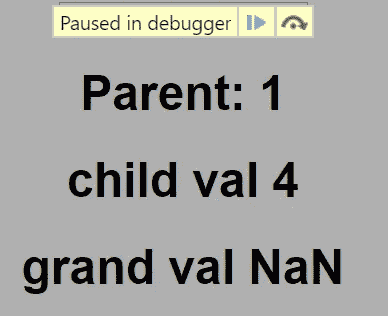
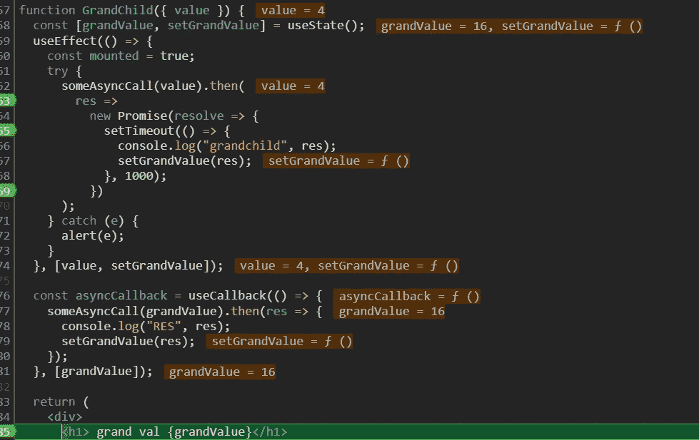
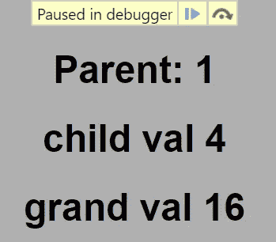
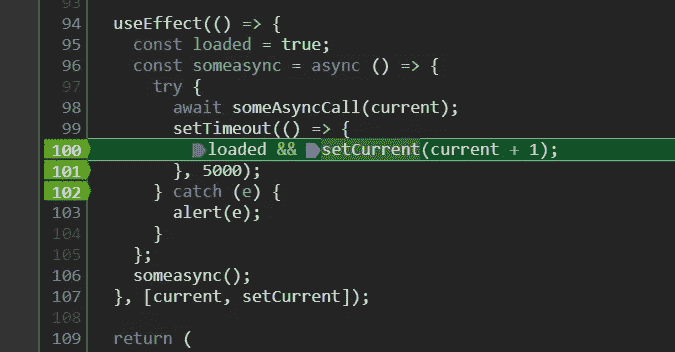

# 带有 React 的序列中的异步事件

> 原文：<https://levelup.gitconnected.com/async-events-in-sequence-with-react-aefd6749d37b>


Javascript 是一种单线程、阻塞、*同步*编程语言。浏览器从上到下按顺序读取包含 Javascript 代码的脚本，并阻止长时间运行的任务，如网络请求和 I/O 事件。

我们可以通过确定以下内容的适用位置来编写异步运行的 JavaScript 代码:

1.  *异步*代码，同步*执行*。
2.  *异步执行*的同步*代码*。

在本文中，我们将创建一个例子，采用异步 Javascript 中的概念，并使用 React 将它们应用到一个实际的例子中。

# 编写异步方法

在 ES7 中，更新引入了使用`async` / `await`在 Javascript 中编写异步代码的语法。让我们回顾一下这个特性如何让我们编写异步代码，通过保持异步和同步函数之间的代码结构相同，使*同步读取*。

给定一个*同步*函数`multiplyByTwo`，它将一个给定数字的值加倍，如果该数字为负，它将抛出一个错误。

```
const multiplyByTwo = function(num){
  if (num < 0) { 
    throw new Error('Cannot be negative');
  } 
  return num * 2;
}
```

我们可以通过创建处于已解决、拒绝或待定状态的承诺来使功能*异步*。我们可以通过创建一个承诺将同步功能转变为异步功能:

```
const multiplyByTwoAsync = function(num) {
  if (number < 0) {
    return **Promise.reject**("Cannot be negative");
  }
  return **Promise.resolve**(number * 2);
};
```

在`async/await`之前，我们可以使用`then-catch`语法调用异步函数。观察使用`then-catch`编写对同步函数的调用与异步调用的代码结构的不同。使用`async/await`，我们可以编写与同步调用结构相同的语法:

```
// synchronous call
const someSyncCall = function(number) {
   try {
     const result = **multiplyByTwo**(number);
     return result;
   } catch (e) {
     ...
   }
} // async-await asynchronous call (reads synchronously!)
const someAsyncCallB = async function(number) {
  try {
    const result = **await multiplyByTwoAsync(number);**
    return result;
  } catch (e) {
    ...
  }
};// then-catch asynchronous call 
const someAsyncCallA = function(number) {
   return **multiplyByTwoAsync**(number)
     .**then**(result => {
       return result;
   })
     .**catch**(err => console.log(err));
}
```

在继续之前，我们先拿上面的方法来创建一个新方法，依次调用 *someAsyncCallA* 和 *someAsyncCallB* 。出于学习目的，我将有目的地混合搭配不同的异步语法:

```
async function asyncCalls(param) {
  const someSyncCall = function(number){ ... }
const someAsyncCallB = async function(number) { ... }async function callComputeAsyncB(number) { ... } **return await callComputeAsyncA(param)
        .then(resA => callComputeAsyncB(resA));** }**// Example: asyncCalls(3) => 12
// resultA = 3 * 2 = 6
// return resultA * 2 = 12;**
```

# React-Setup 的练习示例

让我们使用上面的方法为 React 中的示例定义一个场景。我们有三个组件，一个父组件、一个子组件和一个孙组件。

我们的目标是观察从父组件到孙组件的事件序列，其中每个子组件都依赖于其父组件的值。下面是我们组件树的设置:

```
**function Parent**() {
  const [current, setCurrent] = useState(1); useEffect(() => {
    ....
   });return (
      <div className="Parent">
          <h1>Parent: {**current**}</h1>
          *<Child value={****current****} />*
      </div>
   );
}**function Child**({value}) { 
  const [childValue, setChildValue] = useState() useEffect(() => {
    ....
  });
  return (
      <div className="Child">
        <h1>child val: {**childValue**}</h1>
          *<GrandChild value={***childValue***} />*
      </div>
   );
}**function GrandChild**({value}) { 
  const [grandChildValue, setGrandChildValue] = useState() useEffect(() => {
    ....
  });
  return (
      <div className="GrandChild">
        <h1>grand val: {**grandChildValue**}</h1>
      </div>
   );
}
```

# 用 useEffect()处理承诺

只要承诺没有解决，使用`await`关键字的异步函数将阻止语句执行。使用`[useEffect](https://reactjs.org/docs/hooks-reference.html#useeffec)` [钩子](https://reactjs.org/docs/hooks-reference.html#useeffec)，调用异步函数将使组件订阅承诺的未决结果。

在这个例子中，我们将通过每五秒更新一次它在状态中的值来增加父组件中的`current`。

重新审视我们的父组件:

```
function Parent() {
  const [current, **setCurrent**] = useState(0);useEffect(() => {
    const **someasync** = **async** () => {
      try { 
      ** await asyncCalls(current);**
       setTimeout(() => {
         setCurrent(current + 1);
      }, 5000);
      } catch (e) {
         alert(e);
      }
    }
    **someasync()**;
   }, [current, setCurrent]); return ...
} 
```

如果一个组件在承诺解决之前被卸载会发生什么？

对`setCurrent`的调用将导致一个未安装的组件出错。因为我们不能取消承诺，所以我们需要一种方法来有条件地调用生命周期方法。

> 除了用于清理的函数之外，效果函数不能返回任何内容。看起来你写了 useEffect(async () => …)或者返回了一个承诺。相反，在你的效果中编写异步函数并立即调用它

如果组件被卸载，我们需要防止它设置状态。这可以通过设置一个标志来实现，该标志只允许在我们的组件仍然安装的情况下调用`setCurrent`:

```
useEffect(() => {
    **const loaded = true;**
    const someasync= async () => {
      try { 
      await **asyncCalls**(current);
       setTimeout(() => {
       **  loaded && setCurrent(current + 1);**
      }, 5000);
      } catch (e) {
         alert(e);
      }
    }
    **someasync()**;
   }, [current, setCurrent]);
```

# React 生命周期中的渲染顺序

让我们用上面`useEffect`的类似实现来更新这篇文章中的其他组件:

```
**function Child**({**value**}) { 
  const [childValue, setChildValue] = useState(); useEffect(() => {
    **const loaded = true;**
    const someasync= **async** () => {
      try { 
      ** const res = await asyncCalls**(**value**);
       setTimeout(() => {
       **  loaded && setChildValue(res);**
      }, 1000);
      } catch (e) {
         alert(e);
      }
    }
    **someasync()**;
   }, [**value**, **setChildValue**]); return ...
}**function GrandChild**({**value**}) { 
  const [grandChildValue, setGrandChildValue] = useState(); useEffect(() => {
    **const loaded = true;**
    const someasync= **async** () => {
      try { 
      ** const res = await asyncCalls**(**value**);
       setTimeout(() => {
       **  loaded && setGrandChildValue(res);**
      }, 1000);
      } catch (e) {
         alert(e);
      }
    }
    **someasync()**;
   }, [**value**, **setGrandChildValue**]);

   return ...
```

让我们回顾一下到目前为止我们已经创造了什么。

使用`async/await`和`useEffect`，我们能够创建一系列异步事件，在 React 生命周期中按照*顺序*执行。这是第一次通过时的当前结果:



使用 Chrome 开发工具中的断点，我们可以更好地理解 Javascript 的异步特性在 React 生命周期中的表现。

当一个组件挂载时，它会先 ***处理所有子节点*** 而不阻塞执行。任何未完成的承诺都将被添加到调用堆栈中，并可能仅在承诺完成后触发一个设置组件状态的调用。

在组件的初始渲染中，回想一下我们有一个设置为五秒间隔的计时器，父组件中的`current`的值设置为 1:

```
**function Parent**() {
  const [current, setCurrent] = useState(1);
```

随着子组件的呈现，每个子组件都将创建一个对调用我们的异步方法时创建的承诺的新引用:

```
// Reference to Child/GrandChild 
useEffect(() => {
    **const loaded = true;**
    const someasync= **async** () => {
      try { 
      ** const res = await asyncCalls**(**value**);
```

一旦任务完成，它将把结果或错误传递给对`*asyncCalls*`的调用中的承诺。(如果异步函数完成得很快，结果马上就出来了。)

研究堆栈中的调用，其中子值为 4，孙值为 NaN，从呈现序列中，我们可以确认 child 中的已解决状态。在孙儿中，来自效果的异步调用还没有完成，在孙儿中体现为*楠*。



在解析我们示例的子代中的所有承诺时，您应该看到以下值显示在它们各自的字段中。这个序列将每五秒钟重新评估整个组件树。



只介绍了`useEffect`，我鼓励您扩展 React 中其他生命周期挂钩所涉及的概念。使用这篇文章中的例子，在开发者工具中自己尝试一下。

感谢阅读！

[](https://developer.mozilla.org/en-US/docs/Learn/JavaScript/Asynchronous/Introducing) [## 异步 JavaScript 简介

### 在这篇文章中，我们简要回顾了与同步 JavaScript 相关的问题，并先看一看一些…

developer.mozilla.org](https://developer.mozilla.org/en-US/docs/Learn/JavaScript/Asynchronous/Introducing) [](https://javascript.info/dom-nodes) [## DOM 树

### HTML 文档的支柱是标签。根据文档对象模型(DOM ),每个 HTML 标签都是一个对象…

javascript.info](https://javascript.info/dom-nodes)  [## JavaScript 程序的执行(JavaScript:权威指南，第 4 版)

### 上一节讨论了将 JavaScript 代码集成到 HTML 文件中的机制。现在我们继续…

docstore.mik.ua](https://docstore.mik.ua/orelly/webprog/jscript/ch12_03.htm) [](https://blog.avenuecode.com/understanding-the-javascript-concurrency-model) [## 理解 JavaScript 并发模型

### 您可能听说过诸如“V8”、“事件循环”、“调用堆栈”和“回调队列”等术语在这篇文章中，我们…

blog.avenuecode.com](https://blog.avenuecode.com/understanding-the-javascript-concurrency-model)