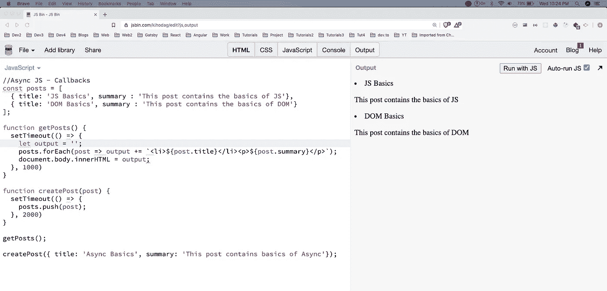
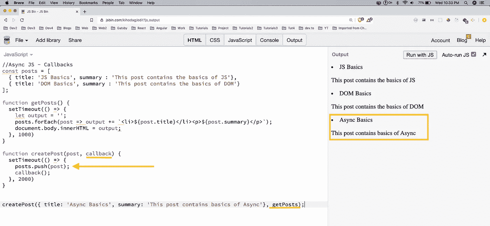
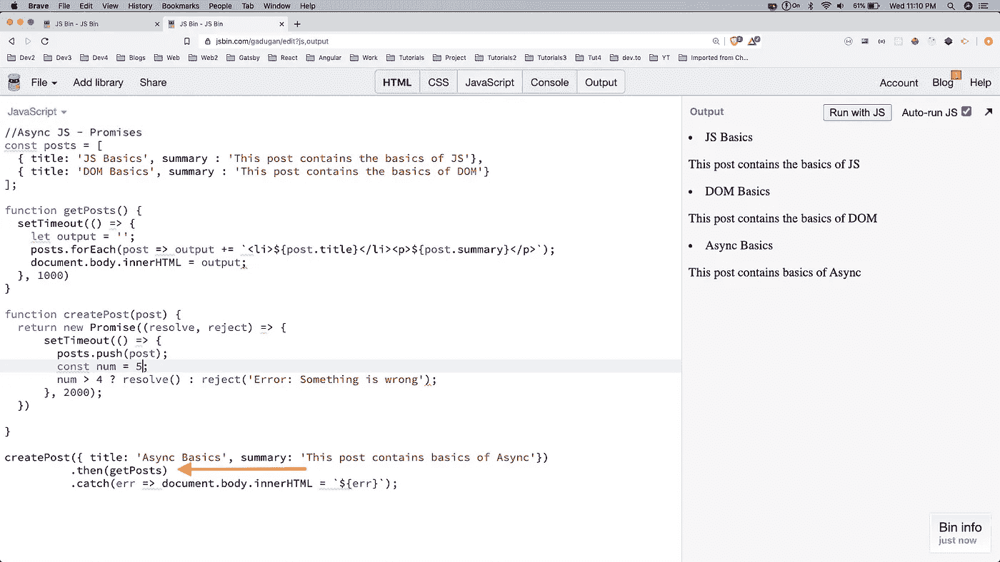
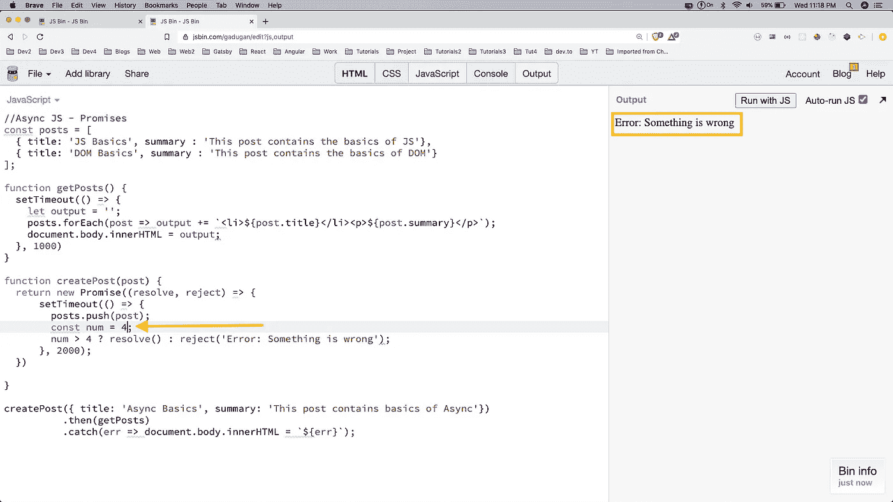
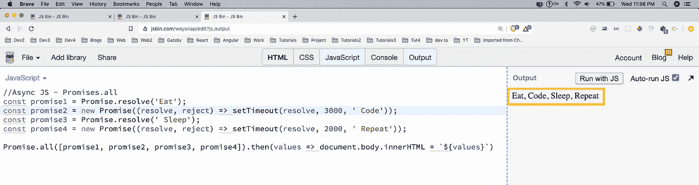
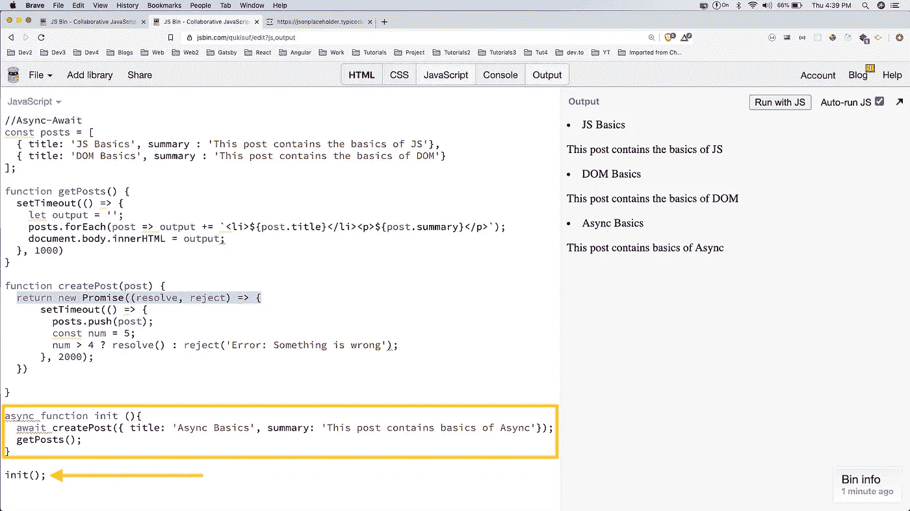
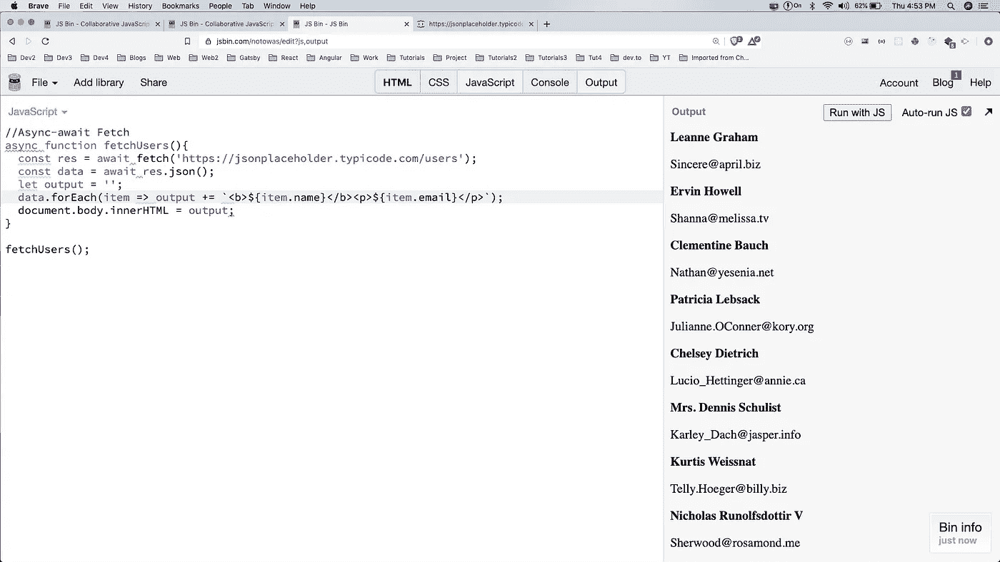

# 异步 JS 速成班——回调、承诺、异步等待

> 原文：<https://levelup.gitconnected.com/async-js-crash-course-callbacks-promises-async-await-2e5f11b67dc4>

阿瑟·里德在 [Unsplash](https://unsplash.com/s/photos/linux?utm_source=unsplash&utm_medium=referral&utm_content=creditCopyText) 上拍摄的照片

欢迎来到异步 JS 速成班。

回调、承诺和异步等待是处理异步数据的一种方式。JavaScript 中的异步编程是这样一种方式，在这种方式下，程序不会等到某件事情正在执行时才开始。

当我们执行 API 调用来获取一些数据时，这很方便，这需要一些时间(可能 2-3 秒)。但是我们不希望我们的程序停止执行下一个语句，这就是所谓的 Async JS。

所以，让我们从一个 jsbin 开始，打开 JavaScript 和输出。这里，我们创建了一个对象 posts 数组，其中包含两个对象。

现在，我们有了一个函数 **getPosts()** ，在这个函数中，我们有 **setTimeout()** 来模拟对 API 服务器的调用，这个调用运行时有 1000 毫秒的延迟。在那之后，我们只是循环遍历帖子，并将包含标题和摘要的 **li** 和 **p** 添加到输出中。

一旦 forEach 完成，我们就将它添加到主体中。

之后，我们有了 **createPost()** ，它只是将一个新的帖子推送到 posts 数组中。但它在 2000 毫秒后运行。

异步ˌ非同步(asynchronous)

我们可以看到上面的问题，因为运行了 **createPost()** 但是延迟了 2000 毫秒，在此之前，已经绘制了 DOM 并且运行了**get post()**。

这就是使用异步编程的地方，我们将首先研究**回调**。

## **回调**

为了使用回调，我们在 **createPost()** 中传递一个新的参数 **callback** 。然后在 **posts.push(post)** 之后，我们调用 **callback()** 。现在在 **createPost()** 调用中，我们正在传递第二个参数，它是函数 **getPost** 。现在，只有在运行 posts.push()之后，才会运行 getPosts，我们将获得所有三个帖子。

回收

## **承诺**

Promises 是回调的更好版本，是在 ES6 中引入的。这里，我们不传递任何参数，而是将整个代码包装在一个 Promise 方法中并返回它。我们传递两个参数， **resolve** 和 **reject** 给它。

现在，每当运行 **resolve** 时，就会执行来自函数调用的 **then()** 块。我们通过给 **num** 为 5 来使其为真，这样三元运算符将为真。

承诺

现在，让我们将 num 设为 4，这样三元运算符为 **false** 并且运行 **reject()** 。现在，将执行 **catch()** 并显示错误。

承诺

还有一种承诺的变化叫做 **Promise.all** ，我们可以将承诺链接起来，一旦所有承诺完成，它就会显示结果，包括最慢的一个。在下面的例子中，最慢的承诺是代码 1，但是一旦它在 3 秒后被解决，那么只有 **then()** 将被执行。

承诺。所有

## 异步等待

现在，我们将学习 async-await，它是 promises 的升级。它被称为合成糖超过承诺，因为在引擎盖下，它是承诺。

我们再次使用旧的承诺的例子。这里，我们创建了一个新函数 **init()** ，但是使用了关键字 **async** 。在函数内部，我们让 **createPost()** 成为**wait**。这意味着它之后的函数将等待它的结果。所以，我们又一次把一切都安排妥当了。

承诺

Async-await 通常与 **fetch** 一起使用，从外部 API 获取数据。我们将使用一个漂亮的假 API 端点来获取 10 个用户的数据。

这里，我们在 **fetch()** 前面使用 **await** 关键字从 **jsonplaceholder** api 获取数据。使用 **fetch()** 我们必须在 **res.json()** 中再次使用 await。之后，只需遍历数据并在浏览器中显示它。

数据

我们的异步等待速成课程到此结束。你可以在这里找到所有的 JSbins

[https://jsbin.com/kihodag/3/edit?js,output](https://jsbin.com/kihodag/3/edit?js,output)

[https://jsbin.com/gadugan/1/edit?js,output](https://jsbin.com/gadugan/1/edit?js,output)

[https://jsbin.com/wayanap/1/edit?js,output](https://jsbin.com/wayanap/1/edit?js,output)
https://jsbin.com/qukisuf/1/edit?js,output
https://jsbin.com/notowas/edit?js,output