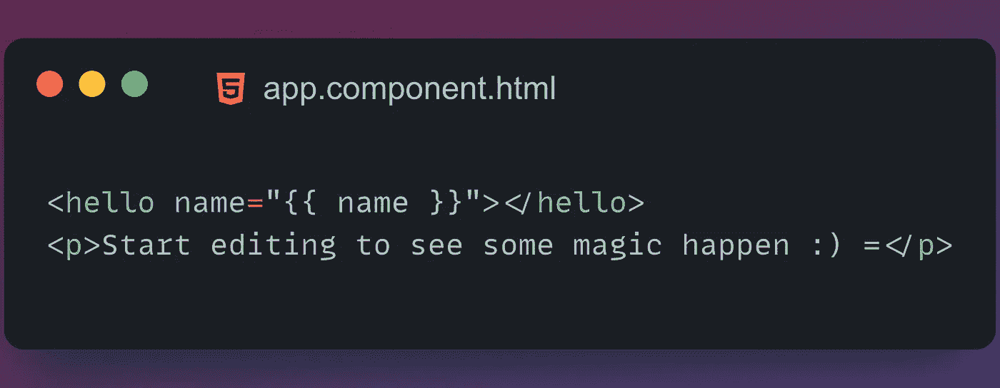

# 从零开始角度异步管道

> 原文：<https://levelup.gitconnected.com/async-pipe-in-angular-from-scratch-254bc8a37943>

角形基本管道

# **但是什么是有角的管子呢？**

管道用于转换输入数据。例如，我们有一个异步管道，它接受一个承诺或可观察值，并在可观察值的情况下将其转换为已解析值或最新值。

## 角形内置异步管道

Angular 有一个内置的管道 ***async*** 我们将从头开始制作它，但首先要了解它是如何工作的

如你所见，我们有一个类型为 promise ***name*** 的变量，它将在 3 秒后解析为“Angular 14”。让我们试着在 HTML 文件中使用它

但是在输出中，我们看不到 3 秒后的角度 14，而是在输出中显示[目标承诺]

所以让我们使用异步管道来解决这个问题

因此，通过添加`| async`，我们可以看到它在 3 秒后显示“角度 14”

# **好了，现在有趣的部分来了，让我们试着从头开始为这个管道编码。**

这是怎么回事？

看，我们通过设置`pure=false`使用了不纯管道，因为我们想在`value(this.value)`改变时调用转换方法。

最初，该值为 null，因此当承诺处于待定状态时，它将首先返回 null，但 3 秒钟后，它会将该值更新为我们传递的任何数据，这将导致 transorm 方法重新运行，我们将在输出中看到“Angular 14”。

这个怎么用？

将 CustomAsync 类添加到 app.module.ts 的声明数组中，并使用{{name | customAsync}}

检查它的演示

[https://stackblitz.com/edit/angular-ivy-oamp4e](https://stackblitz.com/edit/angular-ivy-oamp4e)