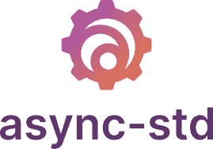
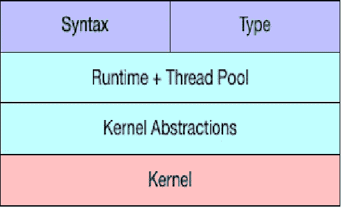

# 异步生锈

> 原文：<https://levelup.gitconnected.com/async-rust-ece546f34231>



异步编程

我认为可以肯定地说，Rust 最令人期待的语言功能之一终于登陆了。我假设对 Rust 的语法和生态系统有一些基本的了解。但是在深入编码部分之前，让我们用异步的定义来涵盖异步编程的一些基本概念。



# 异步定义:

在 Rust 中，异步意味着不等待另一个任务完成，因为它可以在一个线程上并发运行代码或同时运行多个任务。多线程就像这样，但是有一个不同的概念。大多数情况下，当你有计算密集型任务(所谓的 CPU 密集型任务)时，就使用多线程。IO 绑定是花费大量时间等待的任务，例如等待服务器的响应。

异步编程让我们可以在单线程上同时运行多个 IO 绑定的计算，而不会浪费任何时间，因为当它们等待响应时，它们只是空闲的，因此在异步的帮助下，我们可以让计算机继续工作。

# 为什么异步生锈:

Rust 值得注意的一点是无所畏惧的并发性。这就是你应该被授权在不放弃安全的情况下同时做一些事情的概念。此外，Rust 是一种低级语言，它是关于无所畏惧的并发性，而无需选择特定的实现策略。这意味着如果我们想要在不同策略的用户之间共享代码，我们必须对策略进行抽象以允许以后的选择。


# 期货:

计算上的期货抽象。它们描述“什么”，独立于“在哪里”和“什么时候”。为此，他们的目标是将代码分解成小的、可组合的动作，这些动作可以由我们系统的一部分来执行。

## 让我们举一个例子来说明这一点:

```
use async_std::task;// ^ we need this for task spawningasync fn negate_async(n: i32) -> i32 { println!(“Negating {}”, n); task::sleep(std::time::Duration::from_secs(5)).await; println!(“Finished sleeping for {}!”, n); n * -1}async fn f() -> i32 { let neg = negate_async(1); // … nothing happens yet let neg_task = task::spawn(negate_async(2)); // ^ this task /is/ started task::sleep(std::time::Duration::from_secs(1)).await; // we sleep for effect. neg.await + neg_task.await // ^ this starts the first task `neg` // and waits for both tasks to finish}
```

在上面的小代码片段中，事情是这样的。

第一行导入 async_std::task。

异步函数 negate_async 接受一个带符号整数的输入，休眠 5 秒钟，然后返回该整数的取反版本。

异步函数 f 更有趣:

o 第一行(let neg …)创建了 negate_async 函数的未来，并将其赋给 neg 变量。重要的是，它还没有开始执行。

o 下一行代码(let neg_task …)使用 task::spawn 函数开始执行 negate_async 返回的 Future。与 neg 一样，negate_async 返回的未来值被赋给 neg_task 变量。

下一个:我们睡一会儿。这是为了当任务开始运行时，从输出中可以明显看出。

最后，我们等待两个未来，将它们相加，然后返回。通过等待否定，我们开始执行未来，并运行到完成。由于 neg_task 已经开始，我们只需等待它完成。

那么，这有什么结果呢？

```
Negating 2# <- there’s a 1 second pause hereNegating 1Finished sleeping for 2!Finished sleeping for 1!
```

正如我们所看到的，第二个 future，neg_task，一被调用就开始执行——多亏了 task::spawn——而 neg 直到被等待才开始执行。


# 如何在 Rust 中使用 async-await:

您可能对 JavaScript 或 C#中的 async-await 比较熟悉。Rust 版本的功能类似，但没有什么关键区别。

要使用 async-await，您可以通过 async fn 而不是 fn 开始编写。

```
async fn first_function() -> u32 { .. }
```

与常规函数不同，调用异步 fn 不会立即产生任何效果。相反，它返回一个未来。这是一个等待执行的挂起计算。要实际执行未来，使用`.await`操作符:

```
async fn another_function() { // Create the future: let future = first_function(); // Await the future, which will execute it (and suspend // this function if we encounter a need to wait for I/O): let result: u32 = future.await; …}
```

这个例子展示了 Rust 和其他语言的第一个区别:我们写 future.await 而不是 await future。该语法与 Rust 的`?`操作符更好地集成在一起，用于传播错误(毕竟，这在 I/O 中很常见)。你可以简单地写`future.await?`来等待未来的结果并传播错误。它还具有使方法链接变得不费力的优点。

# 结论:

我们相信，在稳定的 Rust 上拥有 async-await 将是 Rust 中许多令人兴奋的新开发的关键促成因素。如果你过去在 Rust 中尝试过异步 I/O 并遇到了问题——特别是如果你过去尝试过基于组合的期货——你会发现 [async-await 与 Rust 的借用系统](http://aturon.github.io/tech/2018/04/24/async-borrowing/)集成得更好。

我希望它有助于理解 Rust 中的**异步编程，如果有任何反馈请告诉我。**

> ***谢谢。***

**资源:**

[https://thomashartmann.dev/blog/async-rust/](https://thomashartmann.dev/blog/async-rust/)

[https://book.async.rs/concepts/futures.html](https://book.async.rs/concepts/futures.html)