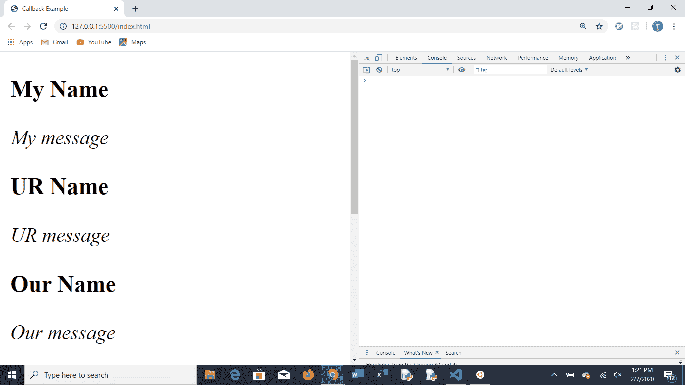
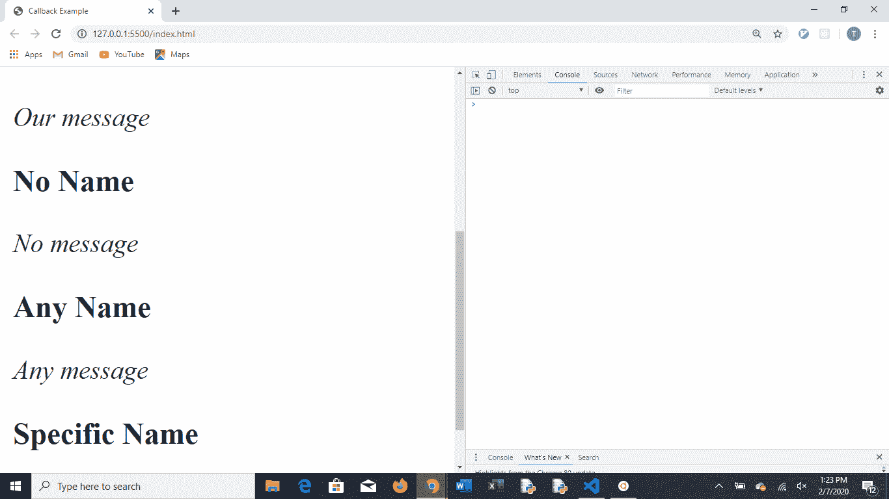
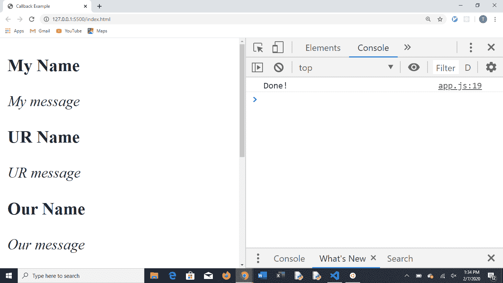

# 异步回调

> 原文：<https://levelup.gitconnected.com/asynchronous-callbacks-a7e146336035>


戈兰·艾沃斯在 [Unsplash](https://unsplash.com?utm_source=medium&utm_medium=referral) 上的照片

JavaScript 是一种单线程语言。这意味着计算机从上到下读取一个 JS 文档。因此，代码从页面的顶部到底部执行。这被称为同步代码。只要函数快速有效地运行，这就很好，但是如果函数需要几秒钟才能运行，会发生什么呢？

运行时间长的函数可能会阻碍后面的其他函数进程。这被称为阻塞代码。如果发生这种情况，页面或应用程序将滞后，客户/客户将会丢失。解决这个问题的一种方法是编写异步代码。

在异步代码中，需要花费大量时间运行的函数可以在“后台”运行，而其他更快的函数在“前台”运行。这样，页面的其余功能可以运行和操作。解决这个问题的一个方法是回调。

回调函数是作为参数传递给另一个函数的函数。回调将在父函数完成后运行。为了更好地理解这一点，我决定创建一个异步回调示例。我创建了两个示例数据的基本 JSON 文件。然后我创建了两个函数:一个从 JSON 文件中检索数据(一个名为 loadJSON 的 XMLHttpRequest ),另一个将数据放在 html 页面上(postData)。

# **示例数据和功能**

**Data.json —** 对象数组，带有字符串化的名称和消息的关键字

```
**[
  { “name”: “My Name”, “message”: “My message” },
  { “name”: “UR Name”, “message”: “UR message” },
  { “name”: “Our Name”, “message”: “Our message” }
]**
```

**Data1.json —** 要从中获取信息的第二个 json 数据文件

```
**[
  { "name": "No Name", "message": "No message" },
  { "name": "Any Name", "message": "Any message" },
  { "name": "Specific Name", "message": "Specific message" }
]**
```

**PostData —** 在 DOM 上发布数据的函数。来自 JSON 文件的数据需要被解析成 JavaScript 可用的数据。然后数据被循环并连接到一个名为 post 的字符串文字上。然后，post 字符串显示在 DOM 上的一个 div 标签中，该标签包含“app”的 id。

```
**const postData = (res) => {
  let data = JSON.parse(res);
  let post = "";
  data.forEach(ele => post +=
    `<h3>${ele.name}</h3>
    <p><i>${ele.message}</i></p>`);
  document.getElementById('app').innerHTML += post;
};**
```

**LoadJSON —** 从 JSON 文件中获取数据的函数(注意函数参数中的回调)

```
**const loadJSON = (file,** callback**) => {
  let xobj = new XMLHttpRequest();
  xobj.open('GET', `${file}`, true);
  xobj.onreadystatechange = () => {
    if (xobj.readyState === 4 && xobj.status === 200) {** callback**(xobj.responseText);
    }
  };
  xobj.send(null);
};**
```

**函数调用—** 此处，loadJSON 通过调用 postData 的回调来调用，而包含第二个 postData 的第二个 loadJSON 在第二个回调中被调用。

```
**loadJSON('data.json', (res) => {
  postData(res);
  loadJSON('data1.json',(res) => {
    postData(res);
  })
});**
```

**结果—** 两个数据集都已加载并呈现到页面上。控制台上未记录任何错误。



**重构—** PostData 函数被重构为接受回调。添加了一个默认的回调函数 done，这样控制台将记录“Done！”当所有的回调都完成时。

```
**const postData = (res, callback = done) => {
  let data = JSON.parse(res);
  let post = "";
  data.forEach(ele => post +=
    `<h3>${ele.name}</h3>
    <p><i>${ele.message}</i></p>`);
  document.getElementById('app').innerHTML += post;
  callback();
};**
```

**重构函数的调用—** 在这里，loadJSON 通过调用 postData 的回调来调用，postData 有一个调用另一个 loadJSON 的回调，load JSON 也有一个调用另一个 postData 的回调。

```
**loadJSON('data.json',
  (res) => postData(res,
    () => loadJSON('data1.json',
      (res) => postData(res))));**
```

**结果**(仍然有效)添加默认的 done 功能防止了任何错误被记录在控制台上。



总结这篇博客，JavaScript 是一种同步运行的单线程语言。避开同步代码的方法是运行异步代码。运行异步代码的一种方法是使用回调。回调是作为参数传递并在另一个函数内部调用的函数。回调是解决长时间运行(可能阻塞)代码的好方法。