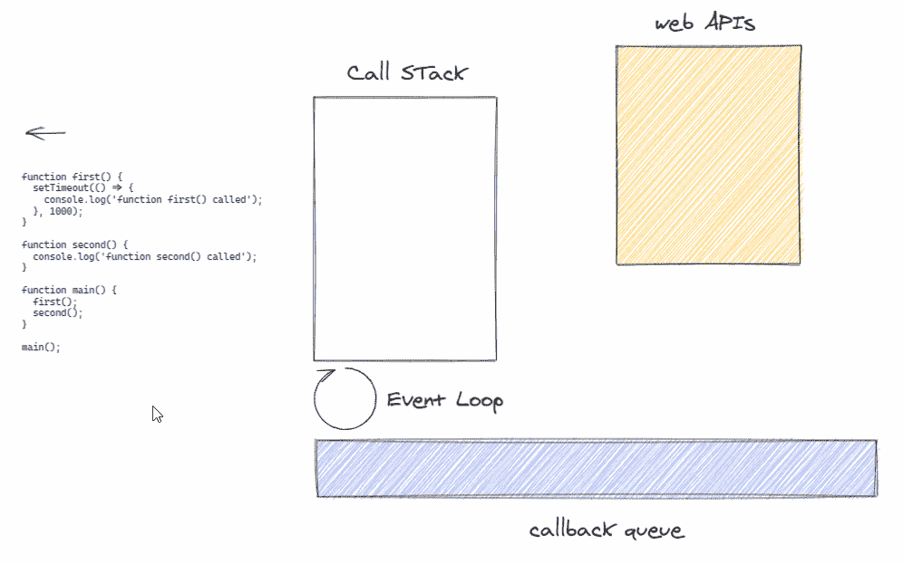

# 异步 JavaScript

> 原文：<https://levelup.gitconnected.com/asynchronous-javascript-6d219b6eb8ff>

## 不那么单线程。

单线程？在 [Unsplash](https://unsplash.com/s/photos/thread?utm_source=unsplash&utm_medium=referral&utm_content=creditCopyText) 上由 [amirali mirhashemian](https://unsplash.com/@amir_v_ali?utm_source=unsplash&utm_medium=referral&utm_content=creditCopyText) 拍摄的照片

# 介绍

作为一名 JavaScript 开发人员，您可能已经读过或听说过 JavaScript 是一种单线程语言。此外，我很确定许多 JavaScript 开发人员只是“*相信*”，从不质疑这个术语或概念，并且已经编写了数千行 [***异步(类似多线程)***](https://stackoverflow.com/questions/34680985/what-is-the-difference-between-asynchronous-programming-and-multithreading/34681101) 代码，甚至没有理解它是如何工作的(不要感到羞耻😅，你不是一个人)。

## 什么是线程？

根据[维基百科](https://simple.wikipedia.org/wiki/Thread_(computer_science))，计算机科学[中的**线程**是执行的*线程的简称。线程是一个*](https://simple.wikipedia.org/wiki/Computer_science)*[程序](https://simple.wikipedia.org/wiki/Computer_program)将自己分成(称为*“拆分”*)两个或更多同时(或伪同时)运行[任务](https://simple.wikipedia.org/wiki/Task_(computers))的一种方式。*

根据上面的定义，我们只是说 JavaScript 一次只能运行一个任务，对吗？好吧，让我们再深入一点。

为了理解 JavaScript 如何处理任务，我们需要理解 JavaScript 调用栈。

JavaScript 调用堆栈是一个字面量 [***堆栈数据类型***](https://en.wikipedia.org/wiki/Stack_(abstract_data_type))*，它将每个连续的函数调用堆叠在另一个上，并在其执行完成时弹出函数。下面是一个直观的表示:*

**

*JavaScript 调用栈演示。[源文件](https://gist.github.com/chuxmykel/81e2c490b1346250a12d643175476c40)*

*观察右侧的菜单，重点关注“Call Stack”菜单项。请注意每个函数调用是如何相互叠加，并在执行完成后弹出的。但是 ***foo*** 是第一个函数调用吧？那为什么我们下面会有 ***(匿名)***foo 呢？这是我们调用脚本时运行的主函数，这个函数运行时在全局范围内遇到了三个函数声明和一个函数调用 ***(foo)*** 。这会立即将 foo 添加到堆栈的顶部。现在我们在 *foo* 的块范围内，我们遇到了另一个函数调用 ***(console.log())。****

> *如果你想知道为什么 **console.log()** 没有出现在调用堆栈上，JavaScript 引擎非常快，我只能通过 [***调试器***](https://developer.mozilla.org/en-US/docs/Web/JavaScript/Reference/Statements/debugger)*语句来可视化这个。而且由于我不能在***console . log()***函数中放一个，所以它一执行就弹出来了。**

**在弹出***console . log()***之后，我们遇到了另一个函数调用 ***(bar())*** ，它将执行上下文带入新函数，并将新函数添加到调用堆栈的顶部。 ***foo()*** 函数还没有离开堆栈，因为它的执行还没有完成，所以现在我们在堆栈上有 ***anonymous()，foo()*** 和 ***bar()*** 。执行 ***bar()*** 函数的过程是相同的，它将***【baz()***放在调用堆栈的顶部。 ***baz()*** 将***console . log()***放入栈中，弹出它并再次将其与告别消息一起放入然后弹出它，弹出 **baz()** 函数然后返回到***bar()***执行上下文运行第二个 ***console.log*****

**我几乎可以肯定我的话没有清楚地传达这个概念，所以我冒昧地创建了一个 gif 来帮助可视化整个过程。**

****

**根据调用堆栈可视化我们的代码执行**

**现在，您应该能够清楚地看到 *console.log()* 是如何融入流程的，以及每一行代码是如何执行的。**

**JavaScript 就是这样运行 [***同步***](https://gist.github.com/chuxmykel/21c6e5044b0cfdc2c60fa1873a836dc4) 代码的。所有的函数都运行到完成，当它们没有其他事情可做时，就从堆栈中弹出。**

**如果我们已经围绕 JavaScript 引擎使用 ***调用栈*** 执行代码的方式建立了一个心智模型，我们已经可以开始质疑它如何能够用一个调用栈同时执行多个任务了。**

## **异步 JavaScript**

**与我们之前的例子相比，考虑下面的代码片段。**

**演示异步 JS**

**如果 JavaScript 引擎像处理前一行代码一样执行这几行代码，我们将得到以下序列:**

*   **执行脚本的函数 ***(匿名)*** 被调用并放置在堆栈顶部。**
*   **它从文件顶部开始，发现 3 个函数声明， ***第一个******第二个*** 和 ***main*** 。**
*   **在第 16 行，它看到对***main()****函数的调用，并将其添加到堆栈中。***
*   ******main()*** 调用***first()******first()***调用 ***setTimeout()*** 。按照我们的心理模型， ***setTimeout()*** 在 ***main()*** 可以调用 ***second()*** 之前，必须弹出调用堆栈(完成执行)。这意味着我们的堆栈应该被阻塞*一秒*对吗？***

***事实并非如此。*setTimeout()奇怪地从堆栈中消失，其他所有东西继续存在，就好像 **setTimeout()** 从未在堆栈中存在过一样。并且在我们的代码执行完成后， ***setTimeout()*** 中的回调函数不知从哪里冒出来并执行。下面的 gif 演示了这一点。****

******

***可视化异步代码执行***

***显然，这对我们来说是个好消息。我们不需要等待整整一秒钟来执行下一行代码。但是这怎么可能呢？ ***setTimeout()*** 调用去了哪里？***

***我们的思维模式不应该改变。JavaScript 是一种单线程语言，使用调用堆栈执行代码，一次执行一个函数调用。运行 JavaScript 的环境(客户端的 ***浏览器*** 和服务器端的 ***节点*** )提供了一组 API，这些 API 从环境中公开数据，并使用这些数据执行一些非常有用的任务。这些 API 不是核心 JavaScript 语言本身的一部分。相反，它们是建立在核心语言之上的，它们给你一些真正有用的附加功能来增强你的 JavaScript 代码。想想用 ***nodejs、*** 访问你的文件系统，JavaScript 引擎没有给你任何开箱即用访问文件系统的方法。相反， ***nodejs*** 公开的 ***本机 API***使我们能够访问文件系统。 ***setTimeout()*** 也是 web***API***的一部分，每个对 ***setTimeout()*** 的调用都是由 ***浏览器的*** (或***nodejs’***)**API**处理的。***

## ***事件循环***

***如果你了解 [*多线程*](https://stackoverflow.com/questions/34680985/what-is-the-difference-between-asynchronous-programming-and-multithreading/34681101) 你会发现，除了将任务分配给其他线程，你还将负责协调所有线程的流程，以确保它们不会相互冲突。然而，JavaScript 有一种漂亮的处理任务的方式，它从我们这里抽象出编排，并可预测地执行它们。***

***每当我们遇到一个任务，它是我们之前谈过的****API***的一部分(****setTimeout()****)*，它将这个任务委托给***API***并且当这些任务完成时，传递给它们的回调是在 [***中排队的***](https://developer.mozilla.org/en-US/docs/Web/JavaScript/EventLoop)****下面的 gif 演示了这一点。*******

******

***用回调队列和 web APIs 可视化异步代码编排。***

***希望这一点现在已经很清楚了。如果此时你感到迷茫，建议你看看 [*这篇文章*](https://medium.com/front-end-weekly/javascript-event-loop-explained-4cd26af121d4) *。****

***现在，我们知道了同步和异步代码是如何执行的，但是这对我们意味着什么呢？***

## ***回调地狱***

***考虑下面的片段:***

***使用用户名登录的异步代码。***

***第 4–6 行的注释解释了异步代码的问题。再看函数，取出数据的方法只有一个，我们要把它作为参数传递给另一个函数( [***一个回调函数***](https://developer.mozilla.org/en-US/docs/Glossary/Callback_function) )。下面演示了这一点:***

***回调函数正在运行。***

***然而，这种方法有一个问题。想象一下，我们必须登录，获得我们所有的帖子，并获得对帖子的评论，然后获得对我们的帖子发表评论的用户。这不会是一个美丽的景象，我会告诉你:***

***回调地狱！***

***如果出于某种原因，我们仍然需要用我们得到的最后一个用户数据来执行这些指令，我们将最终在回调中嵌套回调，这变得非常难以管理。***

## ***承诺***

***根据[***MDN Web Docs***](https://developer.mozilla.org/en-US/docs/Web/JavaScript/Reference/Global_Objects/Promise)***，***A***promise***是在创建 ***promise*** 时不一定知道的值的代理。它允许您将处理程序与异步操作的最终成功值或失败原因相关联。这使得异步方法像同步方法一样返回值:异步方法不是立即返回最终值，而是返回一个*承诺*在将来的某个时间提供该值。***

***一个 ***的承诺*** 就是处于这些状态之一:***

*   ******待定*** :初始状态，既不履行也不拒绝。***
*   ******完成*** :表示操作成功完成。***
*   ******拒绝*** :表示操作失败。***

******承诺*** 给了我们一种不同的(也更干净的)处理异步代码的方式。***

***承诺在行动***

***关于 ***承诺*** *的一个有趣的事情是* ***。然后是()*** 的方法。因为它返回一个承诺，所以它是可链接的。因此，这意味着我们可以进行进一步的行动，承诺解决。***

***现在让我们看看是否可以从上一节中拯救(重构)我们的*回调绑定的* 文件。***

***我们的异步调用被重构为使用承诺***

***我试图向你证明，承诺提供了更好的语法，然后，“重构”的文件有更多的代码行🤦🏿‍♂️.实际上，我们模拟的流程将使用[***fetch API***](https://scotch.io/tutorials/how-to-use-the-javascript-fetch-api-to-get-data)*以一种更简洁的方式进行处理，它向一个实际的 API 发送一个请求，并给我们一个承诺，该承诺用来自 API 的数据进行解析，或者用适当的错误消息 ***拒绝。*******

***回电 vs 承诺***

***虽然我们对承诺带来的改进感到高兴，但如果我们能以更可读的同步方式编写代码，那不是很好吗？考虑下面的片段:***

***我们都知道并喜爱的同步语法***

***想象一下，我们不需要嵌套回调，甚至不需要连锁承诺。这将极大地提高可读性，但是根据 JavaScript 调用堆栈的心理模型，这意味着 [***事件循环***](https://nodejs.org/uk/docs/guides/dont-block-the-event-loop/) 将被阻塞，直到登录解析，对吗？想象一下，获取用户登录数据需要 10 秒钟，这意味着我们的应用程序将在整个 10 秒钟内暂停。当我们收到帖子、评论，然后是创建评论的用户时，时间会很快累积起来，我们会让用户感到沮丧，再也不想使用我们的应用程序。但是如果我告诉你 JavaScript 给了我们某种形式的 [***语法糖***](https://en.wikipedia.org/wiki/Syntactic_sugar)*来同步编写异步代码呢？****

# ****异步/等待****

****JavaScript 提供了一种特殊的语法，允许我们以一种不太复杂的方式处理承诺。****

> ****有一个不应该被忽略的警告，那就是我们只能对一个叫做异步函数的特殊类型的函数使用这个语法。****

## ****异步函数****

****异步函数。****

****使用如上所示的 ***async*** 关键字声明异步函数。关于异步函数的一个有趣的事情是，它们总是返回一个承诺。我们可以从一个异步函数中显式返回一个承诺，这将产生相同的效果。注意在上面的代码片段中，我们如何链接一个 ***then()*** 到 ***func()*** 函数调用。来自 ***func()*** 的返回值作为参数自动传递给***console . log()***。****

## ***Await 关键字***

***记住我们所说的常规同步 JavaScript 函数，它们总是在弹出调用栈之前运行完成。但是异步函数的行为完全不同。我们可以用 ***await*** 关键字暂停异步函数的执行。考虑下面的片段:***

***演示 JavaScript 如何处理异步函数的代码片段***

***从这段代码的输出中，我们可以看到奇怪的行为。 ***first()*** 被调用，即使它还没有完成它的执行，程序继续执行 ***second()。******

***为了理解这种行为，让我们来看看 ***等待*** 关键字做什么。当遇到 ***await*** 关键字时，它会让解释器等待，直到承诺被解决(解决或拒绝)。这意味着在我们代码片段的第 11 行 ***上，函数执行暂停，直到它从****getCount()****函数中获得一个值。显然，这模仿了我们都知道并且非常喜欢的同步代码风格。不同之处在于，我们不是阻塞调用堆栈，而是继续处理其他任务( ***)、第二个()*** )，然后在完成所有其他未完成的任务后，返回完成第一个()***** *的执行。****

**与 ***promise.then()相比，这只是一种更优雅的处理承诺的方式。*** 不仅读起来赏心悦目，写起来也轻松了很多。**

**那么我们如何重构我们的代码库来使用 ***异步/等待*** 语法呢？让我们再来看一个片段:**

**我们的承诺被重构为使用异步/等待**

**注意，我们必须将所有操作包装在一个异步函数***(async operations())***中，我们所要做的就是调用 ***异步函数*** ，我们所有的承诺将在函数中一个接一个地执行。**

**JavaScript 语言现在的位置真的很有趣。过去完成起来像噩梦一样的任务现在已经被简化了，语法也不像以前那么可怕了。**

**作为开发人员，在没有理解他们试图解决的问题的情况下就投入到我们工具的新特性中是不够的。我见过很多代码库，开发者在很多不需要的地方丢弃了 ***await*** 关键字。这可能会给我们的应用程序带来性能问题。**

> **经验法则:如果脚本的执行不依赖于异步操作的结果，就不要等待。**

# **结论**

**在本文中，我们学习了 JavaScript 调用栈以及它如何执行任务。我们还了解到 JavaScript 引擎运行的环境(客户端的浏览器和服务器端的 nodejs)为我们提供了***API***，我们可以利用它们来编写更强大的代码。我们还了解到，回调只是噩梦般的处理，我们应该尽可能用承诺来代替。**

**需要注意的一件重要事情是，我们在示例中没有考虑可能的错误情况。这是不好的做法。异步流程不能保证成功。我们应该总是优雅地处理错误，而不是让它们爆发💣💥我们的准则。**

**感谢阅读！**