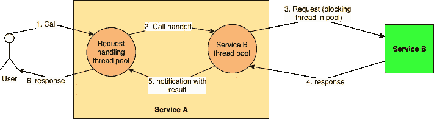

# 使用线程池的异步编程

> 原文：<https://levelup.gitconnected.com/asynchronous-programming-with-thread-pools-e42d6bacd171>


在我的[上一篇文章](https://medium.com/swlh/overcoming-io-overhead-in-micro-services-47d8f986268b)中，我描述了在 IO 密集型环境中提高线程利用率的策略。在这篇文章中，我将进一步研究基于线程的异步编程方法。每当我在这个讨论中提到“阻塞的线程”时，我指的是阻塞/等待 IO 的线程。这是我们试图消除的浪费——阻塞在 CPU 上的线程只能通过添加更多硬件来解除阻塞。这种策略允许我们实现大规模的系统规模，即使是在使用阻塞代码的情况下。

# 什么是基于线程的异步编程

基于线程的异步编程方法，也称为“*工作窃取*或“*舱壁*”，允许一个线程池将任务移交给另一个线程池(姑且称之为工作线程池)，并在工作线程池完成任务时被通知处理结果。

从调用线程的角度来看，系统现在变得*异步*，因为它在单个调用路径上的所有工作都不是按顺序完成的——它做一些事情，然后将与 IO 相关的任务移交给一个或多个工作线程池，然后回来从该点开始继续执行(在此之前已经完成了一些完全独立的任务)。

工作池中的线程仍然会因 IO 而被阻塞，但现在只有该池的线程会被阻塞，从而限制了系统的开销。不涉及 IO 活动的系统的其他代码路径由被释放的调用方线程按比例增加。系统吞吐量显著增加，因为调用线程不会无所事事地等待 IO 完成——它可以执行其他计算。



调用线程将其任务交给工作线程，并在完成时得到结果通知

理解这种行为的一个很好的类比是购物中心的收银台。只要不是每个人都在同一时间结账，少量的收银台就能应付大型购物中心的游客。只有少数工作人员(收银台的工作人员)被阻止使用收银功能，其他工作人员可以自由地协助购物者。如果一名工作人员必须从购物者进入购物中心的那一刻起一直陪伴着他们，那么购物中心可以容纳多少购物者？

一个更技术性的类比是连接池，例如数据库连接池或 TCP 连接池。在一个服务中，我们可以让所有想要调用另一个服务的线程创建它们自己的 RPC 连接(让我们忽略连接创建成本)并触发它们自己的 API 调用。然而，只要不是所有的线程都需要同时访问另一个服务(也就是说，系统还有其他事情要做)，我们就可以创建一个小的 RPC 连接工作池，并通过它们传递所有的 API 调用，从而解除调用线程的阻塞。通过在这个小线程池中多路复用调用，我们可以释放许多其他线程来做与 IO 无关的工作。这正是我们使用 [Apache 异步 HTTP 客户端](https://hc.apache.org/httpcomponents-asyncclient-4.1.x/index.html)或其他类似客户端时发生的情况。

# 处理任务完成

到目前为止，我们已经讨论了将工作卸载到工作线程。异步模型的另一个同样重要的方面是基于中断的程序执行模式。将任务卸载给工作线程后，调用线程需要知道当它从工作线程收到任务结果时，它在调用路径中的位置。但是跟踪运行时状态是一个问题。在哪里保存以及如何保存？

这个问题通常通过引入*回调*或*回调处理程序*来解决，回调处理程序是工作者线程在完成给它的任务时调用的方法。调用线程将这些回调注册到由工作池返回的 *Future* 中，语言/框架现在可以通过向调用线程发出中断(让它停止正在做的任何事情)并指示它执行相关的回调，在调用线程上轻松地跟踪和调用它们。移交看起来像这样:

1.  线程 1 调用 worker pool 给它一个任务。
2.  工作池中的线程 2 执行任务并调用回调。
3.  线程 1 得到一个中断并切换到执行回调

不同的语言给出不同的回调规定，但是最常见的是 *onComplete 和 onFailure* 的变体。顾名思义，当分配给工作池的任务成功或失败时，就会调用这些函数。

# 编码时间！

为了让事情更清楚，让我们看一些 Java 中的(伪)代码。在每个请求一个线程的模型中，对外部服务的 HTTP API 调用可能如下所示。

```
public class Client {
    public Response get(String url, Request request) {
        // API calling logic
    }
}public class CallingClass {
    private Client client = new Client(); public void call() {
        String url = “some-api-url”;
        Request requestData = new RequestData(); Response response = client.get(url, requestData);
        LOG.info(“Got data {}”, response);
   }
}
```

运行这个 *CallingClass* 代码的线程将通过客户端调用 API，然后等待从远程服务器返回的响应，这样它就可以将其解组到响应对象。然后，它会将其记录下来，并继续执行进一步的指令。都很熟悉。

在窃取工作的方式中，客户端包含一个内部线程池，所有请求都提交到这个线程池。 [*ExecutorService*](https://docs.oracle.com/javase/7/docs/api/java/util/concurrent/ExecutorService.html) 是 Java 中推荐的方式，当然你也可以自己动手卷。调用者线程返回一个 [*未来*](https://docs.oracle.com/javase/7/docs/api/java/util/concurrent/Future.html) (看看其他地方的期货和承诺之间的区别——令人迷惑！)指示任务将在未来完成，并且通知呼叫者。

客户端池的线程现在以相同的阻塞行为执行调用，但是对调用者线程隐藏，调用者线程同时继续服务于其他请求。当响应对象在客户端中准备好或者已知调用失败时，完成*未来*并且中断调用线程以执行*未来*的完成/失败处理程序。

```
public class AsyncClient {
    // Create thread pool of size 5 with task timeout of 300 ms
    private ExecutorService workerPool = new ThreadPoolExecutor(5, 5, 300, TimeUnit.MILLISECONDS, new ArrayBlockingQueue<>(10)); // The task to handover to the work pool
    private class ApiCallable implements Callable<Response> {
        private String url;
        private Request request;

        public ApiCallable(String url, Request request) {
            this.url = url;
            this.request = request
        }

        [@Override](http://twitter.com/Override)
        public String call() throws Exception {
            // API calling logic
        }
    } public Future<Response> get(String url, Request request) {
        return workerPool.submit(new ApiCallable(url, request));
    }
}public class CallingClass {
    private AsyncClient client = new AsyncClient(); public void call() {
        String url = “some-api-url”;
        Request requestData = new RequestData(); Future<Response> responseFuture = client.get(url, requestData);
        responseFuture.onComplete() {
          // callback handler for successful future completion
          LOG.info(“Success with data {}”, response);
        }.onFailure() {
          // callback handler for future completion failure
           LOG.error(“API call failed with response {}”, response);
        } LOG.info(“Moving on immediately”);
    }
}
```

这段代码将在任何其他日志消息之前记录“立即继续前进”,如果我们记录回调处理程序内的线程名称和 *AsyncClient* 的 *call()* 方法内的线程名称，我们将看到它们正在不同的线程上执行。

任何数量的线程都可以执行调用类代码，但是只要 *AsyncClient* 能够在不到 300 ms 的时间内完成给定的任务，它们都将保持自由去做其他事情，而它们的*未来*还没有完成。这就是异步编程帮助我们实现大规模系统的方式。

# 那我们开始吧。

尽管用专用线程池设计的大规模系统可以处理，但在开始使用基于线程的异步之前，我们需要注意一些问题。有些是与代码编写和维护相关的实际问题，有些则更具有哲理性。

## 那段代码看起来怪怪的！

对于大多数脱离了老式 Java 编程的程序员来说，这种回调式的编码闻起来像 Javascript，因此从定义上来说是邪恶的 T21。一旦您有一些并行或串行任务移交发生以创建嵌套回调(又名[回调地狱](http://callbackhell.com/))时，理解和调试这些代码会变得非常复杂。这是任何语言中所有异步编程的最大问题之一。

另一个更小的问题(至少在 Java-ville 中)是 [*ThreadLocal*](https://docs.oracle.com/javase/7/docs/api/java/lang/ThreadLocal.html) 变量不再工作。由于调用线程将工作移交给另一个线程，并转移到其他任务，任何存储为 *ThreadLocal* (许多服务中的请求上下文)的上下文都会丢失。传播它的唯一方法是在任务切换中将其作为参数显式传递，这通常会导致笨拙的 API 接受显式但不透明的“上下文”参数。

例如，代替纯的

```
Future<Response> response = client.get(url, request);
```

我们明白这一点，这里不清楚上下文与任何事情有什么关系。

```
Future<Response> response = client.get(context, url, request);
```

## 我们真的改变了什么吗？

回到购物中心/连接池的类比。有两种行为值得注意:
1。工人池的成员致力于一个特定的任务/一组任务——即使没有购物者购买任何东西，收银台仍然必须有人操作。或者，如果我们在上游添加一个缓存层，导致更少的数据库查询，那么数据库连接池仍然会得到维护。
2。池的大小不仅取决于它需要完成的工作量，还取决于工作的性质。例如，如果所有的购物者开始快速来到收银台，将需要更多的工人来处理他们。

这些行为向我们指出了工作窃取方法的主要缺点——随着系统操作环境的变化(规模、新任务、修改后的旧任务等),必须不断手动调整每个工作池的大小。使用线程池构建的系统的吞吐量只有在游戏的性质完全相同的情况下才能确定性地计算出来。我们必须不断地监视分配给每个工作线程池的任务的性质和数量是否在变化，如果是，新的线程分配应该是什么。

这种对持续监督的需求让我们有了更深刻的认识——我们根本没有改变基本的编程模型！！！调用线程只是假装被解除阻塞，但实际上它的阻塞已经被推送到其他线程。IO 仍然阻塞，每个 IO 任务仍然需要线程——即使我们最初的问题陈述是为了解决这个问题。

工作窃取在系统规模和对运行时波动的弹性方面给我们带来了显著的改进，但是它的重点是隔离和遏制线程阻塞的问题。它没有消除根本原因，而是巧妙地移动阻塞来减轻损害。

消除这个问题的一个根本不同的方法是使用真正的非阻塞 IO 范式(也称为 NIO)。又名基于事件的异步编程，又名反应式编程)，像 [node.js](https://nodejs.org/en/) 或 [Vert.x](https://vertx.io/) ，其中线程永远不会在 IO 上被阻塞，我们也不需要创建和维护工作线程池。我们将在后续的博客文章中探讨这一范式。

术语“工作窃取”强调工作池从调用线程“窃取”一些工作。

术语“舱壁”来自造船类比，其中船的底部潜入水密的 [*舱壁*](https://en.wikipedia.org/wiki/Bulkhead_(partition)) 中，以防船体破裂时水扩散到整个船上——这相当于一个工人池，将所有其他线程隔离开来，使其不必执行某种类型的任务。


散装头隔离船的部分，以防止下沉

# 更新

这个帖子在 Reddit 上引发了一场内容丰富的讨论！点击查看[。](https://www.reddit.com/r/programming/comments/duc9kj/asynchronous_programming_using_thread_pools/)

*如果你喜欢这篇文章，你可以订阅* [*我的邮件列表*](https://www.kislayverma.com/) *了解最新消息。*