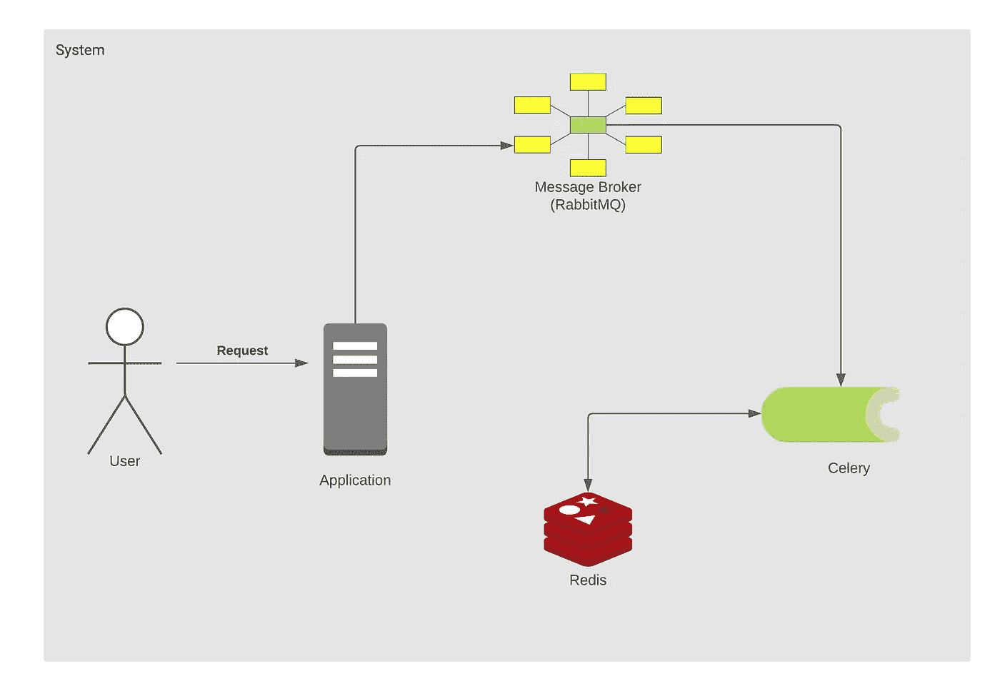
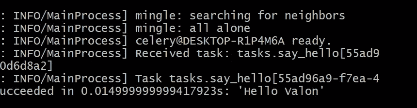
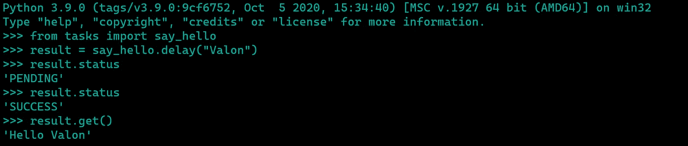
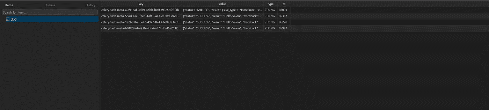

# 用 Celery + RabbitMQ + Redis 实现 Python 中的异步任务

> 原文：<https://levelup.gitconnected.com/asynchronous-tasks-in-python-with-celery-rabbitmq-redis-480f6e506d76>

在本文中，我们将使用 Celery、RabbitMQ 和 Redis 来构建一个分布式任务队列。但是什么是分布式任务队列，为什么要建立一个呢？

> 一个**分布式任务队列**允许你将工作卸载到另一个进程，以异步(一旦你将工作推送到**队列**，你就不用等待)和并行(你可以使用其他内核来处理工作)的方式处理。

因此，它基本上让您能够在后台执行任务，同时应用程序继续解决其他任务。



# 任务队列的用例

最基本和最容易理解的例子是在用户注册后发送电子邮件。在这种情况下，您不知道将电子邮件发送给用户需要多长时间，可能需要 1 毫秒，但也可能需要更长时间，有时甚至根本不发送，因为在这些情况下，您不负责或者只是说您不知道任务将会成功完成，因为另一个提供商将为您完成这项任务。
现在您已经简单了解了如何从任务队列中获益，识别此类任务就像检查它们是否属于以下类别一样简单:

*   **第三方任务**—web 应用程序必须快速为用户提供服务，而不需要在页面加载时等待其他操作完成，例如发送电子邮件或通知，或将更新传播到内部工具(例如为 A/B 测试或系统日志收集数据)。
*   **长时间运行的作业** —资源昂贵的作业，用户在计算结果时需要等待，例如，复杂的工作流执行(DAG 工作流)、图形生成、类似 Map-Reduce 的任务以及媒体内容(视频、音频)服务。
*   **周期性任务** —您计划在特定时间或间隔后运行的任务，例如每月报告生成或每天运行两次的 web scraper。

# 为芹菜设置依赖项

*Celery* 需要一个消息传输来发送和接收消息。可以用作消息代理的一些候选对象有:

*   [RabbitMQ](https://www.rabbitmq.com/)
*   [Redis](https://redis.io/)
*   [亚马逊 SQS](https://aws.amazon.com/sqs/)

在本教程中，我们将使用 *RabbitMQ* ，你可以使用任何其他你想要的消息代理(例如。Redis)。

提到我们现在要用 Redis 做什么也很好，因为对于消息传输器，我们使用 RabbitMQ。
当任务被发送到代理，然后由 celery worker 执行时，我们希望保存状态，并查看哪些任务之前已经被执行过。为此，您将需要某种类型的数据存储，对于这一个，我们将使用 Redis。

对于结果商店，我们也有许多候选:

*   雷迪斯·AMQP
*   Memcached
*   姜戈·奥姆 SQLAlchemy
*   Apache Cassandra，Elasticsearch，Riak 等

为了设置这些服务，我们将使用 docker，因为它很容易设置，它是一个隔离的环境，当您有一个配置(Dockerfile 或 docker-compose)时，您可以很容易地复制相同的环境。

## 项目设置

让我们从头开始一个新的 python 项目。首先让我们创建一个新目录，创建项目所需的所有文件，然后初始化虚拟环境。

```
$ touch docker-compose.yml requirements.txt
$ touch tasks.py# create & activate the virtualenv$ python -m venv env
$ source env/bin/activate 
```

现在让我们安装 requirements.txt **中的项目需求。对于这个项目，我们只需要芹菜和红萝卜。**

```
pip install celery==5.0.5 redis 
```

现在是时候配置 docker-compose 运行 RabbitMQ 和 Redis 了。在 **docker-compose.yaml** 中粘贴以下 yaml 配置。

这里我们简单地启动两个服务，通过定义 image 键指向 [dockerhub](https://hub.docker.com/) 中的图像，映射端口`<host:docker>`，并添加环境变量。要查看您的图像可以使用什么类型的环境变量，您可以简单地转到 dockerhub 中的相应图像，并查看文档。例如，您可以在这里查看如何使用 RabbitMQ 图像

现在，让我们初始化芹菜应用程序，使用 RabbitMQ 作为消息传输器，使用 Redis 作为结果存储。
在 **tasks.py** 中，我们继续粘贴以下代码:

我试图让代码尽可能少，这样你就能理解本教程的目的。
如您所见，我们已经定义了 RabbitMQ 和 Redis 的 URL，然后我们简单地使用这些配置初始化 celery 应用程序。第一个参数`tasks` 是当前模块的名称。

然后我们用`@app.task`来修饰函数`say_hello`，这表明该函数被标记为一个任务，然后稍后可以使用`.delay()`来调用，稍后我们将看到。

> 通常我们会有一个模块`celery_app.py`来初始化 celery 应用程序实例，然后有一个单独的模块`tasks.py`来定义我们希望 celery 运行的任务。

## 用 docker 构建和运行服务

现在我们只需要用 docker 运行服务(RabbitMQ 和 Redis)。要运行容器中的图像，我们只需运行:

```
$ docker-compose up -d 
```

如果本地没有这些图像，这将需要一段时间。然后，为了验证容器是否启动并运行，我们编写:

```
$ docker ps
```

您应该看到两个正在运行的服务，以及每个服务的附加信息，如果没有，请检查日志中是否有任何可能的错误。
现在让我们启动芹菜工人，然后让我们试着用`python interactive shell.`运行一些任务

```
# Starting the Celery worker$ celery -A tasks worker -l info --pool=solo
```

这将运行 celery worker，如果您看到日志，它应该会告诉您它已经成功地与代理连接。

现在让我们运行一个任务。

```
# Running celery tasks$ python
---------------------------------
Type "help", "copyright", "credits" or "license" for more information.
>>> from tasks import say_hello
>>> say_hello.delay("Valon")
<AsyncResult: 55ad96a9-f7ea-44f4-9a47-e15b90d6d8a2>
```

我们可以看到我们使用**调用了这个函数。delay()** 然后传递了名称实参。这个方法实际上是另一个名为 **apply_async()的方法的星形参数快捷方式。**然后我们看到我们得到了`<AsyncResult`，这是传递给代理的任务，之后将被 celery 在后台消耗和完成。

如果您现在查看您的员工，您将在日志中看到该员工收到了一项任务，然后在 5 秒钟后会告诉您该任务已成功完成。



现在让我们运行相同的任务，但是现在让我们将结果存储在游戏中。在 python shell 中，让我们将结果存储在一个变量中，然后让它的属性。



> 如果我们没有在 celery (Redis)上配置后端，我们就不能访问这些属性或功能，因为默认情况下它不会存储任何状态，但是既然我们有了它，我们就可以看到并获得关于我们任务的信息。如果你想深入了解，你可以用 table plus 这样的工具访问 Redis 数据库，或者你可以设置`Flower`来监控 Redis 和 RabbitMQ。



如上图所示，所有的任务都存储在 Redis 中。

## 包扎

在本文中，我们用 Celery、RabbitMQ 和 Redis 从头开始建立了一个 python 应用程序。这篇文章的目的是向您展示什么是任务队列，我们可以从中受益，以及如何实现它。
任务的例子只是为了演示，但是您可以使用与我在这个例子中相同的配置，在 tasks 模块中添加任务，在 **celery_app.py 中添加配置**参见文档[此处](https://docs.celeryproject.org/en/stable/getting-started/next-steps.html)

我强烈建议你在你的应用程序中使用芹菜，因为当你有需要花费较长时间的事情，你需要安排任务等等时，它非常有用。

**您可以在 GitHub 资源库上找到文章的完整源代码，以及说明。**

[www.github.com/vjanz/python-asynchronous-tasks](https://github.com/vjanz/python-asynchronous-tasks)

如果你觉得它有帮助，请不要忘记鼓掌&在你的社交网络上或与你的朋友分享。

**如果你想支持我的工作，你可以点击下面的图片给我买杯咖啡😄**

[](https://www.buymeacoffee.com/valonjanuzaj)

如果你有任何问题，请随时联系我。

在 [LinkedIn](https://www.linkedin.com/in/valon-januzaj-b02692187/) ， [GitHub](http://www.github.com/vjanz) 上和我联系