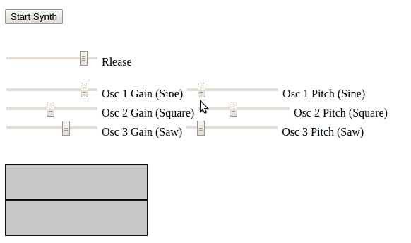
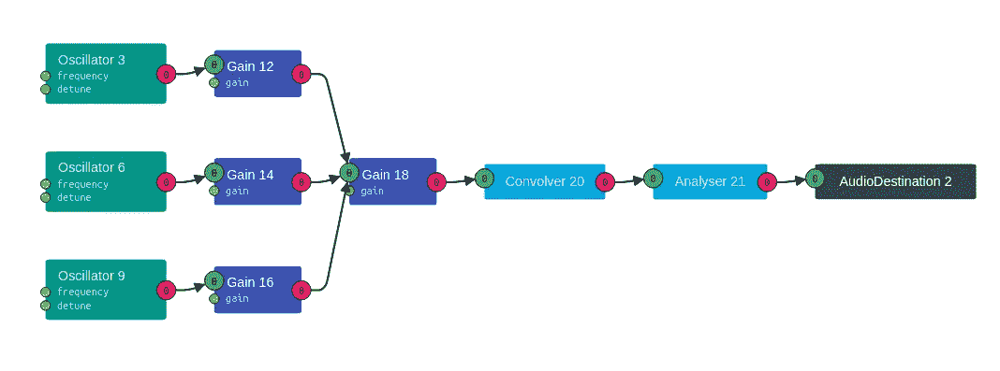

# Javascript 的可听波

> 原文：<https://levelup.gitconnected.com/audible-waves-of-javascript-fc8322c9f02>


[*翁弗勒*](https://en.wikipedia.org/wiki/A_Cart_on_the_Snowy_Road_at_Honfleur) 雪道上的一辆马车(1865 或 1867)，莫奈的第一幅雪景。

# 使用网络音频 API 进行数字音频合成

在人类正在研究合成人类意识的时候，音频合成听起来可能很原始。但是，我们难道不能同意，作为五种感官中的一种，声波在我们的日常生活中起着主导作用吗？

本文旨在探索数字音频合成的*在一个 ***开发者友好的环境*** 中使用*[***Web 音频 API***](https://developer.mozilla.org/en-US/docs/Web/API/Web_Audio_API)**

**为了了解 Web Audio API 有多强大，我试图构建一个在浏览器中运行的合成器，并设法将以下功能构建到“合成器”中。**

1.  **三个振荡器。**
2.  **每个振荡器的音高控制。**
3.  **三声道混频器。**
4.  **主通道上的混响效果。**
5.  **键盘来演奏 c 大调音阶(这样我们就不会听起来很难听)。**
6.  **按键释放的释放信封。**
7.  **示波器(这样我们可以看到实际的波形)。**

****此处代码可用**[](https://github.com/DumindaWijesinghe/web-audio-api-demo)****。******

****[](https://github.com/DumindaWijesinghe/web-audio-api-demo) [## DumindaWijesinghe/we B- audio-API-demo

### 为了了解 Web Audio API 有多强大，我尝试构建了一个在浏览器中运行的合成器，并成功构建了…

github.com](https://github.com/DumindaWijesinghe/web-audio-api-demo) 

“Release”故意拼错是为了引起你的注意:)

我们可以使用[网络音频检查器](https://github.com/google/audion/wiki/How-to-Use)来查看发生了什么，这就是我们的设置。在调试代码时，查看哪个模块链接到哪个模块非常方便。



让我们简单看一下图中的模块。

## 音频环境

`AudioContext`是这里发生的一切的容器，或者我们可以称之为音频处理图。AudioContext 处理图中每个节点的创建。

```
audioCtx **=** **new** AudioContext();
```

## 振荡器

振荡器节点负责生成波。我们可以从`"sine"`、`"square"`、`"sawtooth"`、`"triangle"`、`"custom"`中选择。在我们的实现中，振荡器 1 使用了`"sine"`，振荡器 2 使用了`"square"`，振荡器 3 使用了`"sawtooth"`。

```
osc1 **=** audioCtx.createOscillator();osc1.type **=** "sine";osc2 **=** audioCtx.createOscillator();osc2.type **=** "square";osc3 **=** audioCtx.createOscillator();osc3.type **=** "sawtooth";
```

## 获得

我们可以把增益节点想象成音量旋钮，它是我们用来构建混音器和释放包络的。

```
amp1 **=** audioCtx.createGain();amp2 **=** audioCtx.createGain();amp3 **=** audioCtx.createGain();master **=** audioCtx.createGain(); // Release envelop
```

## 卷积器

这是我们用来实现混响效果的节点。

```
convolver **=** audioCtx.createConvolver();
```

## 分析者

分析器节点可以提取用于分析和可视化目的的实时信息。

```
analyser **=** audioCtx.createAnalyser();
```

这是目前的全部设置。当然，我们还有很多可以改进的地方，但就概念验证而言，这太棒了。

有了像 [Tone.js](https://tonejs.github.io/) 这样的高级框架，Web Audio API 在音频制作工作流程中的各种应用中都有很大的潜力。期待着修补程序，当我有东西要展示的时候，我会写下来的。

在那之前，继续黑吧…****