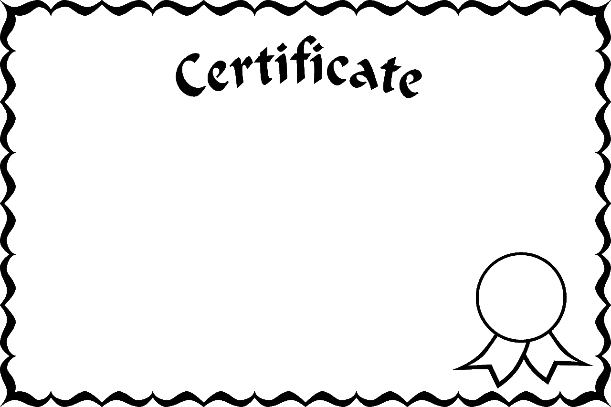
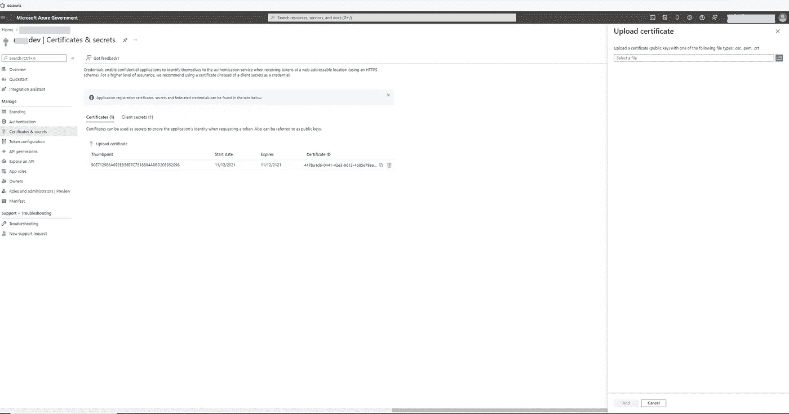
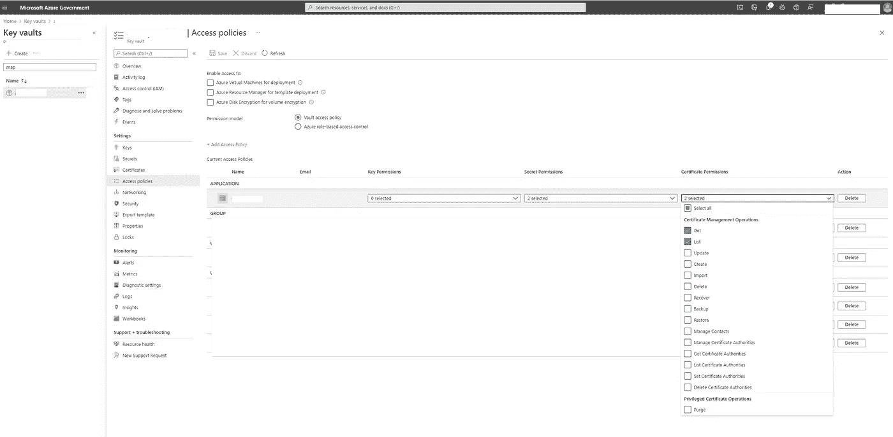

# 使用客户端凭据流中的证书针对 azure ad 进行身份验证

> 原文：<https://levelup.gitconnected.com/authenticate-against-azure-ad-using-certificate-in-a-client-credentials-flow-c02eedec4ed9>



我有一个 API，它需要针对 azure AD 进行身份验证，以获得调用另一个下游 API 的访问令牌。当在 azure AD 中为调用者 API 注册应用程序时，我可以为 API 设置一个共享秘密或证书，作为其在客户端凭证流中的凭证的一部分。在过去，我一直使用共享的秘密，因为它更方便，更容易设置。但是，使用证书可以提供更强的安全性。在花了几个小时的谷歌搜索和黑客攻击后，我能够设置并使用一个证书而不是一个共享秘密作为调用者 API 的凭证来验证 azure AD。

# 为什么使用证书比共享密钥更安全？

共享密码就像明文密码一样。在访问令牌请求中，客户端传输共享秘密，没有任何伪装，如下面的示例请求所示。任何知道客户端 id 和共享密钥的人都可以模拟客户端。下面的代码片段显示了一个来自[文档](https://docs.microsoft.com/en-us/azure/active-directory/develop/v2-oauth2-client-creds-grant-flow#first-case-access-token-request-with-a-shared-secret)的请求示例。

```
POST /{tenant}/oauth2/v2.0/token HTTP/1.1           //Line breaks for clarity
Host: login.microsoftonline.com
Content-Type: application/x-www-form-urlencoded

client_id=535fb089-9ff3-47b6-9bfb-4f1264799865
&scope=https%3A%2F%2Fgraph.microsoft.com%2F.default
&client_secret=sampleCredentia1s
&grant_type=client_credentials
```

另一方面，当使用证书时，客户端不传输证书。相反，客户端使用证书的私钥对请求进行签名。Azure AD 使用证书的公钥来验证签名。如果签名验证通过，azure AD 知道该请求一定是由拥有证书的客户端签名的。下面来自[文档](https://docs.microsoft.com/en-us/azure/active-directory/develop/v2-oauth2-client-creds-grant-flow#second-case-access-token-request-with-a-certificate)的片段显示了一个使用证书的访问令牌请求。

```
POST /{tenant}/oauth2/v2.0/token HTTP/1.1               // Line breaks for clarity
Host: login.microsoftonline.com
Content-Type: application/x-www-form-urlencoded

scope=https%3A%2F%2Fgraph.microsoft.com%2F.default
&client_id=97e0a5b7-d745-40b6-94fe-5f77d35c6e05
&client_assertion_type=urn%3Aietf%3Aparams%3Aoauth%3Aclient-assertion-type%3Ajwt-bearer
&client_assertion=eyJhbGciOiJSUzI1NiIsIng1dCI6Imd4OHRHeXN5amNScUtqRlBuZDdSRnd2d1pJMCJ9.eyJ{a lot of characters here}M8U3bSUKKJDEg
&grant_type=client_credentials
```

在上面的请求中，client_assertion 参数是

> *您需要创建一个断言(一个 JSON web 令牌),并用您注册为应用程序凭证的证书进行签名。阅读关于证书凭据，了解如何注册您的证书和声明的格式。*
> 
> [*用证书请求访问令牌*](https://docs.microsoft.com/en-us/azure/active-directory/develop/v2-oauth2-client-creds-grant-flow#second-case-access-token-request-with-a-certificate)

# 使用 azure key vault 设置自签名证书

证书可以来自不同的来源。例如，您可以将它存储在 Windows 证书存储区、硬盘上的某个位置、azure key vault 等，Azure key vault 具有存储和管理证书的内置支持。此外，由于我的应用运行在 azure 应用服务上，并使用托管身份连接到 azure key vault，因此使用 azure key vault 来存储证书似乎是显而易见的。

关于如何创建一个应用程序中使用的自签名证书的信息，请查看[文档](https://docs.microsoft.com/en-us/azure/key-vault/certificates/quick-create-portal)。

# 将证书上传到 azure 应用注册

创建证书后，下载 CER 或 PFX/PEM 格式的证书。就我而言，我下载了。CER 档案。证书文件包含我上传到调用者 API 的应用注册的公钥信息。



在 azure 应用注册中上传证书

# 使用 Microsoft 身份验证库的代码设置。NET(MSAL.NET)和 Azure Key Vault 证书客户端库。网

在应用程序中，我使用 MSAL.NET 为调用者 API 请求一个访问令牌。我只需要设置一个`IConfidentialClientApplication`并使用 API 方法`AcquireTokenForClient`根据 azure AD 方便地验证客户端，并通过客户端凭证流获得访问令牌。我将检索访问令牌的所有逻辑封装在一个类中，如下面的代码片段所示。

```
using Azure.Identity;
using Azure.Security.KeyVault.Certificates;
using App.Core.Options;
using Microsoft.Extensions.Options;
using Microsoft.Identity.Client;
using System;
using System.Security.Cryptography.X509Certificates;
using System.Threading.Tasks;    

public class AzureTokenService 
    {
        private readonly IConfidentialClientApplication _confidentialClientApplication;
        private readonly AzureADOptions _azureADOptions;
        private readonly KeyVaultOptions _keyVaultOptions; 

        public AzureTokenService(IOptions<AzureADOptions> azureADOptions,
            IOptions<KeyVaultOptions> keyVaultOptions)
        {
            _azureADOptions = azureADOptions.Value;
            _keyVaultOptions = keyVaultOptions.Value;

            _confidentialClientApplication = ConfidentialClientApplicationBuilder.Create(_azureADOptions.ClientId)
                .WithCertificate(GetCertificate())
                .WithAuthority(_azureADOptions.Authority).Build();
        }

        public async Task<string> GetToken()
        {
            AuthenticationResult result = await _confidentialClientApplication.AcquireTokenForClient(new string[] { _azureADOptions.Scope })
                   .ExecuteAsync();

            return result.AccessToken;
        }

        private X509Certificate2 GetCertificate()
        {
            var certificateClient = new CertificateClient(vaultUri: new Uri(_keyVaultOptions.URL), credential: new DefaultAzureCredential());
            var keyVaultCertificate = certificateClient.DownloadCertificate(_azureADOptions.KeyVaultCertificateName);

            return keyVaultCertificate;
        }
    }
```

从上面的片段中可以注意到，在配置`IConfidentialApplication`时，可以通过调用 ConfidentialClientApplicationBuilder 上的`WithCertificate`()方法并传入 X509Certificates 类型的证书来设置证书。

以下片段显示了我的应用程序设置中的配置。

```
"AzureADOptions": {
        "TenantId": "********-****-****-****-4a418e0cca7e",
        "ClientId": "********-****-****-****-4415a019b235",
        "Scope": "api://7********-****-****-****-9acf38c274a9/.default",
        "Authority": "https://login.microsoftonline.us/********-****-****-****-4a418e0cca7e/v2.0/",
        "KeyVaultCertificateName": "MyAppCert"
    },

    "KeyVault": {
        "URL": "https://keyvaulturl"
    },
```

请注意，您用来访问密钥库的 azure 凭据需要拥有获取和列出证书权限。在我的例子中，由于我使用托管身份，所以我将权限分配给托管身份。



配置用于检索证书的密钥库访问策略

# 参考

[公钥如何验证签名](https://stackoverflow.com/questions/18257185/how-does-a-public-key-verify-a-signature)

[快速入门:使用 Azure 门户从 Azure Key Vault 设置和检索证书](https://docs.microsoft.com/en-us/azure/key-vault/certificates/quick-create-portal)

[第一种情况:具有共享秘密的访问令牌请求](https://docs.microsoft.com/en-us/azure/active-directory/develop/v2-oauth2-client-creds-grant-flow#first-case-access-token-request-with-a-shared-secret)

[第二种情况:带有证书的访问令牌请求](https://docs.microsoft.com/en-us/azure/active-directory/develop/v2-oauth2-client-creds-grant-flow#second-case-access-token-request-with-a-certificate)

[微软身份平台应用认证证书凭证](https://docs.microsoft.com/en-us/azure/active-directory/develop/active-directory-certificate-credentials)

[与微软一起使用证书。Identity.Web](https://github.com/AzureAD/microsoft-identity-web/wiki/certificates#using-certificates-with-microsoftidentityweb)

的 Azure Key Vault 证书客户端库。网

[微软认证库。NET(MSAL.NET)](https://github.com/AzureAD/microsoft-authentication-library-for-dotnet/wiki#conceptual-documentation)

*原载于 2021 年 11 月 13 日 https://www.taithienbo.com*[](https://www.taithienbo.com/authenticate-against-azure-ad-using-certificate-in-a-client-credentials-flow/)**。**