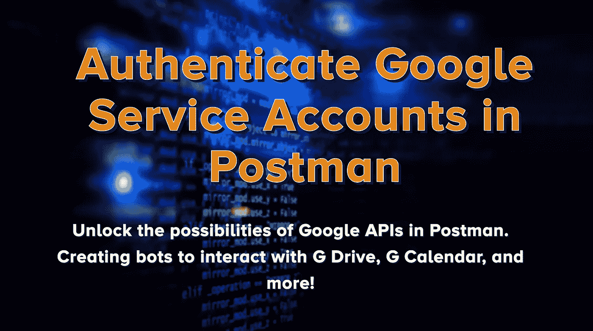
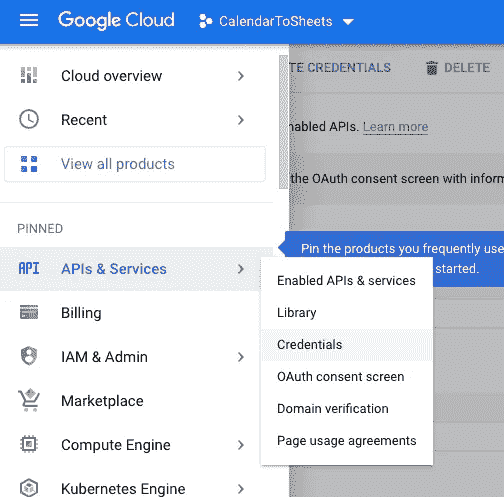
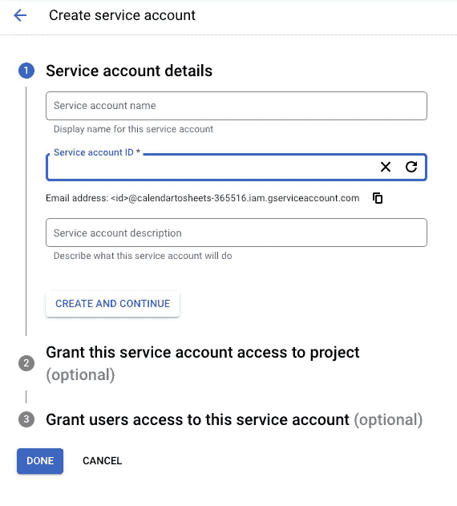
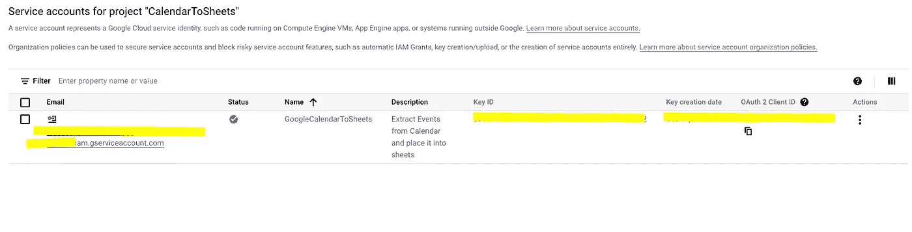
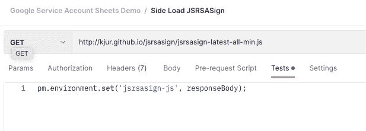
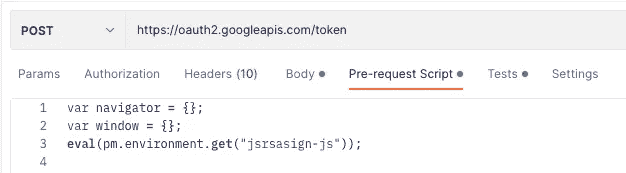
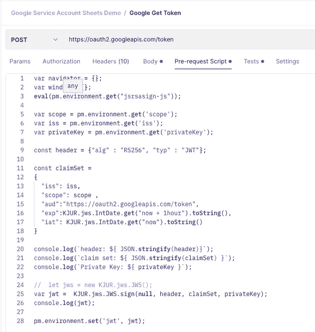
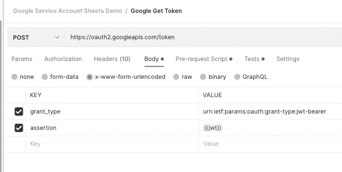
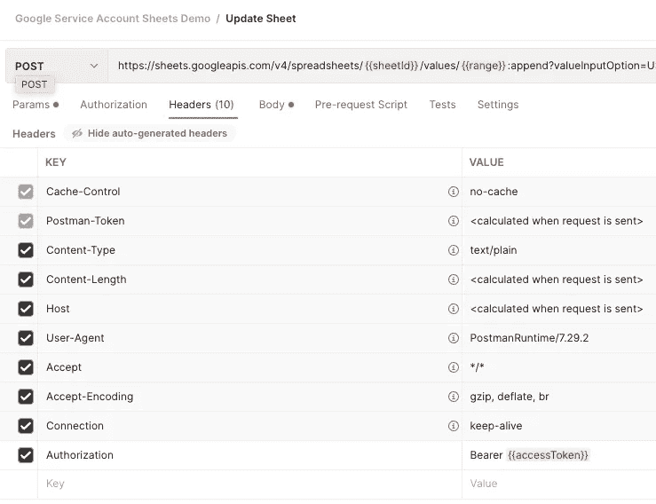

# 在 Postman 中验证 Google 服务帐户

> 原文：<https://levelup.gitconnected.com/authenticate-google-service-accounts-in-postman-c6ad065d6cb>

## 在 Postman 中释放 Google APIs 的可能性。创建机器人与 G 驱动器，G 日历，和更多！

在 Postman 中验证 Google 服务帐户

如果你只知道 Postman 是一个调用 API 的工具，那么你还只是刚刚接触到皮毛。我的其他文章描述了如何使用它们的监视器特性在 Postman 中创建机器人。在创建这些无服务器机器人时，我发现 Google APIs 有许多用途和需求。

我有一个需求，需要将数据存储在一个 google sheet 中。在尝试自动化 Google 电子表格数据输入时，我遇到了一个问题。谷歌服务不允许我在没有*在场登录*的情况下使用 OAuth 进行认证！

然而，谷歌允许你创建一个*服务账户*，它可以像另一个普通账户一样——分享权限、文件、日历、文档等。服务帐户的主要用途是用于服务器到服务器的代码，因此您无需亲自登录即可访问您的数据；你能做的就是把你想要的数据分享给服务账号，就好像是另外一个人一样！

服务器到服务器的认证交互机制要求应用程序创建 JSON Web 令牌(jwt)并对其进行加密签名。

[JSON 网络令牌](https://jwt.io/)，或 jwt，是代表双方声明的加密有效载荷。我们可以用 JWT 交换访问令牌。然而，谷歌要求我们的 JWT 签署了 RSA-256 签名。

谷歌在这里概述了如何认证。

## 创建服务帐户

去[谷歌的云控制台](https://console.cloud.google.com/)创建一个项目。然后在凭证下创建 Google 服务帐户。它还会给你一个公钥和私钥对。您将需要存储这个私钥，以便以后在 Postman 中使用。

如果您想要使用此服务帐户来自动处理表单或日历，则您需要像使用任何其他帐户一样将资源共享到电子邮件。对于大多数 Google Drive 产品，只需使用 UI 中的分享按钮即可。

创建一个谷歌云项目，并创建一个服务帐户

通过使用 Google 服务帐户的电子邮件进行共享来访问资源。

## 侧装 JRS-分配

Postman 可以通过向 CDN 发出请求并设置对环境的响应(库代码)来导入第三方库。然后我们可以使用这个库，但是要把它从环境中取出来并运行 *eval()* 。

对于 JSR 赋值库，我必须模拟 browser 和 navigator 对象，因为库期望代码在 web 浏览器中运行。

通过 CDN 请求库，并将库存储在您的环境中。

在任何你想使用这个库的地方，使用 eval()并创建它可能需要的依赖项。

## 创建和签署 JWT 索赔集

在工作流的后续请求中，我们向*发出一个 POST 请求*

*请求体中需要一个 JWT，因此在请求前脚本中，我们将在发送请求之前创建 JWT。*

*这里列出了谷歌对 JWT 的要求。*

*我们首先需要创建 JWT 报头，它将告诉我们令牌的算法和类型。*

*接下来，我们构建一个声明集，它将包括服务帐户的电子邮件、我们想要访问的 API 和权限的范围、截止日期以及发布声明的时间。这些与相应的邮递员集合一起被记录。*

*接下来，我们使用 JRS 分配库来签署 JWT，并在创建 Google 服务帐户时包含私钥，并将其保存到环境中，使其在请求中可用。*

**

*创建和签署 JWT 的预请求脚本*

*下面我找到了一个 StackOverflow 帖子，解释了这个脚本，如果你需要另一个视角的话。*

**

*JWT 曾经获得一个访问令牌*

## *在 Google API 请求中使用令牌*

*现在，我们可以在与电子表格、日历、g 盘、照片等交互时使用令牌。*

*请确保与服务帐户共享资源。*

**

*使用 google 电子表格的访问令牌示例*

# *使用*

*我经常使用这个。*

*   *自动执行电子表格，并从其他 API 数据源自动填充，以便为您的报告迁移数据或存储数据*
*   *使用 Twilio 创建日历事件或提醒事项*
*   *任何谷歌资源都由你支配*

# *TL；速度三角形定位法(dead reckoning)*

*   *侧装 JRS-将库分配给邮递员*
*   *创建一个索赔集，并对其进行签名以创建 JWT。与谷歌交易一个服务帐户*
*   *像其他用户一样与任何资源共享服务帐户，然后编写您的集成或自动化代码！*

*导入我的收藏以开始使用它，或者在您的收藏中将它用作模板！*

*[在 LinkedIn 上联系我](https://www.linkedin.com/in/stcalica/)。*

*就业市场很艰难，但科技是我的激情所在，我希望❤能给我一点咖啡*

# *其他邮递员和 API 文章*

*   *[创建邮递员不和机器人](/automate-the-boring-stuff-with-postman-discord-bots-9a2ad0088792)*
*   *[有邮差和不和的 web sockets](/websockets-with-postman-and-discord-db26efed56c1)*
*   *[使用 Postman Hack 同步截图](https://medium.com/swlh/automate-the-boring-stuff-with-postman-syncing-product-screenshots-3af6e0e2e2cf)*

*[在 LinkedIn 上和我联系](https://www.linkedin.com/in/stcalica/)。*

* [## 如何在 CryptoJS 中用私钥(pem)签署 JWT？

### 邮递员的出现改变了这一点。我有一个解决办法给你，但无论如何这都不是一个干净方法。你会…

stackoverflow.com](https://stackoverflow.com/questions/53965446/how-to-sign-a-jwt-with-a-private-key-pem-in-cryptojs)*