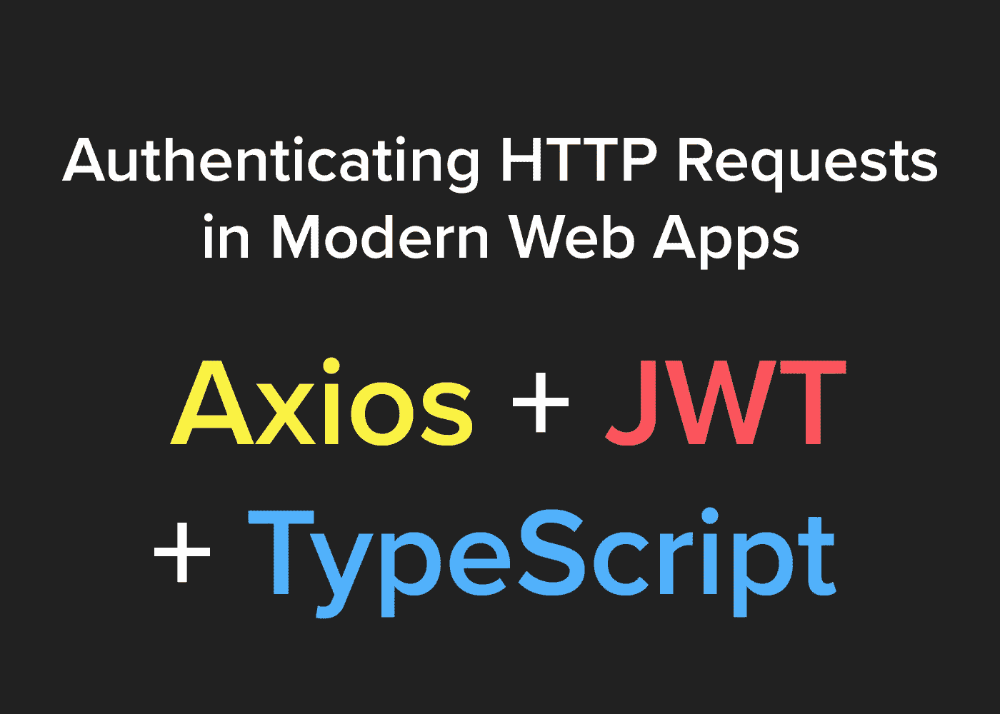

# 在现代 Web 应用程序中验证 HTTP 请求

> 原文：<https://levelup.gitconnected.com/authenticating-http-requests-in-modern-web-apps-6fd9099269f1>

## 确保您的用户使用 Axios、JWT 和 TypeScript 等现代技术进行身份验证。

确保用户通过身份验证是创建现代 web 应用程序的重要部分。今天，我们将了解一种在 Axios 上使用 JWT 访问和更新令牌的通用方法。这些例子将用 TypeScript 编写，但也应该用普通的 JavaScript 编写。如果你感兴趣，可以通过这个代码沙盒链接访问示例代码:[https://codesandbox.io/s/react-typescript-n8hmb?fontsize=14](https://codesandbox.io/embed/authenticating-http-requests-in-modern-webapps-n8hmb)

## 安装依赖项

简单地运行`npm i jsonwebtoken axios -S`，如果你使用的是 TypeScript，一定要保存为 dev 依赖项`npm i typescript -D`。

## 设置身份验证实用程序

为了创建一些与浏览器 localStorage API 和我们的 JWT 逻辑交互的可重用函数，我们将创建一个身份验证实用程序文件`auth.ts`。这将包含在我们执行 API 调用之前确定用户是否经过身份验证的逻辑。该文件还将提供一些函数，当需要更新访问和刷新令牌时，这些函数将为我们提供检索和设置这些令牌的权限。

## 使用 Axios 执行 HTTP 请求

在我们与 Axios 的集成中，我们希望提供一些功能，让我们能够访问外部 API，这些 API 将为我们处理身份验证。我们希望有一个契约，只要求我们指定一个端点和任何相关数据。让我们来看看这是如何做到的。我们将这个文件称为`api.ts`。

这里我们有一个名为`performAuthenticatedRequest`的助手函数，它可以用来提供`get`、`post`、`put`和`delete`方法来执行对我们指定的任何外部 API 的 HTTP 请求。

您需要在后端实现为给定的刷新令牌检索新的访问令牌的逻辑——或者使用像 [Auth0](https://auth0.com/) 这样的服务来为您完成这项工作。

## 结论

这就是全部了！代码并不多，但是理解这里的逻辑划分并创建可重用的函数是很重要的，这些函数允许我们被认证并与外部 API 通信。

## 有兴趣了解更多关于 TypeScript 的知识吗？

 [## 如何构建你的 TypeScript + React + Redux 应用

### 一个简单的、声明性更强的 React + Redux 应用指南

medium.com](https://medium.com/swlh/how-to-structure-your-typescript-react-redux-app-877d1eba1c1e) 

*感谢您的阅读，祝您的项目好运！如果你有任何问题，请留言或给我。*

 [## 学习 JavaScript -最佳 JavaScript 教程(2019) | gitconnected

### JavaScript 是世界上最流行的编程语言之一——它随处可见。JavaScript 是一种…

gitconnected.com](https://gitconnected.com/learn/javascript)