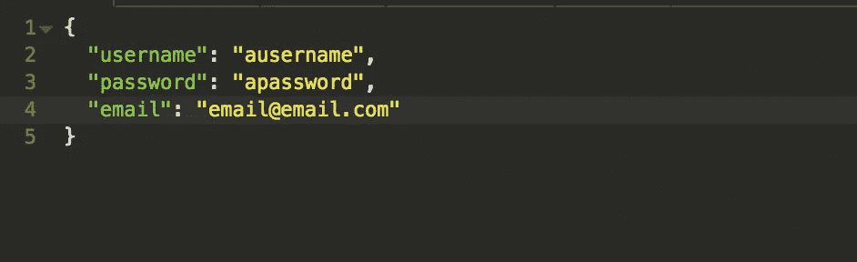
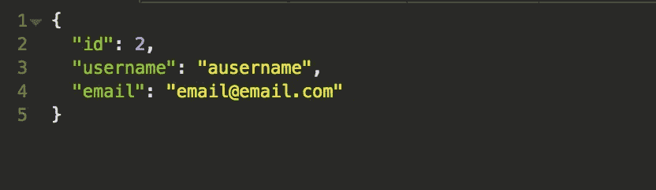
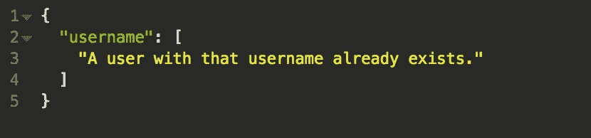

# Django & Django Rest 框架中的认证

> 原文：<https://levelup.gitconnected.com/authentication-in-django-django-rest-framework-be1ae3168d26>

总是首先引用 Django 文档。它们信息量大，很有帮助。但是首先，最好知道 Django 有自己的[用户模型](https://docs.djangoproject.com/en/3.0/ref/contrib/auth/#django.contrib.auth.models.User)，所以你不需要在你的 models.py 中创建一个(除非你想在你的用户模型中有额外的字段。如果是这种情况，请随意阅读我关于[定制用户模型](https://medium.com/@chilinski.a/django-custom-user-model-dace8aaf1148)的博文。内置用户模型需要——最少——用户名、密码和电子邮件。我艰难地认识到需要电子邮件(很遗憾，我花了太多时间才弄明白，因为我最初以为只需要用户名和密码。我的错)。它还可以有“名字”和“姓氏”字段，但这不是创建新用户所必需的。好消息是——Django 会自动为你散列密码！

文档[中有更多关于用户模型的内容，比如组和权限。通过授予用户权限，您可以允许他们只执行某些操作(HTTP 请求)。您甚至可以将用户分组，这样您就可以根据您希望他们拥有的权限类型对他们进行分组(例如，员工、客户、经理等将拥有不同的权限)。](https://docs.djangoproject.com/en/3.0/topics/auth/default/)

Django 还提供发送请求的 URL(登录、注销等)。在这里，医生们会对它们进行彻底的检查。要使用它们，您需要将它们包含在您的主 urls.py 中，如下所示:

```
urlpatterns = [
   path('accounts/', include('django.contrib.auth.urls')),
]
```

可以想象，登录需要用户的凭证(通过 POST 方法)，如果成功，将把登录的用户重定向到指定的下一个页面。这些视图需要不会自动构建到 Django 项目中的模板。所以你必须自己创造。如果您不更改上面的任何 URL，登录 URL 将查找名为“registration/login.html”的模板。因此，请确保使用您指定的代码创建一个包含 login.html 文件的注册文件夹。这些文档在上面的链接中有一个样本模板。您还可以创建自己的自定义模板，如果要在您的 URL 中对此进行编码，还可以自定义更多的 urls.py:

```
path('accounts/login/', auth_views.LoginView.as_view(template_name='myapp/login.html')),
```

其中，模板名称是您称之为登录模板的任何内容。您甚至可以更改 URL，这样您就可以将登录页面设置为“accounts/signin/”，而不是“accounts/login”

唯一没有指定的 URL，或者说我没有看到指定的 URL，是用于创建新用户或注册的。过去，我已经创建了自己的注册序列化器和注册视图。记住，对于这一部分，您需要在项目中安装 [django-rest-framework](https://www.django-rest-framework.org/) 。

serializers.py:

```
from rest_framework import serializers
from django.contrib.auth.models import Userclass RegisterSerializer(serializers.ModelSerializer):
   class Meta:
      model = User
      fields = ('id', 'username', 'email', 'password')
      extra_kwargs = {'password' : {'write_only': True}} def create(self, validated_data):
      user = User.objects.create_user(validated_data['username'],
         validated_data['email'], validated_data['password']
      )
      return user
```

views.py:

```
from rest_framework import viewsets
from rest_framework.response import Response
from .serializers import RegisterSerializer
from django.contrib.auth.models import Userclass RegisterView(viewsets.ModelViewSet):
   serializer_class = RegisterSerializer
   get_queryset = User.objects.all() def post(self, request, *args, **kwargs):
      serializer = self.get_serializer(data=request.data)
      serializer.is_valid(raise_exception=True)
      user = serializer.save()
      if user:
         return Response({
            "user": UserSerializer(user,
               context=self.get_serializer_context()).data
         })
      return Response
```

然后，您可以将视图集附加到应用程序文件夹的 urls.py 中的特定 url，如下所示:

```
router.register('register', RegisterViewSet, 'register')
```

基本上，这个视图将接受必需的字段(用户名、密码、电子邮件)并确保它们是有效的(例如，它们是给定的，电子邮件是正确的格式，用户名还不存在，等等)，并将它保存到数据库。它将给出一个响应，显示新创建的用户。因此，如果您要通过这样填充的字段进行发送:



它会吐出这样的回应:



该用户将被创建并保存到数据库中。因此，假设我们要再次提交这个确切的信息，将会抛出一个异常:



然后，您可以使用这些凭证登录(一旦您设置了模板)。

我喜欢使用的另一个工具是 django-rest-knox。我更喜欢它，因为我选择不使用模板，并且它不是基于会话的。你可以在我的博客[这里](https://medium.com/@chilinski.a/using-django-rest-knox-f7a0ff942576)了解更多。

姜戈-ing 快乐！