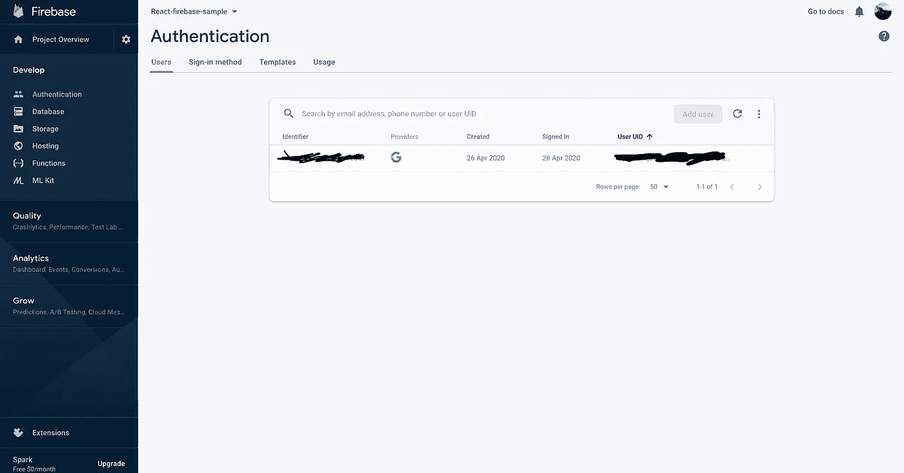

# 使用 Firebase 和 React.js 进行身份验证

> 原文：<https://levelup.gitconnected.com/authentication-using-firebase-and-react-js-99392c6fa58b>

这篇文章将帮助你理解我们如何使用 Firebase 身份验证来构建一个身份验证模块，例如登录和注册页面

*在我们 react app 中设置 firebase 数据库和设置 Firebase 可以在我之前的* [*文章*](https://medium.com/@murthy.suhas/todo-app-using-firebase-react-typescript-ea0a34bd417d) 中找到

在本文中，我们将使用 firebase 构建一个使用 google 帐户的登录、注册和注册


一个基本的登录应用

Firebase 有大量的 API 和特性，所以很难记住所有的东西。作为开发人员，理解并知道如何阅读文档是很重要的，Firebase 有很好的用户友好的文档。使用这个让我们建立我们的应用程序。

**让我们建立一个谷歌账户**

[文档](https://firebase.google.com/docs/auth/web/google-signin)如何设置的指南

使用 Google Sign-In 的身份验证可以通过创建 Google provider 对象的实例来设置，也可以通过从 firebase 导入 auth 模块来设置。

```
import 'firebase/auth';const provider = new firebase.auth.GoogleAuthProvider();
```

接下来，如果需要的话，我们可以设置我们希望与 OAuth 请求一起发送的自定义参数。

```
provider.setCustomParameters({ promt: "select_account",});
```

最后，我们将使用 firebase 验证我们的 google provider 对象。您可以通过提示 google 登录或重定向到 google 登录页面来要求用户登录。对于弹出窗口，我们使用 signInWithPopup()方法；对于重定向，我们使用 signInWithRedirect()方法。在我们的例子中，我们将使用 signInWithPopup()方法。只需这两个强制性步骤，你就可以设置你的应用程序，注册谷歌账户。此时，您的 firebase.ts 文件应该如下所示:

```
import firebase from 'firebase/app';import  "firebase/firestore";import 'firebase/auth';const config = { apiKey: process.env.REACT_APP_APIKEY, authDomain: process.env.REACT_APP_AUTHDOMAIN,  databaseURL: process.env.REACT_APP_DB, projectId: process.env.REACT_APP_PID, storageBucket: process.env.REACT_APP_SB, messagingSenderId: process.env.REACT_APP_SID, appId: process.env.REACT_APP_APPID, measurementId:process.env.REACT_APP_MID};firebase.initializeApp(config);export const auth = firebase.auth();export const firestore = firebase.firestore();/** To sign up using google* Link for developer documentation (https://firebase.google.com/docs/auth/web/google-signin)*/const provider = new firebase.auth.GoogleAuthProvider();provider.setCustomParameters({ promt: "select_account",});export const signInWithGoogle = () =>    auth.signInWithPopup(provider);
```

现在我们所要做的就是在点击一个按钮时调用 signInWithGoogle 方法

```
<Button type="button" fullWidth variant="contained" onClick = {signInWithGoogle} color="secondary"> Sign In with google</Button>
```

当我们单击“使用 Google 登录”按钮时，我们不会看到弹出窗口，但是如果您打开控制台，您会看到一条错误消息，指出*身份提供者配置被禁用。*这是因为默认情况下，所有认证 API 都将被禁用。因此，我们需要转到 Firebase 控制台，并在身份验证下启用 Google 登录方法


如果您在启用该选项后在您的应用程序中重试，您将会看到一个弹出窗口，您可以注册进入该应用程序。在 Firebase 控制台中，如果您转到“身份验证”下的“用户”选项卡，您可以看到用户和提供商，如 Google:



但是我们如何在 react 应用程序中知道用户是否已经登录？根据[文档](https://firebase.google.com/docs/auth/web/manage-users) onAuthStateChanged()，每次授权发生变化，观察者都会告知。所以让我们在 App.ts 中添加这个观察者。

如果你安慰当前用户，你会发现所有的信息，包括:UUID，电子邮件和创建细节。

但是你可以看到注册的用户在用户下面，但是不在我们的数据库中。通常我们在应用程序中需要用户引用。让我们来看看如何做到这一点。

在继续之前，让我们了解一些基本概念，即 Firebase 中的查询引用和快照。

**查询**是我们向 Firestore 发出的从数据库获取数据的请求

Firestore 返回两个对象

1.  参考
2.  快照

返回的对象可以是集合或文档。

但是要记住的关键是 **Firestore 总是返回这些对象，即使什么都不存在**

我们可以通过调用***firestore . doc('/users ')***得到数据引用，即查询引用

我们应该记住，查询引用不会返回实际的数据，相反，它会给我们一些属性，告诉我们关于它的细节。

从这个文档引用中，我们可以得到一个快照对象，它将允许我们知道该对象是否存在。

使用这两个关键特性文档引用和文档快照让我们在 firebase.ts 中创建一个方法，它检查用户是否退出，如果不退出，我们将把用户添加到我们的数据库中，并在每次 auth 状态发生变化时调用。

firebase.ts

App.tsx

现在，如果我们注册了一个用户，您可以在我们的集合中找到该用户


下一步是使用我们的自定义表单创建用户，因为我们需要在身份验证中启用电子邮件/密码登录方法


启用电子邮件/密码选项

我们在使用邮箱/密码签到方法中创建用户所使用的 API 是**createUserWithEmailAndPassword**并传递**邮箱和密码。这方面的文档可以在[这里](https://firebase.google.com/docs/auth/web/password-auth)找到**

但是这将在认证数据库中创建一个用户。要在数据库中创建用户，我们需要将创建的用户传递给我们的**createUserProfileDocument**方法。

这个示例应用程序的最后一步是使用注册时使用的电子邮件和密码登录。因此，让我们通过设置我们的登录组件来完成。

我们可以使用 signInWithEmailAndPassword 方法登录。文档详细信息可在[这里](https://firebase.google.com/docs/auth/web/password-auth#sign_in_a_user_with_an_email_address_and_password)找到

```
const onSubmit = async (e: React.FormEvent<EventTarget>) => { e.preventDefault(); const { email, password } = user; await auth.signInWithEmailAndPassword(email, password); setUser({ email: "", password: "", });};
```

最后，为了注销，我们可以使用 auth 方法 signOut [方法](https://firebase.google.com/docs/auth/web/password-auth)。

使用 Firebase 构建身份验证的示例应用程序到此结束。这个项目的初始设置可以在[这里](https://github.com/suhas86/firebase-react-auth)找到，完整的项目可以在[这里](https://github.com/suhas86/firebase-react-auth/tree/firebase-integration)找到

我希望这有助于您理解 firebase 中身份验证的工作原理。

编码快乐！干杯