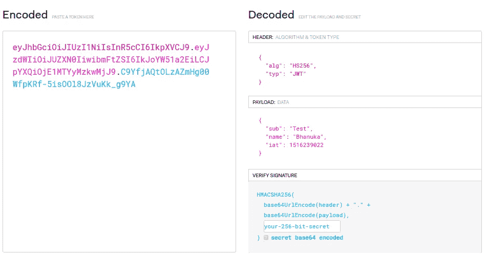

# 使用 JSON Web 令牌进行身份验证(第一部分)

> 原文：<https://levelup.gitconnected.com/authentication-using-json-web-tokens-part-i-4f2eeaca22d7>

## 关于 JSON web 令牌以及如何在认证中使用它的解释

史蒂夫·哈拉马在 [Unsplash](https://unsplash.com?utm_source=medium&utm_medium=referral) 上拍摄的照片

在这篇文章中，我将解释 JSON web 令牌以及如何在认证中使用它。

# **什么是 JWT？**

JSON Web Token (JWT)是一个开放标准( [RFC 7519](https://tools.ietf.org/html/rfc7519) )，它定义了一种紧凑且独立的方式，以 JSON 对象的形式在各方之间安全地传输信息。该信息可以被验证和信任，因为它是数字签名的。jwt 可以使用秘密(使用 **HMAC** 算法)或使用 **RSA** 或 **ECDSA** 的公钥/私钥对进行签名。

JSON Web 令牌可用于在各方之间授权和交换信息。

**授权中的 JSON Web 令牌**

使用 JWT 的最常见场景。当用户使用他的用户名和密码登录时，他获得一个 JSON web 令牌，允许访问该令牌允许的路由、服务和资源。这种方法被广泛使用，因为它的开销很小，并且能够很容易地跨不同的域使用。

**交换信息中的 JSON Web 令牌**

JSON Web 令牌是在各方之间安全传输信息的好方法。因为可以对 jwt 进行签名——例如，使用公钥/私钥对——所以可以实现真实性。此外，由于签名是使用头部和有效载荷计算的，因此您还可以验证内容没有被篡改。

**JWT 结构**

JSON web token 包含主要的 3 个部分。这些部分由一个点(.).这些主要部分是，

1.  页眉

报头由两部分组成:令牌类型(JWT)和签名算法(HMAC SHA256 或 RSA)。

2.有效载荷

有效载荷包含声明。声明是关于实体(通常是用户)和附加数据的声明。

3.签名

签名部分接受编码的报头、编码的有效载荷、秘密、报头中指定的算法，并对其进行签名。

使用 HMAC SHA256 算法，签名将以上述方式创建

如果你想玩玩 JWT，把这些概念付诸实践，你可以使用 [jwt.io 调试器](http://jwt.io/)来解码、验证和生成 jwt。

作者图片

# 如何在认证中使用 JSON Web 令牌？

在第一个请求中，客户端发送一个包含用户名和密码的 POST 请求。认证成功后,(授权)服务器生成 JWT，并将此 JWT 发送给客户端。每当客户端想要访问受保护的路由或资源时，客户端应该发送 JWT，通常在使用**承载**模式的**授权**报头中。

作者图片

服务器使用此令牌对用户进行身份验证。因此，在每次请求身份验证时，客户机不需要向服务器发送用户名和密码。JWT 有效负载可以包含诸如用户 ID 之类的内容，这样当客户端再次发送 JWT 时，您可以确保它是由您发布的，并且您可以看到它是向谁发布的。

我希望您已经了解了 JSON web 令牌的基本概念，以及如何在身份验证中使用它。下期帖子再见！

# 分级编码

感谢您成为我们社区的一员！ [**订阅我们的 YouTube 频道**](https://www.youtube.com/channel/UC3v9kBR_ab4UHXXdknz8Fbg?sub_confirmation=1) 或者加入 [**Skilled.dev 编码面试课程**](https://skilled.dev/) 。

 [## 编写面试问题

### 掌握编码面试的过程

技术开发](https://skilled.dev)