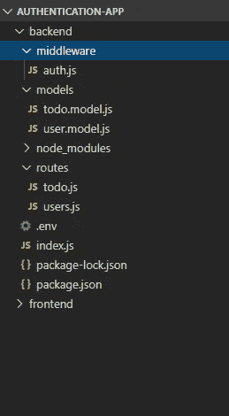
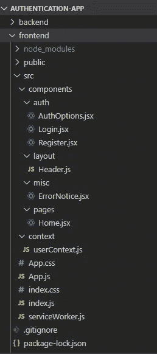
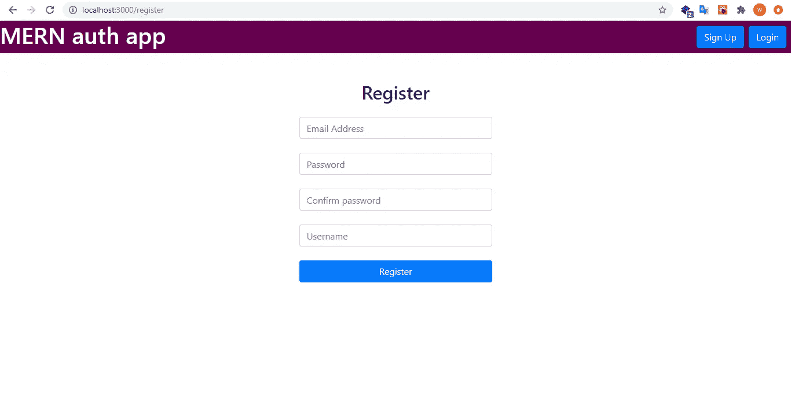
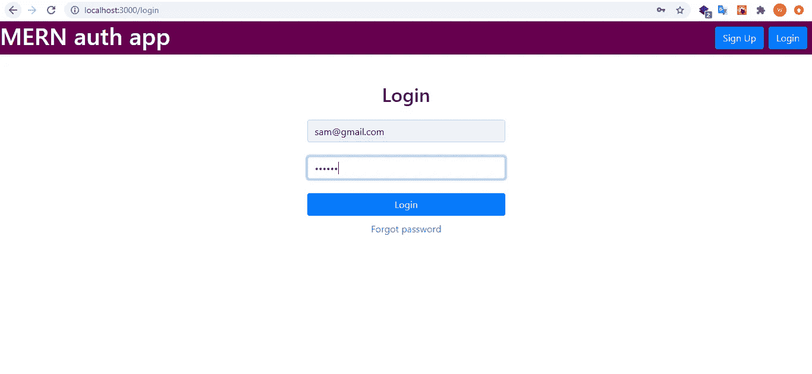
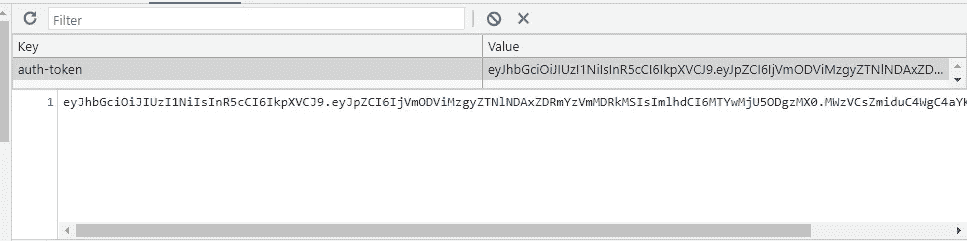
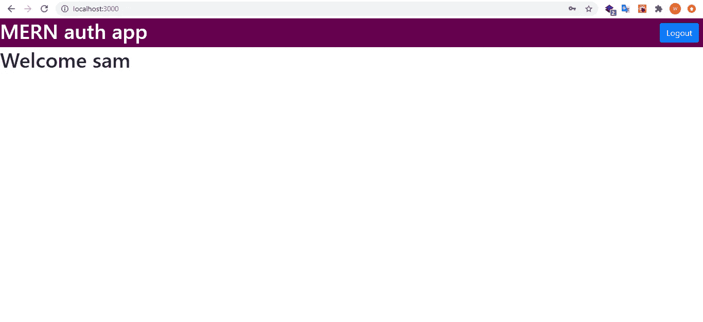

# 在 MERN 使用 JWT 进行身份验证

> 原文：<https://levelup.gitconnected.com/authentication-using-jwt-in-mern-1cc5c8ccd03c>

**Github:**[https://Github . com/swati 1707/authentic ation-using-JWT-MERN](https://github.com/swati1707/Authentication-using-JWT-in-MERN)

这篇博客将带您了解在 MERN 使用 JWT 进行身份验证所需的步骤。

我们将使用 JSON Web 令牌(JWT)来认证用户。

**JSON Web Token** 是一种表示要在双方之间转移的债权的手段。JWT 中的声明被编码为一个 JSON 对象，该对象使用 JSON Web 签名进行数字签名和/或使用 JSON Web 加密进行加密。

这将是项目的文件夹结构。



**后端**



**前端**

先从后端开始吧。

**步骤 1:-安装依赖关系**

运行以下命令安装所有依赖项。

```
npm install express cors mongoose dotenv jsonwebtoken bcrypt
```

**第二步:-连接 MongoDB。**

在 MongoDB Atlas 中创建一个新的集群，然后您将获得一个连接字符串。将它添加到。环境文件。

**步骤 3:-创建后端。**

为后端创建一个新目录，并运行以下命令:

```
mkdir backend
cd backend
npm init -y
```

现在让我们创建我们的服务器。

创建一个 index.js 文件，并添加以下代码:

```
const express = require("express");const mongoose = require("mongoose");const cors = require("cors");require("dotenv").config();const app = express();app.use(express.json());app.use(cors());const PORT = process.env.PORT || 5000;app.listen(PORT, () => console.log(`The server has started on port: ${PORT}`));mongoose.connect(process.env.MONGODB_CONNECTION_STRING,{useNewUrlParser: true,useUnifiedTopology: true,useCreateIndex: true,},(err) => {if (err) throw err;console.log("MongoDB connection established");});app.use("/users", require("./routes/users"));app.use("/todos", require("./routes/todo"));
```

现在运行命令:

```
nodemon index
```

这将在 localhost:5000 上启动您的服务器。

接下来创建一个名为 models 的目录，并在其中添加一个名为 user.model.js 的文件。

**user.model.js**

```
const mongoose = require("mongoose");const userSchema = new mongoose.Schema({email: { type: String, required: true, unique: true },password: { type: String, required: true, minlength: 5 },displayName: { type: String },});module.exports = User = mongoose.model("user", userSchema);
```

接下来创建一个名为 route 的目录，并在其中创建一个 users.js 文件。

**users.js**

```
const router = require("express").Router();const bcrypt = require("bcryptjs");const jwt = require("jsonwebtoken");const auth = require("../middleware/auth");const User = require("../models/user.model");// Registerrouter.post("/register", async (req, res) => {try {let { email, password, passwordCheck, displayName } = req.body;// validateif (!email || !password || !passwordCheck)return res.status(400).json({ msg: "Not all fields have been entered." });if (password.length < 5)return res.status(400).json({ msg: "The password needs to be at least 5 characters long." });if (password !== passwordCheck)return res.status(400).json({ msg: "Enter the same password twice for verification." });const existingUser = await User.findOne({ email: email });if (existingUser)return res.status(400).json({ msg: "An account with this email already exists." });if (!displayName) displayName = email;const salt = await bcrypt.genSalt();const passwordHash = await bcrypt.hash(password, salt);const newUser = new User({email,password: passwordHash,displayName,});const savedUser = await newUser.save();res.json(savedUser);} catch (err) {res.status(500).json({ error: err.message });}});// Loginrouter.post("/login", async (req, res) => {try {const { email, password } = req.body;// validateif (!email || !password)return res.status(400).json({ msg: "Not all fields have been entered." });const user = await User.findOne({ email: email });if (!user)return res.status(400).json({ msg: "No account with this email has been registered." });const isMatch = await bcrypt.compare(password, user.password);if (!isMatch) return res.status(400).json({ msg: "Invalid credentials." });const token = jwt.sign({ id: user._id }, process.env.JWT_SECRET);res.json({token,user: {id: user._id,displayName: user.displayName,},});} catch (err) {res.status(500).json({ error: err.message });}});// Deleterouter.delete("/delete", auth, async (req, res) => {try {const deletedUser = await User.findByIdAndDelete(req.user);res.json(deletedUser);} catch (err) {res.status(500).json({ error: err.message });}});// Check if token is validrouter.post("/tokenIsValid", async (req, res) => {try {const token = req.header("x-auth-token");if (!token) return res.json(false);const verified = jwt.verify(token, process.env.JWT_SECRET);if (!verified) return res.json(false);const user = await User.findById(verified.id);if (!user) return res.json(false);return res.json(true);} catch (err) {res.status(500).json({ error: err.message });}});router.get("/", auth, async (req, res) => {const user = await User.findById(req.user);res.json({displayName: user.displayName,id: user._id,});});module.exports = router;
```

该文件包含每当新用户注册时向数据库添加用户数据的逻辑，还处理登录逻辑。

这里，bcryptjs 用于散列密码。

接下来，在登录路由中，我们将比较登录凭据，如果发现匹配，我们将创建一个令牌。

```
const token = jwt.sign({ id: user._id }, process.env.JWT_SECRET);
```

sign 方法用于创建令牌。第一个参数是有效载荷，第二个参数是密钥。

接下来，我们将创建一个用于验证的中间件。

**auth.js**

```
const jwt = require('jsonwebtoken');const auth = (req, res, next) => {try{const token = req.header("x-auth-token");if(!token)return res.status(401).json({msg: "No authentication token, access denied"});const verified = jwt.verify(token, process.env.JWT_SECRET);if(!verified)return res.status(401).json({msg: "Token verification failed, authorization denied"});req.user = verified.id;next();} catch (err) {res.status(500).json({ error: err.message });}}module.exports = auth;
```

这个中间件对令牌执行验证检查，检查令牌是否有效，以及用户是否登录。

**步骤 4:-创建前端。**

运行以下命令创建一个 react 应用程序:-

```
npx create-react-app frontend
cd frontend
npm install react-router-dom axios
```

首先让我们创建我们的主要组件

**App.js**

```
import React, {useState, useEffect } from 'react';import { BrowserRouter, Switch, Route } from 'react-router-dom';import axios from 'axios';import Header from './components/layout/Header';import Home from './components/pages/Home';import Register from './components/auth/Register';import Login from './components/auth/Login';import UserContext from './context/userContext';import './App.css';function App() {const [ userData, setUserData] = useState({token: undefined,user: undefined});useEffect(() => {const checkLoggedIn = async () => {let token = localStorage.getItem("auth-token");if(token === null){localStorage.setItem("auth-token", "");token = "";}const tokenResponse = await axios.post('http://localhost:5000/users/tokenIsValid', null, {headers: {"x-auth-token": token}});if (tokenResponse.data) {const userRes = await axios.get("http://localhost:5000/users/", {headers: { "x-auth-token": token },});setUserData({token,user: userRes.data,});}}checkLoggedIn();}, []);return (<BrowserRouter><UserContext.Provider value={{ userData, setUserData }}><Header /><Switch><Route exact path="/" component={Home} /><Route path="/register" component={Register} /><Route path="/login" component={Login} /></Switch></UserContext.Provider></BrowserRouter>);}export default App;
```

接下来，我们将创建标题组件。

**Header.js**

```
import React, { Component } from 'react';import {Link} from 'react-router-dom';import AuthOptions from '../auth/AuthOptions';class Header extends Component {render() {return (<header className="header"><Link to="/"><h1 className="title">MERN auth app</h1></Link><AuthOptions /></header>);}}export default Header;
```

现在我们将创建 AuthOptions 组件。

**AuthOptions.jsx**

```
import React, { useContext } from 'react';import { useHistory } from 'react-router-dom';import UserContext from "../../context/userContext";function AuthOptions () {const { userData, setUserData } = useContext(UserContext);const history = useHistory();const register = () => history.push("/register");const login = () => history.push("/login");const logout = () => {setUserData({token: undefined,user: undefined})localStorage.setItem("auth-token","");};return (<nav className="auth-options">{userData.user ? (<button className="btn btn-primary mr-2" onClick={logout}>Logout</button>) : (<><button className="btn btn-primary mr-2" onClick={register}>Sign Up</button><button className="btn btn-primary mr-2" onClick={login}>Login</button></>)}</nav>)}export default AuthOptions;
```

接下来，创建一个上下文来将数据传递给所有组件。创建一个名为 context 的目录，并创建一个 userContext.js 文件。

**userContext.js**

```
import { createContext } from 'react';export default createContext(null);
```

接下来，我们将创建注册和登录组件。

**Register.jsx**

```
import React, { useState, useContext } from 'react';import { useHistory } from "react-router-dom";import axios from "axios";import UserContext from "../../context/userContext";import ErrorNotice from "../../components/misc/ErrorNotice";function Register () {const [email, setEmail] = useState();const [password, setPassword] = useState();const [passwordCheck, setPasswordCheck] = useState();const [displayName, setDisplayName] = useState();const [error, setError] = useState();const { setUserData } = useContext(UserContext);const history = useHistory();const submit = async (e) => {e.preventDefault();try{const newUser = {email, password, passwordCheck, displayName};await axios.post("http://localhost:5000/users/register", newUser);const loginResponse = await axios.post("http://localhost:5000/users/login", {email, password});setUserData({token: loginResponse.data.token,user: loginResponse.data.user});localStorage.setItem("auth-token", loginResponse.data.token);history.push("/");} catch(err) {err.response.data.msg && setError(err.response.data.msg)}};return (<div className="register"><h2>Register</h2>{error && <ErrorNotice message={error} clearError={() => setError(undefined)} />}<form onSubmit={submit}><label>Email: </label><input type="email" id="email" onChange={e => setEmail(e.target.value)}/><label>Password: </label><input type="password" id="password" onChange={e => setPassword(e.target.value)}/><input type="password" placeholder="Confirm password" onChange={e => setPasswordCheck(e.target.value)}/><label>Display name </label><input type="text" id="dsplay-name" onChange={e => setDisplayName(e.target.value)}/><input type="submit" value="Register" className="btn btn-primary" /></form></div>);}export default Register;
```

**Login.jsx**

```
import React, { useState, useContext } from 'react';import { useHistory } from "react-router-dom";import axios from "axios";import UserContext from "../../context/userContext";import ErrorNotice from "../../components/misc/ErrorNotice";function Login () {const [email, setEmail] = useState();const [password, setPassword] = useState();const [error, setError] = useState();const { setUserData } = useContext(UserContext);const history = useHistory();const submit = async (e) => {e.preventDefault();try{const loginUser = {email, password};const loginResponse = await axios.post("http://localhost:5000/users/login", loginUser);setUserData({token: loginResponse.data.token,user: loginResponse.data.user});localStorage.setItem("auth-token", loginResponse.data.token);history.push("/");} catch(err) {err.response.data.msg && setError(err.response.data.msg)}};return (<div className="login"><h2>Login</h2>{error && <ErrorNotice message={error} clearError={() => setError(undefined)} />}<form onSubmit={submit}><label>Email: </label><input type="email" id="email" onChange={e => setEmail(e.target.value)}/><label>Password: </label><input type="password" id="password" onChange={e => setPassword(e.target.value)}/><input type="submit" value="Login" className="btn btn-primary" /></form></div>);}export default Login;
```

接下来，让我们创建一个 ErrorNotice 组件来显示错误消息。

**ErrorNotice.jsx**

```
import React from 'react';function ErrorNotice (props) {return (<div className="error-notice"><span>{props.message}</span><button onClick={props.clearError}>X</button></div>);}export default ErrorNotice;
```

然后我们将创建我们的 Home 组件。用户登录后，将显示此页面。

**Home.jsx**

```
import React, { useEffect, useContext } from 'react';import { useHistory, Link } from 'react-router-dom';import UserContext from '../../context/userContext';function Home () {const {userData} = useContext(UserContext);const history = useHistory();useEffect(() => {if(!userData.user)history.push("/login");}, []);return (<div>{userData.user ? (<h1>Welcome {userData.user.displayName}</h1>) : (<><h2>You are not logged in</h2><Link to="/login">Login</Link></>)}</div>);}export default Home;
```



注册



注册



代币



主页